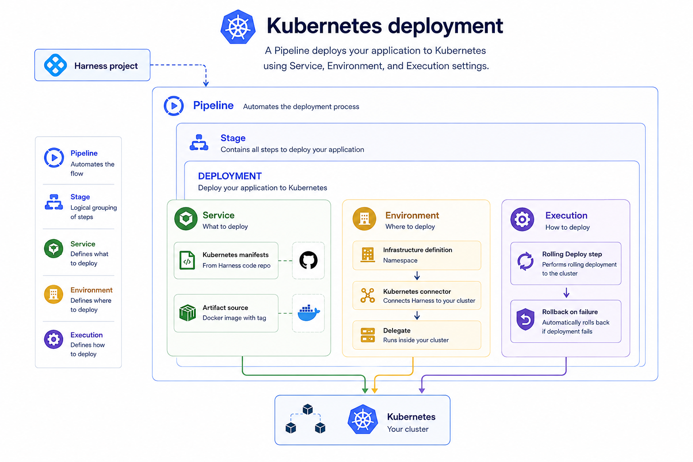

This guide walks you through the simplest path to deploying a containerized application to a Kubernetes cluster using Harness CD. By the end, you will have a working pipeline that performs a rolling deployment and rolls back automatically on failure.

---

## What you will need

A Kubernetes deployment in Harness is made up of several entities that build on each other. The diagram below shows the full dependency chain, with the Delegate running inside your cluster and connecting outbound to Harness.



---

## Before you begin

Before you start, make sure you have:

- A Kubernetes cluster with outbound HTTPS access to `app.harness.io`.
- A Kubernetes service account with `list`, `get`, `create`, and `delete` permissions on the target namespace.
- A container image in a registry, or use the sample manifest in Step 3 which references a public image.

---

## Step 1: Install a delegate

A Delegate is a worker process that runs inside your cluster and executes deployment steps on Harness's behalf. You must install one before Harness can communicate with your cluster.

1. Go to **Account Settings**, then select **General Settings**, then select **Delegates**.
2. Select **Create Delegate**.
3. Choose a delegate type:
   - **Delegate Classic** — Delegate 1.0, supports v0 and v1 pipelines
   - **Delegate New** — Delegate 3.x, lightweight container-based agent, supports v1 pipelines
4. Select **Kubernetes** as the installation method.
5. Harness generates a YAML manifest. Before downloading, add any tags you want to use to identify this delegate — tags are visible in the Harness UI and used to target specific delegates from pipeline steps.
6. Download the YAML and apply it to your cluster:
   ```bash
   kubectl apply -f delegate.yaml
   ```
7. Return to the Harness UI and wait for the delegate to show **Connected** status.

:::tip
The delegate needs outbound HTTPS access on port 443 to `app.harness.io`. No inbound ports need to be opened.
:::

---

## Step 2: Create a Kubernetes connector

A Kubernetes connector authenticates Harness to your cluster using the delegate you installed in Step 1.

1. Go to **Settings**, then select **Connectors**, then select **New Connector**.
2. Select **Kubernetes**.
3. Under connection details, select **Inherit from Delegate** — this uses the delegate's own credentials to connect to the cluster.
4. Select the delegate you installed in Step 1. Use the tag name you assigned to filter it from other delegates.
5. Select **Submit**. Harness verifies the connection and the connector is ready to use.

---

## Step 3: Create a service

A service represents your application. It holds the Kubernetes manifests and configuration used at deploy time.

1. Go to **Deployments**, then select **Services** (or go to **Project Settings** and select **Services**).
2. Select **New Service**.
3. Enter a service name, set **Deployment Target** to **Kubernetes**, and select **Create**.

### Set up a Harness Code repository

This guide uses Harness Code as the manifest store. Before adding the manifest to the service, create a repository and add a manifest file to it.

1. Go to **Code Repositories** and select **Create Repository**.
2. Enter a repository name, choose public or private, and select **Create Repository**.
3. Inside the repository, create the folder path `kubernetes/service/` and add a file named `manifest.yaml`.

<details>
<summary>Sample manifest.yaml</summary>

```yaml
apiVersion: apps/v1
kind: Deployment
metadata:
  name: hello-app
spec:
  replicas: 2
  revisionHistoryLimit: 3
  selector:
    matchLabels:
      app: hello-app
  template:
    metadata:
      labels:
        app: hello-app
    spec:
      containers:
        - name: hello-app
          image: docker.io/hashicorp/http-echo:0.2.3
          args:
            - "-text=Hello from Harness CD"
          ports:
            - containerPort: 5678
---
apiVersion: v1
kind: Service
metadata:
  name: hello-app
spec:
  type: ClusterIP
  selector:
    app: hello-app
  ports:
    - port: 80
      targetPort: 5678
```

</details>

### Add the manifest to your service

1. In your service, go to the **Configuration** tab and under **Manifests**, select **Add Manifest**.
2. Select **K8s Manifest**, then select **Continue**.
3. Under **Specify K8s Manifest Store**, select **Harness Code**.
4. Enter a **Manifest Identifier**.
5. Select the repository you created.
6. Set **Fetch Type** to **Branch** and enter your branch name.
7. Enter the file path to your manifest (for example, `kubernetes/service/manifest.yaml`).
8. Select **Submit**.

---

## Step 4: Create an environment

An environment represents a logical deployment target such as production or staging. Environments hold one or more infrastructure definitions.

1. In your Harness project, go to **Deployments**, then select **Environments**.
2. Select **New Environment**.
3. Enter an environment name (for example, `production`) and select the type: **Production** or **Pre-Production**.
4. Select **Save**.

---

## Step 5: Create an infrastructure definition

An infrastructure definition ties an environment to a specific cluster and namespace.

1. Open the environment you created in Step 4 and select the **Infrastructure Definitions** tab.
2. Select **Create Infrastructure**.
3. Enter a name for the infrastructure definition.
4. Under **Deployment Type**, select **Kubernetes**.
5. Under **Infrastructure Type**, select **Kubernetes**.
6. Under **Cluster Details**, select the connector you created in Step 2.
7. Enter the **Namespace** where you want your application deployed.
8. Select **Save**.

---

## Step 6: Create a pipeline

1. Go to the **Pipelines** section and select **Create Pipeline**.
2. Enter a pipeline name, set the storage type to **Inline**, and select **Create**.
3. Harness adds a default stage automatically. Delete it, then select the **+** icon to add a new stage.
4. When prompted with "What would you like to do?", select **Deploy** and select **Next**.
5. Enter a stage name, set **Deployment Target** to **Kubernetes**, and select **Next**.
6. In **Configure Service**, select the service you created in Step 3 and select **Next**.
7. In **Configure Environment**, select the environment you created in Step 4. Under infrastructure, select **Select Infrastructures Manually** and choose the infrastructure definition from Step 5. Select **Next**.
8. In **Choose Deployment Strategy**, select **Rolling Deploy** and select **Next**.
9. In **Configure Runtime**, select **Directly on Delegate**. This sets where deployment steps execute.
10. Select **Add Stage**. Harness automatically adds the Kubernetes Rolling Deploy step and the rollback steps.
11. Select **Save**.

---

## Step 7: Run the pipeline

1. Open your pipeline and select **Run**.
2. Select **Run Pipeline**.
3. In the execution view, watch the stage progress through the following steps:
   - **Initialize:** Provisions the execution environment.
   - **Service:** Loads manifests and variables.
   - **Infrastructure:** Connects to the target cluster.
   - **Kubernetes Rolling Deploy:** Applies manifests and waits for all pods to reach steady state.

A successful run marks every step green. If the Rolling Deploy step fails, the rollback group re-applies the previous release manifests automatically.

:::tip Check pod status
After a successful run, verify the deployment in your cluster:
```bash
kubectl get pods -n <target-namespace>
```
:::

---

## Next steps

- Go to [Kubernetes rolling deployment](./v1-deployments/kubernetes/kubernetes-deployment-strategies/rolling) to understand how the rolling strategy works and how to extend it with additional steps.
- Go to [Kubernetes services](./v1-deployments/kubernetes/kubernetes-services) to configure Helm charts, Kustomize overlays, and multiple artifact sources.
- Go to [Kubernetes infrastructure](./v1-deployments/kubernetes/kubernetes-infrastructure) to understand namespace isolation, simultaneous deployments, and connector configuration options.
- Go to [Kubernetes canary deployment](./v1-deployments/kubernetes/kubernetes-deployment-strategies/canary) to route a subset of traffic to the new version before promoting to all pods.
