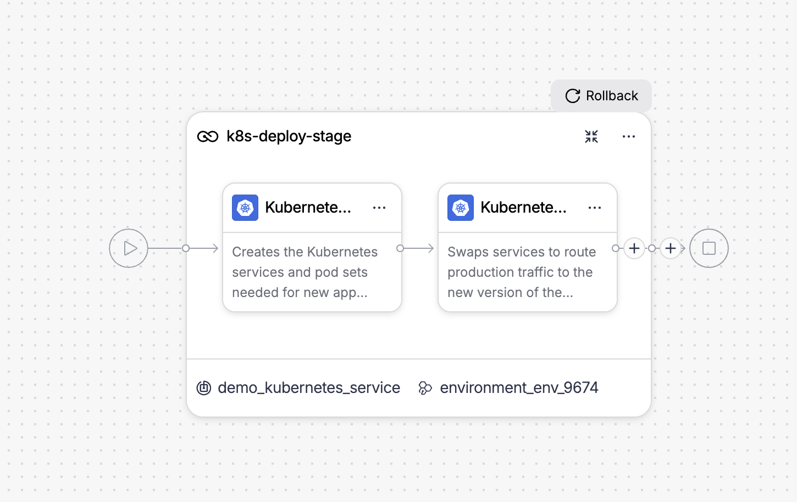
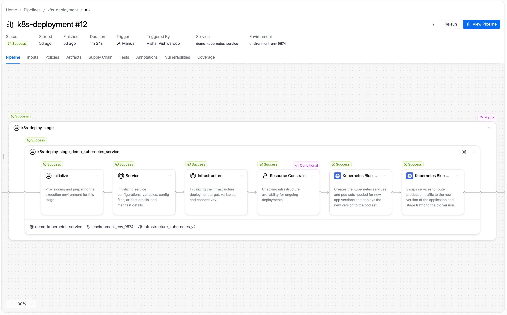
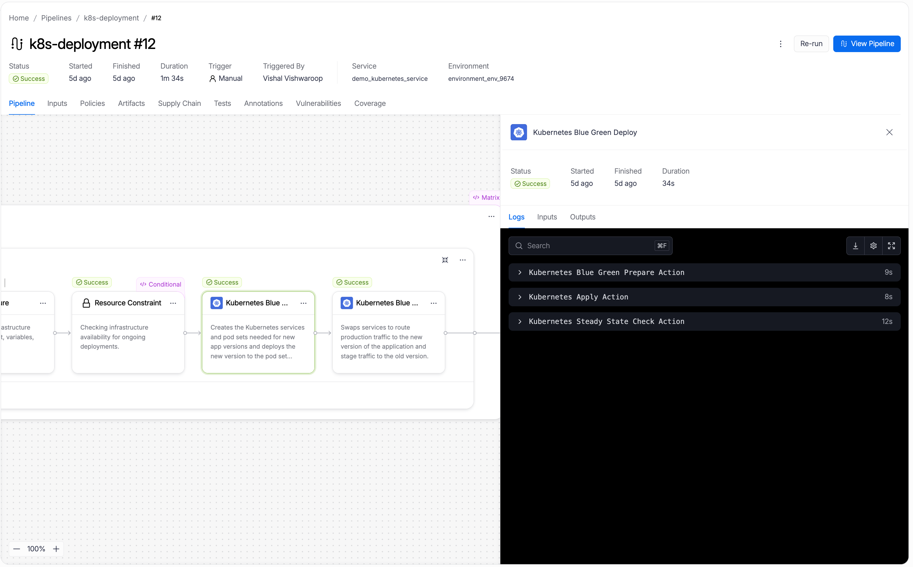
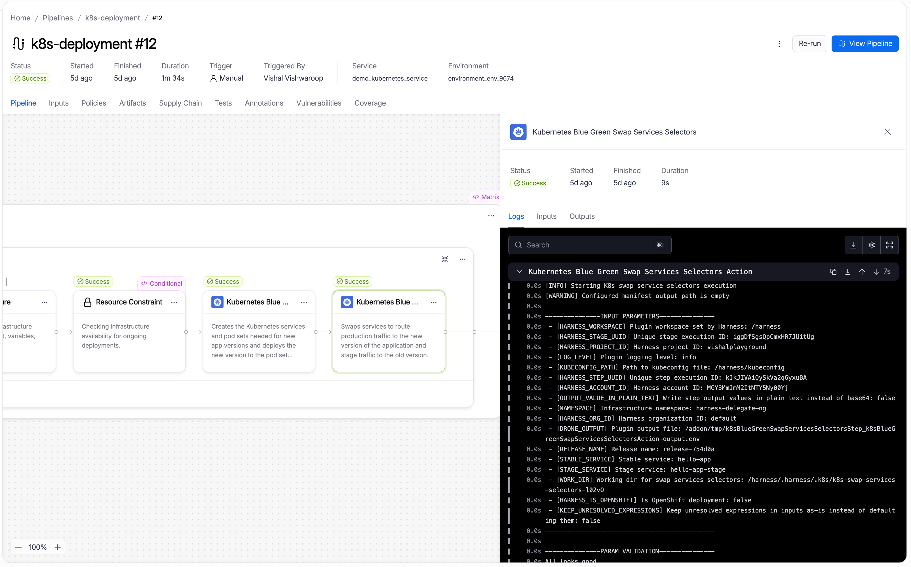

A Kubernetes blue-green deployment maintains two pod sets: one serving production traffic and one receiving the new version. When the new version is healthy, Harness swaps service selectors so the new pod set starts receiving production traffic and the old pod set becomes the stage environment. If anything fails before the swap, the old version continues serving all traffic with no user impact.

---

## Before you begin

Before you configure a blue-green stage, make sure you have the following in place:

- **A Kubernetes service:** Go to [Kubernetes services](/3k-docs/continuous-delivery/v1-deployments/kubernetes/kubernetes-services) to set up a service with manifests and an artifact source.
- **A Kubernetes infrastructure:** Go to [Kubernetes infrastructure](/3k-docs/continuous-delivery/v1-deployments/kubernetes/kubernetes-infrastructure) to connect a cluster and namespace.
- **A Harness delegate in the target cluster:** The delegate runs the deployment steps against your cluster.
- **Runtime configuration:** Every Kubernetes stage requires a `runtime` block specifying the connector and namespace. Go to [Kubernetes runtime configuration](/3k-docs/continuous-delivery/v1-deployments/kubernetes/overview#kubernetes-runtime-configuration) to understand the required fields.

---

## How blue-green deployments work

A blue-green deployment maintains two pod sets in your cluster at all times: one serving production traffic (the current color) and one receiving the new version (the stage color). Harness assigns a color label (`harness.io/color: blue` or `harness.io/color: green`) to each pod set and alternates colors with each deployment.

**First deployment:** Harness creates both services (primary and stage) and a single pod set labeled blue. The stage service points to the blue pods for verification. After the swap, the primary service points to blue as well, and production traffic flows to your application.

**Second deployment:** Harness creates a new pod set labeled green and points the stage service at it. Production traffic still flows to blue through the primary service. You validate green through the stage service. When you run the swap step, the primary service selector switches to green and the stage service selector switches to blue. This is an atomic update to service selectors with no pod restarts. Both pod sets remain running.

**Third and subsequent deployments:** The colors alternate automatically. Harness always deploys to whichever color is not currently serving production traffic.

Rollback re-swaps the service selectors back to the previous color. Because both pod sets are still running, rollback is instant with no redeployment.

**When to use blue-green:**

- You need zero-downtime deployments with an instant, reversible cutover.
- You want to validate the new version in a full production-scale environment before routing any live traffic to it.
- Instant rollback through re-swapping selectors is more important to you than reduced infrastructure footprint.

---

## Configure service manifests for blue-green

Before configuring the pipeline, set up your Kubernetes service manifests so Harness can identify which services are primary and which are stage.

### Single service configuration

When your manifests define only one Kubernetes Service, Harness automatically creates a duplicate stage service with the `-stage` suffix appended to the name. No annotations are required.

```yaml
apiVersion: v1
kind: Service
metadata:
  name: hello-app
spec:
  type: ClusterIP
  selector:
    app: hello-app
  ports:
    - port: 80
      targetPort: 5678
```

Harness identifies this as the primary service and creates `hello-app-stage` to serve stage traffic.

### Two services configuration

When your manifests define two Kubernetes Services, annotate them so Harness can identify which is primary and which is stage:

- **Primary service:** `harness.io/primary-service: "true"`
- **Stage service:** `harness.io/stage-service: "true"`

```yaml
apiVersion: apps/v1
kind: Deployment
metadata:
  name: hello-app
spec:
  replicas: 2
  revisionHistoryLimit: 3
  selector:
    matchLabels:
      app: hello-app
  template:
    metadata:
      labels:
        app: hello-app
    spec:
      containers:
        - name: hello-app
          image: docker.io/hashicorp/http-echo:0.2.3
          args:
            - "-text=Hello from Harness CD"
          ports:
            - containerPort: 5678
---
apiVersion: v1
kind: Service
metadata:
  name: hello-app
  annotations:
    harness.io/primary-service: "true"
spec:
  type: ClusterIP
  selector:
    app: hello-app
  ports:
    - port: 80
      targetPort: 5678
---
apiVersion: v1
kind: Service
metadata:
  name: hello-app-stage
  annotations:
    harness.io/stage-service: "true"
spec:
  type: ClusterIP
  selector:
    app: hello-app
  ports:
    - port: 80
      targetPort: 5678
```

---

## Pipeline YAML

<details>
<summary>View the complete blue-green stage YAML</summary>

```yaml
pipeline:
  stages:
    - name: k8s-deploy-stage
      environment:
        id: <your-environment-id>
        deploy-to: <your-infrastructure-id>
      on-failure:
        errors: all
        action: stage-rollback
      id: k8s_deploy_stage
      service:
        type: kubernetes
        items:
          - <your-service-id>
      steps:
        - name: Kubernetes Blue Green Deploy
          id: k8sBlueGreenDeployStep
          template:
            uses: k8sBlueGreenDeployStep
        - name: Kubernetes Blue Green Swap Services Selectors
          id: k8sBlueGreenSwapServicesSelectorsStep
          template:
            uses: k8sBlueGreenSwapServicesSelectorsStep
            with:
              stable_service: ${{stage.steps.k8sBlueGreenDeployStep.output.outputVariables.stableService}}
              stage_service: ${{stage.steps.k8sBlueGreenDeployStep.output.outputVariables.stageService}}
              is_openshift: ${{stage.steps.k8sBlueGreenDeployStep.output.outputVariables.isOpenshift}}
      rollback:
        - group:
            steps:
              - name: Kubernetes Blue Green Rollback Swap Services Selectors
                id: k8sBlueGreenRollbackSwapServicesSelectorsStep
                template:
                  uses: k8sBlueGreenSwapServicesSelectorsStep
                  with:
                    stable_service: ${{rollback.data.PLUGIN_STABLE_SERVICE}}
                    stage_service: ${{rollback.data.PLUGIN_STAGE_SERVICE}}
                    is_openshift: ${{rollback.data.HARNESS_IS_OPENSHIFT}}
      runtime:
        kubernetes:
          namespace: <target-namespace>
          connector: <your-kubernetes-connector-id>
```

</details>

Go to [Kubernetes runtime configuration](/3k-docs/continuous-delivery/v1-deployments/kubernetes/overview#kubernetes-runtime-configuration) to understand the required `runtime` block and how to find your connector and namespace values.

---

## Configure a blue-green stage

---

### Select the blue-green strategy

When creating a new stage, step 4 of the stage wizard asks you to choose a deployment strategy. Select **K8s Blue Green Deploy Strategy** from the list.

Harness automatically adds the two steps that make up the blue-green flow to the stage canvas.



The two steps run in order:

1. **Kubernetes Blue Green Deploy:** Creates the Kubernetes services and pod sets needed for the new app version and deploys the new version to the stage pod set.
2. **Kubernetes Blue Green Swap Services Selectors:** Swaps service selectors to route production traffic to the new version and stage traffic to the old version.

:::tip Insert verification between steps
Place your verification or approval steps between **Kubernetes Blue Green Deploy** and **Kubernetes Blue Green Swap Services Selectors**. If verification fails, the swap never runs and the old version continues serving all production traffic.
:::

---

### Configure the Kubernetes Blue Green Deploy step

Click the **Kubernetes Blue Green Deploy** step to open its configuration panel.


The following fields are available:

| Parameter | Description | Required |
|-----------|-------------|----------|
| **Name** | Display name for this step in the stage canvas. Default: `Kubernetes Blue Green Deploy`. | Required |
| **Skip Dry Run** | When enabled, skips the `kubectl apply --dry-run` pre-validation before the actual apply. Default: `false`. | Optional |
| **Kubernetes Pruning** | When enabled, removes resources from the cluster that exist in the previous release but are no longer in the current manifests. Default: `false`. | Optional |
| **Skip Unchanged Manifest** | When enabled, Harness compares rendered manifests with the previous deployment and skips the step if no changes are detected. Default: `false`. | Optional |
| **Use Traffic Shift** | When enabled, activates traffic routing configuration on this step to split live traffic between primary and stage services. | Optional |
| **Manifest Path** | Override the manifest paths from the service configuration. Leave empty to use all manifests from the service. | Optional |
| **Kubeconfig Path** | Path to the kubeconfig file. Default: `${{infra.kube_config_path}}`. | Optional |
| **Namespace** | Target namespace for the deployment. Default: `${{infra.namespace}}`. | Optional |
| **Release Name** | Name used to track Harness release history. Default: `${{infra.releaseName}}`. | Optional |
| **Log Level** | Verbosity of step logs. Default: `info`. | Optional |

:::warning One workload per blue-green stage
Blue-green deployments support exactly one Kubernetes Deployment workload per stage. If your service manifests define multiple Deployment objects, the stage fails.
:::

Go to [Kubernetes Blue Green Deploy step reference](../step-library/k8s-blue-green-deploy) to view the full field reference.

---

### Configure the Kubernetes Blue Green Swap Services Selectors step

Click the **Kubernetes Blue Green Swap Services Selectors** step to open its configuration panel.


The **Stable Service** and **Stage Service** fields are auto-populated from the Blue Green Deploy step output when you use this step in a blue-green stage.

The following fields are available:

| Parameter | Description | Required |
|-----------|-------------|----------|
| **Name** | Display name for this step in the stage canvas. Default: `Kubernetes Blue Green Swap Services Selectors`. | Required |
| **Stable Service** | The name of the service currently receiving production traffic. Auto-populated from the Blue Green Deploy step output. | Required |
| **Stage Service** | The name of the service currently receiving stage traffic. Auto-populated from the Blue Green Deploy step output. | Required |
| **Kubeconfig Path** | Path to the kubeconfig file. Default: `${{infra.kube_config_path}}`. | Optional |
| **Namespace** | Target namespace where both services run. Default: `${{infra.namespace}}`. | Optional |
| **Release Name** | Name used to track Harness release history. Default: `${{infra.releaseName}}`. | Optional |
| **Working Directory** | Optional working directory for the swap operation. | Optional |
| **Log Level** | Verbosity of step logs. Default: `info`. | Optional |

Go to [Kubernetes Blue Green Swap Services Selectors step reference](../step-library/k8s-blue-green-swap-services) to view the full field reference.

---

## Rollback

If any step in the blue-green stage fails, Harness runs the rollback steps automatically. The rollback section of the stage canvas contains one step in a group:


The rollback step re-swaps the service selectors to restore the previous routing state.

### Kubernetes Blue Green Rollback Swap Services Selectors step

The **Stable Service** and **Stage Service** fields are pre-wired to the service names captured by the Blue Green Deploy step:

```text
${{rollback.data.PLUGIN_STABLE_SERVICE}}
${{rollback.data.PLUGIN_STAGE_SERVICE}}
```

If the failure occurred before the swap, the rollback swap is a no-op and the old version continues serving traffic. If the swap had already occurred, the rollback re-swaps selectors to restore the previous version as primary. The pod sets are not deleted. Only the service selectors change.

---

## What happens during execution

When you run a pipeline with a blue-green stage, the execution view shows the full step sequence. A successful run looks like this:



The execution includes setup steps that Harness runs automatically before your configured steps:

- **Initialize:** Provisions and prepares the execution environment for this stage.
- **Service:** Initializes service configuration, variables, config files, artifact details, and manifest details.
- **Infrastructure:** Initializes the infrastructure deployment target, variables, and connectivity.
- **Resource Constraint:** Checks infrastructure availability for concurrent deployments.

Your two configured steps follow in order.

---

### Kubernetes Blue Green Deploy step in execution

When the Kubernetes Blue Green Deploy step runs, it performs three internal actions:



The three internal actions are:

1. **Kubernetes Blue Green Prepare Action:** Reads your manifests, determines the stage color (the inverse of the current primary color), creates or updates the stage service (appending `-stage` if using a single-service configuration), labels the new pod set with `harness.io/color: <stage-color>`, and writes the prepared manifests to the workspace. The primary service is not touched at this point.

2. **Kubernetes Apply Action:** Applies the prepared manifests to your cluster using `kubectl apply`. This creates the new pod set alongside the existing pod set, with both running simultaneously. The primary service continues routing all production traffic to the existing pod set.

3. **Kubernetes Steady State Check Action:** Polls the cluster until all pods in the new deployment reach `Running` status and pass readiness checks, or until the step timeout is reached. If pods fail to become ready, the step fails and the primary service continues serving all production traffic from the existing pod set.

---

### Kubernetes Blue Green Swap Services Selectors step in execution

When the Kubernetes Blue Green Swap Services Selectors step runs, it routes production traffic to the new pod set:



The step updates the selector on each service to point to the new color:

- The primary service selector changes from the old color to the new color, routing production traffic to the new pod set.
- The stage service selector changes from the new color to the old color, routing stage traffic to the old pod set.

After the swap, both pod sets continue running. The new pod set serves production traffic and the old pod set serves stage traffic. Use the **Kubernetes Blue Green Stage Scale Down** step after a successful deployment to clean up the old pod set once you are confident the new version is stable.

---

## Scale down the old environment

After a successful swap, you can use the **Kubernetes Blue Green Stage Scale Down** step to clean up the old pod set. Add this step after the Swap step in your stage.

The following fields are available:

| Parameter | Description | Required |
|-----------|-------------|----------|
| **Name** | Display name for this step in the stage canvas. Default: `Kubernetes Blue Green Stage Scale Down`. | Required |
| **Kubeconfig Path** | Path to the kubeconfig file. Default: `${{infra.kube_config_path}}`. | Optional |
| **Namespace** | Target namespace. Default: `${{infra.namespace}}`. | Optional |
| **Release Name** | Name used to look up the release history for the old pod set. Default: `${{infra.releaseName}}`. | Optional |
| **Log Level** | Verbosity of step logs. Default: `info`. | Optional |

:::warning Release name must be unique per namespace
When deploying multiple services to the same namespace using blue-green, each service must have a unique release name. If multiple services share the same release name, the Scale Down step may incorrectly identify which deployment to scale down.
:::

:::info Resources are deleted, not scaled to zero
The Scale Down step deletes workload resources rather than setting replicas to zero. This prevents HPA from overriding a zero-replica state on subsequent deployments. HPA and PDB resources deleted during Scale Down are not recreated during rollback. They require redeployment to restore.
:::

Go to [Kubernetes Blue Green Stage Scale Down step reference](../step-library/k8s-blue-green-stage-scale-down) to view the full field reference.

---

## Enhance your deployment

The blue-green strategy deploys and swaps in two steps. You can insert additional steps to validate the new version through the stage service before swapping, or to operate on the cluster after a successful deployment:

| Step | What it adds |
|------|-------------|
| [Kubernetes Steady State Check](../step-library/k8s-steady-state-check) | Explicitly re-verify that the new pod set is healthy through the stage service before the swap runs. Insert between Blue Green Deploy and Swap Services Selectors. |
| [Kubernetes Blue Green Stage Scale Down](../step-library/k8s-blue-green-stage-scale-down) | Delete the old pod set after a successful swap to free cluster resources. Add after the Swap step. |
| [Kubernetes Scale](../step-library/k8s-scale) | Scale the stage pod set up or down during the validation window to test under different load levels before swapping. |
| [Kubernetes Patch](../step-library/k8s-patch) | Apply a partial patch to the stage workload while it runs under the stage service. |
| [Kubernetes Apply](../step-library/k8s-apply) | Apply individual manifest files before the blue-green deploy. For example, to pre-create a ConfigMap or Job. |
| [Kubernetes Delete](../step-library/k8s-delete) | Remove stale resources after a successful swap and scale-down. |
| [Kubernetes Rollout](../step-library/k8s-rollout) | Run `kubectl rollout restart` on the newly promoted workload to bounce pods and pick up a refreshed Secret or ConfigMap. |

---

## Next steps

- Go to [Kubernetes canary deployment](./canary) to compare blue-green with an incremental canary approach.
- Go to [Kubernetes rolling deployment](./rolling) to understand the rolling update strategy.
- Go to [Blank canvas deployment](./blank-canvas) to build a Kubernetes stage from scratch using the Apply step without a managed strategy.
