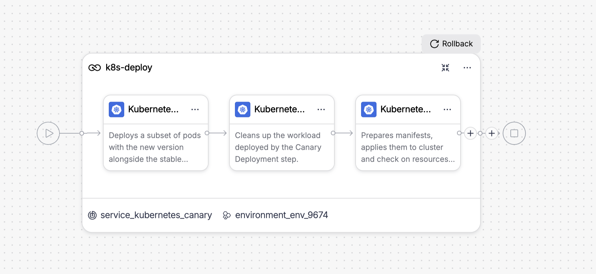
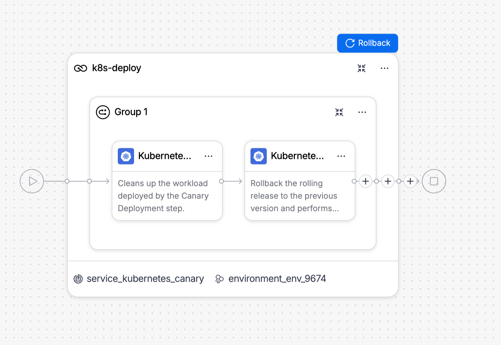
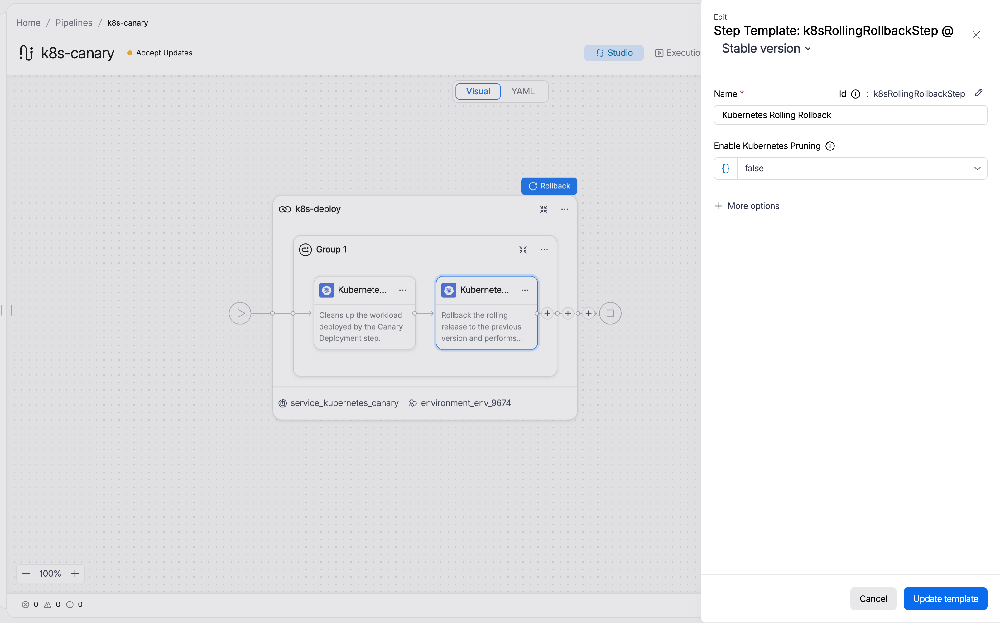
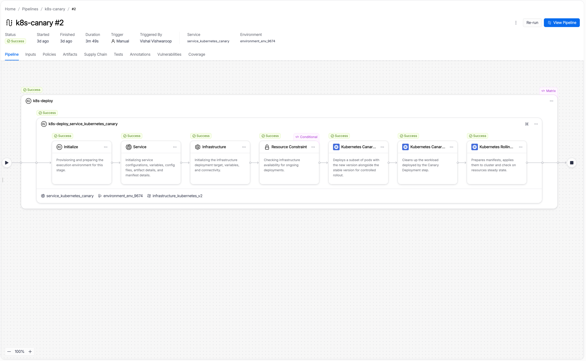
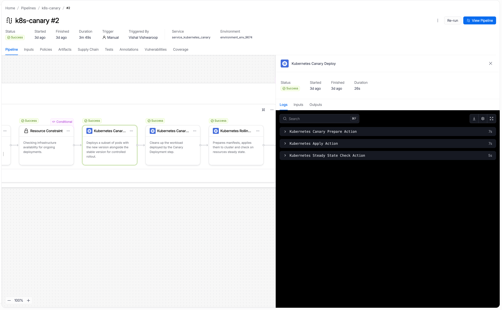
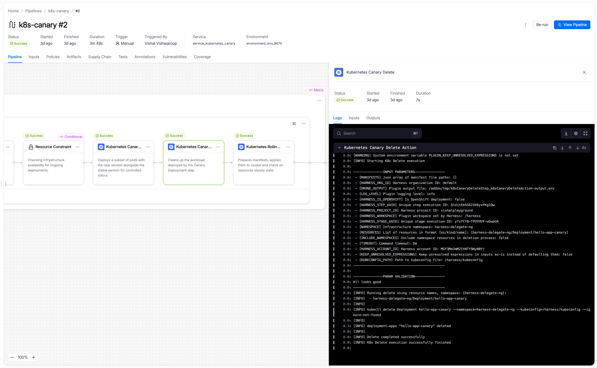

A Kubernetes canary deployment runs a small subset of pods on the new version while the stable version continues to serve the rest. Once you confirm the canary is healthy, a rolling deploy promotes the new version to all pods. If the canary fails, the failure affects only the small subset and the stable version remains untouched.

---

## Before you begin

Before you configure a canary stage, make sure you have the following in place:

- **A Kubernetes service:** Go to [Kubernetes services](/3k-docs/continuous-delivery/v1-deployments/kubernetes/kubernetes-services) to set up a service with manifests and an artifact source.
- **A Kubernetes infrastructure:** Go to [Kubernetes infrastructure](/3k-docs/continuous-delivery/v1-deployments/kubernetes/kubernetes-infrastructure) to connect a cluster and namespace.
- **A Harness delegate in the target cluster:** The delegate runs the deployment steps against your cluster.
- **Runtime configuration:** Every Kubernetes stage requires a `runtime` block specifying the connector and namespace. Go to [Kubernetes runtime configuration](/3k-docs/continuous-delivery/v1-deployments/kubernetes/overview#kubernetes-runtime-configuration) to understand the required fields.

---

## How canary deployments work

A canary deployment releases the new version to a small subset of pods while the stable version continues serving the rest. This lets you observe the new version under real production load using real users and real traffic before committing to a full rollout.

In the Harness Kubernetes canary flow, Harness deploys a small number of pods (defined by count or percentage) alongside the stable pods. Harness labels the canary pods with `harness.io/track=canary` and the stable pods with `harness.io/track=stable`. You can insert verification or approval steps while both versions run simultaneously. Once validated, Harness deletes the canary workload and a rolling deploy promotes the new version to all replicas.

If anything fails during the canary phase, the failure affects only the canary pods. The stable version remains untouched and continues serving all traffic. Rollback deletes the canary pods and re-applies the previous stable release.

**When to use canary:**

- You want to test the new version against real production traffic before a full rollout.
- You need to compare two versions side-by-side using monitoring, metrics, or automated verification.
- You want the lowest-risk deployment path: only a small percentage of users see the new version if something goes wrong.

---

## Pipeline YAML

<details>
<summary>View the complete canary stage YAML</summary>

```yaml
pipeline:
  stages:
    - name: k8s-deploy
      id: k8s_deploy
      service:
        type: kubernetes
        items:
          - <your-service-id>
      environment:
        id: <your-environment-id>
        deploy-to: <your-infrastructure-id>
      steps:
        - name: Kubernetes Canary Deploy
          id: k8sCanaryDeployStep
          template:
            uses: k8sCanaryDeployStep
        - name: Kubernetes Canary Delete
          id: k8sCanaryDeleteStep
          template:
            uses: k8sCanaryDeleteStep
            with:
              resources: <+stage.steps.k8sCanaryDeployStep.output.outputVariables.canaryWorkloads>
              is_openshift: <+stage.steps.k8sCanaryDeployStep.output.outputVariables.isOpenshift>
        - name: Kubernetes Rolling Deploy
          id: k8sRollingDeployStep
          template:
            uses: k8sRollingDeployStep
      rollback:
        - group:
            steps:
              - name: Kubernetes Canary Rollback Delete
                id: k8sCanaryRollbackDeleteStep
                template:
                  uses: k8sCanaryDeleteStep
                  with:
                    select_delete_resources: resources
                    resources: ${{rollback.data.PLUGIN_CANARY_WORKLOADS}}
                    is_openshift: ${{rollback.data.HARNESS_IS_OPENSHIFT}}
              - name: Kubernetes Rolling Rollback
                id: k8sRollingRollbackStep
                template:
                  uses: k8sRollingRollbackStep
      on-failure:
        errors: all
        action: stage-rollback
      runtime:
        kubernetes:
          namespace: <target-namespace>
          connector: <your-kubernetes-connector-id>
```

</details>

Go to [Kubernetes runtime configuration](/3k-docs/continuous-delivery/v1-deployments/kubernetes/overview#kubernetes-runtime-configuration) to understand the required `runtime` block and how to find your connector and namespace values.

---

## Configure a canary stage

---

### Select the canary strategy

When creating a new stage, step 4 of the stage wizard asks you to choose a deployment strategy. Select **K8s Canary Deploy Strategy** from the list.

Harness automatically adds the three steps that make up the canary flow to the stage canvas.



The three steps run in order:

1. **Kubernetes Canary Deploy:** Deploys a subset of pods with the new version alongside the stable version.
2. **Kubernetes Canary Delete:** Removes the canary workload after validation.
3. **Kubernetes Rolling Deploy:** Promotes the new version to all replicas using a rolling update.

:::tip Insert verification between steps
Place your verification or approval steps between **Kubernetes Canary Deploy** and **Kubernetes Canary Delete**. If verification fails, the pipeline stops before Canary Delete runs and the stable version continues serving all traffic.
:::

---

### Configure the Kubernetes Canary Deploy step

Click the **Kubernetes Canary Deploy** step to open its configuration panel.


The following fields are available:

| Parameter | Description | Required |
|-----------|-------------|----------|
| **Name** | Display name for this step in the stage canvas. Default: `Kubernetes Canary Deploy`. | Required |
| **Instances Unit Type** | Whether the **Instances** value represents a pod `count` or a `percentage` of the replicas defined in your manifest. | Required |
| **Instances** | The number of canary pods (count) or the percentage of total desired replicas (percentage). For example, if your manifest specifies `replicas: 4` and you set 50%, Harness deploys 2 canary pods. | Required |
| **Skip Dry Run** | When enabled, skips the `kubectl apply --dry-run` pre-validation before the actual apply. Default: `false`. | Optional |
| **Use Traffic Shift** | When enabled, activates traffic routing configuration on this step to split live traffic between stable and canary. | Optional |
| **Kubeconfig Path** | Path to the kubeconfig file. Default: `${{infra.kube_config_path}}`. | Optional |
| **Namespace** | Target namespace. Default: `${{infra.namespace}}`. | Optional |
| **Release Name** | Name used to track Harness release history. Default: `${{infra.releaseName}}`. | Optional |
| **Log Level** | Verbosity of step logs. Default: `info`. | Optional |

:::warning One workload per canary stage
Canary deployments support exactly one Kubernetes Deployment workload per stage. If your service manifests define multiple Deployment objects, the stage fails.
:::

Go to [Kubernetes Canary Deploy step reference](../step-library/k8s-canary-deploy) to view the full field reference.

---

### Configure the Kubernetes Canary Delete step

Click the **Kubernetes Canary Delete** step to open its configuration panel.


The following fields are available:

| Parameter | Description | Required |
|-----------|-------------|----------|
| **Name** | Display name for this step. Default: `Kubernetes Canary Delete`. | Required |
| **Resource Name** | Reference to the canary workload to delete. Auto-populated from the Canary Deploy step output: `<+stage.steps.k8sCanaryDeployStep.output.outputVariables.canaryWorkloads>`. | Required |
| **Kubeconfig Path** | Path to the kubeconfig file. Default: `${{infra.kube_config_path}}`. | Optional |
| **Namespace** | Kubernetes namespace where the canary workload runs. Default: `${{infra.namespace}}`. | Optional |
| **Log Level** | Verbosity of step logs. Default: `info`. | Optional |
| **OpenShift Mode** | Enable when deploying to an OpenShift cluster. Auto-populated from the Canary Deploy step output. | Optional |
| **Command Flags** | Additional flags passed to the underlying `kubectl delete` command. Use JSON format: `[{"Delete": "--force --grace-period=0"}]`. | Optional |

The **Resource Name** field auto-populates when you use this step after a Canary Deploy step. You do not need to change it.

Go to [Kubernetes Canary Delete step reference](../step-library/k8s-canary-delete) to view the full field reference.

---

### Configure the Kubernetes Rolling Deploy step

Click the **Kubernetes Rolling Deploy** step to open its configuration panel.


The Rolling Deploy step runs after Canary Delete and promotes the new version to all pods. The following fields are available:

| Field | Description |
|---|---|
| **Name** | Display name for this step in the stage canvas. Defaults to `Kubernetes Rolling Deploy`. |
| **Skip Dry Run** | When set to `true`, skips the `kubectl apply --dry-run` pre-validation before the actual apply. Defaults to `false`. |
| **Kubernetes Pruning** | When set to `true`, Harness removes resources from the cluster that exist in the previous release but are no longer in the current manifests. Defaults to `false`. |
| **Manifest Path** | Override the manifest paths from the service configuration. Leave empty to use all manifests from the service. |
| **Kubeconfig Path** | Path to the kubeconfig file. Derived from `${{infra.kube_config_path}}`. |
| **Namespace** | Target namespace for the deployment. Derived from `${{infra.namespace}}`. |
| **Release Name** | Name used to track Harness release history in the cluster. Derived from `${{infra.releaseName}}`. |
| **Log Level** | Verbosity of step logs. Defaults to `info`. |

Go to [Kubernetes Rolling Deploy step reference](../step-library/k8s-rolling-deploy) to view the full field reference.

---

## Rollback

If any step in the canary stage fails, Harness runs the rollback steps automatically. The rollback section of the stage canvas contains two steps in a group:



The two rollback steps run in order:

1. **Kubernetes Canary Delete:** Deletes the canary workload using the canary workload list stored in the rollback data. This cleans up any canary pods that were created before the failure.
2. **Kubernetes Rolling Rollback:** Rolls the stable workload back to the previous successful release.

---

### Kubernetes Canary Rollback Delete step

Click the **Kubernetes Canary Delete** step in the rollback group to see its configuration.


The **Resource Name** field points to the canary workload list captured by the Canary Deploy step:

```text
${{rollback.data.PLUGIN_CANARY_WORKLOADS}}
```

This ensures rollback always targets the exact canary resources that the Canary Deploy step created, even if the deployment partially succeeded.

---

### Kubernetes Rolling Rollback step

Click the **Kubernetes Rolling Rollback** step to see its configuration.



The following fields are available:

| Parameter | Description | Required |
|-----------|-------------|----------|
| **Name** | Display name for this step. Default: `Kubernetes Rolling Rollback`. | Required |
| **Enable Kubernetes Pruning** | When enabled, removes resources from the cluster that are not in the rollback release manifests before re-applying. Default: `false`. | Optional |
| **Kubeconfig Path** | Path to the kubeconfig file. Default: `${{infra.kube_config_path}}`. | Optional |
| **Namespace** | Target namespace. Default: `${{infra.namespace}}`. | Optional |
| **Release Name** | Release name used to look up the rollback target in the cluster secret. Default: `${{infra.releaseName}}`. | Optional |

The step re-applies the manifests from the last successful release stored in the cluster release history secret.

Go to [Kubernetes Rolling Rollback step reference](../step-library/k8s-rolling-rollback) to view the full reference.

---

## What happens during execution

When you run a pipeline with a canary stage, the execution view shows the full step sequence. A successful run looks like this:



The execution includes setup steps that Harness runs automatically before your configured steps:

- **Initialize:** Provisions and prepares the execution environment for this stage.
- **Service:** Initializes service configuration, variables, config files, artifact details, and manifest details.
- **Infrastructure:** Initializes the infrastructure deployment target, variables, and connectivity.
- **Resource Constraint:** Checks infrastructure availability for concurrent deployments.

Your three configured steps follow in order.

---

### Kubernetes Canary Deploy step in execution

When the Kubernetes Canary Deploy step runs, it performs three internal actions:



The three internal actions are:

1. **Kubernetes Canary Prepare Action:** Reads your manifests, computes the canary replica count from the instances setting, appends `-canary` to the workload name, adds the `harness.io/track=canary` label to pod specs, and writes the modified manifests to the workspace. Harness also clones a canary service from the primary service, appending `-canary` to its name and updating its selector to target only canary pods.

2. **Kubernetes Apply Action:** Applies the prepared canary manifests to your cluster using `kubectl apply`. This creates the canary Deployment and canary Service alongside the existing stable workload.

3. **Kubernetes Steady State Check Action:** Polls the cluster until all canary pods reach `Running` status and pass readiness checks, or until the step times out. If pods fail to become ready, the step fails and the stable version continues serving all traffic.

---

### Kubernetes Canary Delete step in execution

When the Kubernetes Canary Delete step runs, it removes the canary workload:



The step retrieves the canary workload name from the Canary Deploy step output, then runs:

```bash
kubectl delete Deployment hello-app-canary --namespace=<namespace> --kubeconfig=<path> --ignore-not-found
```

Harness deletes all canary-suffixed resources tracked in the release history. This includes the canary Deployment, cloned Service, and any canary-suffixed ConfigMaps, Secrets, HPAs, or PDBs. The stable workload and stable service remain unaffected.

---

### Kubernetes Rolling Deploy step in execution

When the Kubernetes Rolling Deploy step runs, it promotes the new version to all replicas:


The three internal actions are:

1. **Kubernetes Rolling Prepare Action:** Reads the full manifest without canary modifications, versions the release, and prepares manifests for full deployment. Harness labels all pods with `harness.io/track=stable`.

2. **Kubernetes Apply Action:** Applies the manifests using `kubectl apply`. Kubernetes performs a rolling update, incrementally replacing pods running the old version with pods running the new version. The number of pods deployed matches `replicas` in your manifest.

3. **Kubernetes Steady State Check Action:** Polls until all pods in the Deployment reach `Running` status, then marks the step and stage as successful.

---

## Enhance your deployment

The canary strategy gives you a three-step deployment flow. You can insert additional steps to add validation between the canary and promotion phases, or to operate on workloads after a successful deployment:

| Step | What it adds |
|------|-------------|
| [Kubernetes Steady State Check](../step-library/k8s-steady-state-check) | Explicitly re-verify the canary workload health before deleting the canary and promoting. Insert between Canary Deploy and Canary Delete. |
| [Kubernetes Scale](../step-library/k8s-scale) | Scale the canary workload up or down during the validation window to test under different load levels. |
| [Kubernetes Patch](../step-library/k8s-patch) | Apply a partial patch to the canary workload. For example, to update a feature flag annotation while the canary runs. |
| [Kubernetes Apply](../step-library/k8s-apply) | Apply individual manifest files before the canary deploy. For example, to pre-create a ConfigMap or Job. |
| [Kubernetes Delete](../step-library/k8s-delete) | Remove stale resources after the rolling promotion completes. |
| [Kubernetes Rollout](../step-library/k8s-rollout) | Run `kubectl rollout restart` on the promoted workload to bounce pods and pick up a refreshed Secret or ConfigMap. |

---

## Next steps

- Go to [Kubernetes rolling deployment](./rolling) to understand the rolling update strategy used in the final promotion step.
- Go to [Kubernetes blue-green deployment](./blue-green) to compare canary with a blue-green approach.
- Go to [Blank canvas deployment](./blank-canvas) to build a Kubernetes stage from scratch using the Apply step without a managed strategy.
