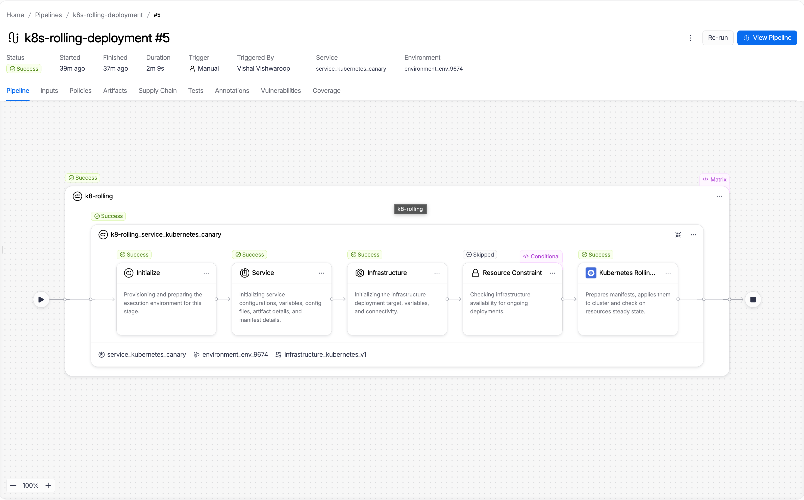
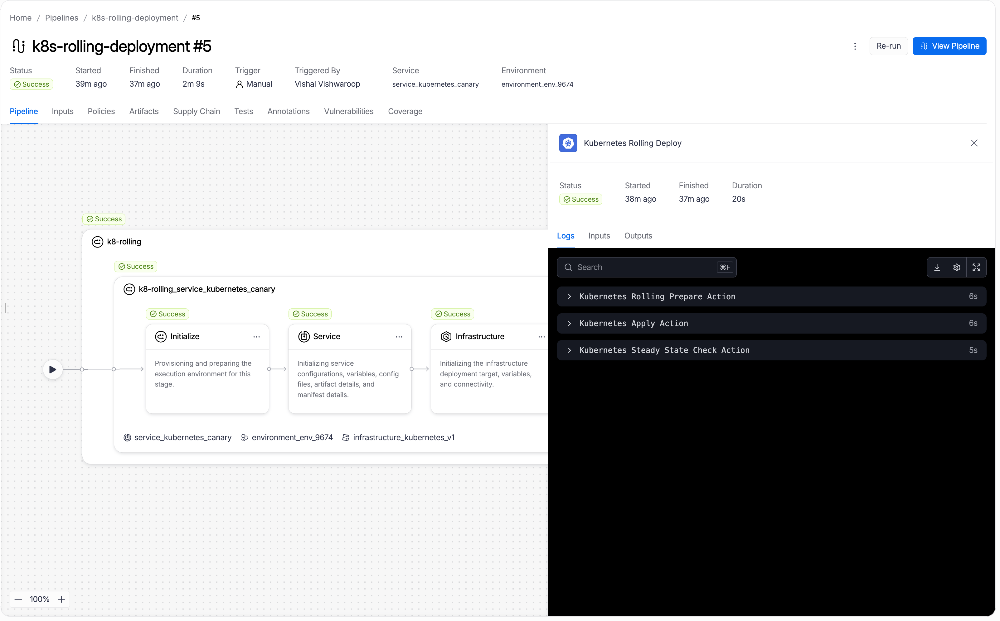

A Kubernetes rolling deployment incrementally replaces running pods with the new version. Harness prepares your manifests, applies them to the cluster, and waits for all pods to reach steady state before marking the deployment successful. If any step fails, Harness rolls back automatically by re-applying the previous release manifests.

---

## Before you begin

Before you configure a rolling stage, make sure you have the following in place:

- **A Kubernetes service:** Go to [Kubernetes services](/3k-docs/continuous-delivery/v1-deployments/kubernetes/kubernetes-services) to set up a service with manifests and an artifact source.
- **A Kubernetes infrastructure:** Go to [Kubernetes infrastructure](/3k-docs/continuous-delivery/v1-deployments/kubernetes/kubernetes-infrastructure) to connect a cluster and namespace.
- **A Harness delegate in the target cluster:** The delegate runs the deployment steps against your cluster.
- **Runtime configuration:** Every Kubernetes stage requires a `runtime` block specifying the connector and namespace. Go to [Kubernetes runtime configuration](/3k-docs/continuous-delivery/v1-deployments/kubernetes/overview#kubernetes-runtime-configuration) to understand the required fields.

---

## How rolling deployments work

A rolling deployment updates your Kubernetes workloads in place. Kubernetes replaces pods incrementally using the `RollingUpdate` strategy. A minimum number of pods stay available throughout the update and no second environment is needed. Harness prepares your manifests, applies them, and Kubernetes handles the replacement sequence natively.

The default rolling update strategy is `25% max unavailable, 25% max surge`. This means at most 25% of desired pods can be unavailable during the update, and at most 25% above the desired count can exist simultaneously. To override these defaults, add a `strategy` block to your Deployment manifest:

```yaml
strategy:
  type: RollingUpdate
  rollingUpdate:
    maxSurge: 1
    maxUnavailable: 1
```

Rolling supports multiple managed workloads per stage, including both Deployments and DaemonSets. This is unlike canary and blue-green, which support only a single Deployment per stage.

**When to use rolling:**

- Your application handles requests gracefully during pod replacement. Old and new versions run briefly side by side.
- You do not need to validate the new version against isolated production traffic before promotion.
- You want the simplest deployment path with automatic rollback to the previous release.

---

## Pipeline YAML

<details>
<summary>View the complete rolling stage YAML</summary>

```yaml
pipeline:
  stages:
    - name: k8-rolling
      id: k8_rolling
      service:
        type: kubernetes
        items:
          - id: <your-service-id>
            with:
              overlay:
                serviceDefinition:
                  type: Kubernetes
                  spec:
                    artifacts:
                      primary:
                        primaryArtifactRef: <+input>
                        sources: <+input>
      environment:
        id: <your-environment-id>
        deploy-to: <your-infrastructure-id>
      steps:
        - name: Kubernetes Rolling Deploy
          id: k8sRollingDeployStep
          template:
            uses: k8sRollingDeployStep
      rollback:
        - group:
            steps:
              - name: Kubernetes Rolling Rollback
                id: k8sRollingRollbackStep
                template:
                  uses: k8sRollingRollbackStep
      on-failure:
        errors: all
        action: stage-rollback
      runtime:
        kubernetes:
          namespace: <target-namespace>
          connector: <your-kubernetes-connector-id>
```

</details>

Go to [Kubernetes runtime configuration](/3k-docs/continuous-delivery/v1-deployments/kubernetes/overview#kubernetes-runtime-configuration) to understand the required `runtime` block and how to find your connector and namespace values.

---

## Configure a rolling stage

### Select the rolling strategy

When creating a new stage, step 4 of the stage wizard asks you to choose a deployment strategy. Select **K8s Rolling Deploy Strategy** from the list.

Harness automatically adds the one step that makes up the rolling flow to the stage canvas.

### Configure the Kubernetes Rolling Deploy step

Click the **Kubernetes Rolling Deploy** step to open its configuration panel.

The following fields are available:

| Field | Description |
|---|---|
| **Name** | Display name for this step in the stage canvas. Defaults to `Kubernetes Rolling Deploy`. |
| **Skip Dry Run** | When set to `true`, skips the `kubectl apply --dry-run` pre-validation before the actual apply. Defaults to `false`. |
| **Kubernetes Pruning** | When set to `true`, Harness removes resources from the cluster that exist in the previous release but are no longer in the current manifests. Defaults to `false`. |
| **Manifest Path** | Override the manifest paths from the service configuration. Leave empty to use all manifests from the service. |
| **Kubeconfig Path** | Path to the kubeconfig file. Derived from `${{infra.kube_config_path}}`. |
| **Namespace** | Target namespace for the deployment. Derived from `${{infra.namespace}}`. |
| **Release Name** | Name used to track Harness release history in the cluster. Derived from `${{infra.releaseName}}`. |
| **Log Level** | Verbosity of step logs. Defaults to `info`. |

Go to [Kubernetes Rolling Deploy step reference](../step-library/k8s-rolling-deploy) for the full field reference.

:::tip Insert verification between steps
The rolling strategy adds a single step by default. You can insert approval, verification, or notification steps anywhere in the stage, before or after the Rolling Deploy step.
:::

---

## Rollback

If the Rolling Deploy step fails, Harness runs the rollback steps automatically. The rollback section of the stage canvas contains one step in a group:

The following fields are available:

| Parameter | Description | Required |
|-----------|-------------|----------|
| **Name** | Display name for this step. Default: `Kubernetes Rolling Rollback`. | Required |
| **Enable Kubernetes Pruning** | When enabled, removes resources from the cluster that are not in the rollback release manifests before re-applying. Default: `false`. | Optional |
| **Kubeconfig Path** | Path to the kubeconfig file. Default: `${{infra.kube_config_path}}`. | Optional |
| **Namespace** | Target namespace. Default: `${{infra.namespace}}`. | Optional |
| **Release Name** | Release name used to look up the rollback target in the cluster secret. Default: `${{infra.releaseName}}`. | Optional |

The step retrieves the previous release's manifests from the Harness release history secret stored in the target namespace and re-applies them using `kubectl apply`.

Go to [Kubernetes Rolling Rollback step reference](../step-library/k8s-rolling-rollback) for the full reference.

---

## What happens during execution

When you run a pipeline with a rolling stage, the execution view shows the full step sequence. A successful run looks like this:



The execution includes setup steps that Harness runs automatically before your configured step:

- **Initialize:** Provisions and prepares the execution environment for this stage.
- **Service:** Initializes service configuration, variables, config files, artifact details, and manifest details.
- **Infrastructure:** Initializes the infrastructure deployment target, variables, and connectivity.
- **Resource Constraint:** Checks infrastructure availability for concurrent deployments.

Your configured step follows.

---

### Kubernetes Rolling Deploy step in execution

When the Kubernetes Rolling Deploy step runs, it performs three internal actions:



The three internal actions are:

1. **Kubernetes Rolling Prepare Action:** Reads your manifests, increments the release number, versions ConfigMaps and Secrets (unless Skip Resource Versioning is enabled), labels all pods with `harness.io/track=stable`, and writes the prepared manifests to the workspace. The release state is saved as a Kubernetes Secret in the target namespace so Harness can reference it for rollback.

2. **Kubernetes Apply Action:** Applies the prepared manifests to your cluster using `kubectl apply`. Kubernetes performs the rolling update natively, incrementally replacing pods running the old version with pods running the new version according to the `maxSurge` and `maxUnavailable` settings in your Deployment manifest. The default strategy is `25% max unavailable, 25% max surge`.

3. **Kubernetes Steady State Check Action:** Polls the cluster until all pods in the Deployment reach `Running` status and pass readiness checks, or until the step timeout is reached. Once all pods are ready, the step and stage are marked successful.

---

## Enhance your deployment

The rolling strategy gives you a working deployment in a single step. You can extend the stage with additional steps to add validation, patch live workloads, or clean up resources:

| Step | What it adds |
|------|-------------|
| [Kubernetes Steady State Check](../step-library/k8s-steady-state-check) | Re-verify workload health at any point in the stage, not just at the end of the deploy step. |
| [Kubernetes Scale](../step-library/k8s-scale) | Scale a workload up or down before or after the rolling deploy. Useful for pre-warming or post-deploy cleanup. |
| [Kubernetes Patch](../step-library/k8s-patch) | Apply a partial patch to a live workload, for example to update a label, annotation, or replica count without redeploying from manifests. |
| [Kubernetes Apply](../step-library/k8s-apply) | Apply individual manifest files directly. Use before the rolling deploy to pre-create ConfigMaps or Jobs. |
| [Kubernetes Delete](../step-library/k8s-delete) | Remove stale resources after a successful deployment. |
| [Kubernetes Rollout](../step-library/k8s-rollout) | Run `kubectl rollout restart` to bounce pods and pick up a new ConfigMap or Secret. |

---

## Next steps

- Go to [Kubernetes canary deployment](./canary) to deploy a small subset first and validate before promoting to all pods.
- Go to [Kubernetes blue-green deployment](./blue-green) to route production traffic between two full environments.
- Go to [Blank canvas deployment](./blank-canvas) to build a Kubernetes stage from scratch using the Apply step without a managed strategy.
