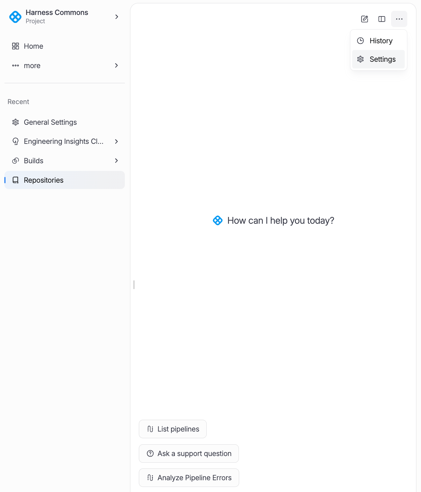
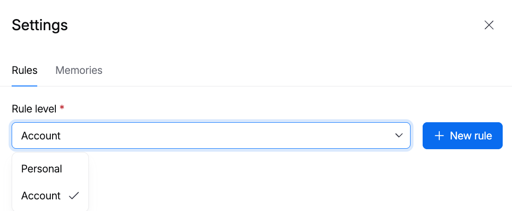
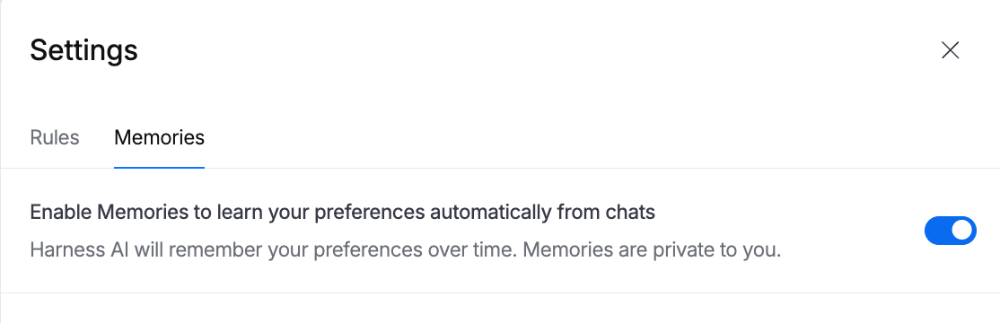

import Tabs from '@theme/Tabs';
import TabItem from '@theme/TabItem';

:::tip New in 3.0
The AI Assistant has been reimagined with a fundamentally new architecture. It is now integrated directly into the navigation, available on all pages, and capable of both answering questions and performing actions. Access it via the lightning bolt icon in the top-right header.
:::

| Aspect | Before (NG) | After (3.0) |
|---|---|---|
| **Placement** | Floating button overlay | Integrated in navigation header |
| **Availability** | Limited to specific pages | Available on all pages |
| **Capabilities** | Answer-only | Questions and actions |
| **Access** | Floating button, easy to miss | Lightning bolt icon in top-right header, always visible |

## Architecture

The AI Assistant is composed of two systems that work together: **Unified Chat** for conversational queries and the **Harness DevOps Agent** for performing actions. Each system uses a different model optimized for its purpose.

<Tabs queryString="architecture">
<TabItem value="chat" label="Unified Chat">

Handles conversational queries, read operations, and knowledge retrieval. Routes requests to the appropriate backend integration.

- **Model:** Sonnet 4.0

</TabItem>
<TabItem value="devops" label="Harness DevOps Agent">

Performs mutating actions such as creating and updating pipelines. Currently supports pipeline operations with more resource types coming soon.

- **Model:** Opus 4.5

:::info Partial Support
Write operations through the DevOps Agent are currently limited to pipelines. Support for additional resource types (secrets, services, environments, and connectors) is planned for future releases.
:::

</TabItem>
<TabItem value="support" label="Harness Support Agent">

Answers questions using Harness support documentation. Provides troubleshooting guidance, configuration help, and best practices from the knowledge base.

- **Model:** Opus 4.5

</TabItem>
<TabItem value="dashboard" label="Harness Dashboard Agent">

Builds and updates dashboards and widgets. Queries the Harness Knowledge Graph via MCP tool for metrics, analytics, and operational insights.

- **Model:** Opus 4.5

</TabItem>
</Tabs>

## Capabilities

The AI Assistant currently focuses on pipeline workflows with integrations into the Harness Knowledge Graph and Dashboard Agent. It supports all read operations and partial write operations through the DevOps Agent.

| Capability | Status | Description |
|---|---|---|
| **Pipeline Operations** | Supported | Create new pipelines and update existing pipeline configurations via the DevOps Agent. This is the primary write operation currently available. |
| **Read Operation Queries** | Supported | Query any Harness resource — list pipelines, inspect execution details, view connector configurations, check service definitions, and more. |
| **Knowledge Graph** | Integrated | Connects to the Harness Knowledge Graph to answer questions about platform concepts, configuration syntax, best practices, and troubleshooting guidance. |
| **Dashboard Agent** | Integrated | Retrieves analytics and metrics from Harness dashboards. Can also create new dashboards, create widgets within dashboards, and answer questions about build trends, deployment frequency, failure rates, and other operational data. |
| **Other Resource Mutations** | Coming Soon | Create/update operations for secrets, services, environments, connectors, and other Harness resources. |

:::tip Current Scope
The AI Assistant currently works with **Pipelines** as the primary resource for write operations. All other DevOps Agent actions (read queries, knowledge graph lookups, dashboard analytics) are fully operational.
:::

## Panel Layout

The AI Assistant opens as a panel on the right side of the viewport, occupying approximately 30–40% of the screen width. The panel contains an input field at the bottom for typing questions and a scrollable content area above for viewing responses. The main page content remains visible and interactive alongside the panel.

## AI-Powered Actions

The AI Assistant can perform actions through two channels: Unified Chat (Sonnet 4.0) handles read queries and knowledge lookups, while the DevOps Agent (Opus 4.5) handles pipeline mutations.

| Action | Channel | Details |
|---|---|---|
| **Create Pipelines** | DevOps Agent | Generate new v1 pipeline YAML from natural language descriptions. The agent produces valid pipeline configurations using the v1 schema. |
| **Update Pipelines** | DevOps Agent | Modify existing pipeline configurations — add stages, update steps, change triggers, adjust inputs and environment variables. |
| **Read Queries** | Unified Chat | Query any Harness resource: list pipelines, view execution history, inspect connectors, check service definitions, review environment configurations, and more. |
| **Knowledge Graph Lookup** | Unified Chat | Search Harness platform knowledge for concepts, configuration syntax, expression references, best practices, and troubleshooting guidance. |
| **Dashboard Analytics** | Unified Chat | Query the Dashboard Agent for build metrics, deployment frequency, failure rates, DORA metrics, and other operational analytics. Can also create new dashboards and add widgets to existing dashboards. |

:::warning Action Confirmation
All mutating actions (create, update) require explicit confirmation before execution. The DevOps Agent presents the proposed pipeline YAML and asks for approval before applying changes to your project.
:::

## Example Interactions

The following examples demonstrate common interaction patterns with the AI Assistant.

### Creating a Pipeline

Ask the AI Assistant to create a new pipeline. The DevOps Agent (Opus 4.5) generates valid v1 pipeline YAML from your description.

```yaml
User: Create a CI pipeline that builds a Docker image and pushes
      it to ECR when code is pushed to the main branch.

AI:   I'll create a CI pipeline with the following configuration:
      - Trigger: push to main branch
      - Stage: Build and push Docker image to ECR
      - Uses your existing "aws-connector" for ECR access

      Here's the pipeline YAML:

      pipeline:
        stages:
          - name: build-and-push
            steps:
              - name: build-image
                run:
                  script: docker build -t my-app .
              - name: push-to-ecr
                run:
                  container: amazon/aws-cli
                  script: |
                    aws ecr get-login-password --region $REGION | \
                      docker login --username AWS --password-stdin $ECR_REGISTRY
                    docker push $ECR_REGISTRY/my-app:latest
                  env:
                    REGION: <+input>
                    ECR_REGISTRY: <+input>

      Shall I create this pipeline in the current project?
```

### Updating a Pipeline

Modify an existing pipeline through a conversational interface. The DevOps Agent reads the current YAML and applies your requested changes.

```yaml
User: Update the "deploy-prod" pipeline to add an approval step
      before the production deployment stage.

AI:   I found the "deploy-prod" pipeline. I'll add an approval
      step before the "deploy-to-production" stage.

      Changes to pipeline YAML:
      + Added step "approval" before deploy-to-production:
          - name: approval
            run:
              script: echo "Waiting for approval..."
            # Approval gate configured via Harness UI
      + Updated stage ordering to ensure approval runs first

      Would you like me to apply this change?
```

### Read Query and Troubleshooting

Use read operations to inspect resources and diagnose failures. Unified Chat (Sonnet 4.0) queries the platform and provides analysis.

```yaml
User: My "deploy-staging" pipeline failed on the last run.
      What went wrong?

AI:   I queried the execution history for "deploy-staging".
      Last run: #247 (failed).

      Root Cause: The "apply-manifests" step failed with:
        "Unable to connect to Kubernetes cluster: connection
         refused on 10.0.1.50:6443"

      This indicates the delegate cannot reach the Kubernetes
      API server. Possible causes:
      1. The cluster endpoint has changed
      2. Network policy is blocking delegate access
      3. The cluster is temporarily unavailable

      Recommended Actions:
      - Verify the Kubernetes connector endpoint is correct
      - Check delegate connectivity to 10.0.1.50:6443
      - Review network policies in the delegate namespace

      Would you like me to look up the connector configuration?
```

## Chat Features

The AI Assistant includes built-in features for managing conversations, providing feedback, and maintaining a searchable history of past interactions.

| Feature | Description |
|---|---|
| **User Feedback** | Rate any AI response with thumbs up or thumbs down. Feedback is used to improve response quality over time. |
| **Copy Messages** | Copy any chat message to your clipboard. Useful for sharing AI-generated YAML, commands, or explanations with your team. |
| **Chat History** | All conversations are saved automatically. Search past chats, rename them for easy reference, or delete conversations you no longer need. |

### Chat History Management

| Action | Description |
|---|---|
| **Search** | Search across all past conversations by keyword to quickly find previous answers, pipeline configurations, or troubleshooting sessions. |
| **Rename** | Rename older chats with descriptive titles for easier navigation and organization. |
| **Delete** | Delete individual conversations from your chat history when they are no longer needed. |

## Settings

The AI Assistant can be configured through **Settings** to control agent behavior, enable personalization through memories, and manage conversation history. Click on the **...** dropdown menu and select **Settings**.

<div style={{maxWidth:800}}>  </div>

### Rules

Rules govern how the AI Assistant behaves and responds. They are plain Markdown files that provide instructions, constraints, and context to the agent. Rules can be defined at multiple scope levels, with narrower scopes taking precedence.

| Scope | Description |
|---|---|
| **Account** | Organization-wide rules that apply to all users across the entire Harness account. Set by account admins to enforce company-level standards. |
| **Organization** | Rules scoped to a specific organization within the account. Useful for team-level conventions and guidelines. |
| **Project** | Rules scoped to a specific project. Define project-specific context like naming conventions, deployment targets, or tech stack details. |
| **Personal** | User-level rules that apply only to your own AI interactions. Customize response style, preferred formats, or personal workflow preferences. |

:::tip Rule Format
Rules are written as plain Markdown files. You can include instructions like "Always use v1 pipeline schema", "Prefer Kubernetes deployments over ECS", or "Include rollback steps in all production pipelines". Rules at narrower scopes (Project > Org > Account) take precedence when there are conflicts.
:::

To create a rule, click **+ New rule** on the **Rules** tab.

<div style={{maxWidth:500}}>  </div>

### Memories

The AI Assistant can learn from your chat and session interactions through Memories. Memories capture key context from conversations such as your preferred tools, common configurations, and project patterns, and summarize them to personalize future interactions.

- **Automatic Summarization**: Memories are automatically summarized from chat and session interactions to capture important context without storing full conversation logs.
- **Personalization**: Stored memories are used to personalize future responses, reducing repetitive explanations and aligning suggestions with your workflow.
- **User Control**: Memories can be enabled or disabled at any time. When disabled, the AI Assistant will not store or reference any memories from your interactions.

Navigate to the **Memories** tab and click the checkbox to **Enable Memories to learn your preferences automatically from chats**.

<div style={{maxWidth:500}}>  </div>

## Module Availability

The AI Assistant is available across all Harness modules. It provides context-aware assistance tailored to the module you are currently working in.

| Module | AI Available |
|---|---|
| Continuous Integration (CI) | ✓ |
| Continuous Delivery (CD) | ✓ |
| Pipelines | ✓ |
| Dashboards | ✓ |