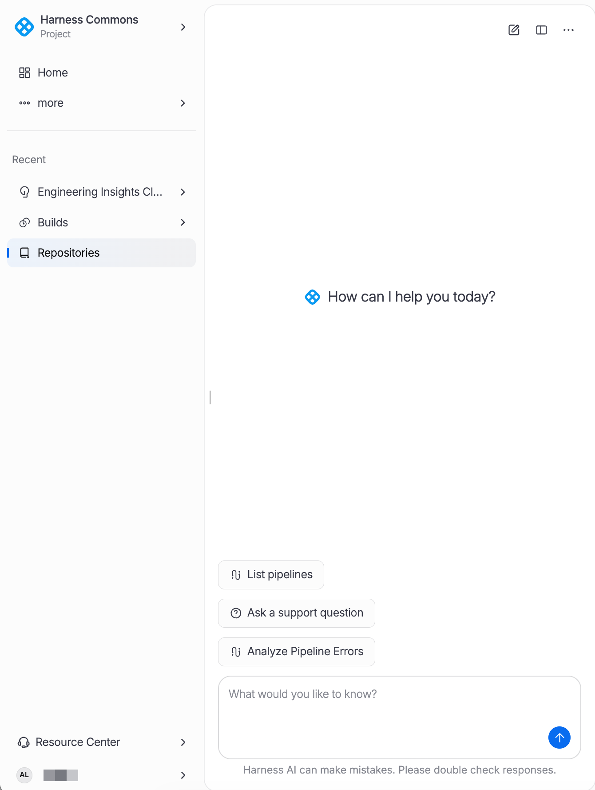
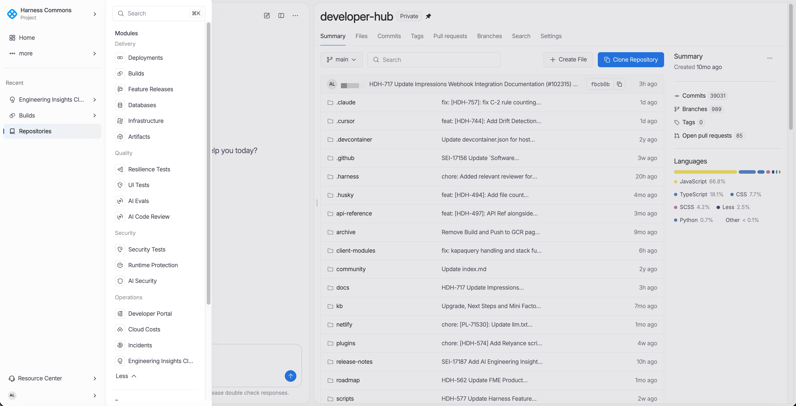
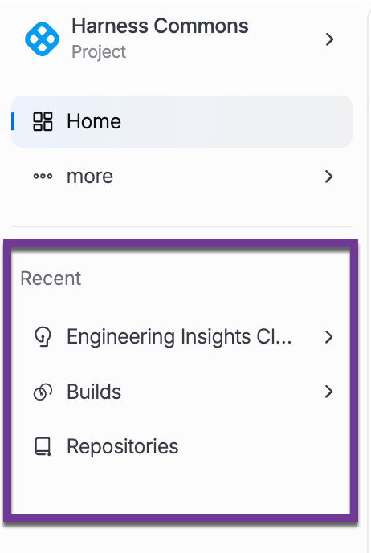
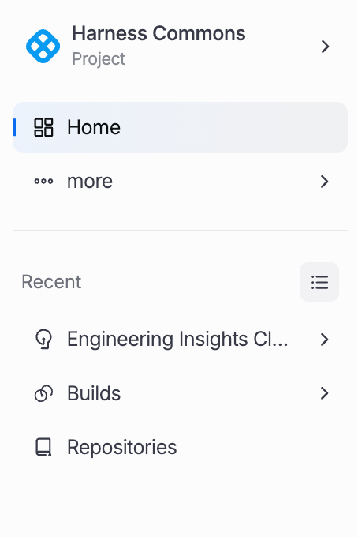
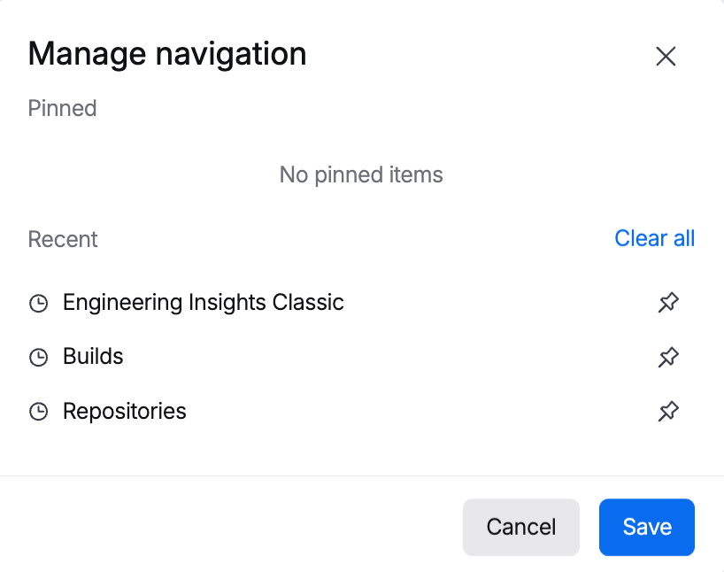

import Tabs from '@theme/Tabs';
import TabItem from '@theme/TabItem';

Harness 3.0 introduces a modern hierarchical navigation system designed for efficiency and discoverability. The navigation is composed of a left sidebar, top header bar, expandable "More" menu, settings panel, recent items list, and an integrated AI assistant.

:::info New in 3.0
The 3.0 navigation replaces the previous module-based tab layout with a unified sidebar that surfaces the most commonly used areas while keeping the full breadth of the platform accessible through the More menu.
:::

## Primary Navigation

The left sidebar is the primary entry point for all navigation in Harness 3.0. It is always visible and provides quick access to the most-used areas of the platform.

<div style={{maxWidth:800}}>  </div>

The table below describes what each section contains and when you'd use it.

| Section | Contents | Description |
|---|---|---|
| **Home** | Dashboard, Metrics, Notifications | Landing page with an overview dashboard, key metrics, and notification center for the current scope. |
| **Activity** | Deployment Events, Pipeline Executions, Audit Logs | Centralized activity feed showing deployment events, pipeline execution history, and audit trail entries. |
| **More** | Expands to full category list | Expands to reveal all available modules and resources organized by category. See [More Menu](#more-menu) below. |
| **Recent** | Dynamically populated, pinnable items | Displays recently accessed resources. Items can be pinned to keep them visible at the top of the list. |
| **Settings** | Account, Organization, Project settings | Located at the bottom of the sidebar. Opens the settings page scoped to the current account, organization, or project. |

```txt title="sidebar-structure.txt"
Sidebar
  |-- Home
  |     |-- Dashboard
  |     |-- Metrics
  |     |-- Notifications
  |
  |-- Activity
  |     |-- Deployment Events
  |     |-- Pipeline Executions
  |     |-- Audit Logs
  |
  |-- More  -->  [Expands to category grid]
  |
  |-- Recent
  |     |-- [Pinned items]
  |     |-- [Recently accessed items]
  |
  |-- Settings  (bottom of sidebar)
```

## More Menu

The More menu is the gateway to the full Harness platform. Clicking **More** in the sidebar expands a categorized grid of all available modules, tools, and resource management pages.



### DevOps

Core DevOps capabilities for building, deploying, and managing applications.

- **Deployments**: Continuous delivery pipeline management and execution.
- **Artifacts**: Artifact registry and artifact management.
- **Portal**: Developer portal for service catalog and documentation.
- **Repositories**: Source code repository management (Harness Code).
- **Workspaces**: Infrastructure as Code workspace management.

### Security

Security scanning and runtime protection capabilities.

- **Security Tests**: Static and dynamic security analysis integrated into pipelines.
- **Runtime Security**: Runtime threat detection and policy enforcement.

### Efficiency

Cloud cost optimization and infrastructure efficiency tools.

- **Cloud Costs**: Cloud cost management, recommendations, and budgeting.

### Platform

Platform-wide dashboards and account management.

- **Dashboards**: Custom dashboards for cross-module visibility.
- **Dashboards 2.0**: Next-generation dashboard builder with advanced visualizations.
- **Account**: Account-level settings and billing overview.

### Resources

Shared platform resources used across modules and pipelines.

- **Connectors**: Integration endpoints for external systems.
- **Secrets**: Secure credential storage and management.
- **Environments**: Deployment target environment definitions.
- **Delegates**: Worker agents for executing pipeline tasks.
- **Services**: Application service definitions and configurations.
- **Templates**: Reusable pipeline, stage, and step templates.
- **Variables**: Shared variables accessible across pipelines.
- **Policies**: OPA-based governance policies.
- **Webhooks**: Webhook endpoint management for external integrations.

## Recent Items

The **Recent** section in the sidebar is dynamically populated based on the resources and pages you access most frequently. It provides a fast way to return to items you were recently working with.

<div style={{maxWidth:300}}>  </div>

| Feature | Description |
|---|---|
| **Dynamic Population** | Items appear automatically as you navigate the platform. The list updates in real time based on your activity. |
| **Pin / Unpin** | Pin frequently used items to keep them at the top of the Recent list. Pinned items persist across sessions and are not displaced by newer activity. |
| **Capacity Limits** | The Recent list has a fixed capacity. When the limit is reached, the oldest unpinned items are removed to make room for new entries. |
| **Per-User Personalization** | Recent items are scoped to the individual user. Each team member sees their own activity history. |

:::tip Pinning Workflow
Hover over any item in the Recent list to reveal the pin icon. Clicking the icon toggles the pinned state. Pinned items are displayed in a separate group at the top of the list for quick access.
:::

### Manage your Recent items

To manage your Recent Items list:

1. Click the **Menu** icon to the right of `Recent`. 

   <div style={{maxWidth:200}}>  </div>

1. In the `Recent` section, you can add recent items to the `Pinned` section. To remove recently visited items, click **Clear all**.
   
   <div style={{maxWidth:400}}>  </div>

1. When you're done customizing your Recent Items list, click **Save**.

## Keyboard Shortcuts

Harness 3.0 supports keyboard shortcuts for common navigation actions. These shortcuts work from any page and provide a fast way to move through the platform without using the mouse.

| Shortcut | Action |
|---|---|
| `/` | Open the global search dialog. Begin typing to search across all resources, pages, and documentation. |
| `g` then `h` | Navigate to Home. |
| `g` then `a` | Navigate to Activity. View deployment events, pipeline executions, and audit logs. |
| `g` then `s` | Navigate to Settings. Opens the settings page for the current scope. |
| `Esc` | Close the current dialog, panel, or overlay. Works for search, AI assistant, and modal dialogs. |

:::info Shortcut Availability
Keyboard shortcuts are disabled when a text input field is focused to prevent accidental navigation. Press `Esc` first to blur the input, then use the shortcut.
:::