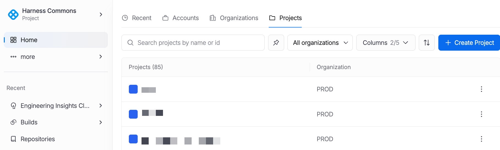
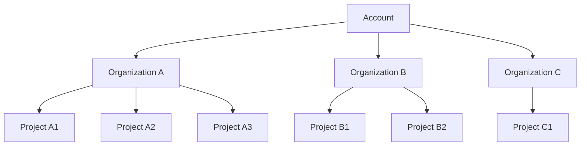

:::tip New in 3.0
All resources, permissions, and navigation are scoped to the currently selected context. Switching scope updates the entire interface, including available resources, sidebar content, and settings. Context is preserved when navigating between pages within the same scope.
:::

The scope selector is located in the top-left area of the header bar. It displays the currently active scope and provides a dropdown to switch between accounts, organizations, and projects. The format is: `[Avatar] [Scope Name] [Badge] [Dropdown]`.

  

## Scope Hierarchy

Harness uses a three-level hierarchy to organize resources and control access. Each level inherits configuration from its parent while allowing overrides at the current level. Resources created at a higher scope are accessible to all child scopes unless explicitly restricted.

**Scope inheritance rules:**

- Account-level resources are visible to all Organizations and Projects.
- Organization-level resources are visible to all Projects within that Organization.
- Project-level resources are only visible within that Project.

| Scope Level | Purpose | Examples |
|---|---|---|
| **Account** | Top-level container representing the entire Harness tenant. Used for global settings, billing, and shared resources. | Authentication settings, SMTP configuration, default delegates, shared connectors. |
| **Organization** | Logical grouping for teams or business units. Inherits account-level resources and adds org-specific configuration. | Team-specific connectors, shared templates, org-level roles and permissions. |
| **Project** | The working scope where pipelines, services, and environments are created and executed. | Pipelines, services, environments, infrastructure definitions, project-specific secrets. |

:::tip Context Preservation
When you switch between pages within the same scope, Harness preserves your context including scroll position, filter state, and selected tabs. Switching to a different project or organization resets the page context to the default view.
:::

## Project Selector

Clicking the scope selector dropdown opens the Project Selector dialog. This dialog provides a searchable, tabbed interface for quickly finding and switching to any project you have access to.

### Dialog Structure

The Project Selector dialog contains the following elements:

- **Title**: Displays "Select a Project" at the top of the dialog.
- **Search Bar**: A text input for filtering the project list by name. Searches are performed as you type.
- **Tabs: Pinned / All**: Toggle between pinned projects (your favorites) and the full list of all accessible projects.
- **Project List**: Each row displays the project icon, project name, breadcrumb path (Account / Org / Project), and a pin button.

### Keyboard Navigation

The Project Selector supports full keyboard navigation for efficient project switching.

| Key | Action |
|---|---|
| Type to search | Begin typing immediately to filter the project list. The search field is auto-focused when the dialog opens. |
| `↑` / `↓` | Navigate through the project list. The currently highlighted project is visually indicated. |
| `Enter` | Select the highlighted project and close the dialog. The scope updates immediately. |
| `Escape` | Close the Project Selector dialog without changing the current scope. |

## Pinning and Favorites

Harness 3.0 supports pinning across multiple resource types to help you quickly access the projects, connectors, secrets, and other resources you work with most frequently.

| Pinning Target | Where It Appears | Behavior |
|---|---|---|
| **Projects** | Project Selector "Pinned" tab | Pinned projects appear in a dedicated tab at the top of the Project Selector for one-click switching. |
| **Resources** | Sidebar Recent section | Pinned resources (secrets, connectors, pipelines) remain visible at the top of the Recent list in the sidebar. |
| **Recently Accessed** | Sidebar Recent section | Items you have recently accessed are always visible below pinned items. The list refreshes automatically based on your activity. |

:::info Per-User Personalization
Pinned items and recently accessed lists are personalized per user. Each team member maintains their own set of pins and recent history, independent of other users in the same account or organization.
:::