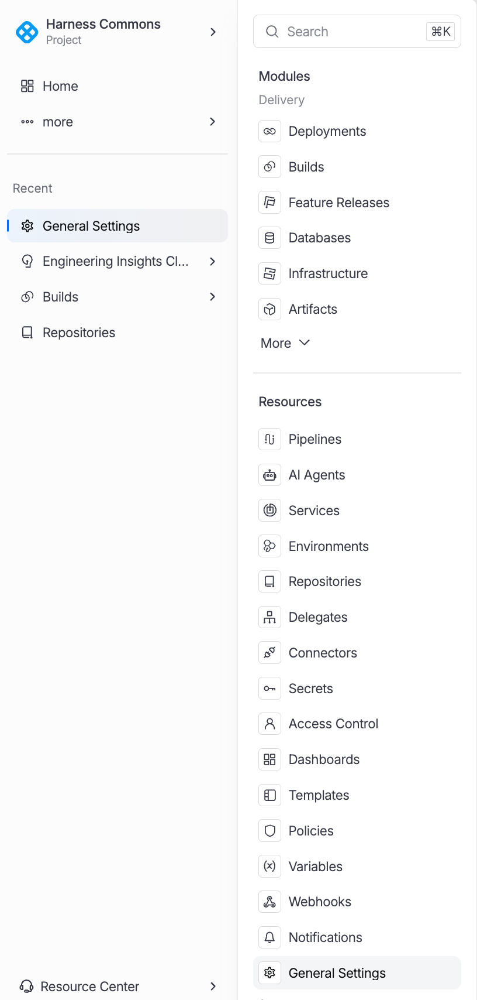

The **Settings** page provides centralized configuration for your Harness account. It is organized using a tabbed navigation structure that groups related settings into logical categories. 

:::info Settings Tabs
The Settings page uses a horizontal tab bar with the following categories: **All**, **General**, **Account-level Resources**, **GitOps**, **Access Control**, **Security and Governance**, **Subscriptions**, and **External Tickets**. Selecting a tab filters the visible settings cards to that category.
:::

To access the **Settings** page, click **More...** on the Harness navigation menu and select **General Settings**.

  

## General Settings

General settings control account-wide configuration that applies across all organizations and projects. These settings are typically configured once during initial setup and updated infrequently.

| Setting | Description |
|---|---|
| **Account Details** | View and edit account name, account ID, default locale, and timezone settings. Includes the account-level avatar and display configuration. |
| **Default Settings** | Configure default values that apply to new organizations and projects, including default connectors, secret managers, and pipeline settings. |
| **Cloud Cost Integration** | Set up cloud provider billing integrations for cost management. Connect AWS, GCP, and Azure billing accounts to enable Cloud Cost Management features. |
| **SMTP** | Configure SMTP server settings for outbound email notifications, pipeline alerts, and approval request emails. |
| **Notifications** | Manage notification channels and routing rules. Configure Slack, PagerDuty, email, and webhook notification endpoints. |
| **Chaos Image Registry** | Specify a custom container image registry for Chaos Engineering experiment images. Required when running in air-gapped environments. |
| **Banners** | Create and manage announcement banners that are displayed to all users in the account. Useful for maintenance windows and important notices. |

## Account-level Resources

Account-level resources are shared across all organizations and projects within the account. Creating resources at the account level reduces duplication and simplifies management for platform administrators.

| Resource | Purpose | Use Case |
|---|---|---|
| **Services** | Define application services that can be deployed across projects. | Shared microservices referenced by multiple teams. |
| **Environments** | Define deployment target environments at the account level. | Shared dev, staging, and production environments. |
| **Connectors** | Integration endpoints for cloud providers, SCMs, and registries. | Shared AWS, GCP, GitHub, and Docker Hub connectors. |
| **Delegates** | Worker agents that execute pipeline tasks in your infrastructure. | Shared delegate pools for multiple projects. |
| **Secrets** | Secure storage for credentials, tokens, and certificates. | Shared API keys and service account credentials. |
| **File Store** | Managed file storage for configuration files and scripts. | Shared deployment scripts and configuration templates. |
| **Templates** | Reusable pipeline, stage, and step definitions. | Organization-wide pipeline standards and best practices. |
| **Variables** | Named values accessible via expressions in pipelines. | Shared configuration values like region names or cluster URLs. |
| **Chaos Hubs** | Repositories of chaos experiment definitions. | Shared chaos experiment libraries for reliability testing. |
| **Overrides** | Service and environment override definitions. | Account-wide variable overrides for different environments. |
| **Certificates** | TLS certificate management for delegate and connector communication. | Custom CA certificates for internal PKI infrastructure. |
| **Webhooks** | Webhook endpoint configuration for external integrations. | Event-driven integrations with external ticketing and notification systems. |
| **IaCM Module Registry** | Private module registry for Infrastructure as Code modules. | Shared Terraform/OpenTofu modules for standardized infrastructure provisioning. |
| **Providers** | Infrastructure provider configuration for IaCM workspaces. | Shared cloud provider definitions for Terraform runs. |

:::tip Resource Scope Best Practice
Create resources at the highest scope where they are shared. If a connector is used by all projects, create it at the account level. If it is specific to a single team, create it at the organization level. This reduces duplication and simplifies credential rotation.
:::

## Access Control

Access Control settings manage who can access resources and what actions they can perform. Harness uses a role-based access control (RBAC) model with users, roles, resource groups, and service accounts.

| Component | Description |
|---|---|
| **User Management** | Invite, manage, and remove users. Assign users to groups and roles. View active sessions and login history. |
| **Role Definitions** | Create and manage roles that define a set of permissions. Built-in roles include Account Admin, Organization Admin, Project Admin, Pipeline Executor, and Viewer. |
| **Resource Groups** | Define groups of resources that a role applies to. Resource groups can include specific resources or all resources of a given type within a scope. |
| **Permission Assignments** | Bind users or user groups to roles within resource groups. This is the mechanism that grants access: User + Role + Resource Group = Permission. |
| **Service Accounts** | Non-human identities for automated access. Service accounts are assigned roles and used for API integrations, CI/CD automation, and external tooling. |
| **API Keys** | Generate and manage API keys for service accounts and user accounts. API keys are used for authenticating API requests and webhook callbacks. |

## Security and Governance

Security and Governance settings provide controls for authentication, network security, audit compliance, and policy enforcement across the platform.

| Setting | Description |
|---|---|
| **Authentication Settings** | Configure authentication methods including username/password, two-factor authentication (2FA), and session timeout policies. |
| **SSO Configuration** | Set up single sign-on with SAML 2.0 or OAuth 2.0 identity providers. Supports Okta, Azure AD, Google Workspace, and other SAML/OAuth providers. |
| **IP Allowlisting** | Restrict platform access to specific IP addresses or CIDR ranges. Separate allowlists can be configured for UI access and API access. |
| **Audit Logs** | View and export a comprehensive audit trail of all actions performed in the account. Audit logs capture user actions, API calls, and system events with timestamps and metadata. |
| **Compliance Policies** | Define and enforce compliance policies using OPA (Open Policy Agent). Policies can be applied to pipelines, deployments, and resource creation. |
| **Governance Rules** | Configure governance rules for cost management, resource usage, and deployment practices. Rules can generate warnings or block non-compliant actions. |

:::warning Security Best Practice
Enable SSO and two-factor authentication for all production accounts. Configure IP allowlisting to restrict access to known corporate networks. Review audit logs regularly to detect unauthorized access or configuration changes.
:::