The **Chaos Studio** offers a streamlined approach to chaos experiment design.

## What is a Chaos Experiment?

A **chaos experiment** is a testing methodology that validates system resilience by introducing controlled failures and observing system behavior. Experiments are composed of three core components:

- **Faults**: Controlled disruptions injected into your system to simulate real-world failures
- **Probes**: Validation mechanisms that continuously monitor system health and behavior
- **Actions**: Automated responses and workflows that execute based on experiment conditions

---

## Create a Chaos Experiment

1. Navigate to **Chaos Experiments** and click on **New Experiment**.

2. In the next screen, enter the **Name**, select your **Chaos Infrastructure**.

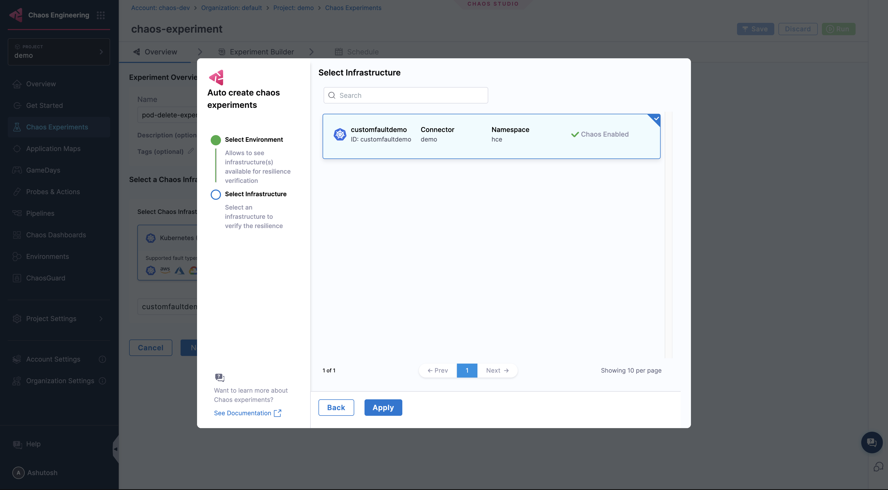

3. In the **Experiment Builder** screen, you can build chaos experiments by adding:
   - **Faults** to simulate system failures
   - **Probes** to validate system behavior and health
   - **Actions** to automate responses based on experiment outcomes

    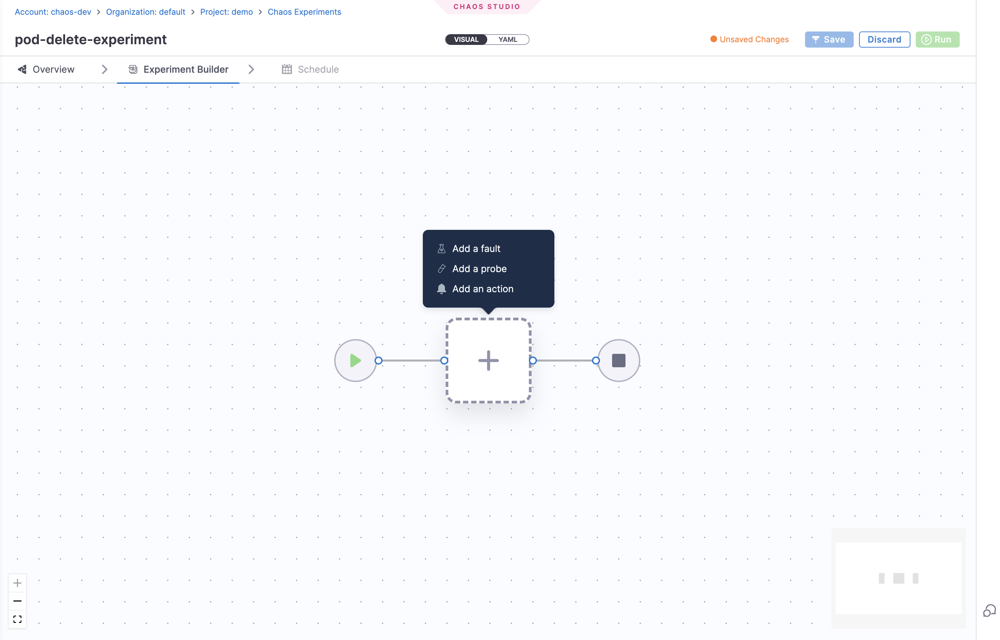

:::tip Alternative Method
You can also create experiments by uploading YAML files directly, which is useful for version control and programmatic experiment management.
:::

---

## Add Faults, Probes, and Actions

    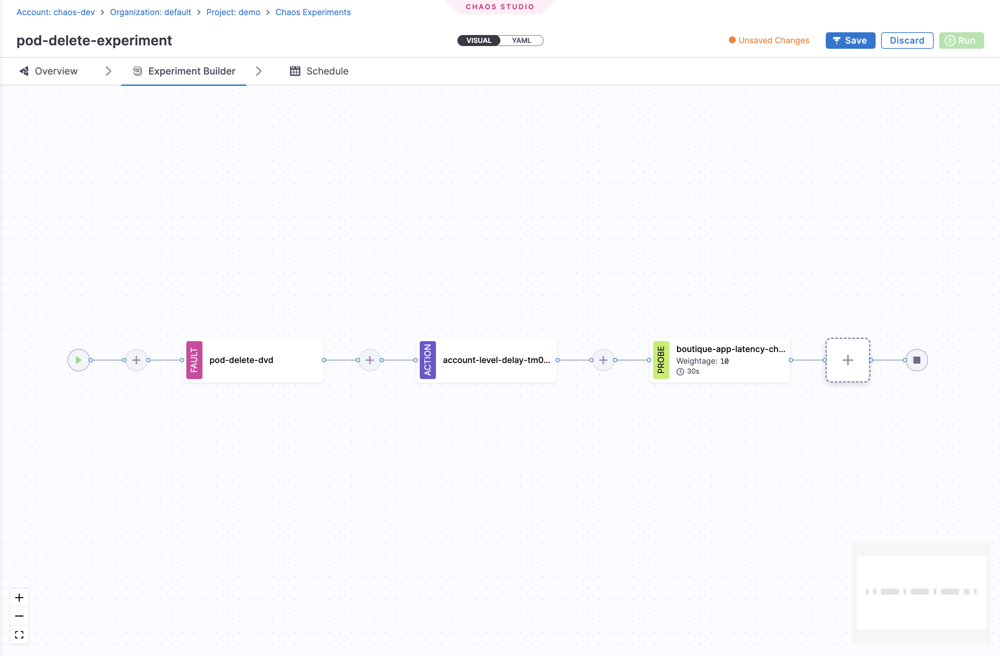

#### Add a Fault

1. Click on '+' icon, then select **Add a Fault** to add a fault to the experiment.

2. Select the fault you want to add to the experiment and click **Add to experiment**.

    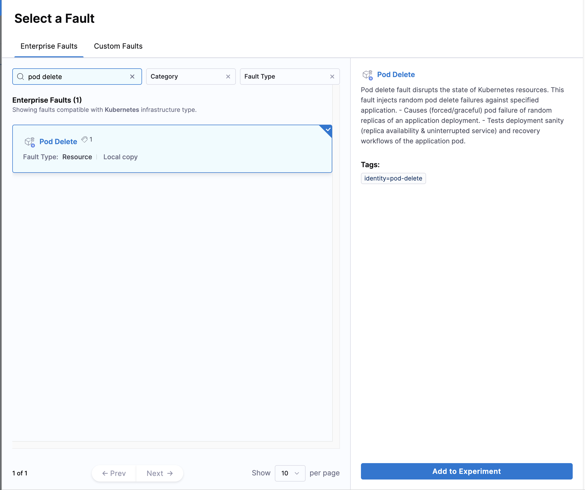

3. Tune the properties of the fault, and click **Apply Changes**.
   
#### Add an Action

1. Click on '+' icon, then select **Add an Action** to add an action to the experiment.

2. Select the action you want to add to the experiment and click **Add to experiment**.

    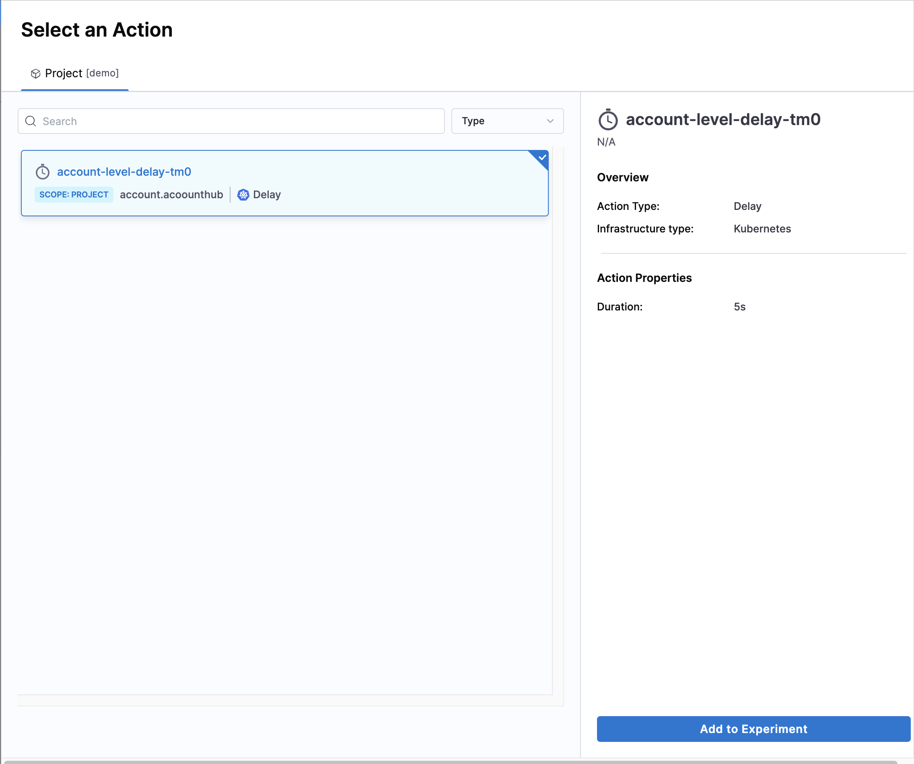

3. Modify the variables if any, then click **Apply Changes** in the next screen

#### Add a Probe

1. Click on '+' icon, then select **Add a Probe** to add a probe to the experiment.

2. Select the probe you want to add to the experiment and click **Add to experiment**.

    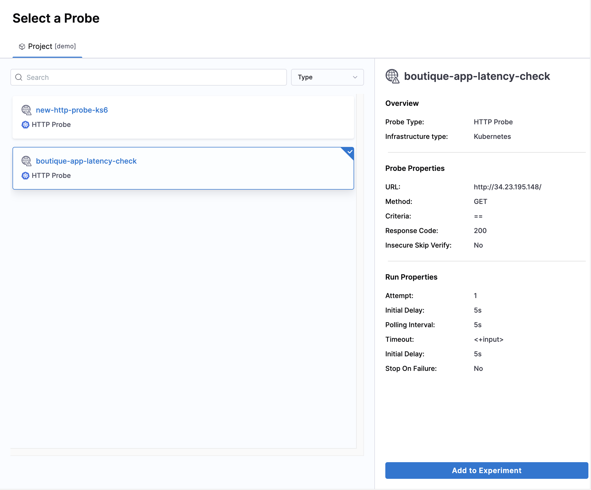

3. Tune the properties of the probe, and click **Apply Changes**.

:::tip Parallel Execution
You can add multiple faults, probes, and actions to run in parallel by using **Ctrl+Click** (Windows/Linux) or **Cmd+Click** (Mac) when clicking the '+' icon. This allows you to execute multiple components simultaneously during your experiment.

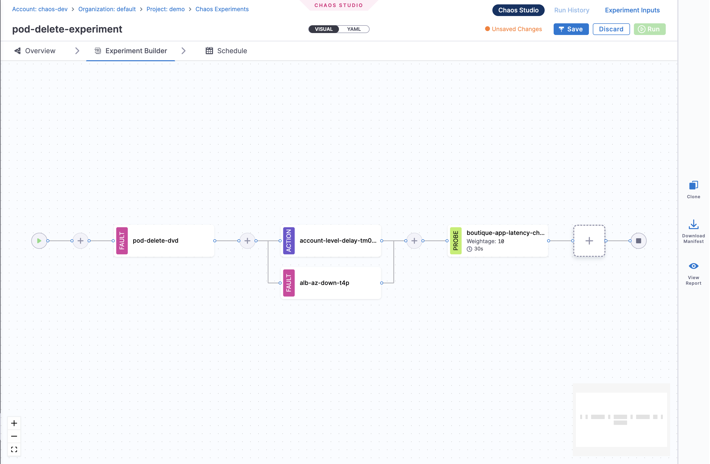
:::

--- 

## Conditional Execution

Conditional execution lets you control whether a fault, probe, or action runs during an experiment based on conditions you define. Use it to build a single experiment that adapts to different targets, environments, or runtime inputs instead of maintaining a separate experiment for each scenario.

Conditions are evaluated when the experiment runs. When the conditions for a node resolve to true, that node executes. When they resolve to false, the node is skipped and the experiment continues with the next node.

### Enable Conditions on a Fault, Probe, or Action

You configure conditions from the **Advanced** tab, which is available on faults, probes, and actions.

1. In the **Experiment Builder**, select the fault, probe, or action you want to gate.

2. Open the **Advanced** tab and turn on **Enable Conditions**.

3. Select an **Operator** to define how multiple values combine:

    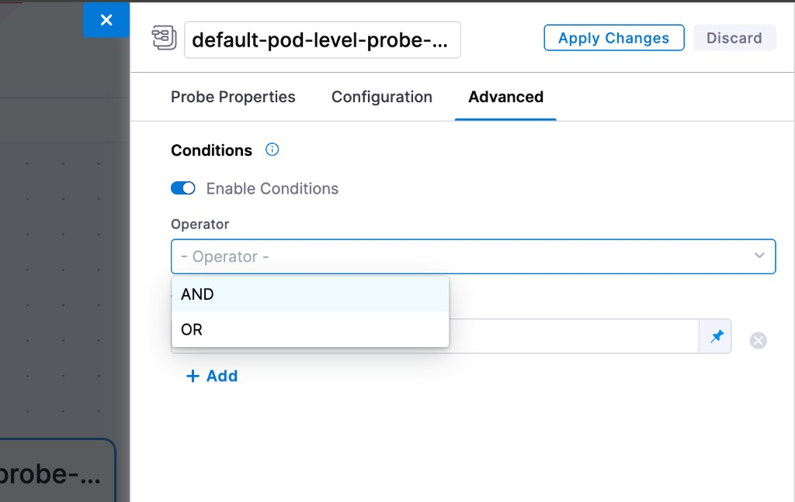

    | Operator | Behavior |
    |----------|----------|
    | **AND** | The node runs only when every value evaluates to true. |
    | **OR** | The node runs when at least one value evaluates to true. |

4. In **Values**, enter the condition values to evaluate. Select **Add** to evaluate more than one value with the chosen operator.

5. Select **Apply Changes**.

:::info Supported operators
Conditions support two operators: **AND** and **OR**. Use **AND** when every value must hold before the node runs. Use **OR** when any single value is enough.
:::

### Choose a Value Input Type

Each value supports three input types. Select the icon at the end of the value field to switch between them.

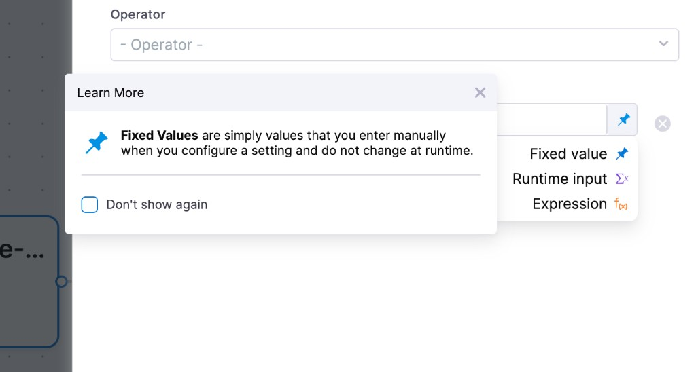

| Input type | Icon | Description |
|------------|------|-------------|
| **Fixed value** | Pin | A value you enter manually when you configure the condition. It does not change at run time. |
| **Runtime input** | `Σx` | A value supplied when the experiment runs, either in the **Run Experiment** dialog or from a saved input set. Use it to decide whether a node runs at execution time without editing the experiment. |
| **Expression** | `f(x)` | A value resolved from an expression, such as a reference to an experiment variable. Use it to evaluate conditions against values defined elsewhere in the experiment. |

Runtime inputs and expressions pair well with [runtime variables](#runtime-variable-support) and [experiment variables](#experiment-variables). For example, define an experiment variable for the target environment, then reference it in a fault condition with an expression so the fault runs only in the environments you choose at run time.

### Use Cases

- **Gate destructive faults by environment:** Add a condition to a `pod-delete` or node-level fault so it runs only in non-production environments, while the rest of the experiment runs everywhere.
- **Run a probe only when relevant:** Attach a condition to a probe so it validates a specific service only when that service is part of the run, which avoids false negatives on targets where the check does not apply.
- **Trigger an action selectively:** Gate a notification or cleanup action so it runs only when a chosen condition is met, such as a specific platform or region passed as a runtime input.
- **Reuse one experiment across teams:** Combine conditions with runtime inputs so each team supplies its own values at run time and exercises only the faults, probes, and actions that apply to its services.

--- 

## Run Experiment & Monitor with Timeline View

1. Save the experiment and click on **Run** to execute the experiment.

2. Once the experiment begins execution, you'll be taken to the **Timeline View** which provides real-time monitoring of your running experiment.

#### What is Timeline View?

The **Timeline View** displays a visual representation of all events in your chaos experiment as they happen. Each event shows with timestamps, giving you complete visibility into:

- **Chaos injection** - When faults start executing
- **Probe validation** - Real-time health checks and monitoring  
- **Actions execution** - Custom scripts and delay actions
- **Rollback/Cleanup** - Recovery and cleanup processes

        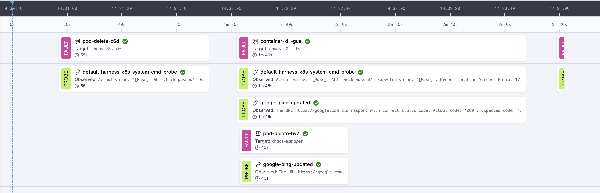

In the example above, you can see how faults and probes run both serially and in parallel, with clear timestamps for each event.

#### Monitor Your Experiment

As your experiment runs, the timeline continuously updates showing:

- **Step 1:** Chaos injection starts → Event logging begins with timestamps
- **Step 2:** Probe validation runs → Continuous monitoring updates
- **Step 3:** Faults execute → Real-time status and metadata
- **Step 4:** Actions trigger → Custom workflows execute
- **Step 5:** Rollback/Cleanup → Recovery processes complete

#### Get Detailed Event Information

Click on any event in the timeline to view detailed metadata:

- **Experiment events** show name, tunables, and execution status

        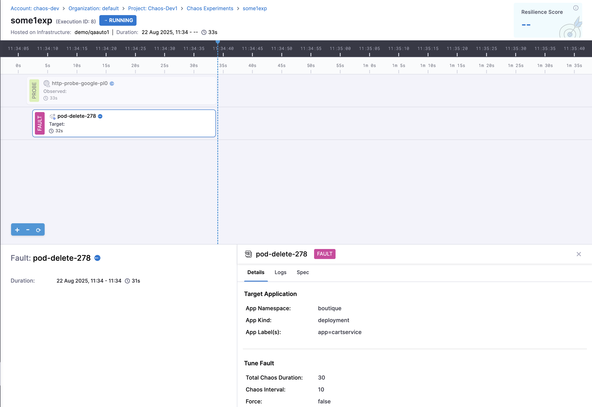

- **Probe events** display details, logs, and validation results
	
        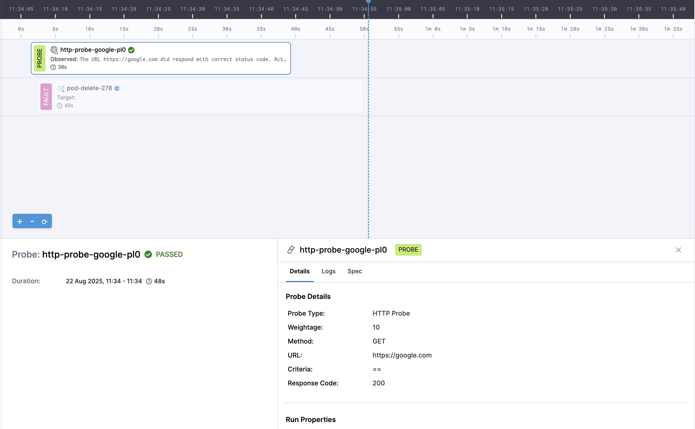

This real-time monitoring helps you:
- **Track progress** as your experiment executes
- **Debug issues** by identifying exactly when and where failures occur
- **Analyze results** with complete execution history and metadata
- **Understand impact** of chaos faults and validation probes over time

---
## Edit Experiment

1. Go to **Chaos Experiments** and hover over the (⋮) icon next to the experiment you want to edit, then select **Edit Experiment**.

    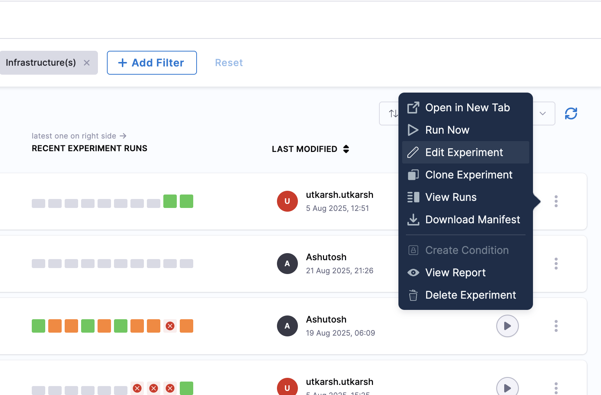

---

## Export Experiment

1. Go to **Chaos Experiments** and hover over the (⋮) icon next to the experiment you want to export, then select **Download Manifest**.

    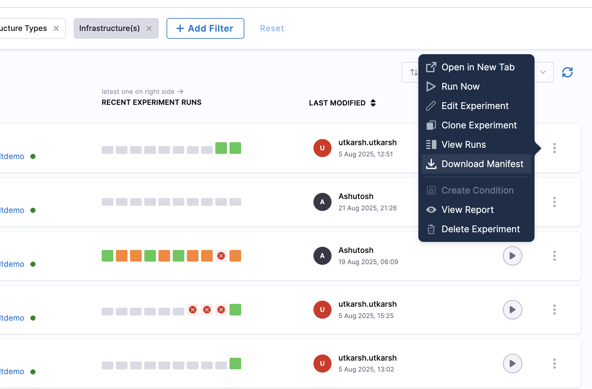

---

## Runtime Variable Support

Runtime variables provide flexibility in chaos experiments by allowing you to customize experiment parameters at execution time rather than hardcoding them during creation.

You can execute chaos experiments using either static values or dynamic runtime values:

- **Static variables**: Define them directly in the experiment and use them without any modification.
- **Runtime variables**: Specify them using `<+input>`, allowing customization at runtime or through saved input sets.

#### Use Runtime Variables

When setting up an experiment, in the **Target Application** and **Tune Fault** modals, you can choose between **Fixed value** and **Runtime Input**. Once you choose the input type, **Save** the changes.

   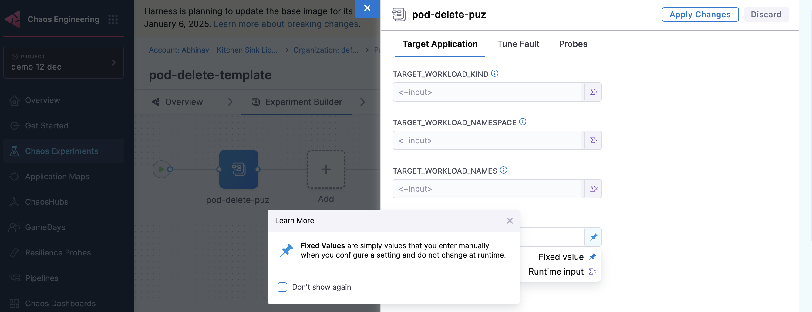

   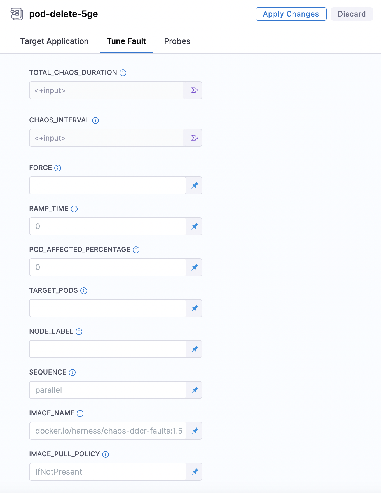

:::tip Runtime Variable Tips
- If you don't provide values for certain fields (which are not mandatory), the experiment executes with default values.
- Variables specified as runtime inputs appear as editable fields in the UI, whereas static fields appear as display-only.
:::

---

## Experiment Variables

Experiment variables let you define reusable, parameterized values at the experiment level, similar to pipeline variables. These variables can be referenced across faults, probes, and actions within the experiment, providing a centralized way to manage shared configuration.

### Add an Experiment Variable

1. In the **Experiment Builder**, click the **Variables** icon in the right sidebar.

    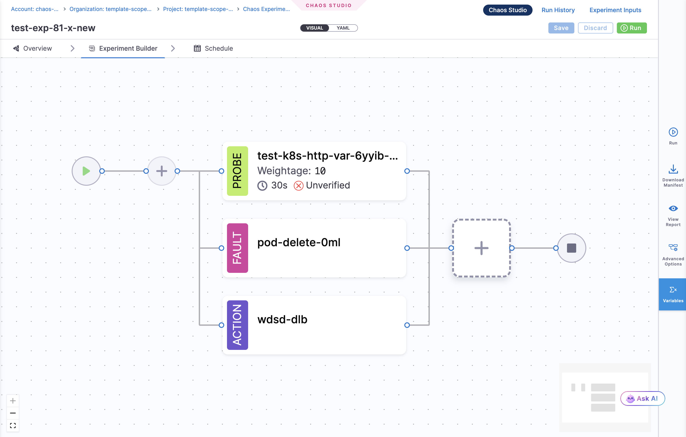

2. In the **Variables** panel, click **+ Add Variable**.

3. In the **New Variable** dialog, configure the following:

    | Field | Description |
    |-------|-------------|
    | **Type** | Data type of the variable. Supported types: `String`, `Number` |
    | **Name** | Identifier used to reference the variable in the experiment |
    | **Value** | The value assigned to the variable. Use a fixed value or `<+input>` for runtime input |
    | **Set variable as required during runtime** | When checked, the variable must be provided at experiment run time |
    | **Description** | Optional description for the variable |

    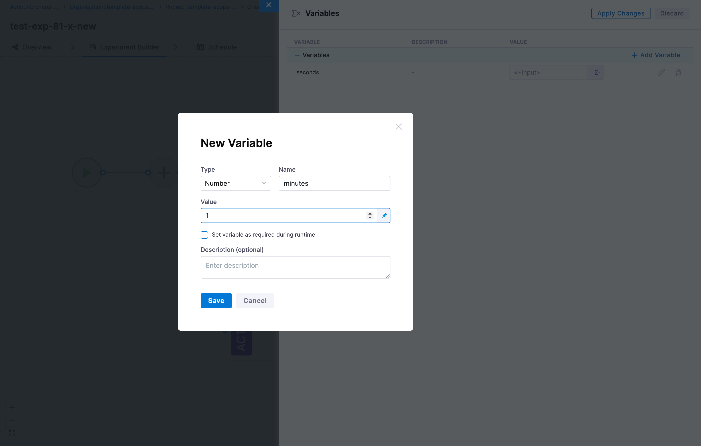

4. Click **Save**, then click **Apply Changes** in the Variables panel.

### Provide Variable Values at Runtime

When you run an experiment that has variables configured with runtime input (`<+input>`), the **Run Experiment** dialog prompts you to provide values for those variables before execution.

You can also:
- Toggle between **Visual** and **YAML** views to configure variables
- Use an existing input set by enabling **Use an Existing Input Set**
- Save the current variable values as a new input set by clicking **Save As New Input Set**

    

