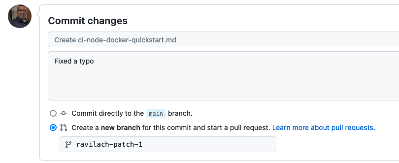

# Contributing to Harness Developer Hub


Thanks for considering to contribute to the Harness Developer Hub! Contributions come in all shapes and sizes and we appreciate them all. Contributions to the Harness Developer Hub come in the form of creating pull requests or submitting issues.

## Change process

GitHub is the primary mechanism for changes. Pull requests are the mechanism to submit and approve changes. 

Each pull request requires 1 approval per [CODEOWNER](/.github/CODEOWNERS) for EACH section that has changes. For example, if you've changed files in the CI and CD modules, you will require approvals from a CI codeowner AND a CD codeowner in order to merge your PR.

### Small changes

Small changes are items that do not require local testing and can be accomplished in the GitHub UI, such as singular typo in an MD file.



### Large changes

Large changes are considered to be an entire document/tutorial or making UI/UX changes such as to the site structure, organization, or branding. These changes require a fork and local development/testing.

Changes that touch multiple modules or sections of HDH tend to take longer to merge due to requiring approvals from many codeowners as well as taking longer to review. Try splitting apart larger PRs into smaller chunks and creating many smaller PRs. 

### PR Merge Guidelines

PRs should follow these guidelines in order to be merged successfully:

- Each PR requires approval from codeowners and the build to pass in order to be merged. You are in charge of merging your own PRs! This means you need to fix any build failures, and track down and tag the codeowners in order to get your approvals. 

- Your PRs will also need to follow the style guide, and need to be of high enough quality in spelling and grammar to be approved. Low quality PRs will be rejected/closed. 

- Stale PRs will be closed after ~1 month. 

- Please click **Enable auto-merge** on your PR to merge it automatically if it receives the required approvals and passes the builds. 

- Please **Assign** a PR to yourself if you are its creator. 

## Style Guide

If you are contributing to HDH, make sure you are compliant with our [Style Guide](./docs/hdh/style-guide).

## Local development guide

The Harness Developer Hub is powered by [Docusaurus](https://docusaurus.io/). Larger changes should be vetted locally before submitting a PR.

- NPM [Node 22]
- Yarn

You need to fork this repository and create a branch to commit, which will be basis for the eventual PR . On your local machine, run the following commands.

> :information_source:
> Per the current version of Docusaurus, Node 18 LTS works the best. The following instructions assume you run a Mac and have [Homebrew](https://brew.sh/) installed:

```
#Install node
brew install node@22
brew link node@22

#Run
cd developer-hub

#Install Yarn
npm install --global yarn

#Validate installation
yarn --version

#Launch site
yarn
yarn start

#Access
http://localhost:3000

```

## PR automation

Open your pull request in Harness Code as you normally would. From then on, every push to the branch runs the `harnessDeveloperHub` CI pipeline, which keeps the PR description up to date for you. This runs server-side (see HDH-1049), so there is no local setup, and it behaves the same whether you push from the CLI, an IDE, or the Harness Code web editor.

On each push the pipeline:

1. Regenerates the PR description from [`.harness/pull_request_template.md`](./.harness/pull_request_template.md) — a summary of the change, the per-page preview table, and the Jira ticket link.
2. **Skips frontmatter-only doc changes** (`redirect_from`, `title`, etc.) from the per-page preview list.
3. Rewrites the preview links once the Netlify preview build finishes.
4. Applies the appropriate content label.

To generate the preview table locally without the API, run:

```bash
npm run generate-pr-preview-list
```

### Your PR title

A PR title has three parts:

```
chore: [HDH-1099]: Update the CI pipeline step scripts
^tag    ^ticket     ^summary
```

**The pipeline never rewrites your summary.** Harness Code fills it in from your first commit when you open the PR, and after that it changes only when you change it.

**The tag and ticket are filled in for you when they are missing.** A PR titled `Fix broken links` on branch `HDH-1099/fix-links` becomes `chore: [HDH-1099]: Fix broken links` on your next push. Your words are untouched — only the two segments in front of them. When both are already present, nothing is written at all, so a well-formed title stays exactly as it is however many times you push.

What goes in each segment:

- **Tag** — `chore` or `feat`, taken from your commit message and defaulting to `chore`.
- **Ticket** — taken from your title first, then your commit messages, then your branch name. Both `HDH-1234/my-branch` and `HDH-1234-my-branch` work.
- If no ticket can be found in any of those, you get a visible `[ticket-id]` placeholder as a reminder to add one. It is replaced automatically once a real ticket turns up.
- A ticket you wrote yourself is never replaced, even when it differs from the branch name. If you have retargeted a PR to a different ticket, that decision sticks.

### Rewriting your title with `[retitle]`

If your title stops fitting — the scope of the PR changed, or it was named after a single early commit — edit it in the Harness Code UI, or ask the pipeline to write a new one by putting `[retitle]` anywhere in a commit message:

```bash
git commit -m "add IaCM upgrade steps [retitle]"
git push
```

This is the only thing that rewrites your summary, and it only happens when you ask for it.

- The new title is generated from the **whole pull request** — every commit on the branch, the diffstat, and the list of changed files — not from the commit you happened to put the marker in.
- Only your most recent commit is checked, so the retitle happens once. Your next push leaves the new title alone.
- The marker is stripped before anything is written, so `[retitle]` never appears in your PR title or description.
- If a title cannot be generated for any reason, your existing title is left exactly as it is.

## Navigation and folder structure

Powering the left navigation are [Docusaurus Sidbars](https://docusaurus.io/docs/sidebar). Update the `sidebars.js` file for new sections. For existing sections, certain sections are auto-generated by folder structure and certain landing pages are static.

```
/docs
	/module
		somedoc.md
		/static
			/somedoc
				somedoc.png
			/somesubdoc
				somesubdoc.png
		/sub_catagory
			somesubdoc.md

```

## Videos

Videos are great tools to embed. You can embed a video in your Markdown as the following:

```


<!-- Video:
https://youtu.be/apSyBZCz5QA-->
<DocVideo src="https://youtu.be/apSyBZCz5QA" />


```

## Sample applications

If possible, we would like to persist sample applications in a [sample application
repository](https://github.com/harness-apps/developer-hub-apps). The sample application repository has a similar [contributor's guide](https://github.com/harness-apps/developer-hub-apps/blob/main/CONTRIBUTING.md).

## Markdown Tutorial

HDH is powered by [Markdown](https://daringfireball.net/projects/markdown/). Take a look at a [sample MD page](http://developer.harness.io/docs/hdh/hdh-docusaurus-sandbox) showing off several MD features that are supported on HDH.

## Additional metadata

When adding a new Markdown file, above the initial H1 tag, a `description` is needed for SEO. You can include optional `keywords`. For example:

```
---
title: NodeJS and Docker pipeline
sidebar_position: 1
description: This build automation guide walks you through building a NodeJS and Docker Application in a CI Pipeline
keywords: [Tutorial, Continuous Integration, NodeJS, Docker]
---

```

`keywords` are only available in the page metadata. They are not rendered when published.

`tags` are similar to keywords; however, they offer interactive functionality. If included, tags appear at the bottom of the page. Selecting a tag directs the user to a page listing all pages with that tag. Only use tags if they are used holistically; otherwise the use of tags creates pages with only a few links, rather than accurately representing the full offering of thematically-related content.

```
---
title: NodeJS and Docker pipeline
sidebar_position: 1
description: This build automation guide walks you through building a NodeJS and Docker Application in a CI Pipeline
tags: [Tutorial, "Continuous Integration", NodeJS, Docker]
---

```

## Change approval flow

Harness approvers will validate changes and approve the branch for merge into `main`. Once merged into `main`, the CI Process [Harness CIE] will start automatically.

### PR preview environment

When PRs are filed, a preview environment is created for the Harness approvers to validate.

## Non-content changes

Please raise a Jira issue for non-content changes, such as infrastructure or UX ideas/changes before submitting a PR.

## Archived Information

Additional info that might not be prudent to your first contribution.

### Style guide

Harness Documentation follows the Microsoft Style Guide. We would recommend this.

- [https://learn.microsoft.com/en-us/style-guide/welcome/](https://learn.microsoft.com/en-us/style-guide/welcome/)

Since the final document is in Markdown, feel free to author in a tool of your choice and port to Markdown.

Vale is an excellent tool for validating spelling and style in Markdown **locally**. You can run [Vale](https://vale.sh/) aganist a specific file or project structure prior to submitting if you would like, locally. This is not required.

> :information_source:
> Part of the PR checks, we are currently not using Vale. If you would like to check locally/programatically, Vale is a good tool.

```
#install
brew install vale

#Create Vale INI
#https://vale.sh/docs/vale-cli/structure/#valeini

cat <<EOF >>.vale.ini
StylesPath = styles

MinAlertLevel = suggestion
Vocab = Base

Packages = Microsoft, write-good

[*.md]
BasedOnStyles = Vale, Microsoft, write-good
EOF

#Vale sync
vale sync

#Execute Vale
#cd into parent local folder if you want to validate all files.

vale ./developer-hub/docs/**/*.md
```
