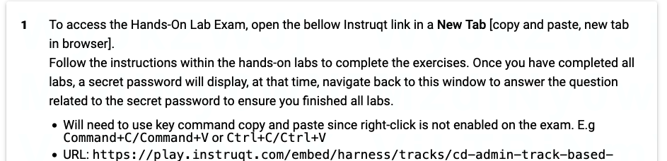
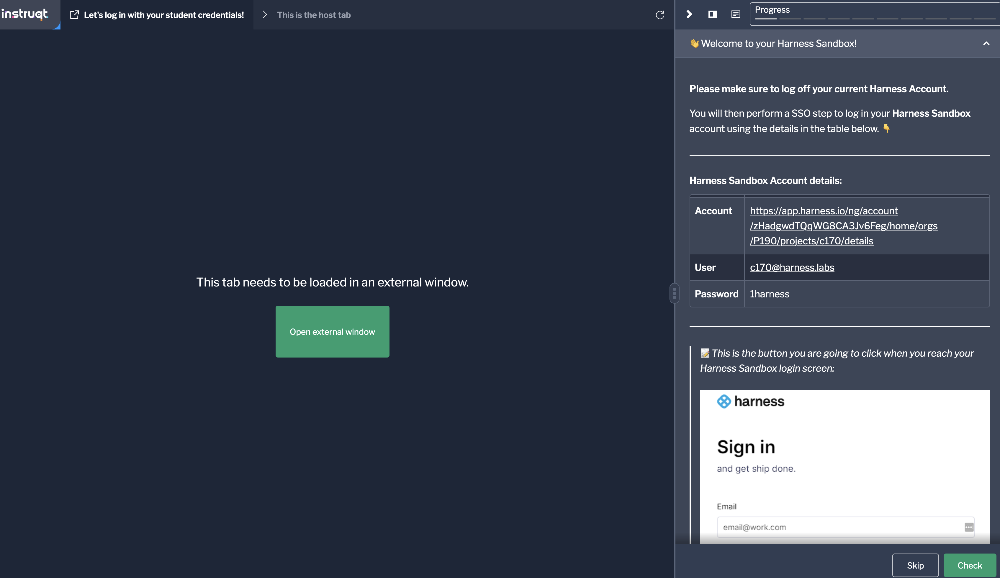

# Instructions

:::info

These instructions are in support of our Admin and Architect level exams. 

:::

## Video of Experience
Video on experience you will follow in the below instructions.

<docvideo src="https://www.youtube.com/watch?v=v8kOnhNopkc" />

## Accessing your Hands-On Exam 

1. After registering for the administrator or architect level exam, the final question will be the hands-on exam. 

2. Once you access the hands-on exam, you will see instructions to open the Instruqt Hands-On exam by copy and pasting the exam URL in a new tab.  

	

3. Follow the instructions provided within the hands-on labs to complete the exercises. Make sure to finish all the labs. Once you have completed all the labs, a secret password will be displayed which will be used for credit.

4. At this point, return to the main exam window and answer the question related to the secret password. This step ensures that you have finished all the labs.

By following these steps, you will be able to access and complete the hands-on exam using Instruqt. Good luck!

## Admin/Architect Cloud Shell- Navigating Instruqt Exam 
For our hands on labs, we are using a cloud shell provider, Instruqt. 

Below is a picture of the cloud shell you will see during an exam. 

1. On the lab page, you will find information about the lab, such as its duration, difficulty level, and objectives. Take a moment to read through this information to familiarize yourself with the lab.
2. To start the lab, click on the "Start Lab" button located on the right side of the lab page.
3. Instruqt will now launch the lab environment for you. You may need to wait for a few moments while the environment initializes.
4. Once the lab environment is ready, you will be presented with a web-based terminal or console interface. This interface allows you to interact with the lab environment and perform the required tasks.
5. Follow the instructions provided within the lab environment to complete the hands-on exercises. The instructions will guide you through the necessary steps and provide any additional information or resources you may need.
6. As you progress through the lab, make sure to read the instructions carefully and perform the tasks as directed. 

