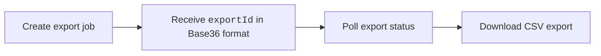

The Business Alignment Export API exports Business Alignment (BA) metrics in CSV format for teams and organization trees.

Business Alignment exports help measure how engineering effort is distributed across categorized and uncategorized work, including investment areas such as KTLO, New Capability, Quality Improvements, and Security and Compliance.



### Authentication

All requests require the following headers:

| Header | Value |
| --- | --- |
| `authorization` | `ApiKey <YOUR_SEI_API_KEY>` |
| `Content-Type` | `application/json` |

You must also include the following query parameters on all requests:

| Parameter | Description |
| --- | --- |
| `projectIdentifier` | Harness project identifier |
| `orgIdentifier` | Harness organization identifier |

## Export workflow

<Tabs queryString="export">
<TabItem value="create" label="Create Export">

Creates a new asynchronous Business Alignment export job.

```bash 
# Replace BASE_URL with your Harness cluster URL
POST {BASE_URL}/v2/insights/ba/exports
```

```json title="Request Body"
{
  "scope": {
    "teamId": "team_abc123",    // String identifier; use either teamId OR orgTreeName (not both)
    "orgTreeName": "string",
    "orgIdentifier": "string",  // Required when using orgTreeName
    "projectIdentifier": "string"
  },
  "dateRange": {
    "start": "2026-01-01", // Required
    "end": "2026-03-31" // Required
  },
  "metricGroups": ["CATEGORIZED", "UNCATEGORIZED"],
  "options": {
    "granularity": "MONTHLY" // Required
  }
}
```

The following request fields are available:

| Field | Description |
| --- | --- |
| `scope.teamId` | Export data for a specific team. |
| `scope.orgTreeName` | Export data for an organization tree. |
| `dateRange.start` | Export start date (`yyyy-MM-dd`). |
| `dateRange.end` | Export end date (`yyyy-MM-dd`). |
| `metricGroups` | Optional filter for `CATEGORIZED` (mapped to business investment categories) or `UNCATEGORIZED` work (not mapped to a business category). |
| `options.granularity` | Reporting interval (`WEEKLY`, `MONTHLY`, `QUARTERLY`). |

```bash title="Example Request"
curl -X POST "${BASE_URL}/v2/insights/ba/exports?projectIdentifier=${PROJECT_ID}&orgIdentifier=${ORG_ID}" \
  -H "Content-Type: application/json" \
  -H "authorization: ApiKey <YOUR_SEI_API_KEY>" \
  -d '{
    "scope": {
      "teamId": "team_abc123"
    },
    "dateRange": {
      "start": "2026-01-01",
      "end": "2026-03-31"
    },
    "metricGroups": ["CATEGORIZED", "UNCATEGORIZED"],
    "options": {
      "granularity": "MONTHLY"
    }
  }'
```

```json title="Example Response"
{
  "exportId": "exp_2B3C4D5E",
  "status": "QUEUED",
  "createdAt": "2025-05-13T10:00:00Z",
  "message": "Export job created successfully"
}
```

</TabItem>
<TabItem value="check" label="Poll Export Status">

Poll the export until the status changes to `COMPLETED`.

```bash
# Replace BASE_URL with your Harness cluster URL
GET {BASE_URL}/v2/insights/ba/exports/{exportId}
```

```json title="Example Response"
{
  "exportId": "exp_2B3C4D5E",
  "status": "COMPLETED",
  "createdAt": "2025-05-13T10:00:00Z",
  "completedAt": "2025-05-13T10:01:30Z",
  "downloadUrl": "/v2/insights/ba/exports/exp_2B3C4D5E/download"
}
```

The following export statuses are available:

| Status       | Description        |
| ------------ | ------------------ |
| `QUEUED`     | Export queued      |
| `PROCESSING` | Export in progress |
| `COMPLETED`  | Export ready       |
| `FAILED`     | Export failed      |

</TabItem>
<TabItem value="download" label="Download Export">

Downloads the generated CSV export file.

```bash
# Replace BASE_URL with your Harness cluster URL
GET {BASE_URL}/v2/insights/ba/exports/{exportId}/download
```

```csv title="Example CSV File"
Granularity,Team,Team_Hierarchy,Start_Date,End_Date,KTLO_story_points,KTLO_tickets,New_Capability_story_points,Security_and_Compliance_story_points,Uncategorized_story_points
Jan 2026,Platform Team,Engineering/Platform,2026-01-01,2026-01-31,120,45,337,95,68
Feb 2026,Platform Team,Engineering/Platform,2026-02-01,2026-02-28,85,30,173,19,39
```

</TabItem>
</Tabs>

Downloads are gzip-compressed by default and export responses include team hierarchy information where applicable.