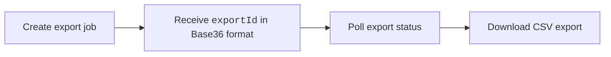

import Tabs from '@theme/Tabs';
import TabItem from '@theme/TabItem';

Harness AIDI provides APIs to export [Efficiency (DORA metrics)](/docs/software-engineering-insights/harness-sei/insights/efficiency#dora-metrics) in CSV format for teams and organization trees. There are two available APIs:

- **V2 Efficiency Export API (recommended)**: Asynchronous export API for scalable DORA metric exports. 
- **Legacy Reports API**: Synchronous CSV export API maintained for backward compatibility. 

<Tabs queryString="api-version">
<TabItem value="v2" label="V2 Export API (Recommended)">

The V2 Efficiency Export API provides asynchronous exports for DORA metrics including Lead Time for Changes (LTTC), Deployment Frequency (DF), Mean Time to Restore (MTTR), and Change Failure Rate (CFR).



### Authentication

All requests require the following headers:

| Header | Value |
| --- | --- |
| `authorization` | `ApiKey <YOUR_SEI_API_KEY>` |
| `Content-Type` | `application/json` |

You must also include the following query parameters on all requests:

| Parameter | Description |
| --- | --- |
| `projectIdentifier` | Harness project identifier |
| `orgIdentifier` | Harness organization identifier |

## Export workflow

<Tabs queryString="export">
<TabItem value="create" label="Create Export">

Creates a new asynchronous Efficiency export job.

```bash 
# Replace BASE_URL with your Harness cluster URL
POST {BASE_URL}/v2/insights/efficiency/exports
```

```json title="Request Body"
{
  "scope": {
    "teamId": "team_abc123",    // String identifier; use either teamId OR orgTreeName (not both)
    "orgTreeName": "string",
    "orgIdentifier": "string",  // Required when using orgTreeName
    "projectIdentifier": "string"
  },
  "dateRange": {
    "start": "2026-01-01", // Required
    "end": "2026-03-31" // Required
  },
  "metricGroups": ["lttc", "df", "mttr", "cfr"], // Required
  "options": {
    "granularity": "MONTHLY" // Required
  }
}
```

The following request fields are available:

| Field | Description |
| --- | --- |
| `scope.teamId` | Export data for a specific team. |
| `scope.orgTreeName` | Export data for an organization tree. |
| `dateRange.start` | Export start date (`yyyy-MM-dd`). |
| `dateRange.end` | Export end date (`yyyy-MM-dd`). |
| `metricGroups` | Supported DORA metrics such as [Lead Time for Changes](/docs/software-engineering-insights/harness-sei/insights/efficiency#lead-time-for-changes) (`lttc`), [Deployment Frequency](/docs/software-engineering-insights/harness-sei/insights/efficiency#deployment-frequency) (`df`), [Mean Time to Restore](/docs/software-engineering-insights/harness-sei/insights/efficiency#mean-time-to-restore) (`mttr`), [Change Failure Rate](/docs/software-engineering-insights/harness-sei/insights/efficiency#change-failure-rate) (`cfr`), or aggregate DORA summary metrics (`summary`). |
| `metrics` | Individual metric columns such as `LTTC_Mean_Days` or `DF_Deployment_Count`. |
| `options.granularity` | Reporting interval (`WEEKLY`, `MONTHLY`, `QUARTERLY`). |
| `options.aggregation` | Aggregation method (`mean`, `median`, `p90`, `p95`). |
| `options.compression` | Export compression format (`gzip`). |

### Available metric groups

The following Efficiency metric groups are available:

| Metric Group | Included Metrics |
| --- | --- |
| `lttc` | `PLANNING`, `CODING`, `REVIEW`, `BUILD`, `DEPLOY`, `LTTC` |
| `work_items` | `TOTAL_WORK_ITEMS`, `PR_ASSOCIATIONS`, `PERCENTAGE_PR_ASSOCIATED` |
| `deployment_frequency` | `DEPLOYMENT_FREQUENCY` |
| `cfr` | `TOTAL_SUCCESS`, `TOTAL_FAILURES`, `CFR` |
| `mttr` | `MTTR` |
| `rating` | `OVERALL_RATING` |

```bash title="Example Request"
curl -X POST "${BASE_URL}/v2/insights/efficiency/exports?projectIdentifier=${PROJECT_ID}&orgIdentifier=${ORG_ID}" \
  -H "Content-Type: application/json" \
  -H "authorization: ApiKey <YOUR_SEI_API_KEY>" \
  -d '{
    "scope": {
      "teamId": "team_abc123"
    },
    "dateRange": {
      "start": "2026-01-01",
      "end": "2026-03-31"
    },
    "metricGroups": ["lttc", "df", "mttr", "cfr"], // Required
    "options": {
      "granularity": "MONTHLY",
      "format": "csv",
      "compression": "gzip"
    }
  }'
```

```json title="Example Response"
{
  "exportId": "exp_2B3C4D5E",
  "status": "QUEUED",
  "createdAt": "2025-05-13T10:00:00Z",
  "message": "Export job created successfully"
}
```

```json title="Existing Export Reused"
{
  "exportId": "exp_2B3C4D5E",
  "createdAt": "2026-05-13T09:58:00Z",
  "message": "Using existing export with identical parameters"
}
```

</TabItem>
<TabItem value="check" label="Poll Export Status">

Poll the export until the status changes to `COMPLETED`.

```bash
# Replace BASE_URL with your Harness cluster URL
GET {BASE_URL}/v2/insights/efficiency/exports/{exportId}
```

```json title="Example Response"
{
  "exportId": "exp_2B3C4D5E",
  "status": "COMPLETED",
  "createdAt": "2025-05-13T10:00:00Z",
  "completedAt": "2025-05-13T10:01:30Z",
  "downloadUrl": "/v2/insights/efficiency/exports/exp_2B3C4D5E/download"
}
```

The following export statuses are available:

| Status       | Description        |
| ------------ | ------------------ |
| `QUEUED`     | Export queued.      |
| `PROCESSING` | Export in progress. |
| `COMPLETED`  | Export ready.       |
| `FAILED`     | Export failed.      |

</TabItem>
<TabItem value="download" label="Download Export">

Downloads the generated CSV export file. 

```bash
# Replace BASE_URL with your Harness cluster URL
GET {BASE_URL}/v2/insights/efficiency/exports/{exportId}/download
```

</TabItem>
</Tabs>

Downloads are gzip-compressed by default and export responses include team hierarchy information where applicable.


</TabItem> 
<TabItem value="v1" label="Legacy Reports API">

**Example 2: Export Team Efficiency Report (DORA Metrics)**

```bash
# Replace BASE_URL with your Harness cluster URL (e.g. https://app.harness.io)
curl -X POST "${BASE_URL}/v2/insights/teams/reports?format=csv&projectIdentifier=myproject" \  
  -H "Content-Type: application/json" \
  -H "authorization: ApiKey <YOUR_API_KEY>" \
  -d '{
    "dateStart": "2024-01-01",
    "dateEnd": "2024-12-31",
    "teamRefId": 123,
    "efficiency": {
      "metrics": ["LEAD_TIME_FOR_CHANGES", "DEPLOYMENT_FREQUENCY", "MEAN_TIME_TO_RESTORE"],
    }
  }' \
  --output efficiency_report.csv
```

- **Default Calculation Type:** If `calculationType` is not specified for Efficiency metrics, it defaults to `MEAN`.

To configure Efficiency metrics with `EfficiencyRequestDto`:

```json
{
  "metrics": ["LEAD_TIME_FOR_CHANGES", "DEPLOYMENT_FREQUENCY"],
  "calculationType": "MEAN"
}
```

- `metrics` (required): List of efficiency metric names to include in the export.
- `calculationType` (optional): Aggregation method (defaults to `MEAN`).

The following Efficiency (DORA) metrics are available:

| Metric Name | Context | Unit | Description |
|---|---|---|---|
| `LEAD_TIME_FOR_CHANGES` | Lead Time for Changes | Days (CSV contains numeric values without unit labels) | Measures the time from code commit to production deployment.<br /><br />Key indicator of delivery speed and process efficiency.<br /><br />Lower lead times indicate faster feature delivery and more agile development.<br /><br />Industry benchmark: Elite performers achieve lead times under 1 day. |
| `DEPLOYMENT_FREQUENCY` | Deployment Frequency | Deployments per time period (affected by `granularity`) | Tracks how often code is deployed to production.<br /><br />Indicates team's ability to deliver value continuously.<br /><br />Higher frequency suggests better automation and CI/CD maturity.<br /><br />Example: 20 means 20 deployments per week (if granularity is weekly).<br /><br />Industry benchmark: Elite performers deploy multiple times per day. |
| `CHANGE_FAILURE_RATE` | Change Failure Rate | Percentage (0–100, CSV contains numeric values without unit labels) | Percentage of deployments that cause failures in production.<br /><br />Measures quality and stability of releases.<br /><br />Lower rates indicate better testing, quality assurance, and deployment practices.<br /><br />Industry benchmark: Elite performers maintain CFR below 15%. |
| `MEAN_TIME_TO_RESTORE` | Mean Time to Restore (MTTR) | Days (CSV contains numeric values without unit labels) | Time to recover from a production failure or incident (aggregated using `calculationType`).<br /><br />Indicates team's incident response capability and system resilience.<br /><br />Lower MTTR suggests effective monitoring, alerting, and rollback procedures.<br /><br />Industry benchmark: Elite performers restore service in under 1 hour. |
| `OVERALL_DORA` | Overall DORA Score | Score/Rating (implementation-specific) | Composite metric combining all four DORA metrics.<br /><br />Provides holistic view of team's DevOps performance.<br /><br />Used to classify teams as Elite, High, Medium, or Low performers.<br /><br />Based on Google's DORA State of DevOps research. |

</TabItem> </Tabs>