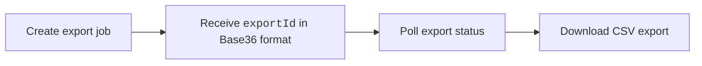

import Tabs from '@theme/Tabs';
import TabItem from '@theme/TabItem';

Harness AIDI provides asynchronous CSV export APIs for exporting data from the out-of-the-box dashboards on the **Insights** page. Downloads are gzip-compressed by default for large exports. All exports are scoped to the authenticated account, and export responses include team hierarchy fields where applicable.

## Export APIs

| Export Type          | Description                                                 |
| -------------------- | ----------------------------------------------------------- |
| [Efficiency (DORA)](/docs/software-engineering-insights/harness-sei/api/export-insights/efficiency)    | Export DORA metrics including Lead Time to Change (LTTC), Deployment Frequency (DF), Mean Time to Restore (MTTR), and Change Failure Rate (CFR) metrics.                          |
| [Sprint](/docs/software-engineering-insights/harness-sei/api/export-insights/sprint)               | Export sprint analytics and sprint metrics.                  |
| [Productivity](/docs/software-engineering-insights/harness-sei/api/export-insights/productivity)         | Export Productivity metrics for developers, teams, and orgs. |
| [Business Alignment](/docs/software-engineering-insights/harness-sei/api/export-insights/business-alignment)   | Export categorized and uncategorized engineering effort metrics.      |
| [Issue Time-in-Status](/docs/software-engineering-insights/harness-sei/api/export-insights/time-in-status) | Export issue lifecycle duration and status transition data.                        |

### Harness base URLs

All SEI export APIs are scoped to a region-specific service endpoint. Every API path is a relative URI and must be prefixed with the appropriate SEI base URL for your Harness environment.

| Environment | Base URL |
|------------|----------|
| Prod 1 | https://app.harness.io/prod1/sei/api/ |
| Prod 2 | https://app.harness.io/gratis/sei/api/ |
| EU | https://accounts.eu.harness.io/sei/api/ |

## Export workflow

All export APIs follow a common asynchronous workflow:

1. Create an export job
2. Poll export status
3. Download the generated CSV file



<Tabs queryString="export">
<TabItem value="create" label="Create Export">

Creates a new asynchronous export job. 

```bash
# Replace BASE_URL with your Harness cluster URL
POST {BASE_URL}/insights/{EXPORT_TYPE}/exports
```

If an identical export request is submitted within 30 minutes of a previous request, the API returns the existing export instead of creating a new export job.

</TabItem>
<TabItem value="check" label="Poll Export Status">

Poll the export until the status changes to `COMPLETED`.

```bash
# Replace BASE_URL with your Harness cluster URL
GET {BASE_URL}/insights/{EXPORT_TYPE}/exports/{exportId}
```

The following export statuses are available:

| Status       | Description        |
| ------------ | ------------------ |
| `QUEUED`     | Export queued.      |
| `PROCESSING` | Export in progress. |
| `COMPLETED`  | Export ready.       |
| `FAILED`     | Export failed.      |

</TabItem>
<TabItem value="download" label="Download Export">

Downloads the generated CSV export file.

```bash
# Replace BASE_URL with your Harness cluster URL
GET {BASE_URL}/insights/{EXPORT_TYPE}/exports/{exportId}/download
```

</TabItem>
</Tabs>

Harness recommends using team-scoped exports instead of full organization exports whenever possible, especially for large datasets. For large or scheduled exports, run jobs during off-peak hours to reduce the likelihood of delays or timeouts. 

After creating an export job, poll the export status endpoint instead of repeatedly creating new export requests. When supported, you can use `metricGroups` instead of long lists of individual metrics to simplify request payloads and improve maintainability.