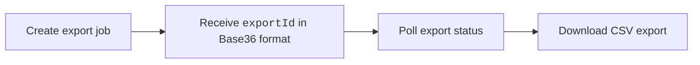

The Sprint Export API exports [Sprint Metrics](/docs/software-engineering-insights/harness-sei/insights/efficiency#sprint-metrics) analytics and sprint-level reporting data in CSV format.

Use sprint exports to analyze sprint completion trends, work distribution, throughput, and sprint health metrics across teams and organization trees.



### Authentication

All requests require the following headers:

| Header | Value |
| --- | --- |
| `authorization` | `ApiKey <YOUR_SEI_API_KEY>` |
| `Content-Type` | `application/json` |

You must also include the following query parameters on all requests:

| Parameter | Description |
| --- | --- |
| `projectIdentifier` | Harness project identifier |
| `orgIdentifier` | Harness organization identifier |

## Export workflow

<Tabs queryString="export">
<TabItem value="create" label="Create Export">

Creates a new asynchronous sprint export job.

```bash 
# Replace BASE_URL with your Harness cluster URL
POST {BASE_URL}/v2/insights/sprint/exports
```

```json title="Request Body"
{
  "scope": {
    "teamId": "team_abc123",    // String identifier; use either teamId OR orgTreeName (not both)
    "orgTreeName": "string",
    "orgIdentifier": "string",  // Required when using orgTreeName
    "projectIdentifier": "string"
  },
  "dateRange": {
    "start": "2026-01-01", // Required
    "end": "2026-03-31" // Required
  },
  "options": {
    "granularity": "MONTHLY" // Required
  },
  "metricGroups": ["work", "delivery", "analysis"],
  "metric": ["Sprint_Commit", "Total_Work_Delivered", "Churn_Rate"]
}
```

The following request fields are available:

| Field | Description |
| --- | --- |
| `scope.teamId` | Export data for a specific team. |
| `scope.orgTreeName` | Export data for an organization tree. |
| `dateRange.start` | Export start date (`yyyy-MM-dd`). |
| `dateRange.end` | Export end date (`yyyy-MM-dd`). |
| `options.granularity` | Reporting interval (`WEEKLY`, `MONTHLY`, `QUARTERLY`). |
| `metricGroups` | High-level business groups, i.e. `work`, `delivery`, or `analysis`. |
| `metrics` | [Sprint Metrics](/docs/software-engineering-insights/harness-sei/insights/efficiency#sprint-details-drilldown) such as `Sprint_Commit`, `Total_Work_Delivered`, or `Churn_Rate`. |

### Available metric groups

The following Sprint metric groups are available:

| Metric Group | Sprint-level Metrics | Team-level Metrics |
| --- | --- | --- |
| `work` | `SPRINT_COMMIT`, `SPRINT_CREEP`, `SPRINT_SIZE`, `SCOPE_CREEP_PERCENT` | `SPRINT_COMMIT`, `SPRINT_CREEP`, `SPRINT_SIZE`, `SCOPE_CREEP_PERCENT` |
| `delivery` | `TOTAL_WORK_DELIVERED`, `DELIVERED_COMMIT`, `MISSED_COMMIT`, `DELIVERED_CREEP`, `MISSED_CREEP`, `TOTAL_DELIVERED_WORK_VS_COMMITTED_WORK` | `TOTAL_WORK_DELIVERED`, `SPRINT_VELOCITY`, `DELIVERED_COMMIT`, `MISSED_COMMIT`, `DELIVERED_CREEP`, `MISSED_CREEP`, `TOTAL_DELIVERED_WORK_VS_COMMITTED_WORK` |
| `deliveryAnalysis` | `COMMITTED_WORK_DELIVERED_PERCENT`, `CREEP_WORK_DELIVERED_PERCENT`, `TOTAL_WORK_DELIVERED_PERCENT` | `COMMITTED_WORK_DELIVERED_PERCENT`, `CREEP_WORK_DELIVERED_PERCENT`, `TOTAL_WORK_DELIVERED_PERCENT` |
| `analysis` | `TICKETS_REMOVED_MID_SPRINT`, `CHURN_RATE` | `CHURN_RATE`, `PREDICTABILITY_DELIVERY_CONSISTENCY`, `PREDICTABILITY_RELIABILITY_OF_COMMITMENT` |

The following options are available: 

| Option | Description |
| --- | --- |
| `computationMode` | Export sprint metrics using `STORY_POINTS` or `TICKETS`. This matches the Sprint UI reporting mode. |
| `metricLevel` | Export metrics grouped by `team` or `sprint`. |
| `granularity` | Reporting interval such as `SPRINT` or `MONTHLY`. |

```bash title="Example Request"
curl -X POST "${BASE_URL}/v2/insights/sprint/exports?projectIdentifier=${PROJECT_ID}&orgIdentifier=${ORG_ID}" \
  -H "Content-Type: application/json" \
  -H "authorization: ApiKey <YOUR_SEI_API_KEY>" \
  -d '{
    "scope": {
      "teamId": "1"
    },
    "dateRange": {
      "start": "2026-01-01",
      "end": "2026-03-31"
    },
    "metricGroups": [
      "work",
      "delivery",
      "deliveryAnalysis",
      "analysis"
    ],
    "options": {
      "computationMode": "STORY_POINTS",
      "metricLevel": "team",
      "granularity": "SPRINT"
    }
  }'
```

```json title="Example Response"
{
  "exportId": "exp_7a8b9c0d",
  "createdAt": "2025-12-29T10:00:00Z",
  "createdBy": {
    "userId": "user_123",
    "name": "John Doe",
    "email": "john.doe@company.com"
  },
  "metadata": {
    "scope": {
      "teamId": "1",
      "teamName": "Platform Team"
    },
    "dateRange": {
      "start": "2026-01-01",
      "end": "2026-03-31"
    },
    "metricGroups": [
      "work",
      "delivery",
      "deliveryAnalysis",
      "analysis"
    ],
    "options": {
      "computationMode": "STORY_POINTS",
      "metricLevel": "team",
      "granularity": "SPRINT",
      "format": "csv",
      "compression": "gzip"
    }
  },
  "message": "Export created successfully"
}
```

</TabItem>
<TabItem value="check" label="Poll Export Status">

Poll the export until the status changes to `COMPLETED`.

```bash
# Replace BASE_URL with your Harness cluster URL
GET {BASE_URL}/v2/insights/sprints/exports/{exportId}
```

```json title="Example Response"
{
  "exportId": "exp_7a8b9c0d",
  "status": "completed",
  "createdAt": "2025-12-29T10:00:00Z",
  "completedAt": "2025-12-29T10:02:15Z",
  "createdBy": {
    "userId": "user_123",
    "name": "John Doe",
    "email": "john.doe@company.com"
  },
  "scope": {
    "teamId": "team_456",
    "teamName": "Platform Team"
  },
  "download": {
    "url": "/v2/insights/sprints/exports/exp_7a8b9c0d/download",
    "filename": "sprint-insights-platform-team-2024.csv.gz",
    "sizeBytes": 245672,
    "contentType": "text/csv",
    "compression": "gzip"
  },
  "metadata": {
    "dateRange": {
      "start": "2024-01-01",
      "end": "2024-12-31"
    },
    "options": {
      "metricLevel": "sprint",
      "granularity": "weekly",
      "format": "csv",
      "compression": "gzip"
    }
  }
}
```

The following export statuses are available:

| Status       | Description        |
| ------------ | ------------------ |
| `QUEUED`     | Export queued      |
| `PROCESSING` | Export in progress |
| `COMPLETED`  | Export ready       |
| `FAILED`     | Export failed      |

</TabItem>
<TabItem value="download" label="Download Export">

Downloads the generated CSV export file.

```bash
# Replace BASE_URL with your Harness cluster URL
GET {BASE_URL}/v2/insights/sprints/exports/{exportId}/download
```

</TabItem>
</Tabs>

Downloads are gzip-compressed by default and export responses include team hierarchy information where applicable.