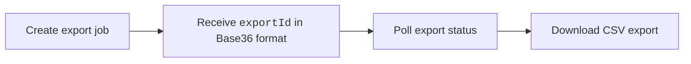

The Issue Time-in-Status Export API exports issue lifecycle analytics showing how long issues spend in each workflow status. Exports can be aggregated by sprint or team and are returned in CSV format.



## Authentication

All requests require the following headers:

| Header | Value |
| --- | --- |
| `authorization` | `ApiKey <YOUR_SEI_API_KEY>` |
| `Content-Type` | `application/json` |

You must also include the following query parameters on all requests:

| Parameter | Description |
| --- | --- |
| `projectIdentifier` | Harness project identifier |
| `orgIdentifier` | Harness organization identifier |

## Export workflow

<Tabs queryString="export">
<TabItem value="create" label="Create Export">

Creates a new asynchronous issue time-in-status export job.

```bash
# Replace BASE_URL with your Harness cluster URL
POST {BASE_URL}/v2/insights/ticket-data/exports
```

```json title="Request Body"
{
  "scope": {
    "teamId": "team_abc123",      // String identifier; use either teamId OR orgTreeName (not both)
    "orgTreeName": "string",
    "orgIdentifier": "string",   // Required when using `orgTreeName`
    "projectIdentifier": "string"
  },
  "dateRange": {
    "start": "2024-01-01", // Required
    "end": "2024-03-31" // Required
  },
  "issueStatuses": [
    "In Progress",
    "In Review",
    "QA",
    "Done"
  ],
  "options": {
    "aggregationLevel": "sprint",
    "granularity": "weekly",
    "terminalDateColumn": "issue_resolved_at"
  }
}
```

The following request fields are available:

| Field | Description |
| --- | --- |
| `scope.teamId` | Export data for a specific team. |
| `scope.orgTreeName` | Export data for an organization tree. |
| `dateRange.start` | Export start date (`yyyy-MM-dd`). |
| `dateRange.end` | Export end date (`yyyy-MM-dd`). |
| `issueStatuses` | List of workflow statuses to measure (`In Progress`, `In Review`, `QA`, or `Done`). |
| `options.aggregationLevel` | Aggregation level (`sprint` or `team`). |
| `options.granularity` | Reporting interval (`daily`, `weekly`, `monthly`, `quarterly`). |
| `options.terminalDateColumn` | Terminal date used for calculations (`issue_resolved_at` or `version_release_date`). |

```bash title="Example Request"
curl -X POST "${BASE_URL}/v2/insights/ticket-data/exports?projectIdentifier=${PROJECT_ID}&orgIdentifier=${ORG_ID}" \
  -H "Content-Type: application/json" \
  -H "authorization: ApiKey <YOUR_SEI_API_KEY>" \
  -d '{
    "scope": {
      "teamId": "team_abc123"
    },
    "dateRange": {
      "start": "2024-01-01",
      "end": "2024-03-31"
    },
    "issueStatuses": [
      "In Progress",
      "In Review",
      "QA",
      "Done"
    ],
    "options": {
      "aggregationLevel": "sprint",
      "granularity": "weekly",
      "terminalDateColumn": "issue_resolved_at"
    }
  }'
```

```json title="Example Response"
{
  "exportId": "exp_9F0A1B2C",
  "status": "QUEUED",
  "createdAt": "2025-05-13T10:00:00Z",
  "message": "Export job created successfully"
}
```

</TabItem>
<TabItem value="check" label="Poll Export Status">

Poll the export until the status changes to `COMPLETED`.

```bash
# Replace BASE_URL with your Harness cluster URL
GET {BASE_URL}/v2/insights/ticket-data/exports/{exportId}
```

```json title="Example Response"
{
  "exportId": "exp_9F0A1B2C",
  "status": "COMPLETED",
  "createdAt": "2025-05-13T10:00:00Z",
  "createdBy": {
    "userId": "user_789",
    "name": "Alice Wong",
    "email": "alice.wong@company.com"
  },
  "message": "Duplicate request - returning existing export"
}
```

The following export statuses are available:

| Status       | Description        |
| ------------ | ------------------ |
| `QUEUED`     | Export queued.      |
| `PROCESSING` | Export in progress. |
| `COMPLETED`  | Export ready.       |
| `FAILED`     | Export failed.      |

</TabItem>
<TabItem value="download" label="Download Export">

Downloads the generated CSV export file.

```bash
# Replace BASE_URL with your Harness cluster URL
GET {BASE_URL}/v2/insights/ticket-data/exports/{exportId}/download
```

```csv title="Example CSV File"
granularity,team,team_hierarchy,total_issues,in_progress_hours,to_do_hours,total_lead_time_hours
Jan 2026,Platform Team,Engineering/Platform,2171,5284151.09,8706228.13,13990379.22
Jan 2026,Payments Team,Engineering/Payments,100,34870.41,18285.37,53155.78
```

</TabItem>
</Tabs>

Downloads are gzip-compressed by default and export responses include team hierarchy information where applicable.