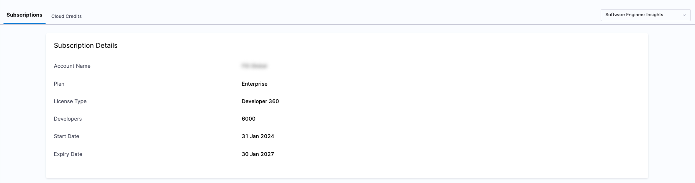
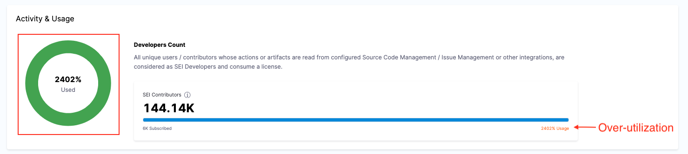
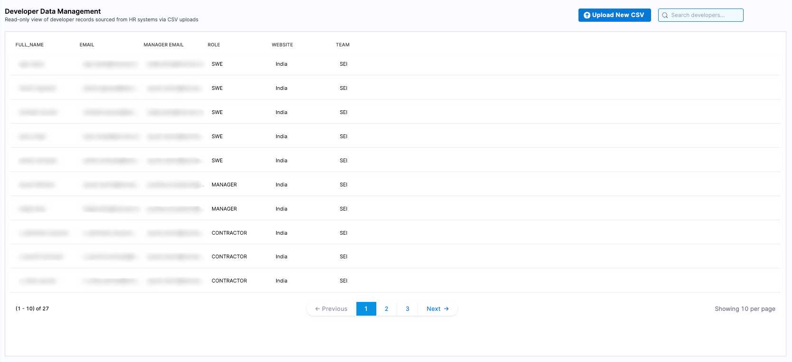

You can manage your SEI subscription and monitor license usage directly from your Harness account.

Your SEI subscription includes a specific number of **Developer licenses**, which determine the number of developers for whom SEI generates insights.

### Who is a Developer?

SEI's Developer licensing model gives SEI admins full control over license consumption. A Developer is an engineer in your organization for whom you choose to generate engineering insights. You can import and manage the list of developers that should receive insights through the Developer table.

Only developers who are included in the organization tree and for whom insights are surfaced are eligible to consume a Developer license. Simply importing a developer does not automatically consume a license unless they meet these criteria.

Developer licenses are consumed based on the generation of insights, not on platform access. Engineering leaders, managers, and other users can view insights in Harness without consuming a Developer license.

### View license usage

You can view and manage your Harness AIDI subscription in your **Harness Account Settings**.

In your Harness account, go to **Account Settings** to view which Harness modules you are currently subscribed to. Subscriptions are shown in the **Subscribed Modules** section on the **Overview** page. You can select Manage to go to the **Subscriptions** page.

### Activity & usage

On the Subscriptions page, you will find a detailed summary of your license activity and usage metrics.

* **Total licenses purchased:** Displays the total number of developer licenses included in your subscription.
* **Subscription period:** Shows the start and end dates of your current plan.
* **Usage insights:** The **Activity & usage** section highlights the total number of Developer licenses consumed.

The **Activity & usage** section provides real-time data on how many Developer licenses are being utilized. An unexpectedly high number of active contributors compared to the allocated licenses might indicate issues like duplicate records. 

If your license usage exceeds the number of purchased licenses, review your Developer table and remove developers who no longer require insights. Removing a developer stops SEI from generating new insights for that developer and reduces Developer license consumption.

You can always update the Developer table to only have the right intended Developers, and hence control license consumption. Note that doing so, ensures that no Insights are generated for the Developers that are removed from the Developer table.

### See also

* [Manage developers](/docs/software-engineering-insights/harness-sei/setup-sei/manage-developers)
