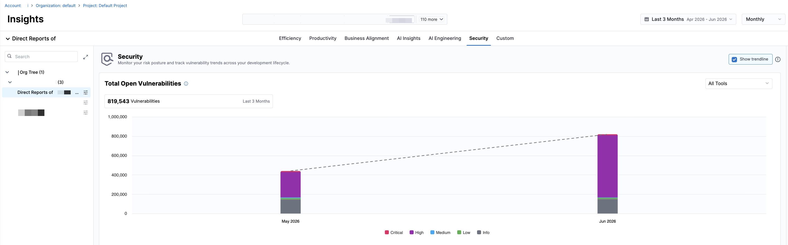
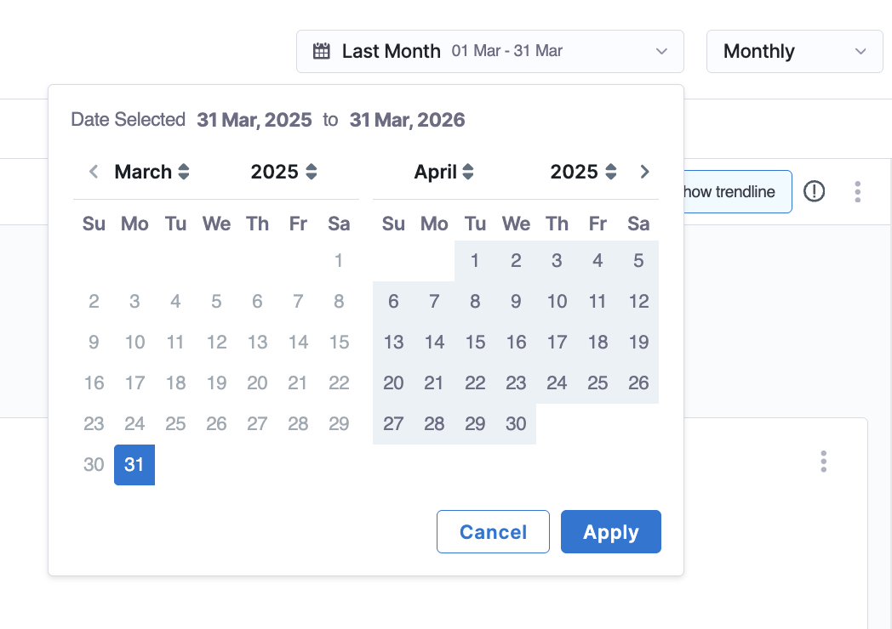
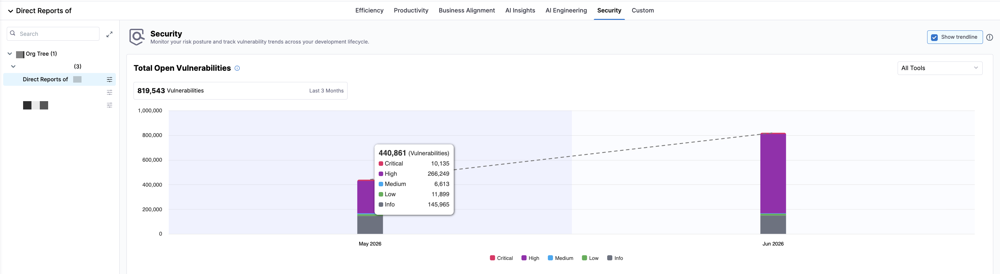
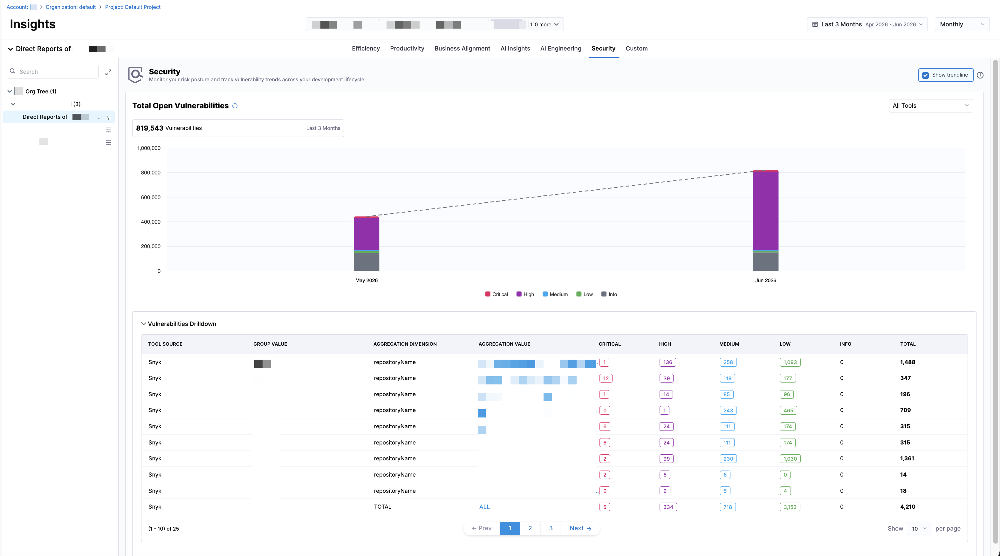

:::tip
Security Insights is in beta. To request access, contact [Harness Support](/docs/software-engineering-insights/sei-support).
:::

Security Insights in AI DLC Insights focuses on understanding vulnerability risk across your application and infrastructure assets. Rather than looking at security findings in isolation, SEI surfaces signals that help teams assess exposure, remediation effectiveness, and long-lived risk over time.

This experience is designed to provide a clear, actionable view of security health, whether you're monitoring organization-wide trends or drilling into specific teams and assets. By combining time-based analysis with tool-level filtering, AI DLC Insights helps you identify where risk is accumulating, how quickly vulnerabilities are resolved, and where remediation efforts may need to be prioritized.

Use the Security Insights dashboard on the **Security** tab of the **Insights** page to analyze vulnerability risk across your application and infrastructure assets.

You can analyze the data by selecting a time range (including default options such as the last several weeks, months, or quarters, or a custom date range for more flexible analysis) and a time granularity (weekly, monthly, or quarterly), which determines how the data is grouped and displayed in the charts.

To scope the Security Insights widgets by security tool, click the `All Tools` dropdown menu and select **All Tools**, **Snyk**, or **Wiz**. All metrics and visualizations update automatically based on the selected time range, aggregation, and tool scope. Click the **Show trendline** checkbox to overlay trendlines across all Security visualizations. Trendlines help you assess whether security metrics are improving, regressing, or remaining stable over time.

:::info
Trendlines use the Ordinary Least Squares (OLS) regression method to identify patterns and direction in your data over the selected time range.
:::

## Security Insights widgets

The Security Insights dashboard on the **Insights** page provides a set of core metrics that highlight vulnerability volume, aging, and remediation trends. Each widget includes a severity filter that allows you to view data by **All Severities**, **Critical**, **High**, **Medium**, **Low**, or **Info**. Selecting a severity updates the metric value and the bar charts.

### Total Open Vulnerabilities

**Total Open Vulnerabilities** tracks the cumulative count of unresolved security vulnerabilities across your codebase and infrastructure over time, aggregated across the selected tool(s). This metric represents the total number of vulnerabilities that have been identified but not yet resolved.

$$
\text{Open Vulnerabilities} = \text{Created Vulnerabilities} - \text{Resolved Vulnerabilities}
$$

The trend line shows whether the total number of open vulnerabilities is increasing or decreasing over time.

:::info
This metric helps you understand your overall security debt. A high or increasing value indicates accumulating vulnerabilities that need attention, while a declining trend reflects effective remediation efforts.

High open vulnerability counts increase security risk and expand the potential attack surface. Tracking this metric helps prioritize security work, allocate remediation resources, and demonstrate improvements in security posture to stakeholders.
:::

The **Vulnerabilities Drilldown** section displays a breakdown of all currently unresolved vulnerabilities contributing to the total count, grouped by tool source and aggregation dimension rather than as a flat list of individual findings. This drilldown helps teams identify what is open right now and where exposure exists across tools and assets.

| Column Name | Description |
|------|-------------|
| **Tool Source** | The security tool that reported the findings (`Snyk` or `Wiz`). |
| **Group Value** | The organizational or business identifier associated with the grouped findings (for example, a GP ID tag). |
| **Aggregation Dimension** | The attribute that findings in the row are grouped by (for example, `repositoryName`). |
| **Aggregation Value** | The specific value of the aggregation dimension (for example, a repository name). Each Aggregation Value is a hyperlink that opens the corresponding filtered findings view in Armorcode. |
| **Critical** | Count of open Critical-severity findings for the row. |
| **High** | Count of open High-severity findings for the row. |
| **Medium** | Count of open Medium-severity findings for the row. |
| **Low** | Count of open Low-severity findings for the row. |
| **Info** | Count of open Info-severity findings for the row. |
| **Total** | Sum of all open findings across severities for the row. |

Each row is scoped to the selected time range, tool, and severity filter. Click an **Aggregation Value** link to open the corresponding filtered findings view directly in [Armorcode](/docs/ai-dlc-insights/setup/integrations/beta-integrations/armorcode/).

At higher levels of the Org Tree (for example, organization or director-level nodes), the dashboard displays a summarized view of the security metrics. When you navigate to a leaf node (a team) in the Org Tree, the **Vulnerabilities Drilldown** section updates to display the vulnerability data associated with that team.

These drilldowns allow engineering leaders to monitor security trends at scale while providing teams with clear, actionable visibility into the vulnerabilities they own.