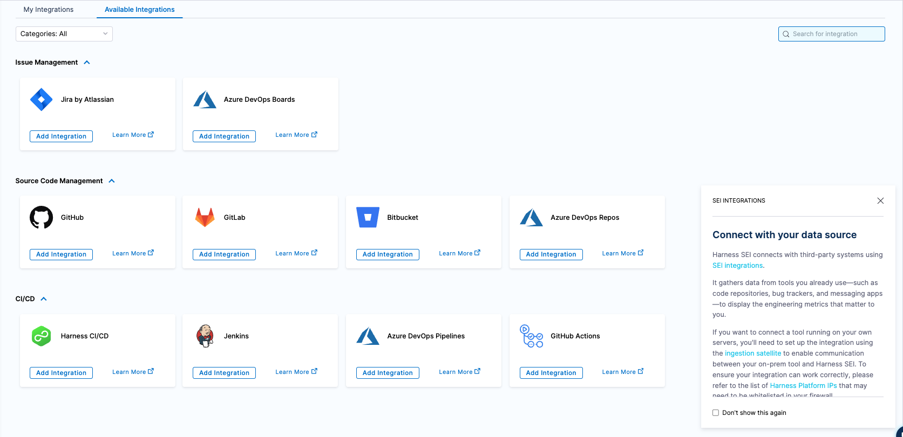
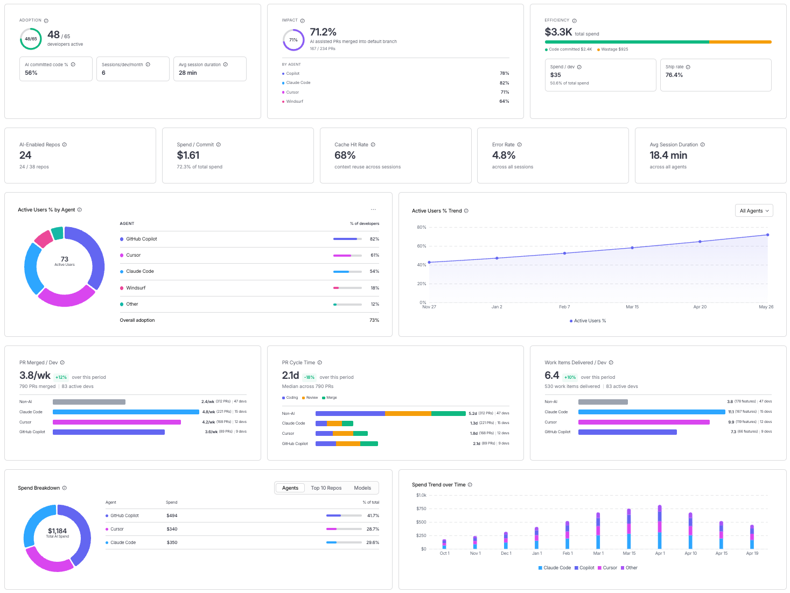

AI DLC Insights gives engineering leaders a complete view of how AI coding agents are being adopted, what code they produce, and what they cost. It connects agent-level telemetry (sessions, token spend, ship rates, and commit attribution) to the delivery metrics that reveal what is happening downstream.

## Measure AI adoption

Understand which AI coding tools engineers rely on to produce committed code, and track how adoption changes over time.

With AI adoption metrics, you can: 

- See what percentage of committed code was AI-generated, broken down by developer, team, or repository.
- Track the percentage of merged PRs and commits containing AI-attributed code.
- Identify which agents (Cursor, Claude Code, Windsurf, Copilot) are actively used versus licensed but unused.
- Surface power users with high AI commit velocity to understand winning patterns and scale them across the org.

## Track token spend and efficiency

Know how much AI spend produced shipped code versus how much was wasted on uncommitted sessions, wrong model choices, and missed cache opportunities.
 
With efficiency metrics, you can:
 
- Identify wasted spend: tokens burned in sessions where no code was committed.
- Spot optimizable spend: expensive model choices for simple tasks, low cache hit rates, and high turn counts on basic prompts.
- Calculate cost per work item by correlating session costs with your issue tracker.
- Compare spend by developer, team, agent, and repository.

## Measure impact on delivery
 
Connect AI activity to the delivery metrics that reveal whether AI adoption is improving how your organization ships.
 
With impact metrics, you can:
 
- Compare PR velocity and lead time across AI-assisted and non-AI developers.
- Track features delivered and backlog reduction at different levels of AI adoption.
- Monitor DORA metrics — deployment frequency, change failure rate, lead time, and MTTR — to ensure AI adoption correlates with delivery health.
- Map engineering output to business priorities to demonstrate ROI.

## Create an Org Tree
 
AI DLC Insights introduces Org Trees, a flexible, scalable way to model your organization as it operates. You can build org structures that reflect reporting lines, business units, or regions by uploading a CSV that defines your organization structure.
 
On day one, you get an organization-level view of all activity across your developer fleet with no additional configuration required. Create an **Org Tree** to slice metrics by team or manager hierarchy.
 

 
Go to [Org Trees](/docs/software-engineering-insights/harness-sei/setup-sei/setup-org-tree) to set up your organization structure.

## Configure integrations
 
AI DLC Insights includes a redesigned integrations framework with built-in diagnostics, proactive health monitoring, and advanced retry mechanisms to reduce maintenance overhead and keep your insights pipeline accurate.
 

Go to [Integrations](/docs/software-engineering-insights/harness-sei/setup-sei/configure-integrations) to integrate your software delivery lifecycle with AI DLC Insights.

## Explore pre-built dashboards
 
Start analyzing your AI engineering insight dashboards designed around industry-proven metrics, including the following:

- **AI Engineering**: Adoption, efficiency, and impact for AI coding agents.
- **Delivery Efficiency:** DORA metrics and Sprint Insights.
- **Developer Productivity:** Output and throughput per developer.
- **Business Alignment:** Engineering output mapped to business priorities.

## Next steps

- [Set up an Org Tree](/docs/software-engineering-insights/harness-sei/setup-sei/setup-org-tree): Model your organization to slice metrics by team or manager.
- [Introducing AI DLC Insights to Prove the ROI of Your AI Engineering Investment](https://www.harness.io/blog/introducing-ai-dlc-insights-to-prove-the-roi-of-your-ai-engineering-investment): Read the launch blog for the full story behind AI DLC Insights.
- [Harness Launches Products to Give Visibility into ROI of AI Spend](https://www.harness.io/blog/harness-launches-products-give-visibility-into-roi-of-ai-spend): Learn more about how Harness approaches AI spend visibility.