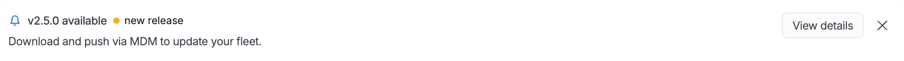

<CTABanner
  buttonText="Request Access"
  title="AI Engineering Insights is in beta!"
  tagline="Enable AI Engineering Insights to measure AI adoption and impact on productivity and quality across your teams. Available now in beta!"
  link="https://developer.harness.io/docs/software-engineering-insights/sei-support"
  closable={true}
  target="_self"
/>

The Harness AI DLC Agent collects productivity telemetry that is attributable to individual developers. This page is intended for security, compliance, and IT teams evaluating the Harness AI DLC Agent before approving fleet deployment. For setup, fleet monitoring, and troubleshooting, go to [Harness AI DLC Agent](/docs/software-engineering-insights/harness-sei/setup-sei/agent/).

## Binary distribution and verification

The Harness AI DLC Agent is distributed as a signed versioned binary. Before deploying, verify the downloaded binary against the SHA-256 checksum by navigating to the **AI Engineering** tab on the **Insights** page and clicking **Diagnostics**.

## Data collected

:::warning
The Harness Agent does not function as general employee monitoring software. It only captures the signals listed in the **Data Collected** table, and from configured AI coding agents such as Claude Code.
:::

The Harness Agent is scoped exclusively to AI coding agent activity. It has no access to general system activity, file contents, or network traffic outside of its own outbound telemetry connection.

The following data is collected for AI Engineering Insights metrics: 

| Data type | Description |
|---|---|
| Session events | Session start and end timestamps, captured via pre- and post-hooks on AI coding agent processes. |
| Token consumption | Input and output token counts per request. Prompt text and model completions are not collected. |
| AI-generated line counts | Number of lines produced by AI agents during a session. Line content is not collected. |
| AI-committed line counts | Number of AI-generated lines that appeared in Git commits, correlated via session-to-commit attribution. |
| Tool call outcomes | Whether individual AI agent tool calls succeeded or failed. |
| Agent and model identifiers | Which AI coding agent and underlying model was used (for example, Claude Code, `claude-sonnet-4-6`). |
| Repository identifiers | Repository name and identifier for commit attribution. Source code content is not collected. |
| Heartbeat and version | Periodic check-in confirming the agent is running and reporting its installed version. |
| Developer identifier | Name and email address, used to attribute metrics to individual developers in the SEI dashboard. |

For a mapping of these signals to dashboard metrics, go to [AI Engineering Insights](/docs/software-engineering-insights/harness-sei/setup-sei/agent#ai-engineering-insights).

Individual developers can see their own metrics in the AI Engineering Insights dashboard if they are granted access by their organization administrator. Managers and organization administrators can view metrics for all developers within their configured Org Tree in AI DLC Insights. Developers will not receive any notifications from the agent during normal operation.

## Security controls

### Data at Rest

Uses the macOS Keychain and standard file permissions to protect sensitive data. API keys are stored securely in the Keychain.

### Data in Transit

All communications use HTTPS/TLS with envelope encryption. Each payload is encrypted using AES-256-GCM, and the encryption key is wrapped using RSA-OAEP-SHA256.

### Authentication

The API key is stored in the macOS Keychain and sent in the `Authorization` header for requests. Network requests use a 10-second timeout.

### Access to AI Tools

The agent accesses SQLite databases in read-only mode using the `READ_ONLY` flag and relies on read-only file watchers to prevent modifications.

### Process Isolation

The agent runs as a user-space daemon without requiring root privileges and is registered as a LaunchAgent rather than a LaunchDaemon.

### Key Management

The RSA public key exists only in memory during execution and is never written to disk.

### Binary Integrity

The installation process verifies SHA-256 checksums to ensure that the binary has not been modified or corrupted.

### Remote Control

A metrics configuration API allows administrators to enable or disable metrics collection remotely without reinstalling the agent.

### Daemon Lifecycle

The daemon supports automatic restart to maintain continuous operation.

### Encryption Detail

The agent uses an envelope encryption model in which a random 256-bit AES key is generated for each conversation or prompt payload. The payload is encrypted using AES-256-GCM, the AES key is wrapped with RSA-OAEP-SHA256 using the Harness public key, and the encrypted payload and wrapped key are transmitted over HTTPS. This ensures that the payload remains protected even if the TLS connection is intercepted.

## Network requirements

### Outbound Network Connection

The agent connects to `*.harness.io` over TCP port 443 using HTTPS for telemetry ingestion, configuration retrieval, and encryption key exchange.

To ensure the agent can reach Harness infrastructure, allowlist the required Harness domains and IPs in your firewall. Refer to the [Harness Platform IP allowlist](/docs/platform/references/allowlist-harness-domains-and-ips) for the list of addresses.

If your organization uses an outbound proxy, the agent respects standard system proxy settings.

### Local IPC Communication

The agent uses the Unix socket located at `~/.harness-AI DLC-agent/socket` for communication between local hooks and the daemon.

### Inbound Network Access

The agent does not open any inbound ports and only initiates outbound HTTPS connections.

### Recommended Firewall Rule

Allow outbound TCP traffic on port 443 to `*.harness.io` and deny unnecessary inbound connections.

## Data classification

### Token Counts

Token counts are collected and transmitted with encryption in transit. They are classified as low-sensitivity data.

### Tool Usage Events

Tool usage events are collected and encrypted during transmission. They are considered low sensitivity.

### AI vs. Human Line Attribution

AI-versus-human attribution information is collected and stored using Git notes before being transmitted in encrypted form. It is classified as low sensitivity.

### Cost Estimates

Cost estimate data is collected and protected with encryption in transit. It is considered low sensitivity.

### Session Duration and Timestamps

Session duration and timestamp information is collected and encrypted during transmission. It is classified as low sensitivity.

### User Email from Git Configuration

The user email obtained from Git configuration is collected for attribution purposes and is considered medium-sensitivity personally identifiable information (PII).

### Prompt Content

Collection of prompt content is configurable. When enabled, it is encrypted in transit, and administrators can enable or disable its collection.

### Code and File Contents

The agent never collects code or file contents.

### AI Response Content

Collection of AI response content is configurable. When enabled, it is encrypted in transit, and administrators can control collection through MDM settings.

### Credentials and Secrets

The agent never collects credentials, passwords, API secrets, or other sensitive secrets.

## Agent behavior on the host

Harness acts as a data processor for telemetry collected by the Harness Agent. Your organization is the data controller.
 
Harness recommends communicating the deployment of the Harness Agent to developers before rollout, including what data is collected and how it is used.

## Update the Agent
 
The Harness AI DLC Agent does not self-update automatically. New versions are distributed by the organization administrator via MDM or shell script. Developers are not prompted to update the agent and cannot trigger updates themselves. 

When a new version is available, an update banner appears in the **Diagnostics** tab of **AI Engineering** for administrators only.

## Uninstall the Agent

The agent can be uninstalled by an administrator using standard MDM tooling. For more information, contact [Harness Support](/docs/software-engineering-insights/sei-support).