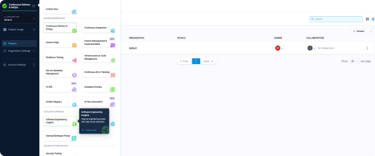
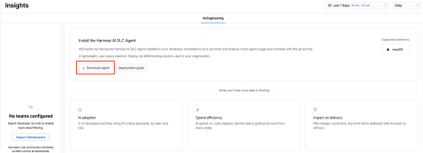
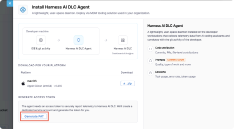
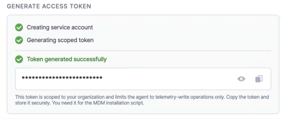
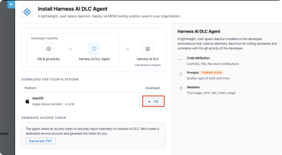
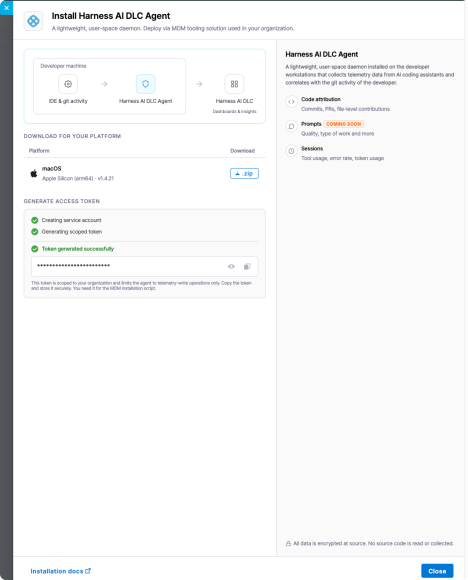
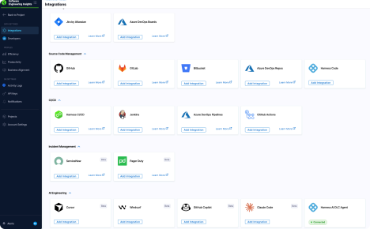
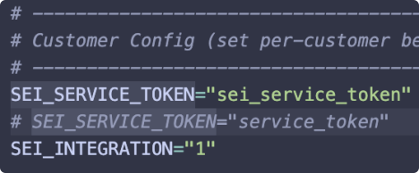
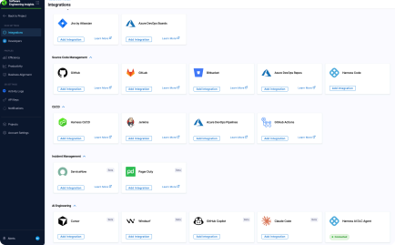
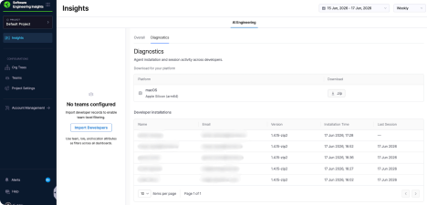

<CTABanner
  buttonText="Request Access"
  title="AI Engineering Insights is in beta!"
  tagline="Enable AI Engineering Insights to measure AI adoption and impact on productivity and quality across your teams. Available now in beta!"
  link="https://developer.harness.io/docs/software-engineering-insights/sei-support"
  closable={true}
  target="_self"
/>

The Harness AI DLC Agent is a lightweight, user-space daemon installed on developer workstations to collect telemetry data from AI coding tools such as Claude Code, Cursor, and GitHub Copilot. It correlates this telemetry with git activity and transmits it to the [AI Engineering Insights](/docs/software-engineering-insights/harness-sei/insights/ai-engineering) dashboard, where engineering leaders can measure AI coding tool adoption, optimize token spend, and quantify the impact of AI on software delivery.


*The AI Engineering dashboard displaying metrics such as session tracking, token spend, commit attribution, ship rate, and error rate.*

## Supported coding agents

The following coding agents/tools are supported for the Harness AI DLC Agent to capture usage and session level telemetry data.

* Claude Code
  * Claude Code via Bedrock/Vertex/other Cloud vendors
  * Claude Code CLI
* GitHub Copilot
  * Copilot CLI
  * Copilot on any IDE (Agent mode only)

## Scope of data collection

| Always collected (metadata) | Configurable (off by default) | Never collected |
| --- | --- | --- |
| Token counts (input, output, cache) | Prompt content | Code content or file contents |
| Tool usage events and session durations | AI response content | Credentials or secrets |
| AI vs. human line attribution counts | | |
| Cost estimates | | |
| Session details (tool, duration, timestamps) | | |

:::info
Prompt and AI response collection is disabled by default. An administrator can enable it during MDM deployment. When disabled, only metadata (token counts, tool usage, attribution) is transmitted.
:::

## Security

Individual developers do not need to take action beyond having the agent installed and running, which is handled via MDM deployment (IT/EngOps owned). The agent runs in the background and captures signals from AI coding tool activity.

Go to [Data Security](/docs/software-engineering-insights/harness-sei/setup-sei/agent/data-security#data-collected) to review the full list of collected data types and security controls.

## Prerequisites

- **Operating system:** macOS 12+ (Monterey or later), Intel or Apple Silicon. Windows support is coming soon.
- **Privileges:** Standard user account. No admin or root required for operation.
- **Network:** Outbound HTTPS to `*.harness.io` on port 443.
- **Harness account:** Active Harness account with the AI Engineering Insights module enabled.
- **Role:** You must be an **Account Admin** in Harness to generate a scoped service token.

## Install the agent

### Step 1: Generate an API token

1. Sign in to your Harness account and navigate to the **Engineering Insights** module.
   
   

2. On the **AI Engineering** tab, select **Download Agent** to open the setup panel.

   

3. In the setup panel, select **Generate PAT**. This token is scoped to your organization and limits the agent to telemetry-write operations only.

   

4. Copy the token and store it securely. You need it for the installation script in Step 3.

   

### Step 2: Download the agent binary

1. In the setup panel, select the download option for the operating system used by developers in your organization. The agent is distributed as a signed, versioned binary for macOS (arm64 and x64).

   

2. Once the download is complete, click **Close** to dismiss the setup panel.

   

1. After a successful installation, navigate to the **AI Engineering** section under **Integrations**. The Harness AI DLC Agent will show a **● Connected** status.

   

### Step 3: Update the installation script

1. Unzip the downloaded package. The folder contains two files: the agent binary and the installation script (`harness-aidlc-agent-macos-arm64-install.sh`).
2. Open the installation script and set the token from Step 1 as the value of `SEI_SERVICE_TOKEN`.
   
   

3. Save the script.

### Step 4: Install the agent

import Tabs from '@theme/Tabs';
import TabItem from '@theme/TabItem';

<Tabs queryString="installation">
<TabItem value="mdm" label="Deploy via MDM" default>

Organization administrators distribute the agent to developer machines using MDM (Mobile Device Management).

1. Zip the binary and the updated installation script from Step 3. 
1. Push the `.zip` package to developer machines. 
1. Create a post-install script (see below) to locate and execute the installation script automatically from the extracted zip. 
1. Initialize the binary installation using the installation script. The post-install script runs the installation script, which verifies the binary, stores the token in the macOS Keychain, writes configuration, places the binary, registers the LaunchAgent, and starts the daemon. 

**Post-install script for MDM zip deployment**: When installing from a .zip file via MDM, you need a post-install script to locate and execute the installation script automatically. Save the following as your post-install script in your MDM configuration:

```bash
#!/bin/bash
# 1. Define the location where the zip is extracted
BASE_DIR="<location-where-zip-is-pushed>"
INSTALL_SCRIPT="$BASE_DIR/harness-aidlc-agent-macos-arm64-install.sh"

# 2. Check if the script exists
if [[ -f "$INSTALL_SCRIPT" ]]; then
  echo "Found install script at $INSTALL_SCRIPT. Executing now..."

  # 3. Make the script executable
  chmod +x "$INSTALL_SCRIPT"

  # 4. Execute the script
  "$INSTALL_SCRIPT"
  
  # 5. Capture the exit status
  EXIT_CODE=$?
  if [ $EXIT_CODE -eq 0 ]; then
    echo "Installation script finished successfully."
    exit 0
  else
    echo "Installation script failed with error code $EXIT_CODE."
    exit "$EXIT_CODE"
  fi
else
  echo "Error: Installation script not found at $INSTALL_SCRIPT"
  exit 1
fi
```

Replace `<location-where-zip-is-pushed>` with the actual path where your MDM tool extracts the zip package on developer machines.

</TabItem>
<TabItem value="manual" label="Manual installation">

Use manual installation for individual developer machines or to test the agent before a broader MDM rollout.

1. Complete Steps 1–3 above.
2. Run the updated installation script:

   ```bash
   sudo bash harness-aidlc-agent-macos-arm64-install.sh
   ```

Once the script completes, the agent begins collecting telemetry in the background.

</TabItem>
</Tabs>

## Deployment artifacts

| Artifact | Location | Purpose |
| --- | --- | --- |
| Binary | `/usr/local/bin/harness-aidlc-agent` | Daemon executable. |
| LaunchAgent | `~/Library/LaunchAgents/com.harness.aidlc-agent.plist` | Starts the agent automatically on user login. |
| Configuration | `~/.harness-aidlc-agent/config.json` | Stores the endpoint and integration ID. |
| Telemetry cache | `~/.harness-aidlc-agent/telemetry/` | Local queue for telemetry data before upload. |
| Audit log | `~/.harness-aidlc-agent/send.log` | Records telemetry transmission activity. |
| IPC socket | `~/.harness-aidlc-agent/socket` | Inter-process communication with `0600` permissions. |
| Git hooks | `.git/hooks/post-commit` | Per-repository attribution triggered on commit events. |
| Keychain entries | macOS System Keychain | Stores the API key securely. |

## Verify the installation

### With direct machine access

Run the following command to confirm the agent binary is installed and check its version:

```bash
harness-aidlc-agent version
```

This returns the version string of the installed binary. To confirm the daemon is running:

```bash
launchctl list | grep harness.aidlc
```

A line with `com.harness.aidlc-agent` and a process ID confirms the daemon is active. A `0` exit status in the second column indicates the agent started successfully.

To view recent telemetry activity, check the audit log:

```bash
tail -20 ~/.harness-aidlc-agent/send.log
```

### Without direct machine access

1. From the **Integrations** page, click **Back to Project** in the top-left corner of the sidebar.

   

2. Navigate to the **AI Engineering** tab and click **Diagnostics**. The **Diagnostics** page lists all developers for whom the agent was installed successfully, along with the installed version and last session time.

   
  
   Collected data is processed every 15 minutes, so allow up to 15 minutes after installation before expecting the developer to appear.

## Troubleshooting

<details>
<summary>A developer is missing from the AI Engineering dashboard</summary>

Verify the agent is installed on their machine by running `launchctl list | grep harness.aidlc`. Check the **Last session** timestamp in the **Developer Installations** table. Note that data is processed every 15 minutes, so allow up to 15 minutes after a new installation or session before the developer appears. If the agent has not reported in, reinstall using the MDM package.

</details>

<details>
<summary>A developer appears in the dashboard but shows no AI activity</summary>

The agent is running but has not detected any AI coding tool sessions. Confirm the developer has an active AI coding tool (such as Claude Code or Cursor) installed and has used it within the selected time range.

</details>

<details>
<summary>The agent is installed but launchctl shows no process</summary>

The LaunchAgent may not have loaded. Run the following command to start it manually:

```bash
launchctl load ~/Library/LaunchAgents/com.harness.aidlc-agent.plist
```

If the plist file does not exist, reinstall the agent via MDM.

</details>

<details>
<summary>Telemetry data is not appearing in the dashboard</summary>

Check network connectivity to `*.harness.io` on port 443. Review `~/.harness-aidlc-agent/send.log` for transmission errors. The agent queues data locally in `~/.harness-aidlc-agent/telemetry/` when the network is unavailable and retries automatically when connectivity is restored.

</details>