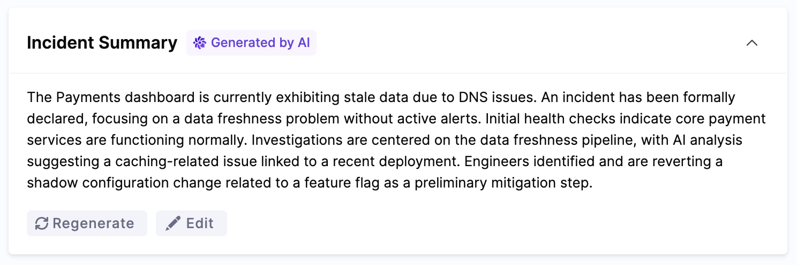
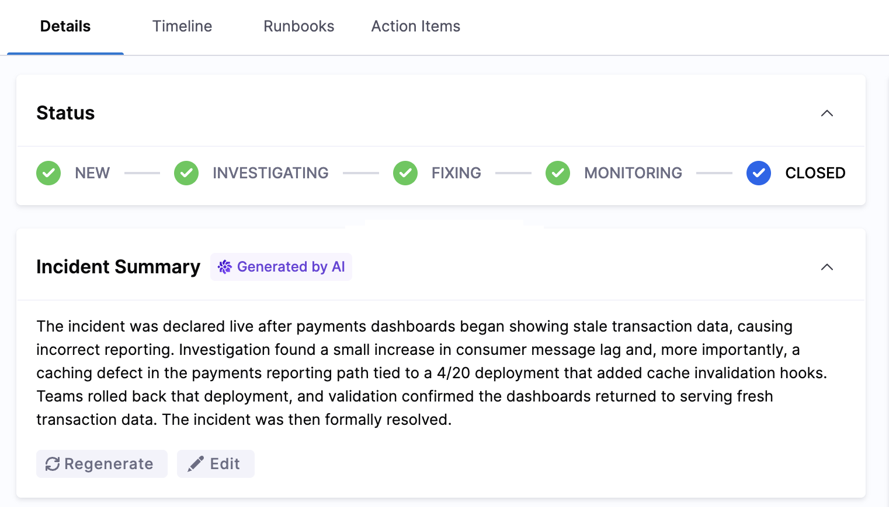

:::info What is the AI Scribe Agent?
The AI Scribe Agent is a specialized autonomous component of the Harness AI SRE platform that acts as a virtual scribe during incidents. It automatically documents communications, decisions, and actions across multiple channels to create comprehensive incident records without manual effort. The AI Scribe Agent works in conjunction with the [RCA Change Agent](/docs/ai-sre/ai-agent/rca-change-agent), the Scribe captures the incident narrative, and the RCA Change Agent uses that structured data to identify root causes and drive corrective action.
:::

The AI Scribe Agent serves as your dedicated incident management specialist, automatically capturing and organizing all incident response activities across communication platforms. 

By monitoring Slack channels, Zoom, and Microsoft Teams meetings, it ensures that no critical information is lost during high-pressure incident response situations.



## Key capabilities

The AI Scribe Agent provides these specific autonomous functions:

### Automated documentation
- **Continuous recording:** Captures all communications without human intervention
- **Key event detection:** Processes transcript chunks through an LLM to identify significant events and adds them as timeline entries. The system focuses on executive-level updates including:
  - Major discoveries about root cause or impact
  - Significant changes in incident scope, severity, or customer impact
  - Key mitigation actions like rollbacks or deployments
  - Important timeline milestones (incident start, resolution, etc.)
  - Deliberately excludes routine activities like creating tickets, standard investigation steps, team coordination, and minor configuration changes

### Communication analysis
<!-- CHANGED (comment #5): Rewrote "Context Preservation: Maintains the complete narrative of an incident", this was presenting an implementation detail as a named feature. What actually happens is the agent persists state between invocations and processes messages incrementally. -->
- **Continuity across the incident:** The AI Scribe maintains context by tracking conversation state and processing new messages incrementally, ensuring events from early in the incident are available when later messages are analyzed.
- **Timeline construction:** Creates chronological records of events

---

## Communication platform integrations

### Slack integration
The AI SRE Scribe Agent actively monitors dedicated incident channels to:
- **Real-time capture:** Records all conversations as they happen
- **Key event detection:** Automatically identifies significant events from conversations and adds them to the timeline (major discoveries, key decisions, mitigation actions)
- **Timeline construction:** Creates chronological event sequences
- **Manual action items:** Action items can be created manually via web UI and Slack commands

### Zoom integration
<!-- CHANGED (comment #12): Added a note that meeting transcription relies on third-party services (Recall.ai for bot deployment, AssemblyAI for transcription). Customers evaluating data handling and privacy need this information. -->
:::note Third-Party Transcription Services
Zoom meeting transcription uses third-party services. Recall.ai deploys the meeting bot, and AssemblyAI handles audio transcription. Review the data handling and privacy policies for these services when evaluating this feature for your organization.
:::

The AI SRE Scribe Agent joins incident war room meetings to:
- **Meeting transcription:** Converts spoken discussions into searchable text
- **Key point extraction:** Identifies and highlights critical information from transcripts using the same criteria as Slack messages (major discoveries, significant changes, key mitigation actions)
- **Speaker attribution:** Maintains record of who said what in the transcript
- **Timeline integration:** Adds significant discussion points to the incident timeline as key events
- **Action item detection:** Automatically extracts action items from meeting transcripts where someone explicitly commits to a task, including assignee and due date if mentioned

### Microsoft Teams integration
<!-- CHANGED (comment #12): Same third-party transcription note applies to Teams. Added equivalent disclosure. -->
:::note Third-Party Transcription Services
Microsoft Teams meeting transcription uses third-party services. Recall.ai deploys the meeting bot, and AssemblyAI handles audio transcription. Review the data handling and privacy policies for these services when evaluating this feature for your organization.
:::

The AI SRE Scribe Agent participates in Teams meetings to:
- **Conversation monitoring:** Tracks all incident-related discussions
- **Insight extraction:** Identifies important technical details from transcripts using the same key event detection criteria
- **Speaker attribution:** Maintains record of who said what in the transcript
- **Timeline integration:** Adds significant discussion points to the incident timeline as key events
- **Action item detection:** Automatically extracts action items from meeting transcripts where someone explicitly commits to a task, including assignee and due date if mentioned

---

## Automated documentation features

### Comprehensive event capture
The AI SRE Scribe Agent captures two levels of information:

**Full Transcript** (stored for reference):
- All messages, calls, and meeting transcripts across platforms
- Complete conversation history with timestamps and speaker attribution

**Key Events** (highlighted in timeline):
- Major discoveries about root cause or technical issues
- Significant changes in incident scope, severity, or customer impact
- Key mitigation actions like rollbacks, deployments, or configuration changes
- Important timeline milestones (incident start, resolution, etc.)

The Scribe deliberately focuses key events on executive-level updates, excluding routine activities like ticket creation, standard investigation commands, team coordination logistics, and minor configuration changes. This keeps the timeline focused on what matters for incident understanding and post-incident review.

**Action Items** (automatically detected from meeting transcripts):
- Concrete tasks where someone explicitly committed to doing something
- Assigned person's name (if mentioned in the transcript)
- Due date or deadline (if mentioned)
- Automatically deduplicated to avoid creating the same action item multiple times when mentioned repeatedly

Action items can also be created manually via the web UI or Slack commands.

### Intelligent timeline generation

The AI SRE Scribe Agent transforms raw communications into structured incident timelines. Key events are expressed as executive-level status updates. The following examples illustrate how the Scribe interprets messages:

#### Examples of automated documentation

**Recovery action detection** (Slack)
```text
[14:23 UTC] DevOps Engineer: Database failover completed successfully
```
↓ *AI SRE Scribe adds to timeline as key event:*
```text
Database failover completed successfully
```

**Root cause discovery** (Zoom transcript)
```text
"After reviewing metrics, we've identified a memory leak in the payment service."
```
↓ *AI SRE Scribe adds to timeline as key event:*
```text
Memory leak identified in payment service after metric review
```

Note: Key events are concise, executive-level summaries. The complete messages and full context remain available in the conversation transcript.

---

## AI-native post-mortem generation

:::info Note

Currently, this feature is behind the `IR_INCIDENT_POSTMORTEM` feature flag. Contact [Harness Support](mailto:support@harness.io) to enable the feature.

:::

AI SRE automatically generates a structured post-incident review when an incident is closed (status → **Closed**). This AI-native post-mortem synthesizes the complete incident record into a comprehensive retrospective document.



### Post-mortem structure

The generated post-mortem contains six fixed sections:

1. **Summary:** High-level overview of what happened and when
2. **Impact:** Affected services, users, and business impact
3. **Root cause:** Identified cause based on RCA theories and investigation findings
4. **Resolution:** How the incident was mitigated and resolved
5. **Insights:** Key observations and patterns discovered during the incident
6. **Lessons learned:** Actionable takeaways for preventing similar incidents

:::note Template Customization
The post-mortem structure is fixed and cannot be customized. All post-mortems follow the same six-section format to ensure consistency across incidents and facilitate pattern recognition during retrospective analysis.
:::

### Data sources

The AI pulls context from multiple sources:

- **Incident metadata:** Title, severity, timestamps, impacted services, RCA theories
- **Incident notes:** Up to 200,000 characters of notes (newest content preserved if truncated)
- **Timeline events:** Nine event types including pages, escalations, runbook executions, key events, and status changes
- **Action items:** Follow-up tasks captured during the incident (both AI-detected and manually created)

### Generation triggers

Post-mortems can be generated in two ways:

- **Automatic generation:** Triggered when an incident status changes to **Closed**
- **Manual regeneration:** Available from the incident detail page if you update notes or add new information after closing

If generation fails, any previously generated post-mortem is preserved. The error message appears alongside the previous content, allowing you to retry generation without losing prior work.

### RCA Change Agent integration

The timeline and event data produced by the AI Scribe Agent serves as a primary input to the [RCA (Root Cause Analysis) Change Agent](/docs/ai-sre/ai-agent/rca-change-agent). The RCA Change Agent runs in realtime as the incident collects new data, ingesting the Scribe's structured timeline alongside alert and telemetry data to identify causal chains and recommend likely root cause candidates so that engineers can focus on long term remediation.

---

## Maximize the AI SRE Scribe Agent

### Optimal configuration
- **Dedicated channels:** Create purpose-specific incident channels
- **Early integration:** Add the AI SRE Scribe Agent at incident creation
- **Naming conventions:** Use consistent, searchable channel naming
- **Access management:** Ensure the agent has proper permissions
- **Platform coverage:** Deploy across all communication platforms

### Communication best practices
<!-- CHANGED (comment #16): Reframed the keyword prefix tips. Previously the framing implied the AI requires these cues to function, which undermines the "intelligent" positioning. Changed to present them as tips that help the AI Scribe capture intent accurately, useful guidance without suggesting the NLP falls back to keyword matching. -->
These tips help the AI Scribe capture your intent more accurately. The Scribe uses NLP to interpret messages in context, but clear formatting makes it easier to detect what matters most:
- **Decision markers:** Prefix key decisions with "DECISION:" to help the Scribe identify them reliably
- **Action formatting:** Use "ACTION ITEM:" to flag tasks clearly
- **Status updates:** Structure updates with timestamps and service names
- **Handoff documentation:** Clearly document shift changes and handoffs
- **Terminology consistency:** Use standard terms across all communications

### Documentation review
- **Verification:** Review AI-generated timelines for accuracy
- **Enrichment:** Add business context to technical details
- **Completion check:** Ensure all critical events are captured
- **Annotation:** Add post-incident insights to the timeline
- **Knowledge base:** Use documentation for training and process improvement

### AI Scribe capabilities vs. human scribes

<!-- CHANGED (comment #6): Changed "Captures 100% of communications" to an accurate scoped claim. The Scribe does not capture DMs, threads the bot is not in, side conversations, phone calls, or in-person discussions. "100%" is indefensible. -->

| Aspect | AI Scribe Agent | Human Scribe |
|--------|---------------------|---------------|
| Coverage | Captures all communications in monitored channels and transcribed meetings | May miss details during fast-paced incidents |
| Availability | Always available, no scheduling needed | Requires staffing and scheduling |
| Consistency | Uniform documentation format | Varies by individual |
| Cost | Fixed platform cost | Requires dedicated staff time |

---

## Get started

### Quick setup
- [Configure Slack integration](/docs/ai-sre/runbooks/integrations/slack): Connect Slack to capture incident channel communications.
- [Set up Zoom integration](/docs/ai-sre/runbooks/integrations/zoom): Add the meeting bot to transcribe Zoom war rooms.
- [Connect Microsoft Teams](/docs/ai-sre/runbooks/integrations/teams): Transcribe Teams meetings into the incident timeline.

### Related resources
- [Incident management overview](/docs/ai-sre/incidents/): Understand how incidents are structured in AI SRE.
- [Runbook automation](/docs/ai-sre/runbooks/): Automate response actions during incidents.
- [Alert integration](/docs/ai-sre/alerts/webhooks/templates/overview): Connect observability signals to incidents.
- [RCA Change Agent](/docs/ai-sre/ai-agent/rca-change-agent): Identify likely root cause candidates from the captured timeline.

---

## Next steps

- Go to the [RCA Change Agent](/docs/ai-sre/ai-agent/rca-change-agent) to turn the captured timeline into root cause candidates.
- Go to [incident management](/docs/ai-sre/incidents/) to understand how incidents are structured in AI SRE.
- Go to [runbook automation](/docs/ai-sre/runbooks/) to automate response actions during incidents.

---

## Summary

By leveraging the AI Scribe Agent, teams can focus on resolving incidents faster while maintaining comprehensive documentation automatically. This specialized agent handles the documentation burden so your technical teams can concentrate on what matters most: restoring service and resolving customer-impacting issues.