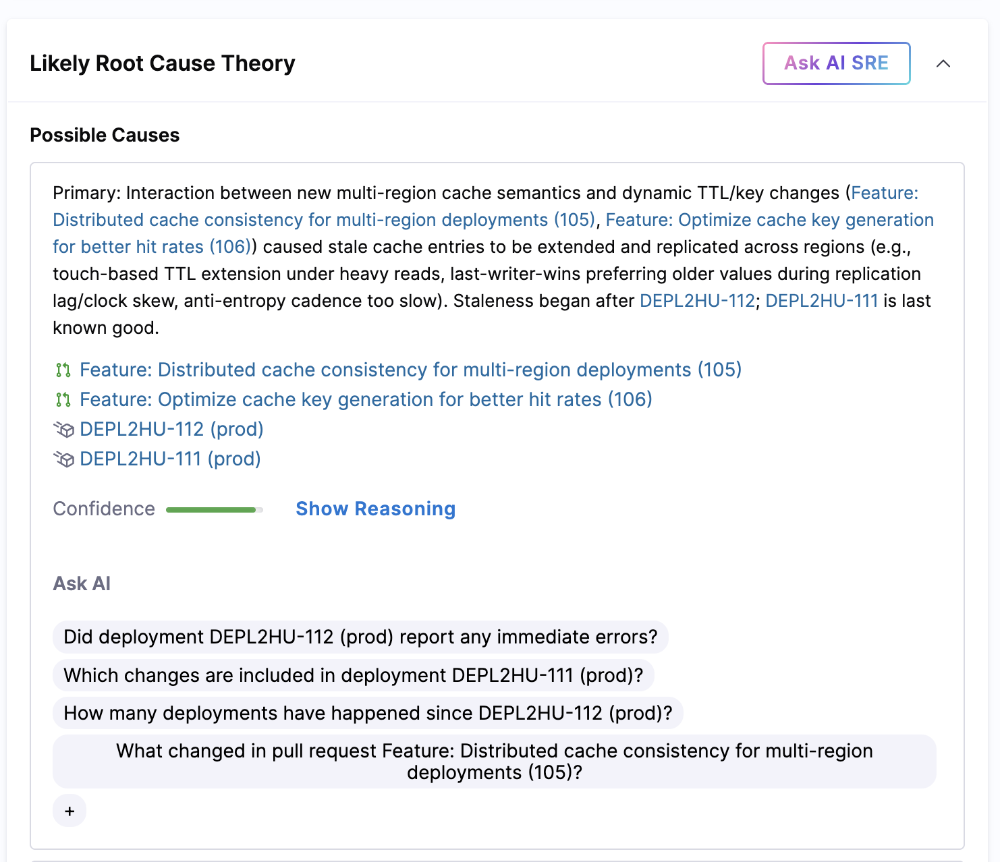

# Use RCA Change Agent

:::info What is the RCA Change Agent?
The RCA (Root Cause Analysis) Change Agent is a specialized autonomous component of the Harness AI SRE platform that analyzes incidents to identify potential root causes. It automatically investigates deployments, pull requests, and change events, then generates theories with confidence scores to help engineers focus their investigation efforts.
:::

The RCA Change Agent operates continuously throughout an incident's lifecycle, automatically re-analyzing when new key events are added by the AI Scribe Agent. 

As new information becomes available, it updates theory confidence scores and can add new theories or rule out unlikely candidates, providing engineers with an evolving understanding of potential root causes.



## How It Works

The RCA Change Agent runs automatically as a background job whenever key events are added to an active incident. This means:

- **Automatic triggering**: No manual configuration required — the agent activates when the AI Scribe Agent captures key events
- **Continuous updates**: Each time new key events are added, the agent re-evaluates its theories
- **Progressive refinement**: Confidence scores adjust as more data becomes available
- **Theory evolution**: New theories can be added, and unlikely theories can be ruled out as the incident progresses

<!-- 
## Investigation Tools

The RCA Change Agent uses specialized tools to investigate incidents:

### Deployment Analysis
- **Search deployments**: Finds deployment information for specific services, environments, and time ranges
- **Timeline correlation**: Matches deployments to incident timeline events to identify suspect changes

### Code Change Analysis
- **Find related PRs**: Identifies pull requests between stable and broken deployments
- **Code correlation**: Links code changes to symptoms observed during the incident

### Change Event Analysis
- **Search change events**: Finds feature flags, infrastructure changes, and configuration updates
- **Change timeline**: Correlates change events with incident start and symptom progression

### Code Investigation (Optional)
When configured, the agent can access investigator runbooks that execute code-level analysis to examine specific services or components identified as potential causes.

## Root Cause Theories

The RCA Change Agent generates theories about potential root causes. Each theory includes:

### Theory Components

| Component | Description |
|-----------|-------------|
| **Theory message** | Clear description of the potential root cause |
| **Confidence score** | Numerical value from 0 to 100 indicating likelihood |
| **Status** | Current investigation status (see below) |
| **Related activities** | Links to specific deployments, PRs, alerts, or change events that support the theory |
| **Evidence** | Specific timeline events or telemetry signals that led to this theory |

### Theory Status

Theories progress through these statuses as investigation continues:

- **INVESTIGATING** (default) — Theory is being evaluated; more data is needed
- **CONFIRMED** — High confidence this is the root cause based on strong evidence
- **RULED_OUT** — Evidence indicates this is not the root cause

## Integration with AI Scribe Agent

The RCA Change Agent depends on the AI Scribe Agent for structured incident data:

1. **AI Scribe Agent** captures communications and creates key events in the incident timeline
2. **RCA Change Agent** analyzes the timeline and runs investigation tools when key events are added
3. **Confidence scores update** as new key events provide additional context
4. **Post-Incident Review action** (when configured in a runbook) generates human-readable reports using the RCA theories

The quality of root cause theories depends directly on the completeness of the AI Scribe Agent's timeline. Teams that follow [communication best practices](/docs/ai-sre/ai-agent/#communication-best-practices) — particularly explicitly stating observed symptoms and root cause hypotheses — will see more accurate analysis.

:::note
If the AI Scribe Agent was not active during an incident, the RCA Change Agent cannot run, as it requires the structured timeline and key events.
:::

## Viewing RCA Analysis

Root cause theories appear in the incident view as they are generated:

- **Theory list**: View all active theories with their confidence scores and status
- **Related items**: Click through to deployments, PRs, or change events linked to each theory
- **Timeline correlation**: See which timeline events contributed to each theory
- **Confidence progression**: Watch how confidence scores change as new data arrives

## Example Analysis

Here's how the RCA Change Agent might analyze an incident:

**Initial analysis** (after first key events):
```
Theory 1: Recent deployment to payment-service (deploy-1234)
Confidence: 60
Status: INVESTIGATING
Related: deployment deploy-1234, PR-456 "Update payment processor timeout"
```

**After additional key events**:
```
Theory 1: Recent deployment to payment-service (deploy-1234)
Confidence: 85
Status: CONFIRMED
Related: deployment deploy-1234, PR-456, alert payment-timeouts-high
Evidence: Error rates spiked 2 minutes after deploy-1234, correlates with timeout changes in PR-456
```

## Configuration

### Enabling RCA Analysis

The RCA Change Agent requires:

1. **AI Scribe Agent active** on the incident to generate key events
2. **Valid services and environments** configured in your incident type
3. **Alert integrations** connected to provide telemetry data

No additional runbook configuration is required — the agent runs automatically when these prerequisites are met.

### Optional: Change Event Analysis

When the `IR_RCA_QUERY_CHANGES` feature flag is enabled for your organization, the RCA Change Agent also searches change events (feature flags, infrastructure changes, configuration updates) as part of its analysis.

### Optional: Code Investigation

Investigator runbooks can be configured to enable deeper code-level analysis. When configured:

1. The RCA Change Agent can invoke runbooks as tools during investigation
2. Runbooks can examine specific services, query logs, or analyze metrics
3. Results from runbook executions are incorporated into theory generation

Contact your Harness representative for information on configuring investigator runbooks.

## Data Sources

The RCA Change Agent automatically analyzes:

| Data Source | Purpose |
|-------------|---------|
| **Incident timeline** | Key events and decisions from AI Scribe Agent |
| **Deployment history** | Recent deployments to affected services |
| **Pull request data** | Code changes between stable and broken deployments |
| **Change events** | Feature flags, infrastructure changes, configuration updates |
| **Alert data** | Signals from connected observability platforms |
| **System telemetry** | Metrics and traces from affected services |

## Best Practices

### For Accurate Root Cause Analysis

- **Enable AI Scribe Agent early**: Add it at incident creation to capture the complete timeline
- **Communicate clearly**: State symptoms and hypotheses explicitly in incident channels
- **Use consistent naming**: Reference services and environments by their configured names
- **Tag relevant changes**: Mark deployments, PRs, and change events with service names
- **Review theories regularly**: Engineers should validate theories and provide feedback

### For Investigation Efficiency

- **Check theories first**: Before deep investigation, review RCA theories to focus efforts
- **Follow evidence links**: Click through to related deployments and PRs for context
- **Update based on findings**: As you confirm or rule out causes, theories will adjust
- **Document decisions**: Add key events when you confirm or rule out a root cause

## Getting Started

### Quick Setup
- [AI Scribe Agent](/docs/ai-sre/ai-agent/)
- [Alert Integration](/docs/ai-sre/alerts/integrations)
- [Runbook Automation](/docs/ai-sre/runbooks/)

### Related Resources
- [Incident Management Overview](/docs/ai-sre/incidents/)
- [Post-Incident Review](/docs/ai-sre/ai-agent/#post-incident-review)
- [Runbook Automation](/docs/ai-sre/runbooks/) -->

## Summary

The RCA Change Agent enhances incident response by automatically investigating potential root causes whenever the AI Scribe Agent adds key events to an active incident. 

By analyzing deployments, code changes, and telemetry data, it generates theories with confidence scores that help engineers focus their investigation efforts on the most likely causes, accelerating time to resolution.
