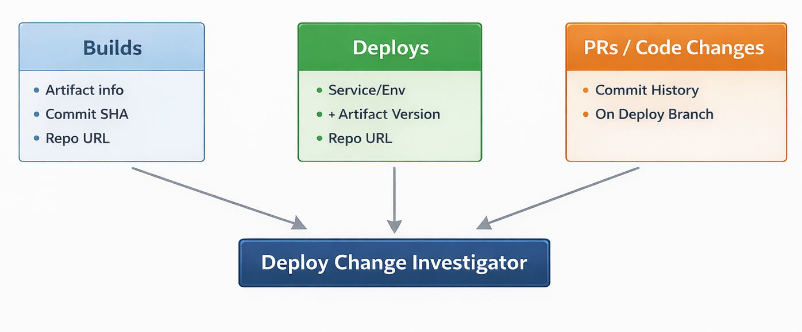

import { Troubleshoot } from '@site/src/components/AdaptiveAIContent';

The Deploy Change Investigator helps you understand what changed when incidents occur by connecting three critical data streams: builds, deployments, and code changes (PRs).

## How it works

The investigator connects your CI/CD pipeline data to provide precise answers about "what changed" during incidents:



**The connection flow:**

1. **Build webhook** sends: artifact name/version + commit SHA + repository
2. **Deploy webhook** sends: services deployed + environment + artifact versions
3. **PR ingestion** fetches: all PRs merged to your main deploy branch

The investigator maps deployments → builds → code changes, giving you precise answers to "what changed?" during incidents.

:::info Why all three pieces matter
- **Without builds:** Can't map deployments to code changes
- **Without deploys:** Can't correlate incidents to specific releases
- **Without PR ingestion:** Can't show which changes were in the deployment
:::

## Prerequisites

Before starting, ensure you have:

- **AI SRE module** enabled in your Harness account
- **Pipeline permissions** to add webhook steps to your build and deployment pipelines
- **Source control connector** (if not using Harness Code) - GitHub or Bitbucket credentials configured in your project

## Set up source control connector

:::tip Start here
Set up your connector first. When you test your build webhook later, AI SRE will automatically create a PR ingestion job for your repository.
:::

**Skip this step if:** You're using Harness Code (it's already integrated).

### If you already have a platform connector

1. Navigate to **Project Settings** (bottom left gear icon)
2. Go to **Third Party Integrations** → **AI SRE**
3. Select your GitHub or Bitbucket connector from the dropdown or create a new one
4. Click **Save**

When you send your first build webhook, AI SRE will use this connector to automatically create a PR ingestion job for your repository's main branch.

## Create build webhook integration

1. Navigate to **AI SRE** → **Integrations** (left sidebar)
2. Click **+ New Integration**
3. Fill in the form:
   - **Name:** Build (or your preferred name)
   - **Type:** Build
   - **Select Template:** Harness Build
4. Click **Save**
5. **Copy the Endpoint URL** — you'll need this when configuring your pipeline

The integration is created with a unique ID (e.g., `BUILB1A`) and a webhook URL like:

```
https://app.harness.io/gateway/ir/tp/account/{accountId}/api/v1/mc/webhook/{webhookId}/{token}
```

## Create deploy webhook integration

1. While still in **AI SRE** → **Integrations**, click **+ New Integration** again
2. Fill in the form:
   - **Name:** Deploy (or your preferred name)
   - **Type:** Deployment
   - **Select Template:** Harness Deployment
3. Click **Save**
4. **Copy the Endpoint URL** — you'll need this when configuring your pipeline

You should now see both integrations listed in your integrations view.

## Configure build pipeline webhooks

Add a Shell Script step to your build pipeline that runs **after** the artifact is published.

### Add the webhook step

1. Open your build pipeline
2. Add a new **Shell Script** step (e.g., "IR Build Notification")
3. Place it **after** your artifact publishing step
4. Configure the step with the following command:

```bash
#!/bin/bash

json_payload="{\"artifact\": {\"name\": \"${ARTIFACT_REPO}\",\"version\": \"${NEW_VERSION}\"},\"source\": {\"commitSha\": \"${COMMIT_SHA}\",\"kind\": \"branch\",\"value\": \"${BRANCH}\",\"repository_url\": \"${MANIFEST_REPO}\"},\"service\": {\"name\": \"${ARTIFACT_REPO}\",\"version\": \"${NEW_VERSION}\"},\"buildId\": \"<+pipeline.executionId>\"}"

curl 'YOUR_BUILD_WEBHOOK_URL_HERE' \
  -s \
  -H 'Content-Type: application/json' \
  -d "$json_payload"
```

### Configure environment variables

Map these variables to your pipeline outputs:

- **ARTIFACT_REPO** → `<+execution.steps.build_service.output.outputVariables.ARTIFACT_REPO>`
- **NEW_VERSION** → `<+execution.steps.build_service.output.outputVariables.NEW_VERSION>`
- **COMMIT_SHA** → `<+codebase.commitSha>` or your build step's commit SHA output
- **BRANCH** → `<+codebase.branch>`
- **MANIFEST_REPO** → Your repository URL (e.g., `https://github.com/yourorg/yourrepo`)
- **REGISTRY** → Your artifact registry (e.g., `us-west1-docker.pkg.dev`)

:::warning Important notes
- Escape all quotes in `json_payload`
- No newlines in the JSON string
- Replace `YOUR_BUILD_WEBHOOK_URL_HERE` with the endpoint URL from your Build integration
:::

### Build webhook payload reference

The Build webhook expects this JSON structure:

```json
{
  "artifact": {
    "name": "us-west1-docker.pkg.dev/docker/harness-service",
    "version": "1.7.2"
  },
  "source": {
    "commitSha": "9b5866d04b5255f80d7463f7670e3d8a5ff48e34",
    "kind": "branch",
    "value": "release/harness-service-1.7.0",
    "repository_url": "https://app.harness.io/ng/account/accountId/module/code/orgs/default/projects/default/repos/harness-service"
  },
  "service": {
    "name": "harness-service",
    "version": "1.7.2"
  },
  "buildId": "abc123"
}
```

**Field mapping:**

- **artifact.name:** Full artifact path (registry + image name)
- **artifact.version:** Artifact version/tag
- **source.commitSha:** Git commit SHA that was built
- **source.kind:** Usually "branch"
- **source.value:** Branch name
- **source.repository_url:** Git repository URL
- **service.name:** Service identifier
- **service.version:** Same as artifact version
- **buildId:** Unique build ID (pipeline execution ID)

## Test build webhook and verify PR ingestion

Run your build pipeline and verify two things:

### Verify build webhook is received

1. Navigate to **AI SRE** → **Integrations**
2. Click the three-dot menu (**...**) on the BUILD integration
3. Select **Debug**
4. You should see a timeline of received webhook events with:
   - Timestamp
   - Payload preview
   - Status (success/failure)

### Verify PR ingestion job was auto-created

If you configured your connector, AI SRE should automatically create a PR ingestion job:

1. Navigate to **AI SRE** → **PR Ingestions** (tab next to Integrations)
2. You should see an ingestion job with:
   - Repository name
   - Branch being tracked (usually `main`)
   - Last sync status and timestamp

The job runs automatically and fetches PRs merged to your deploy branch.

:::tip Success checkpoint
At this point, you should have:
- ✓ Build webhooks flowing (visible in Debug view)
- ✓ PR ingestion job created and running
:::

## Configure deploy pipeline webhooks

Add a Shell Script step to your deployment pipeline that runs **after** the deployment completes.

### Add the webhook step

1. Open your deployment pipeline
2. Add a new **Shell Script** step (e.g., "IR Deploy Notification")
3. Place it **after** your deployment step
4. Configure the step with the following command:

```bash
#!/bin/bash

json_payload="{\"services\": [{\"service\": \"bootstrap\",\"version\": \"1.34.0\"},{\"service\": \"code-api\",\"version\": \"1.42.2\"}],\"environments\": [\"qa\"],\"changeId\": \"<+pipeline.executionId>\",\"status\": \"SUCCESS\",\"deployedBy\": \"<+pipeline.triggeredBy.name>\",\"deployTimestamp\": \"<+pipeline.startTs>\"}"

curl 'YOUR_DEPLOY_WEBHOOK_URL_HERE' \
  -s \
  -H 'Content-Type: application/json' \
  -d "$json_payload"
```

### Customize the payload

- Replace the **services array** with your actual services and versions (supports multiple services per deployment)
- Update the **environments array** with your environment names (e.g., `["prod"]`, `["staging", "qa"]`)
- Replace `YOUR_DEPLOY_WEBHOOK_URL_HERE` with the endpoint URL from your Deploy integration

**Using Harness expressions for dynamic values:**

- **changeId** → `<+pipeline.executionId>` (unique deployment ID)
- **deployedBy** → `<+pipeline.triggeredBy.name>` (who triggered the deployment)
- **deployTimestamp** → `<+pipeline.startTs>` (when deployment started)

### Deploy webhook payload reference

The Deploy webhook expects this JSON structure:

```json
{
  "services": [
    {
      "service": "bootstrap",
      "version": "1.34.0"
    },
    {
      "service": "code-api",
      "version": "1.42.2"
    }
  ],
  "environments": [
    "qa"
  ],
  "changeId": "huEiP2S2TAO-kG-7JHDQJg",
  "status": "SUCCESS",
  "deployedBy": "A. Developer",
  "deployTimestamp": "2025-05-20T21:38:09Z"
}
```

**Field mapping:**

- **services[]** — Array of services deployed (can be one or many)
- **services[].service** — Service name (must match `service.name` from Build webhook)
- **services[].version** — Artifact version deployed (must match `artifact.version` from Build webhook)
- **environments[]** — Array of environments deployed to
- **changeId** — Unique deployment ID
- **status** — "SUCCESS" or "FAILURE"
- **deployedBy** — User who triggered the deployment
- **deployTimestamp** — ISO 8601 timestamp of deployment

:::danger Critical mapping requirement
The `services[].service` and `services[].version` **must match** the corresponding fields from your Build webhooks. This is how the investigator links deployments → builds → commits.
:::

## Test deploy webhook

After running a deployment, verify the webhook is being received:

1. Navigate to **AI SRE** → **Integrations**
2. Click the three-dot menu (**...**) on the DEPLOY integration
3. Select **Debug**
4. You should see deployment events with timestamps and payloads

## Verification checklist

At this point, you should have:

- ✓ Source control connector configured (if not using Harness Code)
- ✓ Build webhook integration created and receiving events
- ✓ Deploy webhook integration created and receiving events
- ✓ PR ingestion job created and syncing
- ✓ Verified webhook data in Debug views

## Troubleshooting

<Troubleshoot
  issue="PR ingestion job not auto-created after sending build webhooks"
  mode="docs"
  fallback="Verify: (1) You have a GitHub or Bitbucket connector at Project Settings → Connectors, (2) The connector is selected in Project Settings → Third Party Integrations → AI SRE, (3) Build webhook payloads include the source.repository_url field. If all are correct, contact Harness support as a feature flag may need to be enabled."
/>

<Troubleshoot
  issue="Build webhooks not appearing in Debug view"
  mode="docs"
  fallback="Check: (1) The webhook URL is correct and matches the integration endpoint, (2) Your pipeline is reaching the webhook step, (3) The curl command is not failing (add -v flag for verbose output), (4) Network connectivity allows outbound HTTPS to app.harness.io."
/>

<Troubleshoot
  issue="Deploy webhooks sending but changes not showing in incidents"
  mode="docs"
  fallback="Verify that services[].service and services[].version in your deploy webhook exactly match the service.name and artifact.version from your build webhooks. The investigator requires exact string matches to link deployments to builds."
/>

<Troubleshoot
  issue="PR ingestion job created but showing no PRs synced"
  mode="docs"
  fallback="Check: (1) The connector has read permissions on the repository, (2) The branch being tracked matches your actual deploy branch name, (3) PRs have been merged to that branch recently. View the job details for specific error messages."
/>

## Next steps

Now that your Deploy Change Investigator is configured:

- Learn how the [AI Agent uses change detection during incidents](/docs/ai-sre/ai-agent/rca-change-agent)
- Explore [incident management workflows](/docs/ai-sre/incidents)
- Configure [alert rules and integrations](/docs/ai-sre/alerts)
