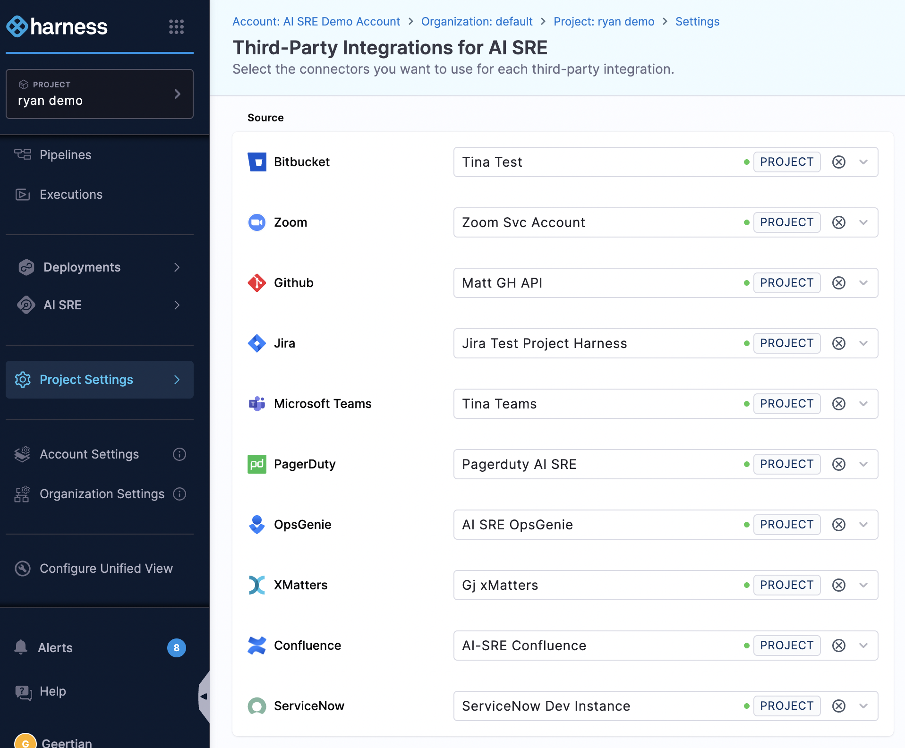
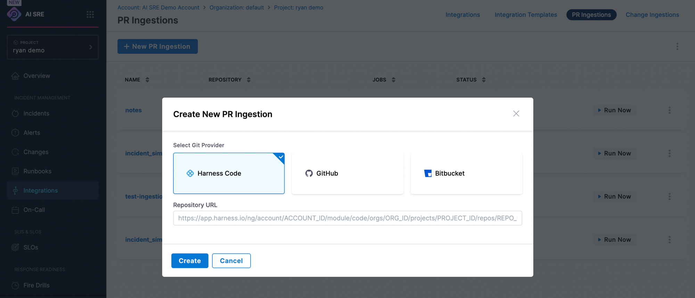

import { Troubleshoot } from '@site/src/components/AdaptiveAIContent';

Connect Bitbucket Cloud as a source-control change source so the Deploy Change Investigator ingests the pull requests merged into your deploy branch and links them to builds and deployments.

## Before you begin

- **Deploy Change Investigator setup**: Build and deploy webhook integrations created in AI SRE. Go to [Deploy Change Investigator](/docs/ai-sre/change/deploy-change-investigator) to set up the webhook endpoints.
- **A Bitbucket connector**: A Harness Bitbucket connector configured in your project. Go to [Connect to a code repo](/docs/platform/connectors/code-repositories/connect-to-code-repo) to create one.
- **Connector permissions**: Account, organization, or project **Admin**, or a role with **Manage Connectors**, to create a connector. Go to the [permissions reference](/docs/platform/role-based-access-control/permissions-reference) to review required permissions.

---

## How Bitbucket pull request ingestion works

The Deploy Change Investigator ingests Bitbucket pull requests by **polling**, not through webhooks. You do not paste a webhook URL into Bitbucket. Instead, AI SRE uses your Bitbucket connector to periodically query the Bitbucket API for pull requests that have merged into your deploy branch.

- **Mechanism**: AI SRE polls the Bitbucket Cloud API for merged pull requests on the tracked repository.
- **Frequency**: The ingestion job runs approximately once per hour.
- **Lookback**: On first activation, the job backfills merged pull requests from the previous 60 days when it is created automatically from a build webhook, or 90 days when you create it manually. It then syncs incrementally.
- **Stored data**: Each pull request is stored with its branch, PR number, commit SHA, title, merge timestamp, and author.

:::info Polling, not webhooks
Unlike the CI/CD build and deploy integrations, source-control change sources do not require a webhook. There is nothing to configure inside Bitbucket beyond the access granted to your Harness connector.
:::

---

## Supported Bitbucket platforms

| Platform | Supported |
|----------|-----------|
| Bitbucket Cloud | Yes |
| Bitbucket Server / Data Center | No |

Authentication uses your Bitbucket connector's credentials: a username and an App Password sent as HTTP Basic authentication. Go to the [Bitbucket connector settings reference](/docs/platform/connectors/code-repositories/ref-source-repo-provider/bitbucket-connector-settings-reference) to review connector fields.

:::warning Bitbucket Cloud only
Pull request ingestion supports Bitbucket Cloud only. Bitbucket Server and Data Center are not supported as source-control change sources.
:::

---

## Select the connector for AI SRE

Map the Bitbucket source to a connector so AI SRE knows which credentials to use.

1. In the left navigation, click **Project Settings** (gear icon).
2. Under **Project-level resources**, select **Third Party Integrations (AI SRE)**.
3. On the **Third-Party Integrations for AI SRE** page, find the **Bitbucket** row.
4. Select your Bitbucket connector from the dropdown. The scope tag (for example, **PROJECT**) shows where the connector is defined.

:::note Project-scoped page
This page is scoped to the project shown in the **PROJECT** selector at the top of the left navigation. Confirm the correct project is selected before you map connectors.
:::

---

## Create a pull request ingestion

1. In the AI SRE left navigation, go to **Integrations**.
2. Open the **PR Ingestions** tab.
3. Click **+ New PR Ingestion**.
4. In the **Create New PR Ingestion** dialog, under **Select Git Provider**, choose **Bitbucket**.
5. Enter the **Repository URL** of the repository to track.
6. Click **Create**.

:::tip Automatic creation from build webhooks
You do not have to create the ingestion by hand. When you send your first build webhook that includes a `source.repository_url` pointing at a Bitbucket repository, AI SRE creates the pull request ingestion job automatically.
:::

---

## Verify pull request ingestion

1. Navigate to **AI SRE** → **PR Ingestions** (tab next to Integrations).
2. Confirm an ingestion job exists for your repository with:
   - Repository name
   - Branch being tracked (usually `main`)
   - Last sync status and timestamp
3. After the next hourly sync, confirm merged pull requests appear against your deployments in **Change Management**.

---

## Troubleshooting

<Troubleshoot
  issue="Bitbucket pull request ingestion job not created after sending build webhooks"
  mode="docs"
  fallback="Confirm a Bitbucket connector exists at Project Settings → Connectors, that the Bitbucket row is mapped to it under Project Settings → Third Party Integrations (AI SRE), and that your build webhook payload includes the source.repository_url field. AI SRE creates the ingestion job on the first build webhook that identifies a repository. You can also create it manually under Integrations → PR Ingestions → New PR Ingestion."
/>

<Troubleshoot
  issue="Bitbucket pull request ingestion job created but no PRs are syncing"
  mode="docs"
  fallback="Confirm the App Password has read access to the repository and pull requests, the tracked branch matches your deploy branch, and pull requests have merged recently. Open the job details for specific error messages."
/>

<Troubleshoot
  issue="Bitbucket Server or Data Center pull requests are not ingested"
  mode="general"
  fallback="Pull request ingestion supports Bitbucket Cloud only. Bitbucket Server and Data Center repositories cannot be used as source-control change sources."
/>

---

## Next steps

- Go to [Deploy Change Investigator](/docs/ai-sre/change/deploy-change-investigator) for the complete setup guide.
- Go to [Configure GitHub](/docs/ai-sre/change/sources/github) to add GitHub as a source-control change source.
- Go to [AI Agent RCA](/docs/ai-sre/ai-agent/rca-change-agent) to learn how change detection works during incidents.
