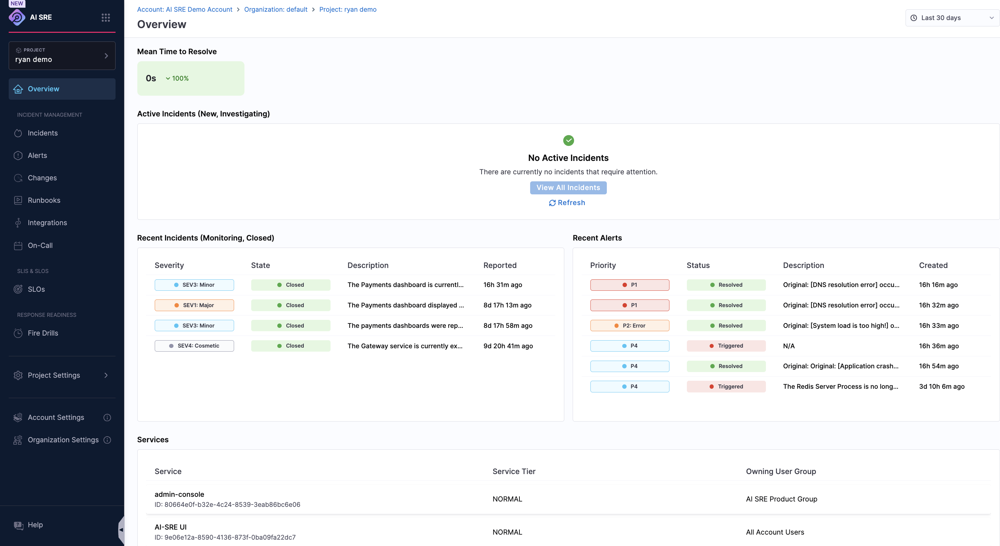
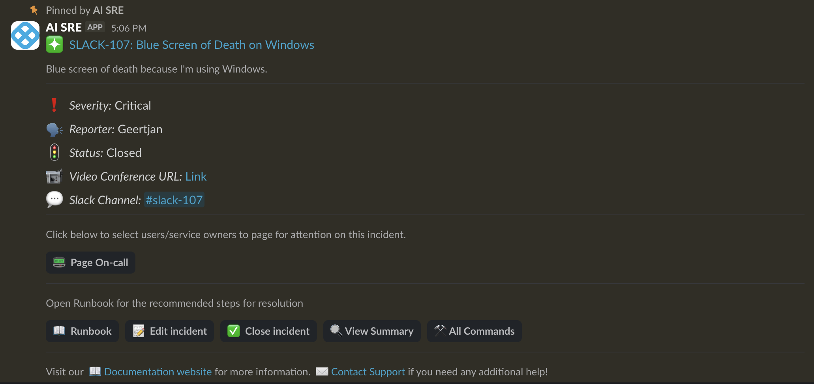
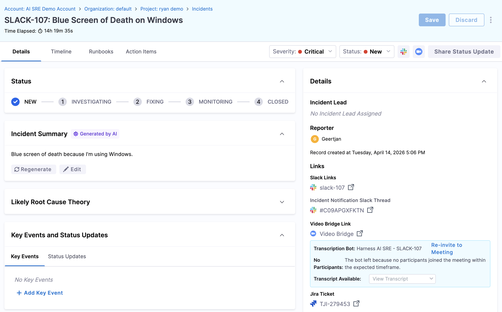
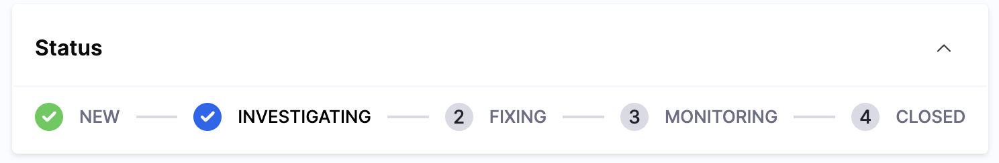
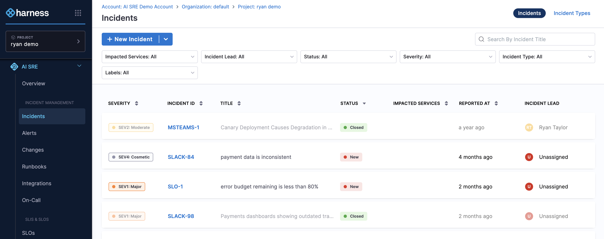
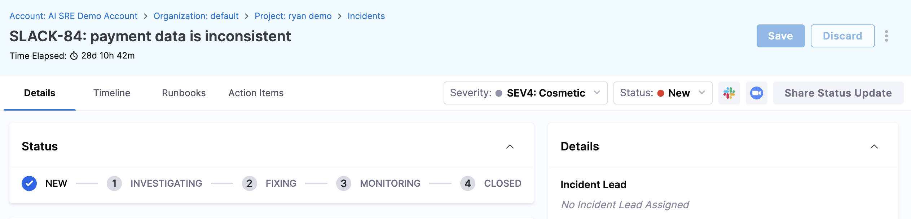
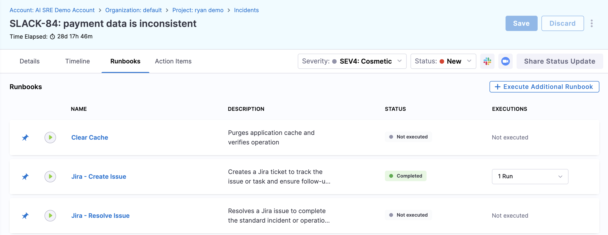
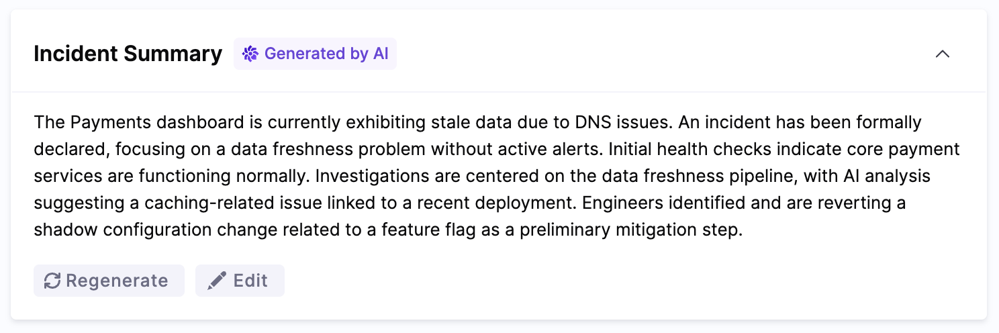
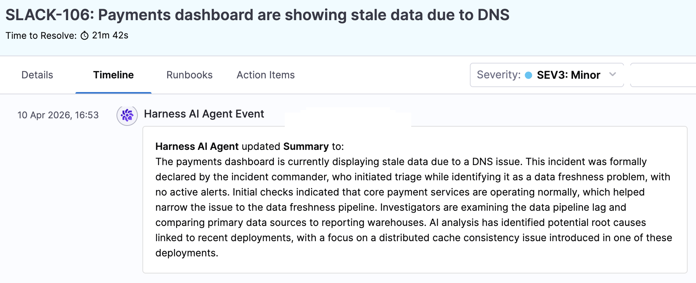

import Tabs from '@theme/Tabs';
import TabItem from '@theme/TabItem';
import DocVideo from '@site/src/components/DocVideo';

This guide walks you through the essentials of using Harness AI SRE as a responder or engineer.

You'll learn how to navigate the dashboard, respond to incidents, collaborate with your team, and use runbooks and AI-powered tools to resolve issues faster.

Your administrator has already configured the integrations and incident types. This guide focuses on what you need to know to be effective as an incident responder from day one.

## Prerequisites

Before getting started, confirm the following with your administrator:

| Item | Details |
| --- | --- |
| Harness account access | You have been added to your organization's Harness account with appropriate permissions |
| Collaboration tools connected | The Harness AI SRE bot is installed in your team's Slack workspace or Google Chat |
| Monitoring tools configured | Your organization's monitoring tools (Datadog, New Relic, Grafana, etc.) are already integrated |
| On-call schedule (if applicable) | You've been added to your team's on-call rotation in PagerDuty, OpsGenie, or a similar tool |

:::info Need admin setup first?
If your organization hasn't configured AI SRE yet, share the [Administrator Onboarding Guide](/docs/ai-sre/get-started/onboarding-guide-admins/) with your platform team to get started.
:::

## 1. Explore the AI SRE dashboard

<Tabs groupId="ai-sre-user" queryString>
  <TabItem value="Step by Step" label="Step by Step" default>

The AI SRE dashboard is your central hub during on-call shifts and day-to-day operations.

1. Log in to your **Harness account**.
2. Navigate to **AI SRE** from the left navigation panel and click **Overview**.

   
   <!-- Screenshot: Left nav with AI SRE module selected -->

3. The dashboard opens, shown below.

   

   On the dashboard, review the following:

   - **Active Incidents** — Any ongoing incidents that need attention.
   - **Recent Alerts** — The latest alerts from your monitoring tools.
   - **Metrics and Trends** — Key reliability metrics like MTTR and incident volume.

   <!-- Screenshot: Main dashboard showing active incidents, recent alerts, and metrics panels -->

4. Use the filters at the top to narrow by **incident type**, **severity**, **status**, or **assigned team**.

:::tip Quick Orientation
Bookmark the AI SRE dashboard for quick access during on-call shifts. The active incidents panel updates in real time.
:::

  </TabItem>
  <TabItem value="Interactive Guide" label="Interactive Guide">

<DocVideo src="https://app.tango.us/app/embed/c55a8b8f-bce1-487c-b8ea-5d178a844682?skipCover=true&defaultListView=false&skipBranding=false&makeViewOnly=false&hideAuthorAndDetails=true" title="Explore the Harness AI SRE Dashboard" />

Get familiar with the dashboard layout, active incidents, alerts, and key metrics at a glance.

  </TabItem>
</Tabs>

**Learn more:**
- [Understanding Incident Types](/docs/ai-sre/incidents) — Learn how incident types map to severity levels and responder teams.
- [Integration Overview](/docs/category/integrations) — See which monitoring tools are connected to your environment.

## 2. Respond to an incident

<Tabs groupId="ai-sre-user" queryString>
  <TabItem value="Step by Step" label="Step by Step" default>

When an incident is created — automatically from a monitoring alert or manually by a teammate — here's how to respond.

1. You'll receive a notification via **[Harness On-Call](/docs/category/handle-on-call)**, **Slack**, **Google Chat**, or your on-call tool.

   
   <!-- Screenshot: Slack message showing an incident notification with a link to the incident -->

2. Click the notification link to open the **incident detail page** in Harness.

   
   <!-- Screenshot: Full incident detail page showing summary, severity, and timeline -->

3. Review the incident summary:
   - **Severity** and **incident type** — Understand the scope and priority.
   - **Timeline** — The sequence of alerts and events that triggered the incident.
   - **Related alerts** — Correlated monitoring data and affected services.

4. If you've been paged about the incident, **acknowledge** the incident to let your team know you're on it.

   <!--  -->
   <!-- Screenshot: Incident detail header with the Acknowledge button highlighted -->

5. Update the **status** as you work through it: **Investigating**, **Fixing**, **Monitoring**, **Closed**.

   
   <!-- Screenshot: Status dropdown open showing available status options -->

6. Use the **incident channel** in Slack or Google Chat to collaborate with other responders in real time.
7. Add **notes and updates** to the incident timeline to keep a clear record of actions taken.

   <!--  -->
   <!-- Screenshot: Note input field on the incident timeline -->

:::info Slack Commands
You can manage incidents without leaving Slack. Use `/harness` slash commands to acknowledge, update status, add notes, and more.
:::

  </TabItem>
  <TabItem value="Interactive Guide" label="Interactive Guide">

<DocVideo src="https://app.tango.us/app/embed/50543ebc-97c8-4b92-86c2-bc19cd4fc230?skipCover=true&defaultListView=false&skipBranding=false&makeViewOnly=false&hideAuthorAndDetails=true" title="Respond to an incident in Harness AI SRE" />

Learn how to acknowledge, triage, and begin working on an incident when you're paged or alerted.

  </TabItem>
</Tabs>

**Learn more:**
- [Slack Commands Reference](/docs/ai-sre/get-started/slack-commands) — Manage incidents directly from Slack without switching to the UI.
- [AI Scribe Agent](/docs/ai-sre/ai-agent) — See how the Scribe captures your incident activity automatically.

## 3. Create an incident manually

<Tabs groupId="ai-sre-user" queryString>
  <TabItem value="Step by Step" label="Step by Step" default>

Not every incident starts from an automated alert. If you notice a problem — customer reports, degraded performance, or a teammate flagging something — you can create an incident manually.

1. Navigate to **Incidents** from the left panel.

   

2. Click **+ New Incident** or select an incident type from the **+ New Incident** drop-down.

3. The **Create a New Incident** form appears.

   
   <!-- Screenshot: Create incident form with the Incident Type dropdown open -->

4. Fill in the incident details:
   - **Title** — A clear, concise summary (e.g., "Elevated error rates on checkout API").
   - **Severity** — Choose the appropriate level based on impact.
   - **Description** — What you're observing, when it started, and any initial hypotheses.
   - Any additional **required fields** specific to your incident type.

5. Click **Save**.

An incident channel is created in your communication tool and relevant team members are notified.

:::tip From Slack
You can also create incidents directly from Slack using the `/harness new` command. This is useful during on-call when you want to stay in your communication tool.
:::

  </TabItem>
  <TabItem value="Interactive Guide" label="Interactive Guide">

<DocVideo src="https://app.tango.us/app/embed/f14f004b-3405-4384-baae-48a035a8eb12?skipCover=true&defaultListView=false&skipBranding=false&makeViewOnly=false&hideAuthorAndDetails=true" title="Create a new incident in Harness AI SRE" />

Sometimes you'll spot an issue before automated monitoring catches it. Learn how to declare an incident manually.

  </TabItem>
</Tabs>

**Learn more:**
- [Slack Commands Reference](/docs/ai-sre/get-started/slack-commands) — Use `/harness new` and other commands to create and manage incidents from Slack.
- [Understanding Incident Types](/docs/ai-sre/incidents) — Learn what incident types are available and how they affect notifications and runbooks.

## 4. Use runbooks during an incident

<Tabs groupId="ai-sre-user" queryString>
  <TabItem value="Step by Step" label="Step by Step" default>

Runbooks are predefined playbooks that guide you through incident response. 

Some run automatically when certain conditions are met; others can be triggered manually.

1. Navigate to **Incidents** from the left panel.

   

2. Click the **Incident ID** of the relevant incident to open the **Details** tab for an active incident.

   

3. Click the **Runbooks** tab.

   
   <!-- Screenshot: Incident detail page with the Runbooks tab selected -->

4. Review any runbooks that have been **auto-attached** based on the incident type.

   <!--  -->
   <!-- Screenshot: Runbooks tab showing a runbook that was automatically triggered -->

5. To manually attach a runbook, click **Add Runbook**, search for the one you need, and confirm.

   <!--  -->
   <!-- Screenshot: Add Runbook search dialog with results listed -->

6. Work through the runbook step by step:
   - **Automated steps** will run and report results without any action from you.
   - **Manual steps** show instructions for you to follow. Mark each one complete as you go.

   <!--  -->
   <!-- Screenshot: Runbook execution view with a mix of completed, in-progress, and pending steps -->

    Runbook execution is logged in the incident timeline.

:::tip When to use runbooks
If you're unsure which runbook applies, check the incident type. Your administrator has likely associated recommended runbooks with each type. You can also browse all available runbooks under **Runbooks** in the left navigation.
:::

  </TabItem>
  <TabItem value="Interactive Guide" label="Interactive Guide">

<DocVideo src="https://app.tango.us/app/embed/48a2f0ca-d07f-4395-aa7b-9b5c2c7b9018?skipCover=true&defaultListView=false&skipBranding=false&makeViewOnly=false&hideAuthorAndDetails=true" title="Use runbooks during an incident" />

Runbooks guide you through predefined response steps and can automate common actions during an incident.

  </TabItem>
</Tabs>

**Learn more:**
- [Browsing Runbooks](/docs/ai-sre/runbooks/create-runbook) — Explore the runbook library to see what playbooks are available to you.
- [Understanding Incident Types](/docs/ai-sre/incidents) — See which runbooks are associated with each incident type.

## 5. Use the AI Scribe Agent

The AI Scribe Agent works alongside you during incidents to reduce manual overhead.

- **Automatic summaries** — The Scribe monitors your incident channel and picks out key decisions, actions, and findings as they happen.
- **Timeline generation** — It builds a structured timeline from channel activity, status changes, and runbook execution.
- **Post-incident reports** — After resolution, the Scribe drafts a post-incident report from the timeline and channel discussions, giving you a head start on the retrospective.

To access Scribe outputs, open the **Details** page and look for the AI-generated **Incident Summary**.

Also, the **Timeline** tab shows updates generated by the Scribe.

<!-- Screenshot: Incident detail page showing the AI Summary and Timeline sections populated by the Scribe -->

**Learn more:**
- [AI Scribe Agent](/docs/ai-sre/ai-agent) — Full documentation on how the Scribe works and how to get the most out of it.
- [RCA Change Agent](/docs/ai-sre/ai-agent/rca-change-agent) — See how AI-powered root cause analysis works alongside the Scribe during an incident.

## Next steps {#ai-sre-user-next-steps}

- **[Slack Commands Reference](/docs/ai-sre/get-started/slack-commands)** — The full set of slash commands for managing incidents from Slack.
- **[Understanding Incident Types](/docs/ai-sre/incidents)** — How incident types map to severity levels, responder teams, and escalation paths.
- **[Browsing Runbooks](/docs/ai-sre/runbooks/create-runbook)** — Explore the automated playbooks available to you.
- **[Integration Overview](/docs/category/integrations)** — Which monitoring, communication, and ITSM tools are connected to your environment.
- **[AI Scribe Agent](/docs/ai-sre/ai-agent)** — Deeper documentation on AI-powered incident documentation and insights.