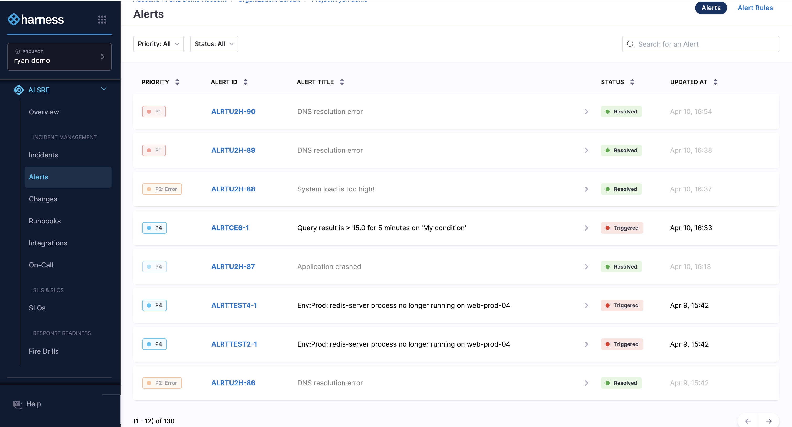
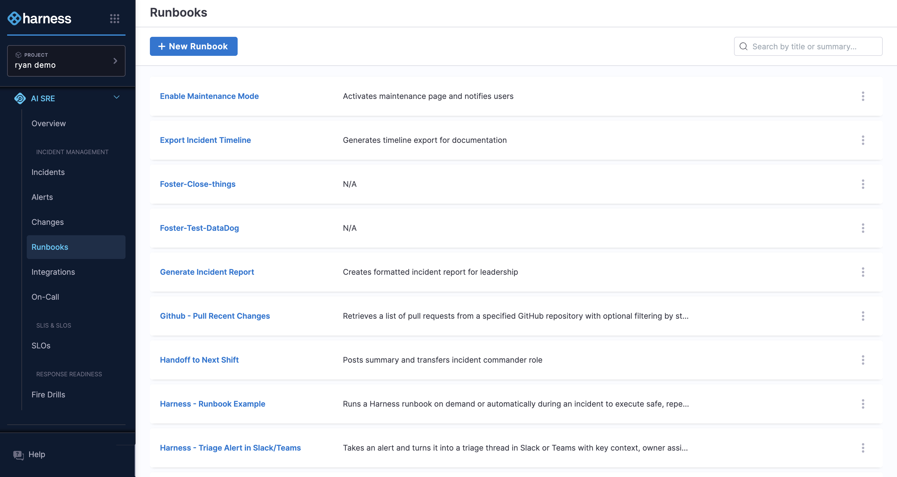
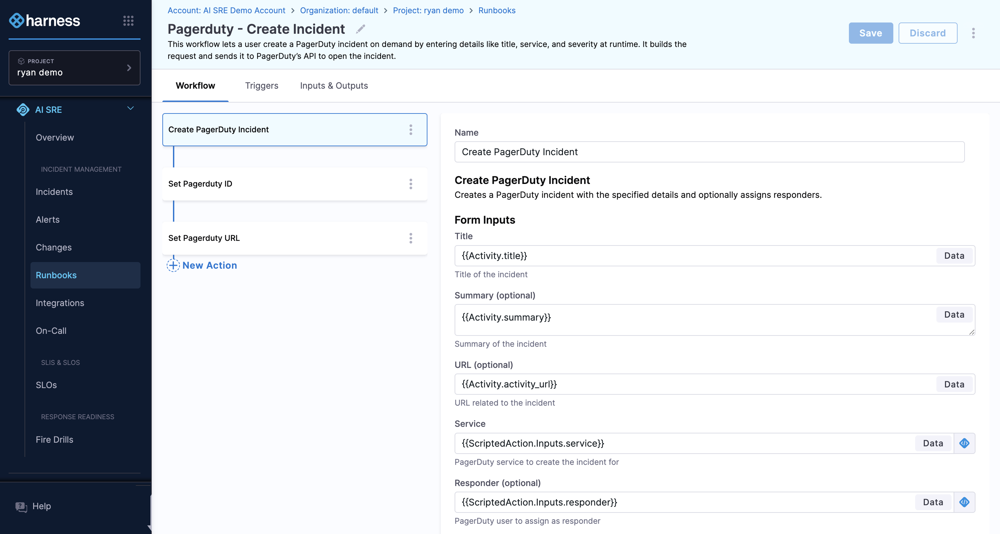
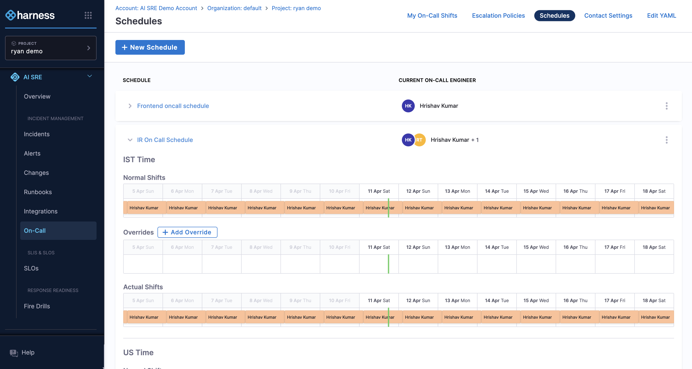
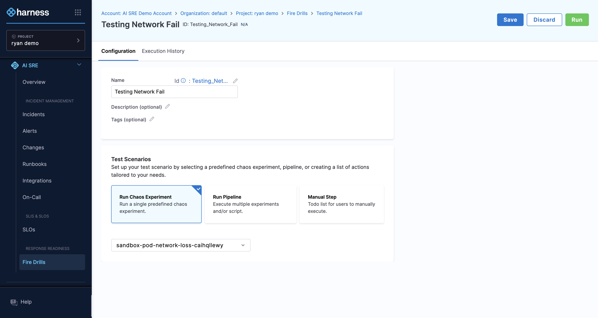
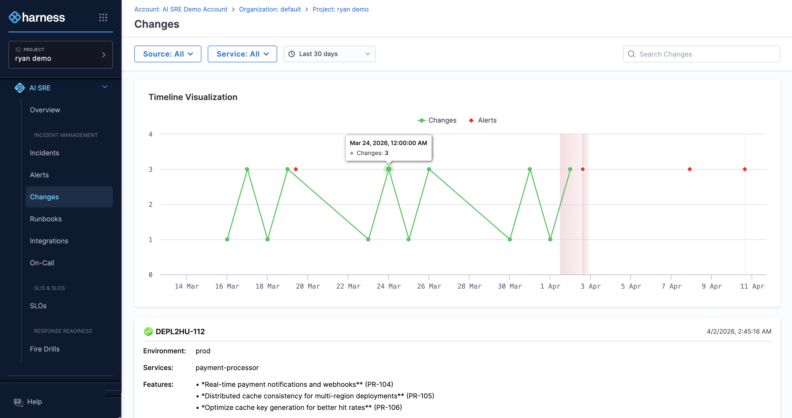
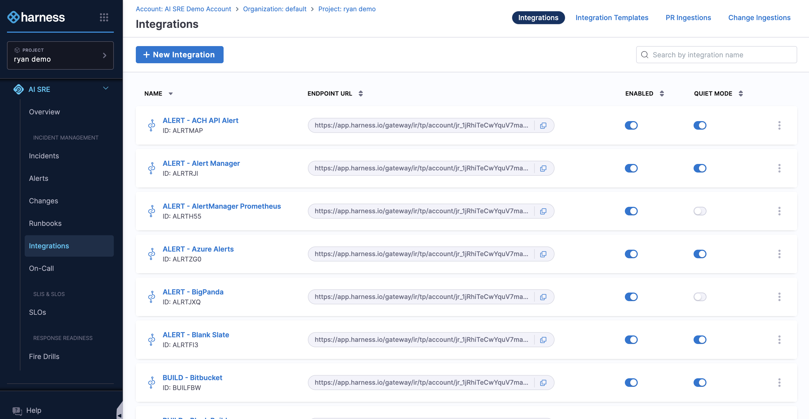

# Harness AI SRE Module

## Overview

Harness AI SRE is an incident management system that helps teams detect, respond to, and resolve incidents. It connects to your existing monitoring, alerting, and communication tools and ties them together into a single workflow. The platform combines automated documentation and root cause analysis with on-call management, runbooks, and structured incident response.

The AI SRE Overview Dashboard shows the current state of your systems and incident activity. Metrics include active incidents, mean time to resolve (MTTR), recent alert volume, SLO breaches, system uptime, and mean time between failures (MTBF).

<!-- Screenshot: Home dashboard or platform overview -->

## AI Agents

Two AI agents run automatically during an incident and work together as it unfolds.

### AI Scribe Agent

The AI Scribe Agent monitors your Slack channels, Zoom calls, and Microsoft Teams meetings during an incident. It picks out key events, adds them to a timeline, and keeps that record updated as the situation develops.

No one on the responding team needs to take notes or update a document manually.

<!-- Screenshot: Incident timeline showing auto-captured key events -->

### RCA Change Agent

The RCA Change Agent reads the timeline the Scribe builds and looks for likely root causes. It checks recent deployments, pull requests, and change events, then produces a list of theories with confidence scores.

The scores update as new events come in, so the analysis stays current throughout the incident rather than reflecting only the initial state.

<!-- Screenshot: RCA theories panel showing confidence scores and linked deployments/PRs -->

## Alerts and Incidents

Harness AI SRE gives you a unified view of incoming signals and active incidents. Alerts identify problems from your monitoring tools and incidents provide a structured workspace for coordinating the response.

### Alerts

Alerts come in through webhooks from tools like Datadog, PagerDuty, and New Relic. Harness can deduplicate and correlate them so that a single underlying problem does not generate a flood of separate notifications.

Each alert can be tied to an on-call policy, an alert rule, or a runbook. Some alerts trigger a runbook response without becoming a full incident.

<!-- Screenshot: Alert list showing status, source integration, and linked policies -->

### Incidents

An alert can be promoted to an incident automatically when it meets criteria you define. You can also open an incident from the web UI or by running `/harness new` in Slack.

Once an incident is open, it links to the affected services, the runbooks that have been triggered, any related fire drills, and change events that may be relevant.

<!-- Screenshot: Open incident showing timeline, linked services, and runbook activity -->

## Runbooks and Actions

Runbooks and actions let you codify your response procedures so they execute consistently every time. Runbooks define the overall sequence, while actions are the individual steps that carry it out.

### Runbooks

A runbook is a sequence of actions that runs automatically when triggered. You define the steps ahead of time so the team does not have to coordinate them manually during an incident.

A typical runbook for a major incident might open a Slack channel, post an update, start a Zoom bridge, notify the on-call engineers, and page the service team through PagerDuty.

<!-- Screenshot: Runbook builder showing a configured sequence of actions -->

### Actions

Actions are the individual steps inside a runbook. Some are simple, like posting a message to Slack. Others are more involved, like triggering a Harness Pipeline to roll back a deployment or creating a new PagerDuty incident.

Actions that talk to external systems run through a [Harness Delegate](/docs/platform/delegates/delegate-concepts/delegate-overview) to keep the connection secure.

## On-Call Management

On-call management lets you define who is responsible and how they get notified. You set up rotation schedules, escalation policies, and notification channels so the right person is always reachable.

<!-- Screenshot: On-call schedule showing rotations and escalation tiers -->

:::info Note

Currently, this feature is behind a feature flag. Contact [Harness Support](mailto:support@harness.io) to enable the feature.

:::

## Fire Drills

Fire drills let you test your incident response process before a real incident happens. You can run them manually or kick them off through a chaos experiment.

A fire drill targets specific services or application maps and exercises your runbooks and escalation paths in a controlled setting.

:::info Note

Currently, this feature is behind a feature flag. Contact [Harness Support](mailto:support@harness.io) to enable the feature.

:::

## Change Events

Change events track modifications to your system that could cause problems: code commits, deployments, feature flag changes, infrastructure updates, and third-party changes.

They show up alongside incident data so you can check whether something changed around the time a problem started.

<!-- Screenshot: Change events list shown alongside an incident timeline -->

## Integrations

Harness AI SRE connects to tools across four areas.

* **Monitoring and alerting:** Datadog, New Relic, Splunk, Dynatrace, Grafana, OpsGenie, and others send alerts via webhook.

* **CI/CD and development:** GitHub, GitLab, Jenkins, and Harness Pipelines feed in change event data and can be triggered for rollbacks.

* **ITSM and incident management:** ServiceNow, Jira, PagerDuty, and VictorOps handle escalation and ticketing.

* **Collaboration:** Slack, Microsoft Teams, Zoom, and Confluence are where the Scribe Agent listens and where runbook actions send updates.

<!-- Screenshot: Integrations list or configuration page -->