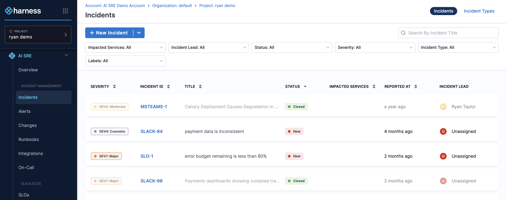

import Tabs from '@theme/Tabs';
import TabItem from '@theme/TabItem';
import DocVideo from '@site/src/components/DocVideo';

Harness AI SRE's incident management system provides a comprehensive platform for tracking, coordinating, and resolving service disruptions. From incident creation to resolution, teams can manage the entire incident lifecycle with automated workflows, real-time collaboration, and intelligent response procedures.

## Overview

Incidents in Harness AI SRE help you:
- Create and track service disruptions with standardized incident types
- Coordinate response efforts across teams and stakeholders
- Document incident timelines with automated event tracking
- Execute automated remediation steps through integrated runbooks
- Generate comprehensive post-mortems and action items
- Integrate with monitoring tools for automatic incident creation
- Manage escalation policies and on-call notifications

---

## Key features

### Intelligent incident creation
- AI-powered problem description analysis and field auto-population
- Multiple creation methods: manual, alert-based, and monitoring integration
- Standardized incident types with pre-configured fields and workflows
- Quick Start functionality for rapid incident creation

### Comprehensive incident management
- Real-time incident details page with editable fields
- Timeline tracking with automatic event logging
- Manual key event addition for important milestones
- Status updates and ownership management
- Integration with on-call schedules and escalation policies

### Automated response procedures
- Runbook execution directly from incident interface
- Action item creation and assignment with due dates
- Automated workflow triggers based on incident type
- Integration with monitoring tools and alert systems

### Collaboration and communication
- Timeline-based messaging and updates
- Structured status updates via email to service subscribers
- Team notifications and stakeholder communication
- Action item tracking and assignment
- Post-incident analysis and documentation

---

## Create an incident

<Tabs groupId="incident-creation" queryString>
  <TabItem value="interactive-guide" label="Interactive Guide" default>

<DocVideo src="https://app.tango.us/app/embed/500fd8d9-da9a-42b3-8006-94ecc9d5d8ff?skipCover=true&defaultListView=false&skipBranding=false&makeViewOnly=false&hideAuthorAndDetails=true" title="Create an Incident" />

Follow this interactive guide to create and manage incidents with AI-powered assistance and automated workflows.

  </TabItem>
  <TabItem value="step-by-step" label="Step by Step">

### Step 1: Access incident creation

Open the incident creation flow:

1. Navigate to **Incidents** from the left panel

   

2. Choose your creation method:
   - Click **New Incident** for a blank incident
   - Select an **Incident Type** from the dropdown next to "New Incident" for pre-configured templates

### Step 2: Select incident type

Pick the incident type that matches the disruption:

1. Choose the appropriate **Incident Type** from the available options

   

2. This will pre-populate relevant fields and associate appropriate runbooks
3. Incident types ensure consistent data collection and response procedures

### Step 3: Describe the problem

Give the AI enough context to populate the incident:

1. Use the **Quick Start** block to describe the problem
2. Provide a clear, concise description of the issue
3. The AI system will analyze your description and suggest field values
4. Include relevant details like affected services, symptoms, and impact

### Step 4: Generate incident fields

Let AI SRE derive field values from your description:

1. Click the **up arrow** sign to process your description
2. AI will automatically populate incident fields based on your description
3. The system will suggest appropriate severity, priority, and other relevant fields

### Step 5: Review and customize

Verify and adjust the generated values before saving:

1. Review all auto-generated field values
2. **Manually change** any field values that need adjustment:
   - Title and description
   - Severity and priority levels
   - Add Assignee 
   - Add values to any custom fields added as per the Incident type
3. Click **Save** to create the incident

### Step 6: Manage incident details

Review and edit the incident from its details page:

1. The **Incident Details** page will display with all incident information
2. Use the **Edit icon** to edit individual fields as needed
3. Click **Edit** to modify the **Incident Summary**
4. Click **Save** after making any changes

### Step 7: Add key events

Document important milestones on the incident:

1. Click **Add Key Event** to manually document important milestones
2. Type the key event description in the text box
3. Include relevant details about actions taken or status changes
4. Click the **check mark** to save the key event
5. Remember to **Save** from the top right

### Step 8: Monitor timeline activity

Track and post to the incident timeline:

1. Navigate to the **Timeline** tab
2. View all incident-related activity in chronological order
3. Post messages to the timeline by typing in the text field and pressing Enter
4. All automated actions and manual updates appear here

### Step 9: Execute runbooks (optional)

Run automated response procedures from the incident:

1. Click the **Runbooks** tab
2. Click **Execute Additional Runbook** to link automated response procedures
3. Select the appropriate runbook from available options
4. Click **Execute** to perform the runbook actions
5. Monitor execution progress and results
6. Click **Close** when execution is completed

### Step 10: Manage action items

Create and assign follow-up tasks:

1. Navigate to the **Action Items** tab
2. Click **Create Action Item** to add follow-up tasks
3. Define the action item with:
   - Clear description of the task
   - **Assignee** responsible for completion
   - **Due date** for completion
4. Click the **check mark** to save the action item
5. Use the **Edit icon** to edit action item status as needed

### Step 11: Finalize and save

Confirm everything is documented, then save:

1. Review all incident details, timeline events, and action items
2. Ensure all necessary information is documented
3. Click **Save** to finalize all changes
4. The incident is now ready for ongoing management and resolution

  </TabItem>
</Tabs>

---

## Best practices

### Incident creation and classification
- **Choose appropriate incident types:** Select the most specific incident type to ensure proper field configuration and runbook association
- **Provide detailed descriptions:** Use the Quick Start feature with comprehensive problem descriptions to enable accurate AI field population
- **Verify auto-generated fields:** Always review and adjust AI-suggested field values to ensure accuracy
- **Set correct severity levels:** Align severity with actual business impact and response time requirements

### Incident response and management
- **Acknowledge quickly:** Respond to incidents promptly to minimize impact and meet SLA requirements
- **Assess impact thoroughly:** Evaluate affected services, user impact, and business consequences
- **Execute relevant runbooks:** Use associated runbooks for standardized response procedures
- **Document all actions:** Record every action taken in the timeline for audit trails and learning
- **Update status regularly:** Keep incident status current to inform stakeholders and trigger appropriate workflows

### Timeline and event management
- **Add key events:** Document critical milestones, decisions, and turning points in the incident lifecycle
- **Use timeline messaging:** Communicate updates and coordination through the incident timeline
- **Maintain chronological order:** Ensure all events are properly timestamped and sequenced
- **Include context:** Provide sufficient detail in timeline entries for future reference and analysis

### Action item management
- **Create specific action items:** Define clear, actionable tasks with specific outcomes
- **Assign ownership:** Ensure every action item has a designated owner and due date
- **Track progress:** Regularly update action item status and completion
- **Follow up:** Monitor action items through completion to prevent issues from recurring

### Communication and collaboration
- **Use structured communication:** Follow incident communication templates and standards
- **Update stakeholders regularly:** Provide timely updates to affected teams and leadership
- **Leverage integration channels:** Use Slack, Teams, or other integrated communication tools
- **Maintain professional tone:** Keep all incident communication clear, factual, and professional

### Post-incident activities
- **Complete action items:** Ensure all follow-up tasks are completed within specified timeframes
- **Conduct reviews:** Analyze incident response effectiveness and identify improvement opportunities
- **Update documentation:** Refine runbooks, procedures, and incident types based on lessons learned
- **Share knowledge:** Communicate insights and improvements with the broader team

---

## Benefits

Incident management in AI SRE delivers the following benefits:

- **Streamlined response:** AI-powered incident creation reduces time to response and improves accuracy
- **Standardized processes:** Incident types ensure consistent handling across all teams and services
- **Automated workflows:** Integrated runbooks and action items automate response procedures
- **Complete visibility:** Timeline tracking and event logging provide full incident lifecycle visibility
- **Enhanced collaboration:** Built-in communication tools facilitate team coordination and stakeholder updates
- **Continuous improvement:** Action item tracking and post-incident analysis drive process optimization
- **Integration ready:** Seamless connection with monitoring tools, alert systems, and communication platforms

---

## Next steps

### Getting started
- [Configure incident types](/docs/ai-sre/incidents/incident-types): Standardize incident classification.
- [Set up route alerts](/docs/ai-sre/alerts/alert-rules/overview): Automatically create incidents from monitoring alerts.
- [Configure on-call schedules](/docs/ai-sre/oncall): Ensure proper incident assignment and escalation.

### Advanced configuration
- [Customize incident fields](/docs/ai-sre/incidents/incident-fields): Capture specialized data.
- [Set up incident workflows](/docs/ai-sre/incidents/incident-workflows): Enable advanced automation.
- [Configure incident templates](/docs/ai-sre/incidents/incident-templates): Standardize incident creation.
- [Configure status updates](/docs/ai-sre/incidents/status-updates): Communicate with stakeholders.
- [Integrate monitoring tools](/docs/ai-sre/alerts/webhooks/templates/overview): Generate incidents automatically.

### Best practices resources
- [AI SRE best practices guide](/docs/ai-sre/resources/ai-sre-best-practices): Review recommendations for running AI SRE.
- [Incident response playbooks](/docs/ai-sre/runbooks/create-runbook): Build runbooks for standardized response.
- [AI SRE onboarding guide for administrators](/docs/ai-sre/get-started/onboarding/overview): Set up AI SRE for your organization.
