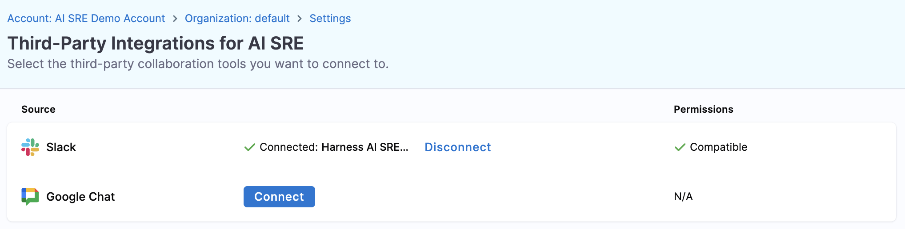
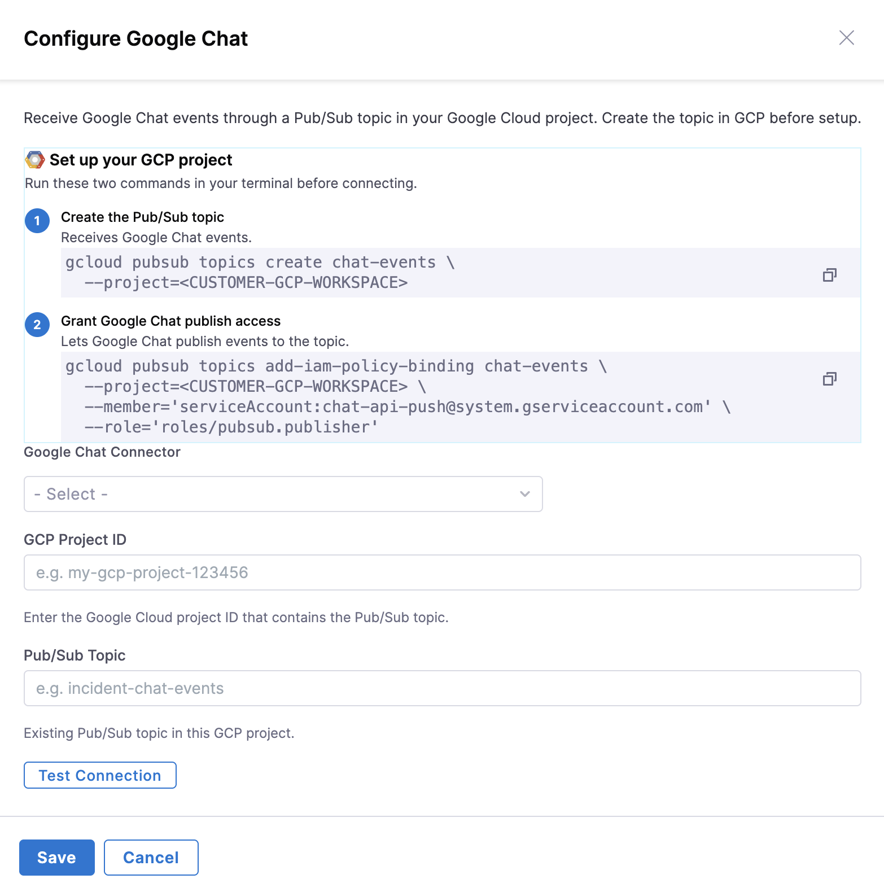

import { Troubleshoot } from '@site/src/components/AdaptiveAIContent';

# Google Chat Integration

Harness AI SRE integrates with Google Chat at the organization level, enabling teams using Google Workspace to collaborate on incidents using Google Chat spaces. The integration uses GCP Pub/Sub for reliable two-way message delivery.

## Overview

Google Chat integration enables your team to:

- Link Google Chat spaces to incidents for real-time collaboration
- Capture messages from Google Chat spaces automatically in the incident timeline
- Send automated notifications to Google Chat spaces via runbook actions
- Maintain a complete incident record across communication platforms

## Prerequisites

Before setting up the Google Chat integration, ensure you have:

- **Google Cloud Platform project**: With Pub/Sub API enabled
- **Google Chat admin access**: For your Google Workspace organization
- **Harness Organization Admin role**: To configure third-party integrations
- **GCP permissions**: Ability to create Pub/Sub topics and grant permissions

## Setup Steps

The Google Chat integration requires three main steps: GCP infrastructure setup (including Google Chat API configuration), Harness connection, and linking spaces to incidents.

### Step 1: Set Up GCP Infrastructure

1. **Create a Pub/Sub topic in your GCP project**:
   - Navigate to **Pub/Sub** → **Topics** in the Google Cloud Console.
   - Click **Create Topic**.
   - Name the topic, use the default suggested name or choose your own (e.g., `harness-ai-sre-google-chat`).
   - Leave other settings at default.
   - Click **Create**.

2. **Grant Google Chat service account permissions**:
   - Open the newly created Pub/Sub topic.
   - Click **Permissions** (or IAM) tab.
   - Click **Add Principal**.
   - Add the Google Chat service account: `chat-api-push@system.gserviceaccount.com`.
   - Assign the **Pub/Sub Publisher** role.
   - Click **Save**.

3. **Enable and configure the Google Chat API**:
   - In the Google Cloud Console, search for **Google Chat API** in your project.
   - If not enabled, click **Enable** to activate the API.
   - After enabling, navigate to **Configuration** in the Google Chat API page.
   - Fill in the app metadata:
     - **App name**: Enter a descriptive name (e.g., `Harness AI SRE`)
     - **Avatar URL**: Optional app icon
     - **Description**: Brief description of the integration
   - Under **Interactive features**:
     - Select **Enable interactive features**.
     - In the **Connection settings** section, select **Cloud Pub/Sub**.
     - Paste the **Pub/Sub topic name** you created in Step 1 (e.g., `projects/my-project-12345/topics/harness-ai-sre-google-chat`).
     - The full topic name format is: `projects/PROJECT_ID/topics/TOPIC_NAME`
   - Under **Visibility**:
     - Select **Make this Chat app available to specific people and groups in ORGANIZATION_NAME**.
     - Add the user group or individuals who will use the Harness integration.
   - Click **Save**.

4. **Install the Chat app in your workspace**:
   - Navigate to [chat.google.com](https://chat.google.com).
   - In the left sidebar, locate your newly created app under **Apps** or search for it.
   - Click the app name and select **Add to space** or **Install**.
   - The app now appears in your **Internal apps** section and is ready to use.

:::note GCP Project ID
You will need your GCP Project ID in the next step. Find it in the Google Cloud Console under **Project Settings** or in the project selector dropdown.
:::

### Step 2: Connect Google Chat in Harness

1. Navigate to **Organization Settings** → **Third-Party Integrations (AI SRE)**.
2. Locate **Google Chat** and click **Connect**.

3. Complete the OAuth authorization flow, as outlined below.

4. Configure the integration:
   - **Google Chat Connector**: Select your Google chat connector, sign in with your Google Workspace account, and grant the requested permissions when prompted. The authorization popup closes automatically on success.
   - **GCP Project ID**: Enter your Google Cloud project ID (e.g., `my-project-12345`)
   - **Pub/Sub Topic**: Enter the topic name you created in Step 1 (e.g., `harness-ai-sre-google-chat`)
5. **Test the connection** (optional but recommended):
   - Paste a Google Chat space ID from a test space URL
   - The space ID appears in the URL after `/room/` or `/space/`:
     - `https://chat.google.com/room/SPACE_ID`
     - `https://mail.google.com/chat/u/0/#chat/space/SPACE_ID`
   - Click **Test Connection**
   - If successful, you will see a confirmation message
6. Click **Save**.

The integration status changes to **Connected** after successful configuration.

:::info One Integration Per Organization
AI SRE supports one Google Chat integration per organization. All projects within the organization share this integration.
:::

### Step 3: Link Google Chat to Incidents

Once the integration is configured, you can link Google Chat spaces to specific incidents:

1. Open an **Incident Details** page.
2. Click **Edit** or the **pencil icon** next to collaboration tools.
3. Select **Add Google Chat Link**.
4. Provide the **Space ID**:
   - Copy the space ID from the Google Chat space URL:
     - `https://chat.google.com/room/SPACE_ID`
     - `https://mail.google.com/chat/u/0/#chat/space/SPACE_ID`
   - The Space ID is the alphanumeric string after `/room/` or `/space/`
   - Paste the space ID into the field
5. Click **Save**.

After linking:

- Harness automatically creates a Pub/Sub subscription for the space
- Messages sent in the Google Chat space appear in the incident timeline as case events
- The AI Scribe Agent (if enabled) captures key events from the conversation
- Runbook actions can post messages to the linked space

## Verify Two-Way Communication

After linking a Google Chat space to an incident, verify that messages flow correctly between Google Chat and Harness.

### Test Inbound Messages

1. Open the Google Chat space you linked to the incident.
2. Send a test message in the space (for example, "Testing Harness integration").
3. Navigate to the **Incident Details** page in Harness.
4. Check the **incident timeline** — your test message should appear as a case event.

:::note User Identification
User IDs currently appear as numeric Google IDs in the timeline, not email addresses or display names. Future improvements will resolve user identities to human-readable names.
:::

### View Case Event Details

To see the full message payload and metadata:

1. In the **Incident Details** page, locate the case event in the timeline.
2. Click on the case event to expand it.
3. Review the message text, timestamp, and user ID.

Case events capture the exact message content and metadata from Google Chat, providing a complete record of incident communication.

## How It Works

### Message Flow

**Inbound (Google Chat → Harness)**:

1. A user sends a message in the linked Google Chat space
2. Google Chat publishes the message to the configured Pub/Sub topic
3. Harness consumes the message from the Pub/Sub subscription
4. The message appears in the incident timeline

**Outbound (Harness → Google Chat)**:

1. A runbook action triggers the **Google Chat Post Message** action
2. Harness sends the message via the Google Chat API
3. The message appears in the linked Google Chat space

### Pub/Sub Subscription Management

- **Subscription creation**: When you link a Google Chat space to an incident, Harness creates a dedicated Pub/Sub subscription for that space
- **Subscription update**: If you switch to a different space, the old subscription is updated or removed, and a new one is created
- **Subscription deletion**: When you disconnect a Google Chat space from an incident, the Pub/Sub subscription is deleted automatically

## Switch or Disconnect a Space

### Switch to a Different Space

1. Open the **Incident Details** page.
2. Click **Edit** next to the Google Chat link.
3. Replace the **Space ID** with the new space ID.
4. Click **Save**.

Harness updates the Pub/Sub subscription to listen to the new space.

### Disconnect a Space

1. Open the **Incident Details** page.
2. Click **Remove** or the **X icon** next to the Google Chat link.
3. Confirm the removal.

The Pub/Sub subscription is deleted, but the organization-level Google Chat integration remains configured.

## Known Limitations

- **User identification**: User IDs currently appear as numeric Google IDs in the timeline, not email addresses or display names. Future improvements will resolve user identities to human-readable names.
- **One integration per organization**: You can configure only one Google Chat integration per Harness organization. All projects share this integration.
- **GCP infrastructure required**: Unlike Slack OAuth, Google Chat requires GCP Pub/Sub setup before configuration.

## Troubleshooting

<Troubleshoot
  issue="Messages from Google Chat do not appear in the incident timeline"
  mode="docs"
  fallback="Verify the Google Chat service account has Pub/Sub Publisher permissions on the topic, confirm the GCP Project ID and Pub/Sub Topic Name are correct in Harness, check that the space is linked to the incident, and verify the Pub/Sub subscription exists in GCP Console under Pub/Sub → Subscriptions. If the subscription is missing, try relinking the space to recreate it."
/>

<Troubleshoot
  issue="OAuth authorization fails during setup"
  mode="docs"
  fallback="Ensure your Google Workspace admin has approved the Harness AI SRE app, disable popup blockers for the Harness domain, and use a Google Workspace account with admin privileges."
/>

<Troubleshoot
  issue="Test connection fails with Invalid Space ID error"
  mode="docs"
  fallback="The Space ID is the alphanumeric string in the Google Chat URL after /room/ or /space/ (for example, https://chat.google.com/room/SPACE_ID or https://mail.google.com/chat/u/0/#chat/space/SPACE_ID). Do not include the full URL, only the space ID portion. Ensure the space exists and is accessible to the authorized Google account."
/>

<Troubleshoot
  issue="Pub/Sub subscription does not appear in GCP Console after linking a space"
  mode="docs"
  fallback="Verify that the GCP Project ID and Pub/Sub Topic Name in Harness match your GCP project settings. Check that the Google Chat service account (chat-api-push@system.gserviceaccount.com) has Pub/Sub Publisher permissions on the topic. Try disconnecting and relinking the space to trigger subscription creation."
/>

<Troubleshoot
  issue="Google Chat app does not appear in chat.google.com after configuration"
  mode="docs"
  fallback="Verify the Google Chat API is enabled in your GCP project. Ensure you completed the Configuration step in the Google Chat API page, including setting up the Pub/Sub connection with the full topic name (projects/PROJECT_ID/topics/TOPIC_NAME). Check that visibility is configured to make the app available to your user group. If the app still does not appear, refresh chat.google.com or try logging out and back in."
/>

## Best Practices

### For Administrators

- **Use a dedicated GCP project**: Create a separate GCP project for AI SRE integrations to isolate billing and permissions.
- **Monitor Pub/Sub usage**: Google Cloud charges for Pub/Sub message delivery. Monitor usage in the GCP Console under **Pub/Sub** → **Topics**.
- **Test before production**: Use a test Google Chat space to verify the integration before linking production incident spaces.
- **Document GCP setup**: Record the GCP Project ID and Pub/Sub Topic Name in your organization's runbook for future reference.

### For Incident Responders

- **Link spaces early**: Add the Google Chat link when creating the incident to capture the full conversation history.
- **Use consistent space naming**: Follow a naming convention for incident spaces (e.g., `incident-12345-payment-outage`).
- **Avoid switching spaces mid-incident**: If you must switch, document the reason in the incident notes.

## Next Steps

- Go to [Google Chat Post Message Runbook Action](/docs/ai-sre/runbooks/runbook-action-integrations/google-chat) to learn how to send automated messages to Google Chat spaces.
- Go to [AI Scribe Agent](/docs/ai-sre/ai-agent) to enable automatic capture of key events from Google Chat conversations.
- Go to [Acknowledge and Triage Incidents](/docs/ai-sre/users/manage-incidents/acknowledge-and-triage) to learn how incident responders use collaboration tools during incidents.
