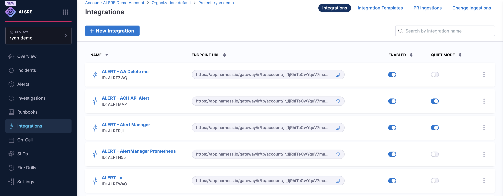
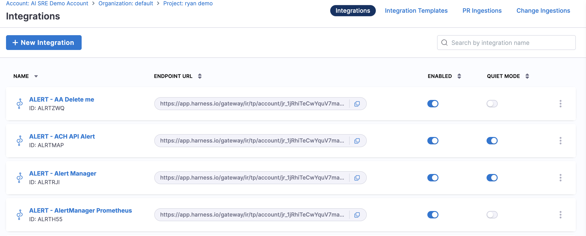
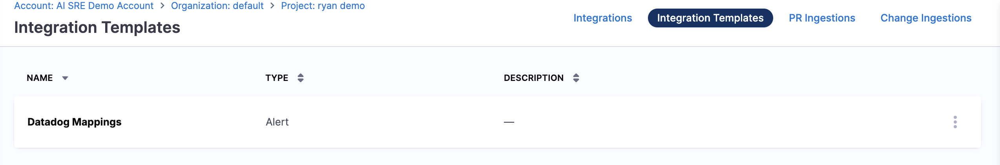
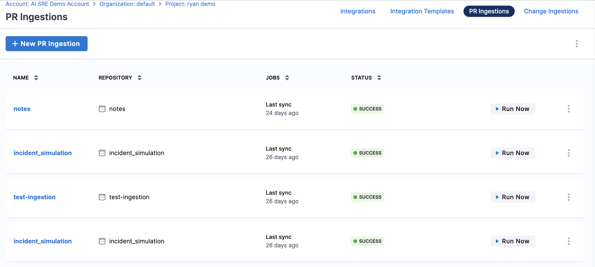
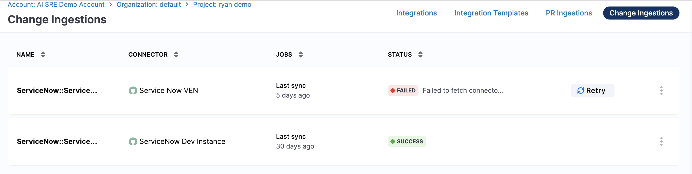

Harness AI SRE connects to the tools you already use across monitoring, CI/CD, ticketing, communication, and on-call. Each integration feeds AI SRE the signals it needs to detect, investigate, and resolve incidents, or lets AI SRE act on those tools during a response.

## What an integration gives you

An AI SRE integration connects an external tool to AI SRE in one of two ways. A single tool can do both.

- **Ingest:** The tool sends data into AI SRE. Monitoring tools send alerts that open or update incidents, and CI/CD tools send build, deploy, and pull request data the [Deploy Change Investigator](/docs/ai-sre/change/deploy-change-investigator) correlates to incidents. Ingest is one-way, into AI SRE.

- **Automation:** AI SRE acts on the tool. Runbooks post messages, create tickets, page responders, and open bridges. Automation is one-way, out of AI SRE.

Ingest and automation are separate capabilities. A tool that only ingests, such as Datadog, sends alerts to AI SRE but cannot be acted on by a runbook. A tool that only automates, such as Slack, receives runbook actions but sends no incident signal. Tools such as Jira and ServiceNow do both.

Behind these capabilities are three transport mechanisms:

- **Native.** Harness Code, Harness Pipelines, and Harness SLO integrate in-platform with no connector or webhook configuration required.

- **Webhooks.** These are ingest-only and require no connector: the tool POSTs data to an AI SRE webhook URL. You create the webhook URL in AI SRE, then paste it into the sending tool. Go to [Ingest Alerts](/docs/ai-sre/alerts/webhooks/overview) to create a webhook.

- **Connectors.** These call the tool's API and power automation, on-call schedule sync, and polling-based ingestion such as pull request and change-record ingestion. Configure connectors under **Project Settings** or **Organization Settings** → **Third Party Integrations (AI SRE)**. Go to [Integrate Your First Tool](/docs/ai-sre/get-started/onboarding/integrate-tools) to connect one.

---

## Where you manage integrations

Open **Integrations** in the AI SRE left navigation to manage every connection to an external tool. The page has four tabs, each for a different kind of integration.

Use the tab that matches how the tool connects and what data it moves.

### Integrations

The **Integrations** tab lists your webhook endpoints for alert ingestion. Each entry has an endpoint URL that a monitoring tool POSTs alerts to, an **Enabled** toggle, and a **Quiet Mode** toggle that suppresses incident creation while you test the payload.

Use this tab when a tool sends alerts into AI SRE over a webhook, such as Datadog, Prometheus, or Grafana. Select **New Integration** to create an endpoint, then paste its URL into the sending tool. Go to [Ingest Alerts](/docs/ai-sre/alerts/webhooks/overview) to create a webhook.

### Integration Templates

The **Integration Templates** tab holds reusable field-mapping templates. A template maps an incoming payload to AI SRE incident and alert fields once, so several endpoints of the same type share one mapping instead of repeating it.

Use this tab when you ingest alerts from the same tool through more than one endpoint, or when you want a consistent mapping across a team. Go to [Webhook Templates](/docs/ai-sre/alerts/webhooks/templates/overview) to review the prebuilt templates.

### PR Ingestions

The **PR Ingestions** tab lists pull request ingestion jobs. Each job connects a repository and syncs its merged pull requests so the Deploy Change Investigator can correlate a code change to an incident. The tab shows the repository, last sync time, and status, and lets you run a sync on demand.

Use this tab to bring pull request and code-change data in from Harness Code, GitHub, or Bitbucket. Go to [CI/CD and change sources](#cicd-and-change-sources) to review the supported providers.

### Change Ingestions

The **Change Ingestions** tab lists connector-based change ingestion jobs. Each job uses a Harness connector to poll an external system, such as ServiceNow, for change records on a schedule. The tab shows the connector, last sync time, and status, and lets you retry a failed sync.

Use this tab when change records reach AI SRE through a connector rather than a webhook, such as ServiceNow change requests. Go to [ServiceNow](/docs/ai-sre/integrations/ticketing-itsm/servicenow) to configure the connector.

---

## Integration capabilities at a glance

Use this table to confirm what AI SRE can do with each tool before you configure it. Ingest means the tool sends data to AI SRE. Automation means runbooks can act on the tool. Transport is how the connection is made. Where to manage is where you configure the tool: one of the four tabs on this page, **Third-Party Integrations** for automation connectors, or in-platform for native tools.

:::note
Configure automation connectors under **Third-Party Integrations** at either scope: **Project Settings** → **Third Party Integrations (AI SRE)** for a single project, or **Organization Settings** → **Third Party Integrations (AI SRE)** to share the connector across every project in the organization.
:::

| Tool | Ingest | Automation | Transport | Where to manage |
|------|--------|------------|-----------|-----------------|
| [AlertSite](/docs/ai-sre/integrations/monitoring/alertsite) | Yes | No | Webhook | Integrations tab |
| [AWS CloudWatch](/docs/ai-sre/integrations/monitoring/aws-cloudwatch) | Yes | No | Webhook | Integrations tab |
| [BigPanda](/docs/ai-sre/integrations/monitoring/bigpanda) | Yes | No | Webhook | Integrations tab |
| [Bitbucket](/docs/ai-sre/integrations/cicd-change/bitbucket) | Yes | No | Connector | PR Ingestions tab |
| [CircleCI](/docs/ai-sre/integrations/cicd-change/circleci) | Yes | No | Webhook | Integrations tab |
| [Confluence](/docs/ai-sre/integrations/ticketing-itsm/confluence) | No | Yes | Connector | Third-Party Integrations |
| [Datadog](/docs/ai-sre/integrations/monitoring/datadog) | Yes | No | Webhook | Integrations tab |
| [Dynatrace](/docs/ai-sre/integrations/monitoring/dynatrace) | Yes | No | Webhook | Integrations tab |
| [GitHub](/docs/ai-sre/integrations/cicd-change/github) | Yes | Yes | Connector (pull requests, runbook actions), Webhook (build and deploy) | PR Ingestions tab, Integrations tab, Third-Party Integrations |
| [GitLab](/docs/ai-sre/integrations/cicd-change/gitlab) | Yes | No | Webhook | Integrations tab |
| [Google Chat](/docs/ai-sre/integrations/communication/google-chat) | No | Yes | Connector | Third-Party Integrations |
| [Grafana](/docs/ai-sre/integrations/monitoring/grafana) | Yes | No | Webhook | Integrations tab |
| [Grafana Incident](/docs/ai-sre/integrations/monitoring/grafana-incident) | Yes | No | Webhook | Integrations tab |
| [Harness Code](/docs/ai-sre/integrations/cicd-change/harness-code) | Yes | No | Native | Native (in-platform) |
| [Harness Pipelines](/docs/ai-sre/integrations/cicd-change/harness-pipelines) | Yes | Yes | Native | Native (in-platform) |
| [Harness SLO](/docs/ai-sre/integrations/monitoring/harness-slo) | Yes | No | Native | Native (in-platform) |
| [Jenkins](/docs/ai-sre/integrations/cicd-change/jenkins) | Yes | No | Webhook | Integrations tab |
| [Jira](/docs/ai-sre/integrations/ticketing-itsm/jira) | Yes | Yes | Webhook (deployments), Connector (runbook actions) | Integrations tab, Third-Party Integrations |
| [Jira Service Management](/docs/ai-sre/integrations/ticketing-itsm/jira-service-management) | No | Yes | Connector | Third-Party Integrations |
| [Lacework](/docs/ai-sre/integrations/monitoring/lacework) | Yes | No | Webhook | Integrations tab |
| [Microsoft Teams](/docs/ai-sre/integrations/communication/microsoft-teams) | No | Yes | Connector | Third-Party Integrations |
| [New Relic](/docs/ai-sre/integrations/monitoring/new-relic) | Yes | No | Webhook | Integrations tab |
| [Octopus Deploy](/docs/ai-sre/integrations/cicd-change/octopus-deploy) | Yes | No | Webhook | Integrations tab |
| [OpsGenie](/docs/ai-sre/integrations/oncall/opsgenie) | Yes | Yes | Connector (schedules), Webhook (alerts) | Integrations tab, Third-Party Integrations |
| [PagerDuty](/docs/ai-sre/integrations/oncall/pagerduty) | Yes | Yes | Connector (schedules), Webhook (alerts) | Integrations tab, Third-Party Integrations |
| [Prometheus](/docs/ai-sre/integrations/monitoring/prometheus) | Yes | No | Webhook | Integrations tab |
| [Sentry](/docs/ai-sre/integrations/monitoring/sentry) | Yes | No | Webhook | Integrations tab |
| [ServiceNow](/docs/ai-sre/integrations/ticketing-itsm/servicenow) | Yes | Yes | Connector | Change Ingestions tab, Third-Party Integrations |
| [Slack](/docs/ai-sre/integrations/communication/slack) | No | Yes | Connector | Third-Party Integrations |
| [Splunk](/docs/ai-sre/integrations/monitoring/splunk) | Yes | No | Webhook | Integrations tab |
| [Terraform](/docs/ai-sre/integrations/cicd-change/terraform) | Yes | No | Webhook | Integrations tab |
| [Travis CI](/docs/ai-sre/integrations/cicd-change/travis-ci) | Yes | No | Webhook | Integrations tab |
| [xMatters](/docs/ai-sre/integrations/oncall/xmatters) | Yes | No | Connector | Third-Party Integrations |
| [Zoom](/docs/ai-sre/integrations/communication/zoom) | No | Yes | Connector | Third-Party Integrations |

---

## Monitoring and observability

These tools ingest alerts into AI SRE to open and enrich incidents. They are receive-only: AI SRE does not act on them.

- **[AlertSite](/docs/ai-sre/integrations/monitoring/alertsite)**: Ingest AlertSite monitoring alerts through a webhook.
- **[AWS CloudWatch](/docs/ai-sre/integrations/monitoring/aws-cloudwatch)**: Ingest CloudWatch alarms through an SNS webhook.
- **[BigPanda](/docs/ai-sre/integrations/monitoring/bigpanda)**: Ingest BigPanda alerts through a webhook.
- **[Datadog](/docs/ai-sre/integrations/monitoring/datadog)**: Ingest Datadog monitor alerts through a webhook.
- **[Dynatrace](/docs/ai-sre/integrations/monitoring/dynatrace)**: Ingest Dynatrace problem notifications through a webhook.
- **[Grafana](/docs/ai-sre/integrations/monitoring/grafana)**: Ingest Grafana alerts through a webhook.
- **[Grafana Incident](/docs/ai-sre/integrations/monitoring/grafana-incident)**: Ingest Grafana Incident events through a webhook.
- **[Harness SLO](/docs/ai-sre/integrations/monitoring/harness-slo)**: Ingest Harness Service Reliability Management SLO alerts.
- **[Lacework](/docs/ai-sre/integrations/monitoring/lacework)**: Ingest Lacework security alerts through a webhook.
- **[New Relic](/docs/ai-sre/integrations/monitoring/new-relic)**: Ingest New Relic alert conditions through a webhook.
- **[Prometheus](/docs/ai-sre/integrations/monitoring/prometheus)**: Ingest Prometheus Alertmanager alerts through a webhook.
- **[Sentry](/docs/ai-sre/integrations/monitoring/sentry)**: Ingest Sentry issue alerts through a webhook.
- **[Splunk](/docs/ai-sre/integrations/monitoring/splunk)**: Ingest Splunk alerts through a webhook.

---

## CI/CD and change sources

These tools ingest build, deploy, and pull request data so the Deploy Change Investigator can tie a change to an incident. Most are receive-only. Harness Pipelines can also be triggered by runbooks, and GitHub also exposes runbook actions such as pull request creation.

- **[Bitbucket](/docs/ai-sre/integrations/cicd-change/bitbucket)**: Ingest pull requests from Bitbucket Cloud.
- **[CircleCI](/docs/ai-sre/integrations/cicd-change/circleci)**: Send build and deploy webhooks from CircleCI workflows.
- **[GitHub](/docs/ai-sre/integrations/cicd-change/github)**: Ingest pull requests and send build and deploy webhooks.
- **[GitLab](/docs/ai-sre/integrations/cicd-change/gitlab)**: Send build and deploy webhooks from GitLab CI/CD.
- **[Harness Code](/docs/ai-sre/integrations/cicd-change/harness-code)**: Ingest pull requests automatically, with no connector required.
- **[Harness Pipelines](/docs/ai-sre/integrations/cicd-change/harness-pipelines)**: Send build and deploy data, and trigger pipelines from runbooks.
- **[Jenkins](/docs/ai-sre/integrations/cicd-change/jenkins)**: Send build and deploy webhooks from Jenkins pipelines.
- **[Octopus Deploy](/docs/ai-sre/integrations/cicd-change/octopus-deploy)**: Send deployment webhooks from Octopus Deploy.
- **[Terraform](/docs/ai-sre/integrations/cicd-change/terraform)**: Send Terraform apply events as deployment data.
- **[Travis CI](/docs/ai-sre/integrations/cicd-change/travis-ci)**: Send build and deploy webhooks from Travis CI.

---

## Ticketing and ITSM

These tools track change records and let runbooks create and update tickets during an incident. Jira and ServiceNow both ingest and automate; Jira Service Management and Confluence are automation-only.

- **[Confluence](/docs/ai-sre/integrations/ticketing-itsm/confluence)**: Create and update Confluence pages from runbooks.
- **[Jira](/docs/ai-sre/integrations/ticketing-itsm/jira)**: Track Jira deployments and automate Jira ticket actions.
- **[Jira Service Management](/docs/ai-sre/integrations/ticketing-itsm/jira-service-management)**: Create Jira Service Management alerts from runbooks.
- **[ServiceNow](/docs/ai-sre/integrations/ticketing-itsm/servicenow)**: Ingest ServiceNow change records and automate ticket actions.

---

## Communication

These tools let your team collaborate on incidents and let runbooks post updates and open bridges automatically. They are automation-only: they carry no incident signal into AI SRE.

- **[Google Chat](/docs/ai-sre/integrations/communication/google-chat)**: Collaborate on incidents in Google Chat spaces.
- **[Microsoft Teams](/docs/ai-sre/integrations/communication/microsoft-teams)**: Collaborate on incidents and post messages.
- **[Slack](/docs/ai-sre/integrations/communication/slack)**: Collaborate on incidents and run Slack commands.
- **[Zoom](/docs/ai-sre/integrations/communication/zoom)**: Create meetings and conference bridges from runbooks.

---

## On-call and escalation

These tools sync on-call schedules into AI SRE and let runbooks page responders. PagerDuty and OpsGenie also run incident actions; xMatters is schedule sync only.

- **[OpsGenie](/docs/ai-sre/integrations/oncall/opsgenie)**: Synchronize on-call schedules and create alerts.
- **[PagerDuty](/docs/ai-sre/integrations/oncall/pagerduty)**: Synchronize on-call schedules and create incidents.
- **[xMatters](/docs/ai-sre/integrations/oncall/xmatters)**: Synchronize on-call schedules.

---

## Custom integrations

Connect a tool that is not listed above through a custom webhook:

- **[Custom webhooks](/docs/ai-sre/alerts/webhooks/create-webhook)**: Ingest alerts from any tool that can send an HTTP POST, using a custom webhook template with CEL or Mustache field mapping.

---

## Next steps

- Go to [Ingest Alerts](/docs/ai-sre/alerts/webhooks/overview) to create a webhook and start ingesting alerts.
- Go to [Integrate Your First Tool](/docs/ai-sre/get-started/onboarding/integrate-tools) to connect a tool with a connector.
- Go to [Webhook Templates](/docs/ai-sre/alerts/webhooks/templates/overview) to review the prebuilt field mappings.
