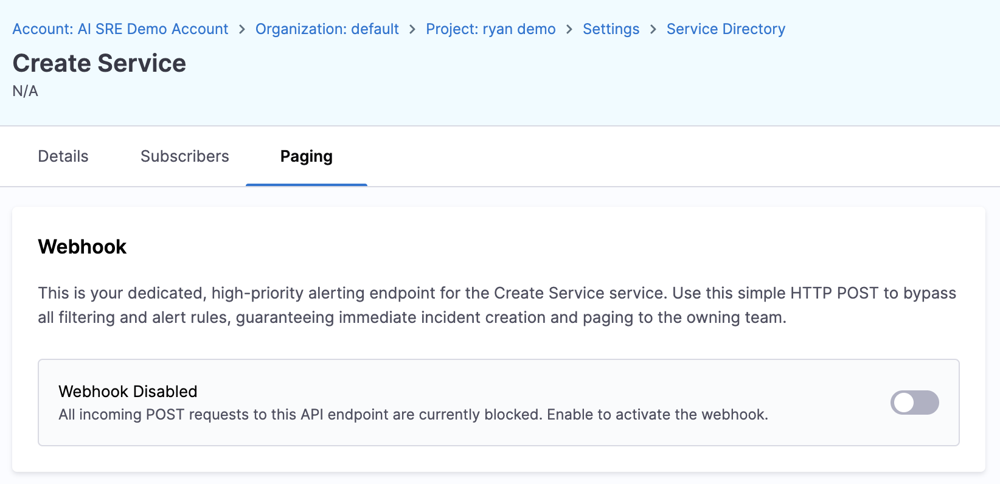
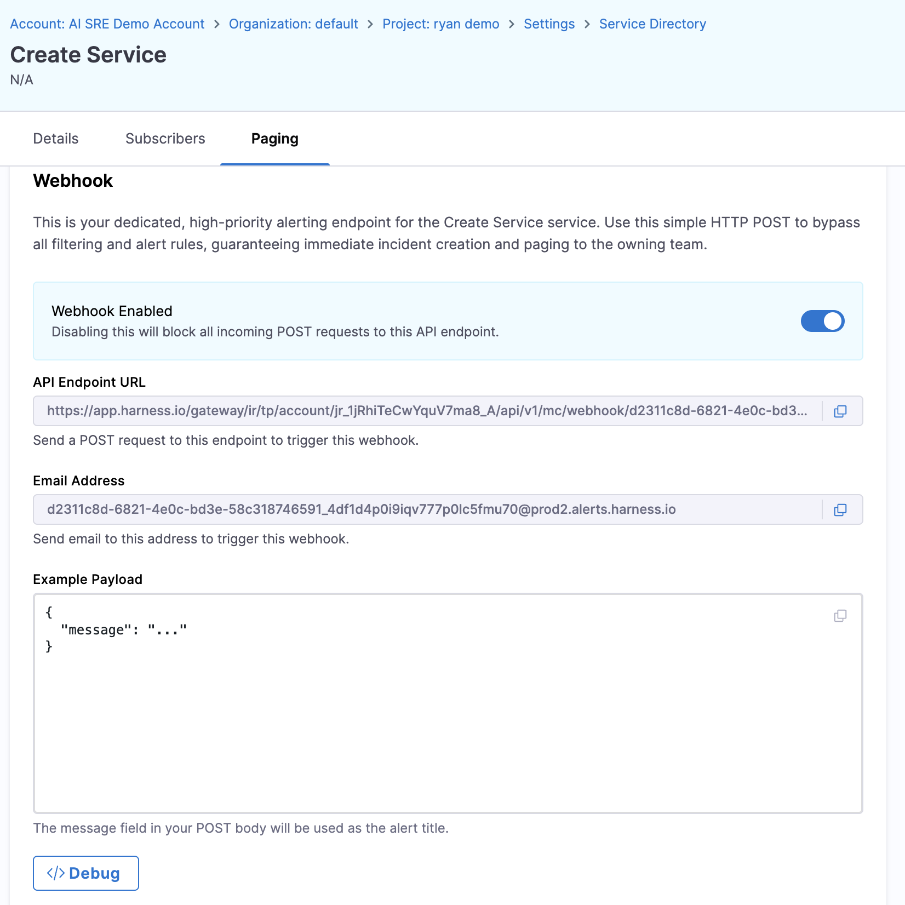

# Configure Service Paging Webhooks

Service paging webhooks enable external monitoring tools, legacy systems, and custom applications to trigger on-call notifications by sending alerts directly to a service. Each service can have a dedicated paging webhook that automatically creates alerts and pages the on-call team.

## Overview

The service paging webhook provides two integration methods:

- **HTTP POST**: Send JSON payloads via HTTP to a unique webhook URL
- **Email**: Send alerts via email to a unique service email address

When an alert is received via either method, the system automatically:

1. Creates an alert with the provided title and description
2. Routes the alert to the service's assigned team
3. Pages responders according to the service's escalation policy

## How It Works

When you enable a paging webhook on a service, the system atomically creates three components:

1. **Webhook**: A unique URL and authentication key for receiving alerts
2. **Alert template**: A system-controlled template that defines how incoming data maps to alert fields
3. **Alert rule**: An always-true condition that automatically pages the service when any alert arrives

This setup ensures that every alert sent to the webhook immediately triggers the configured escalation policy.

### Alert Field Mapping

The paging webhook accepts these fields:

| Field | Description | Default Value |
|-------|-------------|---------------|
| `message` | Alert title (required) | None |
| `email_text` | Alert description (optional) | Empty string |
| `priority` | Alert priority | `p1_critical` |
| `status` | Alert status | `triggered` |
| `created_at` | Alert creation timestamp | Current time |
| `started_at` | Alert start timestamp | Current time |

## Enable Service Paging Webhook

### Prerequisites

- **Service configured**: The service must exist in the Service Directory
- **Team assigned**: The service must have a team and escalation policy configured
- **On-call schedule**: The team must have an active on-call schedule

### Enable the Webhook

1. Navigate to **Project Settings** → **Service Directory (AI SRE)**.
2. Select the service you want to configure.
3. In the **Paging** tab, enable the webhook.

4. The system creates the webhook, alert template, and alert rule automatically.

5. Copy the **Webhook URL** and **Email Address** displayed in the UI.

The webhook is now active and ready to receive alerts.

:::info One Webhook Per Service
Each service supports one paging webhook. Attempting to enable a second webhook on the same service will refresh the existing webhook configuration rather than creating a new one.
:::

## Using the HTTP Webhook

### Webhook URL Format

The webhook URL follows this format:

```
https://app.harness.io/api/v1/webhook/{webhookId}?key={key}
```

- **webhookId**: Unique identifier for the webhook
- **key**: Authentication key (acts as a bearer token)

### HTTP Request Format

Send a POST request with a JSON body:

**Endpoint:**
```
POST https://app.harness.io/api/v1/webhook/{webhookId}?key={key}
```

**Headers:**
```
Content-Type: application/json
```

**Body:**
```json
{
  "message": "High CPU usage on production-api",
  "email_text": "CPU usage has exceeded 90% for the past 5 minutes. 
Service: production-api, Host: api-server-01, Current value: 95.2%"
}
```

### Example: cURL

```bash
curl -X POST 'https://app.harness.io/api/v1/webhook/abc123?key=xyz789' \
  -H 'Content-Type: application/json' \
  -d '{
    "message": "Database connection pool exhausted",
    "email_text": "Service: payment-service, Environment: production, 
Connection pool: 100/100 connections in use, 
Timeout errors detected"
  }'
```

### Example: Python

```python
import requests

webhook_url = "https://app.harness.io/api/v1/webhook/abc123?key=xyz789"
payload = {
    "message": "API latency spike detected",
    "email_text": "Service: user-api, 
P99 latency: 2500ms (threshold: 500ms), Region: us-east-1"
}

response = requests.post(webhook_url, json=payload)
print(f"Status: {response.status_code}")
```

### Example: Shell Script

```bash
#!/bin/bash

WEBHOOK_URL="https://app.harness.io/api/v1/webhook/abc123?key=xyz789"
MESSAGE="Service health check failed"
DETAILS="Service: auth-service, Health endpoint returned 503, 
Last successful check: 2 minutes ago"

curl -X POST "$WEBHOOK_URL" \
  -H "Content-Type: application/json" \
  -d "{\"message\":\"$MESSAGE\",\"email_text\":\"$DETAILS\"}"
```

## Using the Email Integration

Each service paging webhook includes a unique email address. Sending an email to this address triggers the same paging flow as the HTTP webhook.

### Email Address Format

The email address follows this format:

```
{webhookId}_{key}@{domain}
```

Example: `abc123_xyz789@alerts.harness.io`

### Email Field Mapping

- **Email subject**: Maps to alert `message` (title)
- **Email body**: Maps to alert `email_text` (description)

### Example: Send Alert via Email

**To:** `abc123_xyz789@alerts.harness.io`  
**Subject:** `High memory usage on staging-db`  
**Body:**
```
Memory usage on staging-db has exceeded 85% for the past 10 minutes.

Host: db-staging-01
Current memory usage: 7.2 GB / 8 GB
Swap usage: 1.5 GB
Database: PostgreSQL 14.5

Action required: Investigate query performance and consider scaling.
```

This email creates an alert with:
- **Title:** "High memory usage on staging-db"
- **Description:** (email body text)
- **Priority:** `p1_critical` (default)
- **Status:** `triggered` (default)

### Email Size Limits

- **Maximum email size**: 10 MB (raw email)
- **Passthrough without truncation**: 96 KB
- **Text body truncation**: 32,000 characters
- **Maximum after processing**: 2 MB

Emails exceeding these limits are rejected or truncated.

### Reply Handling

Emails containing an `In-Reply-To` header are ignored. Only new emails (not replies) create alerts. This prevents duplicate alerts when someone replies to an alert notification.

## Use Cases

### External Monitoring Tools

**Scenario:** Datadog monitors detect an issue but you want alerts routed through Harness AI SRE for unified on-call management.

**Solution:** Configure Datadog webhook notifications to send alerts to the service paging webhook URL.

### Legacy Systems

**Scenario:** An older monitoring system only supports email-based alerting.

**Solution:** Configure the system to send alert emails to the service's unique email address.

### Custom Monitoring Scripts

**Scenario:** Internal health checks run as cron jobs and need to page on-call when failures are detected.

**Solution:** Use cURL or a scripting language to POST to the webhook URL when checks fail.

### Third-Party Tools Without Native Integration

**Scenario:** A SaaS tool lacks a direct Harness integration but supports webhooks or email notifications.

**Solution:** Configure the tool to send webhooks or emails to the service paging endpoint.

## Disable or Refresh a Paging Webhook

### Disable the Webhook

1. Navigate to **Project Settings** → **Service Directory (AI SRE)**.
2. Select the service.
3. Click **Disable Paging Webhook**.

**What happens:**
- The webhook is set to **quiet mode** (does not create alerts)
- The webhook URL and email address remain valid but inactive
- The webhook is **not deleted** from the system

You can re-enable the webhook later to restore paging.

### Refresh the Webhook

Re-enabling a webhook refreshes its configuration and removes quiet mode. This is useful if you need to update the webhook manifest or restore paging after disabling it.

1. Navigate to **Project Settings** → **Service Directory (AI SRE)**.
2. Select the service.
3. Click **Enable Paging Webhook** (if currently disabled).

**What happens:**
- The webhook manifest is regenerated
- Quiet mode is removed
- The webhook resumes creating alerts and paging responders

## Debug and Monitor Webhooks

### Service Paging Webhook Debug Drawer

The Service Directory UI includes a **Debug Drawer** that shows:

- **Webhook status**: Enabled, disabled, or quiet mode
- **Recent activity**: List of recent alerts received via the webhook
- **Webhook URL and email address**: Copy for external systems
- **Test webhook**: Send a test alert to verify configuration

### Viewing Webhook Activity

1. Navigate to **Project Settings** → **Service Directory (AI SRE)**.
2. Select the service.
3. Click **Debug** in the lower left corner of the dialog.

4. Review recent alerts and their status.

## Best Practices

### For Administrators

- **Test before production**: Send test alerts to verify the webhook works before configuring external systems.
- **Document webhook URLs**: Store webhook URLs and email addresses in a secure location (password manager, secrets vault).
- **Monitor webhook health**: Use the debug drawer to check for recent activity and ensure alerts are flowing correctly.
- **Align with escalation policies**: Ensure the service has a valid team and escalation policy before enabling the webhook.
- **Use quiet mode for maintenance**: Disable webhooks temporarily during maintenance windows to prevent unnecessary pages.

### For External System Integrations

- **Include context**: Provide detailed alert descriptions with service name, environment, and affected resources.
- **Use consistent formatting**: Structure email subjects and webhook payloads consistently for easier troubleshooting.
- **Avoid reply emails**: Configure external systems to send new emails only (not replies) to prevent ignored alerts.
- **Rate limiting**: Avoid sending excessive alerts to the same webhook (group similar alerts when possible).
- **Monitor delivery**: Log webhook POST requests in external systems to track delivery success.

### Security Considerations

- **Keep keys confidential**: The webhook key acts as an authentication token. Do not commit keys to version control.
- **Use HTTPS only**: Webhook URLs use HTTPS. Do not downgrade to HTTP.
- **Rotate keys periodically**: Disable and re-enable webhooks to refresh keys if they are compromised.
- **Restrict email senders**: Configure external systems to send emails from trusted addresses only.

## Troubleshooting

<details>
<summary><strong>Webhook returns 401 Unauthorized</strong></summary>

**Possible causes:**
- Incorrect webhook key in the URL
- Webhook was disabled or deleted

**Resolution:**
1. Verify the webhook URL and key match what is displayed in the Service Directory
2. Check if the webhook is enabled (not in quiet mode)
3. If the key is incorrect, disable and re-enable the webhook to refresh it

</details>

<details>
<summary><strong>Emails sent to the service address are not creating alerts</strong></summary>

**Possible causes:**
- Email exceeds size limits (10 MB max)
- Email is a reply (contains `In-Reply-To` header)
- Webhook is disabled or in quiet mode
- Email address is incorrect

**Resolution:**
1. Verify the email address matches the format shown in the Service Directory
2. Confirm the email is a new message (not a reply)
3. Check email size (should be under 10 MB raw, 2 MB after processing)
4. Ensure the webhook is enabled

</details>

<details>
<summary><strong>Webhook creates alerts but no one gets paged</strong></summary>

**Possible causes:**
- Service does not have a team assigned
- Team does not have an escalation policy
- No one is on-call in the escalation policy

**Resolution:**
1. Navigate to **Project Settings** → **Service Directory (AI SRE)**.
2. Verify the service has a team assigned
3. Verify the team has an escalation policy
4. Check the escalation policy has an active on-call schedule
5. Confirm someone is on-call during the current time period

</details>

<details>
<summary><strong>Cannot enable webhook (error or no button visible)</strong></summary>

**Possible causes:**
- Service already has a webhook enabled
- Insufficient permissions
- Service is not properly configured

**Resolution:**
1. Check if the webhook is already enabled (look for webhook URL displayed)
2. Verify you have admin permissions for the organization
3. Ensure the service has a team and escalation policy configured

</details>

## Next Steps

- Go to [Integrate with the Service Directory](/docs/ai-sre/oncall/integrate-service-directory) to configure service-to-team mappings.
- Go to [Define Escalation Policies](/docs/ai-sre/oncall/define-escalation-policies) to set up on-call routing.
- Go to [Configure Alert Rules](/docs/ai-sre/oncall/configure-alert-rules) to create advanced alert routing logic.
- Go to [Configure Webhooks](/docs/ai-sre/alerts/webhooks) for general webhook configuration beyond service paging.
