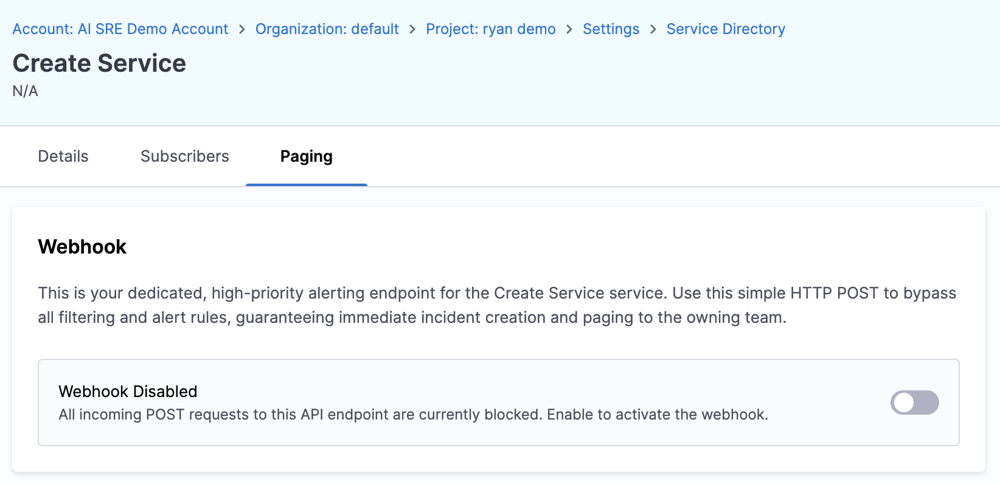
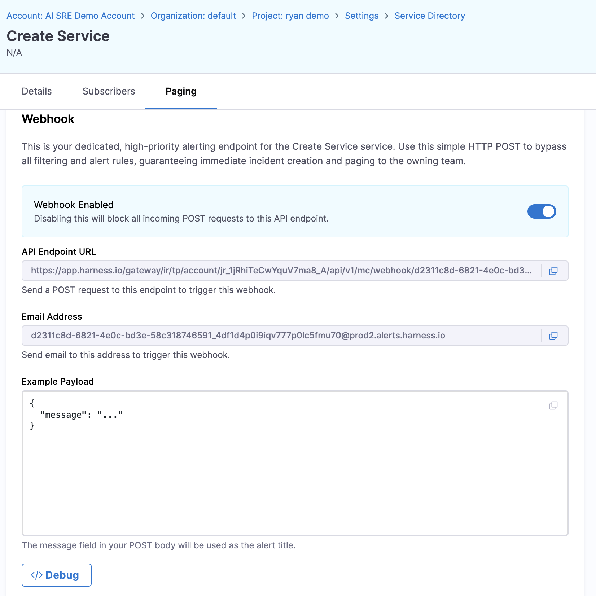

import { Troubleshoot } from '@site/src/components/AdaptiveAIContent';

Service paging webhooks enable external monitoring tools, legacy systems, and custom applications to trigger on-call notifications by sending alerts directly to a service. Each service can have a dedicated paging webhook that automatically creates alerts and pages the on-call User Group.

## Overview

The service paging webhook provides two integration methods:

- **HTTP POST:** Send JSON payloads over HTTP to a unique webhook URL.
- **Email:** Send alerts by email to a unique service email address.

When an alert is received through either method, the system automatically:

1. Creates an alert with the provided title and description.
2. Routes the alert to the service's assigned User Group.
3. Pages responders according to the service's escalation policy.

---

## How it works

When you enable a paging webhook on a service, the system atomically creates three components:

1. **Webhook:** A unique URL and authentication key for receiving alerts.
2. **Alert template:** A system-controlled template that defines how incoming data maps to alert fields.
3. **Alert rule:** An always-true condition that automatically pages the service when any alert arrives.

This setup ensures that every alert sent to the webhook immediately triggers the configured escalation policy.

### Alert fields

The paging webhook accepts these fields:

| Field | Description | Default Value |
|-------|-------------|---------------|
| `message` | Alert title (required) | None |
| `email_text` | Alert description (optional) | Empty string |
| `priority` | Alert priority | `p1_critical` |
| `status` | Alert status | `triggered` |
| `created_at` | Alert creation timestamp | Current time |
| `started_at` | Alert start timestamp | Current time |

---

## Enable a service paging webhook

### Before you begin

- **Service configured:** The service must exist in the Service Directory.
- **User Group assigned:** The service must have an owning User Group and escalation policy configured.
- **On-call schedule:** The User Group must have an active on-call schedule.

### Enable the webhook

Enable paging on a service to generate its webhook and email endpoint:

1. Navigate to **Project Settings** → **Service Directory (AI SRE)**.
2. Select the service you want to configure.
3. In the **Paging** tab, enable the webhook.

4. The system creates the webhook, alert template, and alert rule automatically.

5. Copy the **Webhook URL** and **Email Address** displayed in the UI.

The webhook is now active and ready to receive alerts.

:::info One webhook per service
Each service supports one paging webhook. Attempting to enable a second webhook on the same service refreshes the existing webhook configuration rather than creating a new one.
:::

---

## Use the HTTP webhook

### Webhook URL format

The webhook URL follows this format:

```text
https://app.harness.io/api/v1/webhook/{webhookId}?key={key}
```

- **webhookId:** Unique identifier for the webhook.
- **key:** Authentication key (acts as a bearer token).

### HTTP request format

Send a POST request with a JSON body:

**Endpoint:**
```text
POST https://app.harness.io/api/v1/webhook/{webhookId}?key={key}
```

**Headers:**
```text
Content-Type: application/json
```

**Body:**
```json
{
  "message": "High CPU usage on production-api",
  "email_text": "CPU usage has exceeded 90% for the past 5 minutes. 
Service: production-api, Host: api-server-01, Current value: 95.2%"
}
```

### Example: cURL

```bash
curl -X POST 'https://app.harness.io/api/v1/webhook/abc123?key=xyz789' \
  -H 'Content-Type: application/json' \
  -d '{
    "message": "Database connection pool exhausted",
    "email_text": "Service: payment-service, Environment: production, 
Connection pool: 100/100 connections in use, 
Timeout errors detected"
  }'
```

### Example: Python

```python
import requests

webhook_url = "https://app.harness.io/api/v1/webhook/abc123?key=xyz789"
payload = {
    "message": "API latency spike detected",
    "email_text": "Service: user-api, 
P99 latency: 2500ms (threshold: 500ms), Region: us-east-1"
}

response = requests.post(webhook_url, json=payload)
print(f"Status: {response.status_code}")
```

### Example: shell script

```bash
#!/bin/bash

WEBHOOK_URL="https://app.harness.io/api/v1/webhook/abc123?key=xyz789"
MESSAGE="Service health check failed"
DETAILS="Service: auth-service, Health endpoint returned 503, 
Last successful check: 2 minutes ago"

curl -X POST "$WEBHOOK_URL" \
  -H "Content-Type: application/json" \
  -d "{\"message\":\"$MESSAGE\",\"email_text\":\"$DETAILS\"}"
```

---

## Use the email integration

Each service paging webhook includes a unique email address. Sending an email to this address triggers the same paging flow as the HTTP webhook.

### Email address format

The email address follows this format:

```text
{webhookId}_{key}@{domain}
```

Example: `abc123_xyz789@alerts.harness.io`

### Email fields

Email components map to alert fields as follows:

- **Email subject:** Maps to the alert `message` (title).
- **Email body:** Maps to the alert `email_text` (description).

### Example: send an alert by email

**To:** `abc123_xyz789@alerts.harness.io`
**Subject:** `High memory usage on staging-db`
**Body:**
```text
Memory usage on staging-db has exceeded 85% for the past 10 minutes.

Host: db-staging-01
Current memory usage: 7.2 GB / 8 GB
Swap usage: 1.5 GB
Database: PostgreSQL 14.5

Action required: Investigate query performance and consider scaling.
```

This email creates an alert with:

- **Title:** "High memory usage on staging-db"
- **Description:** (email body text)
- **Priority:** `p1_critical` (default)
- **Status:** `triggered` (default)

### Email size limits

The email integration enforces the following size limits:

- **Maximum email size:** 10 MB (raw email)
- **Passthrough without truncation:** 96 KB
- **Text body truncation:** 32,000 characters
- **Maximum after processing:** 2 MB

Emails exceeding these limits are rejected or truncated.

### How replies are handled

Emails containing an `In-Reply-To` header are ignored. Only new emails (not replies) create alerts. This prevents duplicate alerts when someone replies to an alert notification.

---

## Use cases

### External monitoring tools

**Scenario:** Datadog monitors detect an issue but you want alerts routed through Harness AI SRE for unified on-call management.

**Solution:** Configure Datadog webhook notifications to send alerts to the service paging webhook URL.

### Legacy systems

**Scenario:** An older monitoring system only supports email-based alerting.

**Solution:** Configure the system to send alert emails to the service's unique email address.

### Custom monitoring scripts

**Scenario:** Internal health checks run as cron jobs and need to page on-call when failures are detected.

**Solution:** Use cURL or a scripting language to POST to the webhook URL when checks fail.

### Third-party tools without native integration

**Scenario:** A SaaS tool lacks a direct Harness integration but supports webhooks or email notifications.

**Solution:** Configure the tool to send webhooks or emails to the service paging endpoint.

---

## Disable or refresh a paging webhook

### Disable the webhook

Disable paging to place the webhook in quiet mode without deleting it:

1. Navigate to **Project Settings** → **Service Directory (AI SRE)**.
2. Select the service.
3. Click **Disable Paging Webhook**.

**What happens:**

- The webhook is set to **quiet mode** (does not create alerts).
- The webhook URL and email address remain valid but inactive.
- The webhook is **not deleted** from the system.

You can re-enable the webhook later to restore paging.

### Refresh the webhook

Re-enabling a webhook refreshes its configuration and removes quiet mode. This is useful if you need to update the webhook manifest or restore paging after disabling it.

1. Navigate to **Project Settings** → **Service Directory (AI SRE)**.
2. Select the service.
3. Click **Enable Paging Webhook** (if currently disabled).

**What happens:**

- The webhook manifest is regenerated.
- Quiet mode is removed.
- The webhook resumes creating alerts and paging responders.

---

## Debug and monitor webhooks

### Service paging webhook debug drawer

The Service Directory UI includes a **Debug Drawer** that shows:

- **Webhook status:** Enabled, disabled, or quiet mode.
- **Recent activity:** List of recent alerts received through the webhook.
- **Webhook URL and email address:** Copy for external systems.
- **Test webhook:** Send a test alert to verify configuration.

### View webhook activity

Open the debug drawer to review recent alerts received through the webhook:

1. Navigate to **Project Settings** → **Service Directory (AI SRE)**.
2. Select the service.
3. Click **Debug** in the lower left corner of the dialog.

4. Review recent alerts and their status.

---

## Best practices

### For administrators

Follow these practices when you enable and manage paging webhooks:

- **Test before production:** Send test alerts to verify the webhook works before configuring external systems.
- **Document webhook URLs:** Store webhook URLs and email addresses in a secure location (password manager, secrets vault).
- **Monitor webhook health:** Use the debug drawer to check for recent activity and ensure alerts are flowing correctly.
- **Align with escalation policies:** Ensure the service has a valid User Group and escalation policy before enabling the webhook.
- **Use quiet mode for maintenance:** Disable webhooks temporarily during maintenance windows to prevent unnecessary pages.

### For external system integrations

Follow these practices when you connect external tools to a webhook:

- **Include context:** Provide detailed alert descriptions with service name, environment, and affected resources.
- **Use consistent formatting:** Structure email subjects and webhook payloads consistently for easier troubleshooting.
- **Avoid reply emails:** Configure external systems to send new emails only (not replies) to prevent ignored alerts.
- **Apply rate limiting:** Avoid sending excessive alerts to the same webhook (group similar alerts when possible).
- **Monitor delivery:** Log webhook POST requests in external systems to track delivery success.

### Security considerations

Follow these practices to keep webhook credentials secure:

- **Keep keys confidential:** The webhook key acts as an authentication token. Do not commit keys to version control.
- **Use HTTPS only:** Webhook URLs use HTTPS. Do not downgrade to HTTP.
- **Rotate keys periodically:** Disable and re-enable webhooks to refresh keys if they are compromised.
- **Restrict email senders:** Configure external systems to send emails from trusted addresses only.

---

## Troubleshooting

<Troubleshoot
  issue="Service paging webhook returns 401 Unauthorized"
  mode="docs"
  fallback="Verify the webhook URL and key match what is displayed in the Service Directory, confirm the webhook is enabled and not in quiet mode, and disable then re-enable the webhook to refresh the key if it is incorrect."
/>

<Troubleshoot
  issue="Emails sent to the service paging address are not creating alerts"
  mode="docs"
  fallback="Verify the email address matches the format shown in the Service Directory, confirm the email is a new message and not a reply, check the email is under the size limits, and ensure the webhook is enabled."
/>

<Troubleshoot
  issue="Service paging webhook creates alerts but no one gets paged"
  mode="docs"
  fallback="Confirm the service has an owning User Group with an escalation policy, verify the escalation policy has an active on-call schedule, and confirm someone is on-call during the current time period."
/>

<Troubleshoot
  issue="Cannot enable a service paging webhook (error or no button visible)"
  mode="docs"
  fallback="Check whether the webhook is already enabled, verify you have admin permissions for the organization, and ensure the service has an owning User Group and escalation policy configured."
/>

---

## Next steps

- Go to [Integrate with the Service Directory](/docs/ai-sre/oncall/integrate-service-directory) to configure service-to-team mappings.
- Go to [Configure Escalation Policies](/docs/ai-sre/oncall/define-escalation-policies) to set up on-call routing.
- Go to [Route Alerts](/docs/ai-sre/oncall/configure-alert-rules) to create advanced alert routing logic.
- Go to [Configure Webhooks](/docs/ai-sre/alerts/webhooks/overview) to configure general webhooks beyond service paging.
