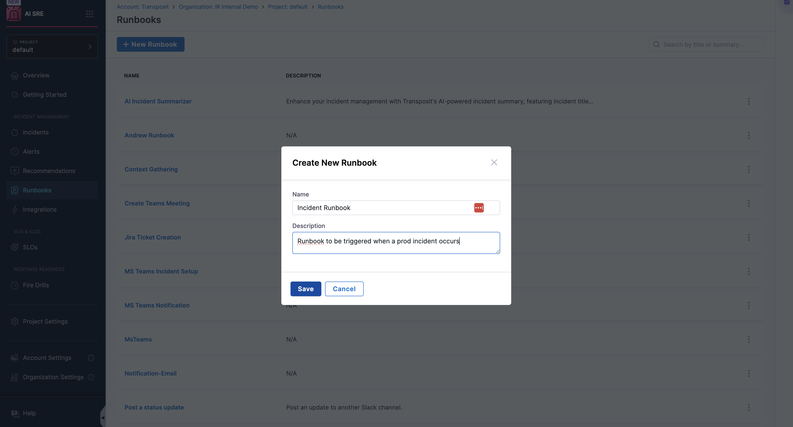
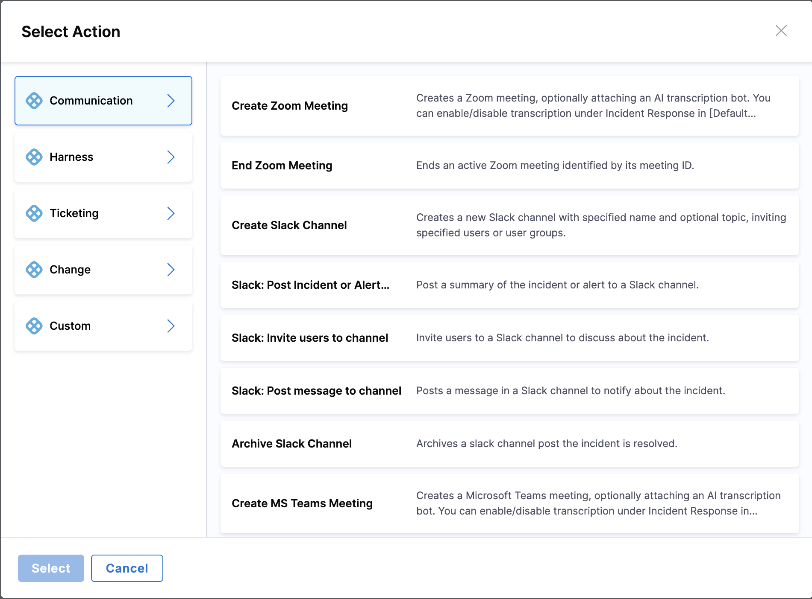
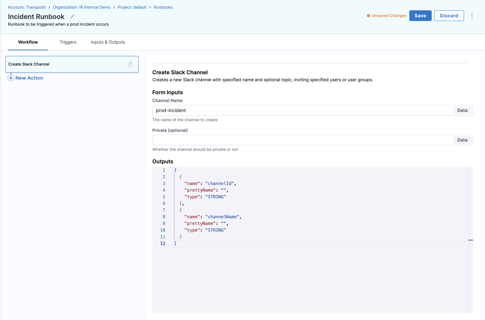
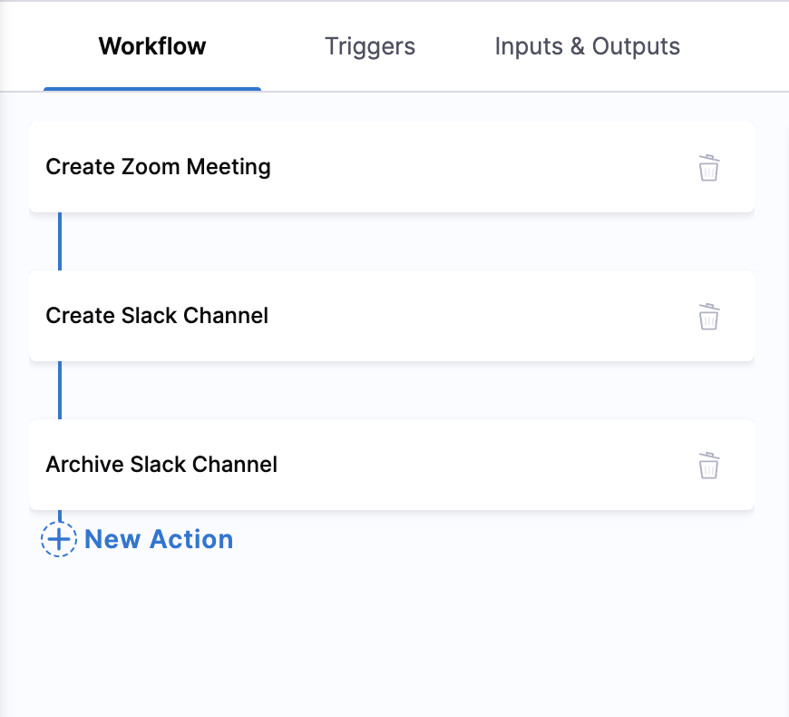
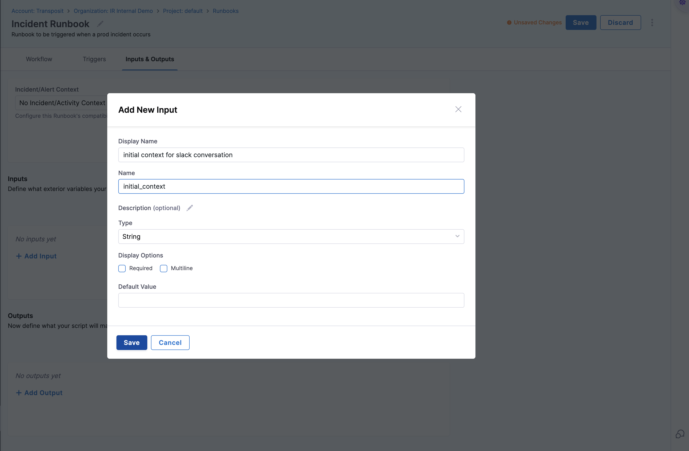
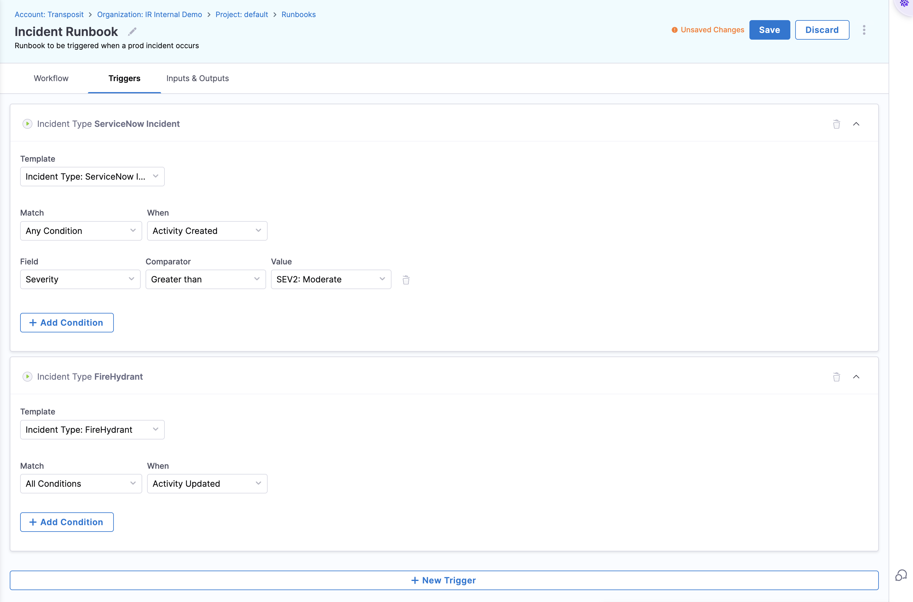
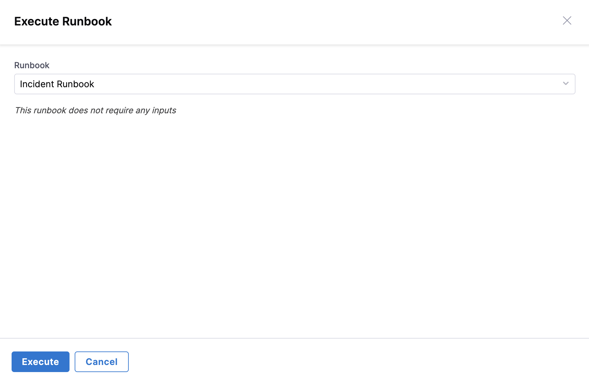

# Create a Runbook

Runbooks in Harness AI SRE enable you to automate incident response workflows, operational procedures, and remediation actions. This comprehensive guide walks you through creating, configuring, and deploying effective runbooks that can significantly reduce mean time to resolution (MTTR) and improve your team's operational efficiency.

## Before You Begin

### Prerequisites

Ensure you have the following before creating your first runbook:

- **Platform Access**: Active Harness AI SRE account with appropriate permissions
- **User Permissions**: Required Account, Organisation and Project level permissions
- **Integration Access**: Configured integrations for the tools you plan to use (Slack, Jira, ServiceNow, etc.)
- **Monitoring Setup**: Alert sources configured (Datadog, New Relic, PagerDuty, etc.)

### Key Concepts

Before diving into runbook creation, familiarize yourself with these core concepts:

- **Actions**: Individual tasks or operations within a runbook (notifications, API calls, pipeline executions)
- **Triggers**: Conditions that automatically initiate runbook execution
- **Variables**: Dynamic values that can be passed between actions and customized per execution
- **Sequences**: The order in which actions are executed within your workflow

## Step 1: Initialize Your Runbook

### Create a New Runbook

1. **Navigate to Runbooks**: Go to **AI SRE** → **Runbooks** in your Harness platform
2. **Start Creation**: Click **+ New Runbook** to begin the creation process
3. **Basic Information**: Provide essential details for your runbook:
   - **Name**: Use a descriptive name (e.g., "High CPU Alert Response", "Database Connection Recovery")
   - **Description**: Clearly explain the runbook's purpose and when it should be used
   - **Tags**: Add relevant tags for easy categorization and discovery

### Design Your Workflow

Once your runbook is created, you'll enter the workflow designer where you can build your automation sequence.

#### 1. Add Actions to Your Workflow

Actions are the building blocks of your runbook. Each action performs a specific task in your incident response or operational workflow.

**Common Action Types:**
- **Communication**: Send notifications, create channels, start meetings
- **Ticketing**: Create incidents, update status, assign teams
- **Automation**: Execute pipelines, run scripts, trigger deployments
- **Monitoring**: Query metrics, check service health, validate fixes

#### 2. Configure Action Parameters

Each action requires specific configuration to function correctly. Parameters vary by action type but typically include:

**Example: Slack Channel Creation**
- **Channel Name**: Use variables like `${incident.id}` for dynamic naming
- **Channel Description**: Provide context about the incident or operation
- **Initial Members**: Automatically invite relevant team members
- **Channel Settings**: Configure privacy, archiving, and notification preferences

#### 3. Arrange Action Sequences

The order of actions is crucial for effective runbook execution. Drag and drop actions to create logical sequences.

**Best Practices for Sequencing:**
- **Immediate Response**: Start with critical notifications and incident creation
- **Information Gathering**: Follow with diagnostic and monitoring actions
- **Remediation**: Execute fix actions based on gathered information
- **Validation**: Verify that remediation was successful
- **Closure**: Update stakeholders and close incidents

#### 4. Define Workflow Variables

Variables make your runbooks dynamic and reusable across different scenarios.

**Variable Types:**
- **Input Variables**: Values provided when the runbook is triggered
- **Output Variables**: Results from action executions
- **System Variables**: Automatically populated values (timestamps, user info)
- **Custom Variables**: User-defined values for specific use cases

## Step 2: Available Actions and Integrations

Harness AI SRE provides a comprehensive library of pre-built actions across multiple categories. Choose the right combination of actions to build effective automation workflows.

### Communication & Collaboration Tools

Establish immediate communication channels and keep stakeholders informed throughout incident resolution.

#### **[Slack Integration](./integrations/slack.md)**
- **Send Notifications**: Broadcast alerts to channels or direct messages
- **Create Channels**: Automatically create incident-specific channels
- **Start Threads**: Organize discussions and updates
- **Update Channel Topics**: Provide real-time status updates
- **Archive Channels**: Clean up after incident resolution

#### **[Microsoft Teams Integration](./integrations/teams.md)**
- **Team Notifications**: Send alerts to specific teams or channels
- **Status Updates**: Post progress updates and resolution status
- **File Sharing**: Attach logs, screenshots, or diagnostic reports
- **Meeting Integration**: Schedule or start emergency calls

#### **[Zoom Integration](./integrations/zoom.md)**
- **Create Meetings**: Instantly set up incident response calls
- **Manage Participants**: Add or remove attendees dynamically
- **Recording Control**: Start/stop recordings for post-incident analysis
- **Breakout Rooms**: Organize team discussions during complex incidents

### Incident Response & Ticketing Systems

Automate incident tracking, assignment, and resolution workflows across your preferred ticketing platforms.

#### **[Jira Integration](./integrations/jira.md)**
- **Issue Creation**: Automatically create tickets with relevant context
- **Status Updates**: Progress incidents through workflow states
- **Assignment Management**: Route tickets to appropriate teams
- **Comment Threading**: Add investigation notes and resolution steps
- **Custom Fields**: Populate incident-specific metadata

#### **[ServiceNow Integration](./integrations/servicenow.md)**
- **Incident Management**: Create and manage ServiceNow incidents
- **Change Requests**: Initiate emergency or standard changes
- **Knowledge Base**: Query and update resolution procedures
- **Asset Management**: Link incidents to affected configuration items
- **SLA Tracking**: Monitor and report on resolution timeframes

### Automation & Pipeline Execution

Execute remediation actions, deploy fixes, and trigger operational workflows.

#### **[Harness Pipelines Integration](./integrations/harness-pipelines.md)**
- **Pipeline Execution**: Trigger deployment or remediation pipelines
- **Notification Delivery**: Send pipeline status updates
- **Artifact Management**: Deploy specific versions or rollback changes
- **Environment Management**: Manage infrastructure scaling or configuration
- **Approval Workflows**: Route critical changes through approval processes

### Monitoring & Observability

Integrate with your monitoring stack to gather context and validate remediation efforts.

#### **Custom HTTP Actions**
- **API Calls**: Execute custom REST API requests
- **Webhook Triggers**: Notify external systems of runbook execution
- **Data Retrieval**: Fetch metrics, logs, or configuration data
- **System Commands**: Execute remote commands or scripts

## Step 3: Configure Triggers

Triggers determine when and how your runbooks execute automatically. Proper trigger configuration ensures your runbooks respond to the right conditions at the right time.

### Setting Up Triggers

1. **Access Trigger Configuration**: Click the **Triggers** tab in your runbook editor
2. **Choose Trigger Type**: Select from available trigger sources
3. **Define Conditions**: Set specific criteria for runbook activation
4. **Test Triggers**: Validate trigger logic before deployment

### Trigger Types

#### **Alert-Based Triggers**
Automatically execute runbooks when specific alerts are received:
- **Alert Patterns**: Match alerts based on severity, source, or content
- **Service Impacts**: Trigger based on affected services or components
- **Threshold Conditions**: Activate when metrics exceed defined limits
- **Time-Based Rules**: Consider time windows, business hours, or maintenance periods

#### **Manual Triggers**
Allow team members to execute runbooks on-demand:
- **One-Click Execution**: Simple button-based activation
- **Parameterized Execution**: Prompt for input variables before execution
- **Role-Based Access**: Control who can manually trigger specific runbooks

#### **Scheduled Triggers**
Execute runbooks on a regular schedule for maintenance or monitoring:
- **Cron Expressions**: Define complex scheduling patterns
- **Recurring Tasks**: Set up daily, weekly, or monthly executions
- **Maintenance Windows**: Align with planned maintenance schedules

### Trigger Configuration Best Practices

- **Avoid Trigger Overlap**: Ensure multiple runbooks don't trigger simultaneously for the same event
- **Use Appropriate Delays**: Add delays between related triggers to prevent conflicts
- **Test Thoroughly**: Validate trigger conditions in non-production environments
- **Monitor Execution**: Track trigger effectiveness and adjust conditions as needed

## Step 4: Test Your Runbook

Thorough testing is essential before deploying runbooks to production. A well-tested runbook prevents failures during critical incidents and ensures reliable automation.

### Pre-Production Testing

#### **1. Environment Preparation**
- **Test Environment**: Set up a dedicated testing environment that mirrors production
- **Test Data**: Prepare realistic test scenarios and data sets
- **Integration Sandboxes**: Use test instances of integrated tools (Slack, Jira, etc.)
- **Mock Services**: Create mock endpoints for external dependencies

#### **2. Functional Testing**
- **Action Validation**: Verify each action executes correctly with expected parameters
- **Sequence Testing**: Confirm actions execute in the correct order
- **Variable Passing**: Validate that variables are correctly passed between actions
- **Error Handling**: Test failure scenarios and error recovery mechanisms

#### **3. Integration Testing**
- **Notification Delivery**: Confirm all notifications reach intended recipients
- **Pipeline Executions**: Verify that triggered pipelines complete successfully
- **API Responses**: Check that external API calls return expected results
- **Authentication**: Ensure all integrations authenticate properly

#### **4. End-to-End Testing**
- **Complete Workflows**: Execute full runbook scenarios from trigger to completion
- **Multiple Scenarios**: Test various input combinations and edge cases
- **Performance Testing**: Measure execution times and resource usage
- **Concurrent Execution**: Test behavior when multiple instances run simultaneously

### Testing Checklist

- [ ] All actions execute without errors
- [ ] Notifications are delivered to correct channels/recipients
- [ ] Variables are properly populated and passed
- [ ] External integrations respond as expected
- [ ] Error conditions are handled gracefully
- [ ] Execution logs provide sufficient detail for troubleshooting
- [ ] Performance meets acceptable thresholds
- [ ] Security permissions are correctly enforced

## Step 5: Deploy and Monitor

Once testing is complete, deploy your runbook to production and establish monitoring to ensure continued effectiveness.

### Deployment Process

1. **Final Review**: Conduct a final review of runbook configuration and testing results
2. **Stakeholder Approval**: Obtain necessary approvals from team leads or security teams
3. **Production Deployment**: Activate the runbook in your production environment
4. **Documentation Update**: Update operational documentation with runbook details
5. **Team Training**: Ensure relevant team members understand the new automation

### Post-Deployment Monitoring

- **Execution Metrics**: Track success rates, execution times, and failure patterns
- **Alert Effectiveness**: Monitor whether runbooks are triggered appropriately
- **Performance Impact**: Assess the impact on incident resolution times
- **User Feedback**: Gather feedback from team members using the runbooks

## Best Practices for Runbook Creation

### Design Principles

- **Start Simple**: Begin with basic workflows and gradually add complexity as you gain experience
- **Modular Design**: Create reusable actions and workflows that can be combined for different scenarios
- **Clear Naming**: Use descriptive names for runbooks, actions, and variables that clearly indicate their purpose
- **Comprehensive Documentation**: Document expected outcomes, prerequisites, and troubleshooting steps

### Operational Excellence

- **Stakeholder Inclusion**: Ensure appropriate team members are notified and involved in incident response
- **Error Handling**: Implement robust error handling and fallback procedures for critical actions
- **Regular Updates**: Review and update runbooks regularly to reflect changes in infrastructure and processes
- **Version Control**: Maintain version history and change logs for all runbook modifications

### Security and Compliance

- **Least Privilege**: Grant minimum necessary permissions for runbook execution
- **Audit Logging**: Ensure all runbook executions are logged for compliance and troubleshooting
- **Sensitive Data**: Protect sensitive information using secure variable storage
- **Access Control**: Implement appropriate role-based access controls for runbook management

### Performance Optimization

- **Parallel Execution**: Use parallel action execution where possible to reduce overall runtime
- **Resource Management**: Monitor resource usage and optimize for efficiency
- **Timeout Configuration**: Set appropriate timeouts to prevent runbooks from hanging indefinitely
- **Conditional Logic**: Use conditional statements to avoid unnecessary action execution

## Troubleshooting Common Issues

### Execution Failures

**Problem**: Runbook actions fail to execute
- **Solution**: Check integration credentials and network connectivity
- **Prevention**: Implement health checks and credential rotation

**Problem**: Variables not passing between actions
- **Solution**: Verify variable names and data types match expectations
- **Prevention**: Use consistent naming conventions and validate variable mappings

### Performance Issues

**Problem**: Runbooks execute slowly
- **Solution**: Optimize action sequences and enable parallel execution where possible
- **Prevention**: Regular performance testing and monitoring

**Problem**: High resource consumption
- **Solution**: Review action efficiency and implement resource limits
- **Prevention**: Monitor resource usage patterns and optimize accordingly

## Next Steps

### Advanced Configuration
- **[Configure Authentication](./configure-authentication.md)**: Set up secure access to integrated tools and services
- **[Configure Incident Fields](./configure-incident-fields.md)**: Customize incident data collection and processing
- **[Runbook Templates](./templates.md)**: Use pre-built templates for common scenarios
- **[Return to Overview](./runbooks.md)**: Explore additional runbook capabilities and features

### Integration Setup Guides

#### Communication & Collaboration
- **[Slack Integration](./integrations/slack.md)**: Complete setup guide for Slack automation
- **[Microsoft Teams Integration](./integrations/teams.md)**: Configure Teams notifications and collaboration
- **[Zoom Integration](./integrations/zoom.md)**: Set up automated meeting creation and management

#### Incident Management
- **[Jira Integration](./integrations/jira.md)**: Automate issue tracking and project management
- **[ServiceNow Integration](./integrations/servicenow.md)**: Integrate with enterprise service management
- **[PagerDuty Integration](./integrations/pagerduty.md)**: Connect with incident response workflows

#### Automation & Pipelines
- **[Harness Pipelines Integration](./integrations/harness-pipelines.md)**: Execute deployment and remediation pipelines
- **[Custom HTTP Actions](./integrations/custom-http.md)**: Create custom integrations with REST APIs

### Learning Resources

- **[Runbook Examples](./examples/)**: Real-world runbook templates and use cases
- **[Video Tutorials](./tutorials/)**: Step-by-step video guides for common scenarios
- **[Community Forum](https://community.harness.io)**: Connect with other users and share best practices
- **[API Documentation](https://apidocs.harness.io)**: Programmatic access to runbook management

---

**Need Help?** Contact our support team or visit the [Harness Documentation](https://docs.harness.io) for additional resources and troubleshooting guides.
