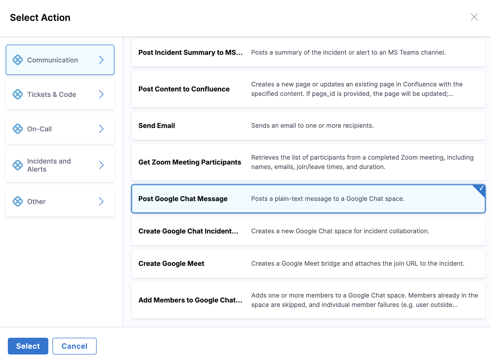

import { Troubleshoot } from '@site/src/components/AdaptiveAIContent';

Harness AI SRE integrates with Google Chat at the organization level, enabling automated incident communication and team collaboration for organizations using Google Workspace.

## Overview

Google Chat integration enables your runbooks to:

- Send automated notifications to Google Chat spaces
- Post incident updates to linked spaces
- Coordinate response teams using Google Workspace tools
- Maintain communication history in the incident timeline

---

## Set up the integration

Before using Google Chat actions in runbooks, configure the organization-level Google Chat integration.

### Prerequisites

- **Google Cloud Platform project:** With Pub/Sub API enabled
- **Google Chat admin access:** For your Google Workspace organization
- **Harness Organization Admin role:** To configure third-party integrations

### Setup steps

Connect the organization-level integration with these steps:

1. Go to **Organization Settings**, then **Third-Party Integrations (AI SRE)**.
2. Click **Connect** for **Google Chat**.
3. Complete the OAuth authorization flow.
4. Configure GCP Project ID and Pub/Sub Topic Name.
5. Test the connection with a Space ID.
6. Click **Save**.

Go to [Google Chat Integration](/docs/ai-sre/integrations/communication/google-chat) to review complete setup instructions, including GCP Pub/Sub configuration.

---

## Use Google Chat actions in runbooks

Google Chat actions are configured through the runbook action form in the UI:

1. **In your runbook**, click **New Step**, then **Action**.

   

2. In the **Select Action** dialog, go to the **Communication** category.
3. Select the Google Chat action you need from the available options.

   

4. Configure the action through a form-based interface.

### Google Chat post message action

Sends a message to a specified Google Chat space.

**Form fields:**

- **Space ID:** The Google Chat space identifier
  - Find this in the Google Chat space URL: `https://chat.google.com/room/SPACE_ID`
  - Supports Mustache variables: `{{incident.chat_space_id}}`
- **Message:** Message text to send
  - Supports Mustache variables: `{{Activity.title}}`, `{{Activity.summary}}`
  - Plain text format (HTML formatting not currently supported)

**Example configuration:**

```yaml
Space ID: {{incident.chat_space_id}}
Message: |
  🚨 Incident Alert: {{Activity.title}}
  
  Severity: {{Activity.severity}}
  Status: {{Activity.status}}
  
  Summary: {{Activity.summary}}
  
  View incident: https://app.harness.io/incidents/{{Activity.id}}
```

**Available Mustache variables:**

- `{{Activity.title}}`: AI SRE incident title
- `{{Activity.id}}`: AI SRE incident ID
- `{{Activity.severity}}`: AI SRE incident severity
- `{{Activity.status}}`: AI SRE incident status
- `{{Activity.summary}}`: AI SRE incident summary
- Any custom incident fields configured in your incident template

---

## Best practices

### Message structure

Structure Google Chat messages so responders can scan them quickly:

- **Use clear formatting:** Break messages into sections with blank lines for readability.
- **Include severity indicators:** Use emoji or text indicators for severity (🚨 Critical, ⚠️ High, ℹ️ Low).
- **Link to dashboards:** Include links to monitoring dashboards, runbooks, or incident details.
- **Keep messages concise:** Google Chat messages should be scannable; avoid large blocks of text.

### Space management

Organize spaces so incident communication stays traceable:

- **Use dedicated incident spaces:** Create a Google Chat space for each incident rather than posting to shared channels.
- **Document space IDs:** Store frequently used space IDs as custom incident fields or runbook variables.
- **Link spaces to incidents:** Use the Incident Details page to link Google Chat spaces so all messages appear in the timeline.

### Runbook design

Design runbooks to post meaningful updates without overwhelming the space:

- **Send updates at key milestones:** Post messages when status changes, mitigation is applied, or resolution is confirmed.
- **Avoid message spam:** Do not send messages in tight loops; use conditional logic to limit frequency.
- **Test with a sandbox space:** Validate runbook actions in a test Google Chat space before using in production incidents.

---

## Common use cases

### Incident notification

Send an initial notification when an incident is created:

**Runbook action:**
- **Action:** Google Chat Post Message
- **Space ID:** `{{incident.chat_space_id}}`
- **Message:**
```text
🚨 New Incident Created

Title: {{Activity.title}}
Severity: {{Activity.severity}}
Assigned to: {{Activity.assignee}}

Link: https://app.harness.io/incidents/{{Activity.id}}
```

### Status update broadcast

Send a status update when the incident status changes:

**Runbook action:**
- **Action:** Google Chat Post Message
- **Space ID:** `{{incident.chat_space_id}}`
- **Message:**
```text
ℹ️ Status Update

Incident: {{Activity.title}}
Previous Status: {{Activity.previous_status}}
New Status: {{Activity.status}}

Updated by: {{Activity.updated_by}}
```

### Resolution notification

Notify the team when the incident is resolved:

**Runbook action:**
- **Action:** Google Chat Post Message
- **Space ID:** `{{incident.chat_space_id}}`
- **Message:**
```text
✅ Incident Resolved

Incident: {{Activity.title}}
Resolution Time: {{Activity.resolution_time}}

Root Cause: {{Activity.root_cause}}

Post-mortem: https://app.harness.io/incidents/{{Activity.id}}/postmortem
```

---

## Troubleshooting

<Troubleshoot
  issue="A runbook message does not appear in the Google Chat space"
  mode="docs"
  fallback="Verify the Google Chat integration is connected in Organization Settings, confirm the Space ID matches the Google Chat space URL, ensure the authorized Google account has access to the space, and check the runbook execution logs."
/>

<Troubleshoot
  issue="Mustache variables do not render in a Google Chat runbook message"
  mode="docs"
  fallback="Confirm the variable name matches the incident field exactly (case-sensitive), use the correct {{variable_name}} syntax, and supply default values for optional fields such as {{Activity.custom_field | default: 'N/A'}}."
/>

<Troubleshoot
  issue="A Google Chat runbook action fails with an Unauthorized error"
  mode="docs"
  fallback="Re-authorize the Google Chat integration in Organization Settings, confirm the Harness app is approved by your Google Workspace admin, and verify the authorized account can access the target space."
/>

---

## Permissions

The Google Chat integration requires these permissions:

- **chat.messages.create:** Send messages to Google Chat spaces
- **chat.spaces.readonly:** Read space metadata (for space ID validation)

These permissions are requested during the OAuth authorization flow.

---

## Next steps

- [Google Chat Integration](/docs/ai-sre/integrations/communication/google-chat): Set up the organization-level integration.
- [Create a Runbook](/docs/ai-sre/runbooks/create-runbook): Build automated response workflows.
- [AI Scribe Agent](/docs/ai-sre/ai-agent): Enable automatic capture of key events from Google Chat conversations.
