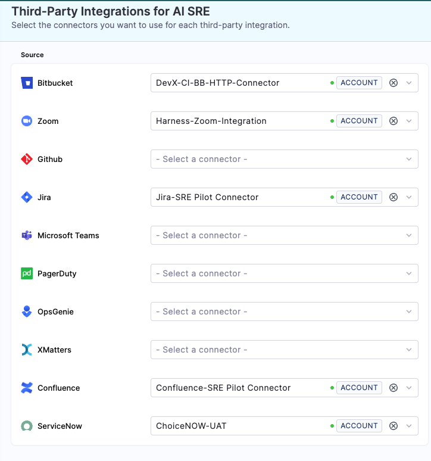
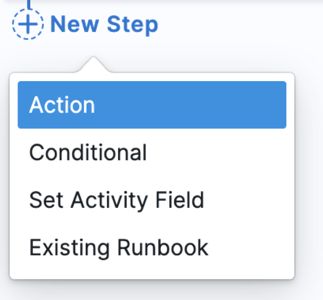
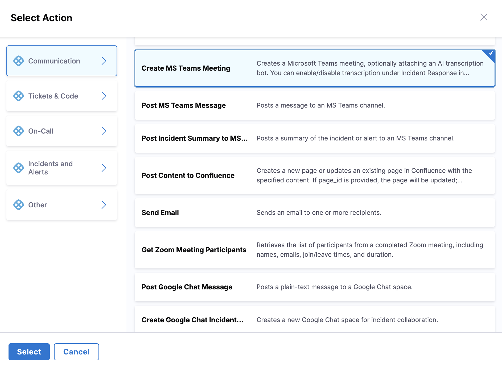

Harness AI SRE integrates with Microsoft Teams at the project level, enabling automated incident communication and team collaboration.

## Overview

Teams integration enables your runbooks to:
- Send automated notifications
- Create incident-specific channels
- Schedule and manage meetings
- Share incident updates
- Coordinate response teams

---

## Set up the integration

Microsoft Teams integration uses OAuth 2.0 for secure authentication.

### Prerequisites
- **Microsoft Teams admin access:** To authorize the Harness app
- **Harness Project Admin role:** To configure integrations

### Setup steps

1. Go to **Project Settings**, then **Third Party Integrations (AI SRE)**.

   

2. Click **Connect** for **Microsoft Teams**.
3. Complete the OAuth authorization in the popup window.
4. Grant the requested permissions when prompted.

After authorization completes, the Teams integration status shows as **Connected**.

---

## Use Teams actions in runbooks

Microsoft Teams actions are configured through the runbook action form in the UI:

1. **In your runbook**, click **New Step**, then **Action**.

   

2. In the **Select Action** dialog, go to the **Communication** category.
3. Select the Teams action you need from the available options.

   

4. Configure the action through a form-based interface. The specific fields depend on the action type you select.

### Send Teams message action

Sends a message to a specified Teams channel.

**Form fields:**
- **Team:** Team name or ID
- **Channel:** Channel name within the team
- **Message:** Message text to send
  - Supports Mustache variables: `{{Activity.title}}`, `{{Activity.summary}}`
  - Can include formatting and mentions

### Create Teams channel action

Creates a new Teams channel for incident coordination.

**Form fields:**
- **Team:** Team where the channel will be created
- **Channel Name:** Name for the new channel
  - Example: `incident-{{Activity.id}}`
- **Description:** Channel description

**Available Mustache variables:**
- `{{Activity.title}}`: AI SRE incident title
- `{{Activity.id}}`: AI SRE incident ID
- `{{Activity.severity}}`: AI SRE incident severity
- `{{Activity.status}}`: AI SRE incident status
- Any custom incident fields configured in your incident template

---

## Best practices

### Channel management
- Use consistent naming conventions
- Archive resolved incident channels
- Limit channel creation to active incidents
- Document channel purpose

### Message structure
- Use clear formatting
- Include severity indicators
- Add relevant links
- Mention appropriate teams

### Permissions
- Follow least privilege principle
- Regular permission audits
- Document access requirements
- Monitor usage

---

## Common use cases

### Incident coordination
1. Create dedicated channel
2. Notify stakeholders
3. Share initial assessment
4. Track response actions

### Status updates
1. Send periodic updates
2. Track resolution progress
3. Share incident metrics
4. Document action items

### Meeting management
1. Schedule incident bridges
2. Send meeting reminders
3. Share meeting notes
4. Track action items

---

## Troubleshooting

### Common issues
1. **Authentication failures**
   - Re-authorize the Teams connection in Project Settings
   - Ensure you have Teams admin permissions
   - Check that the OAuth consent was completed

2. **Channel creation errors**
   - Check naming conventions
   - Verify you have access to the target team
   - Ensure the Harness app has been added to the team

3. **Message failures**
   - Validate channel existence
   - Check message formatting
   - Verify rate limits

---

## Next steps

- [Slack Integration](/docs/ai-sre/runbooks/integrations/collaboration/slack): Configure Slack notifications.
- [Zoom Integration](/docs/ai-sre/runbooks/integrations/collaboration/zoom): Configure Zoom meetings.
- [Runbooks Overview](/docs/ai-sre/runbooks): Return to the runbooks overview.
