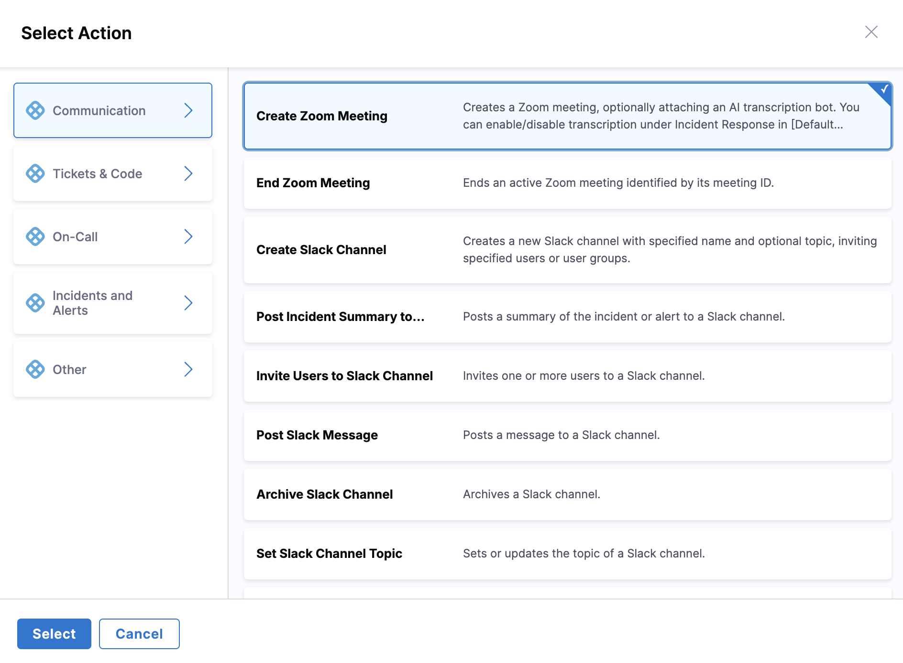

import { Troubleshoot } from '@site/src/components/AdaptiveAIContent';

Harness AI SRE integrates with Zoom through a connector-based approach, enabling automated meeting management for incident response.

## Overview

Zoom integration enables your runbooks to:
- Create incident bridges automatically
- Schedule follow-up meetings
- Manage participant access
- Share meeting recordings
- Track attendance

---

## Connector requirements

### When you need the Zoom connector

The Zoom connector is required for **programmatic meeting creation**, creating meetings via runbook actions with the ability to:
- Create new meetings on demand
- Set meeting names, duration, and descriptions
- Programmatically invite participants
- Configure meeting settings (waiting room, passcode, auto-recording, etc.)

### When you do not need the Zoom connector

You do **not** need a connector if you only want to:
- Join existing Zoom meetings using static bridge links
- Use pre-configured, recurring meeting rooms
- Manually create meetings through the Zoom web interface

If your incident response workflow uses static meeting bridges that responders join manually, the Zoom connector is not required.

---

## Set up the integration

### Prerequisites
- Zoom admin access
- Harness Project Admin role
- Appropriate Zoom API permissions

### Setup steps

Connect the Zoom integration with these steps:

1. Go to **Project Settings**, then **Third Party Integrations (AI SRE)**.

   

2. Select **Zoom** from the available integrations.
3. Configure authentication. Go to [Authentication methods](#authentication-methods) to review the options.
4. Grant required API permissions (see below).
5. Test the connection.

### Authentication methods

Zoom integrations in Harness AI SRE support two authentication methods: **Server-to-Server OAuth** and **API Key/Secret** (Account ID and Secret). The authentication method you choose affects how the AI Scribe Agent joins incident meetings.

#### Server-to-Server OAuth (recommended)

OAuth authentication enables the AI Scribe Agent to join Zoom meetings automatically without waiting room delays.

**Capabilities:**
- **Automatic meeting join:** Generates ZAK (Zoom Access Key) tokens that allow the bot to bypass waiting rooms
- **No manual admission required:** The bot joins immediately when the meeting starts
- **Full programmatic access:** Create, configure, and manage meetings via runbook actions
- **Silent operation:** No error alerts related to meeting access

**Use OAuth when:**
- You want the AI Scribe Agent to join incident war rooms automatically
- You need reliable meeting transcription without manual intervention
- You are using runbook actions to create meetings programmatically

**Setup:**
1. In the Zoom integration configuration, select **OAuth**.
2. Click **Sign in with Zoom** and authorize access.
3. Grant the required API scopes listed below.
4. Test the connection.

#### API Key/Secret authentication

API Key authentication (Account ID and Secret) provides basic meeting management capabilities but limits automatic meeting participation.

**Limitations:**
- **No ZAK token support:** Cannot generate tokens that bypass waiting rooms
- **Waiting room requirement:** The bot joins as a standard participant and requires manual admission
- **Manual intervention needed:** Someone on the call must admit the bot from the waiting room
- **Alert messages:** Generates error messages in Slack when attempting to request ZAK tokens

**Behavior with API Key authentication:**

When the AI Scribe Agent attempts to join a meeting with API Key authentication:

1. Bot attempts to join meeting using ZAK token, and the request fails (ZAK not supported with API Key auth).
2. Bot falls back to standard join, and lands in the waiting room.
3. Error alert appears in Slack: "ZAK token generation not supported".
4. A meeting participant must manually admit the bot.
5. If no one admits the bot, it misses the meeting entirely and no transcript is captured.

**Use API Key when:**
- You only need to create meetings programmatically (not join them for transcription)
- Your team is comfortable manually admitting the bot to meetings
- OAuth setup is not feasible for your organization

:::warning Missing meeting transcripts
If using API Key authentication, the AI Scribe Agent will miss meetings where no participant admits it from the waiting room. This results in incomplete incident documentation. For reliable transcription, use Server-to-Server OAuth.
:::

#### Switch from API Key to OAuth

If you are currently using API Key authentication and experiencing issues with bot admission or seeing ZAK token error alerts:

1. Go to **Project Settings**, then **Third Party Integrations (AI SRE)**, then **Zoom**.
2. Remove the existing API Key configuration.
3. Select **OAuth** and follow the setup instructions above.
4. Test by creating a meeting via runbook and verifying the bot joins automatically.

Alternatively, if OAuth is not feasible, you can suppress the ZAK token error alerts in your Slack notification settings.

### Required permissions

The Zoom integration requires specific API scopes depending on the actions your runbooks will perform. Below are the required scopes organized by functionality:

#### Basic meeting management
- **`meeting:write`:** Create, update, and delete meetings
- **`meeting:read`:** Read meeting details and settings
- **`user:read`:** Read user information for meeting hosts and participants

#### Advanced meeting actions
- **`meeting:write:admin`:** **Required for ending meetings** and advanced meeting control
- **`meeting:update:admin`:** Modify meeting settings for meetings you do not host
- **`meeting:read:admin`:** Access detailed meeting information across the organization

#### Recording management
- **`recording:read`:** Access meeting recordings
- **`recording:write`:** Manage recording settings and permissions
- **`cloud_recording:read`:** Read cloud recording details
- **`cloud_recording:write`:** Manage cloud recordings

#### Participant and user management
- **`user:read`:** Read basic user information
- **`user:write`:** Manage user settings (for participant management)
- **`group:read`:** Read group information for bulk participant management

#### Webinar support (if applicable)
- **`webinar:write`:** Create and manage webinars
- **`webinar:read`:** Read webinar information

### Scope requirements by action

| Action | Required Scopes | Notes |
|--------|----------------|-------|
| Create Meeting | `meeting:write`, `user:read` | Basic meeting creation |
| End Meeting | `meeting:write:admin` | **Critical for meeting termination** |
| Update Meeting Settings | `meeting:write`, `meeting:update:admin` | Admin scope needed for meetings you do not host |
| Manage Participants | `meeting:write`, `user:read`, `user:write` | For adding/removing participants |
| Access Recordings | `recording:read`, `cloud_recording:read` | For post-meeting analysis |
| Schedule Recurring Meetings | `meeting:write`, `user:read` | For incident follow-ups |

### Troubleshoot permissions

If you encounter permission errors:

1. **"Insufficient privileges" error:** Add `meeting:write:admin` scope
2. **"Cannot end meeting" error:** Ensure `meeting:write:admin` is granted
3. **"Recording access denied":** Add `recording:read` and `cloud_recording:read` scopes
4. **"User not found" errors:** Verify `user:read` scope is active

Go to the [official Zoom API documentation](https://developers.zoom.us/docs/api/rest/reference/) to review detailed information about Zoom API scopes.

---

## Use the Zoom connector

### Create a Zoom meeting runbook
1. Create a new runbook or edit an existing one.
2. Add a new Action.
3. From the Action Picker, select **Create Zoom Meeting**.
4. No additional configuration is required. The default Zoom connector is used.

### Execute the runbook
1. Open an existing incident or create a new one.
2. Go to the Runbooks tab.
3. Click **Execute a Runbook**.
4. Select your runbook with the Zoom meeting action.
5. Click the Run icon to execute.
6. View the results in the incident timeline.

---

## Disable the connector

### Remove from Zoom Marketplace
1. Go to the [Zoom Marketplace](https://marketplace.zoom.us).
2. Go to **Manage**, then **Installed Apps**.
3. Locate the Harness app.
4. Click **Remove** or **Uninstall**.
5. Confirm the removal.
6. Verify in Harness:
   - Go to **Project Settings**, then **Third Party Integrations (AI SRE)**.
   - Confirm the Zoom connector is no longer listed.
   - Check that related secrets have been automatically removed.

---

## Use Zoom actions in runbooks

Zoom actions are configured through the runbook action form in the UI:

1. **In your runbook**, click **New Step**, then **Action**.

   

2. In the **Select Action** dialog, go to the **Communication** category.
3. Select the Zoom action you need from the available options.

   

4. Configure the action through a form-based interface. The specific fields depend on the action type you select.

### Create Zoom meeting action

Creates a new Zoom meeting for incident coordination.

**Form fields:**
- **Topic:** Meeting title
  - Example: `{{Activity.title}} - Incident Bridge`
- **Agenda:** Meeting description (optional)
- **Duration:** Meeting duration in minutes
- **Start Time:** When to start the meeting (for scheduled meetings)
- **Settings:**
  - Join before host
  - Waiting room enabled/disabled
  - Auto-recording (cloud or local)

**Available Mustache variables:**
- `{{Activity.title}}`: AI SRE incident title
- `{{Activity.id}}`: AI SRE incident ID
- `{{Activity.severity}}`: AI SRE incident severity
- `{{Activity.summary}}`: AI SRE incident summary
- Any custom incident fields configured in your incident template

---

## Best practices

### Meeting setup
- Use consistent naming
- Enable auto-recording
- Configure waiting rooms appropriately
- Set proper security settings

### Participant management
- Control host privileges
- Manage waiting room
- Set up co-hosts
- Configure breakout rooms

### Recording management
- Set retention policies
- Configure sharing settings
- Manage access controls
- Archive important meetings

---

## Common use cases

### Incident response
1. Create immediate bridge
2. Add response team
3. Enable recording
4. Share meeting link

---

## Troubleshooting

<Troubleshoot
  issue="A Zoom runbook action fails with an authentication error"
  mode="docs"
  fallback="Verify the OAuth tokens, check the granted API permissions, and confirm the Zoom account access."
/>

<Troubleshoot
  issue="The AI Scribe bot does not join Zoom meetings or shows ZAK token errors in Slack"
  mode="docs"
  fallback="This happens when the connector uses API Key authentication instead of OAuth. Switch to Server-to-Server OAuth so the bot can bypass the waiting room, or manually admit the bot from the waiting room as a workaround."
/>

<Troubleshoot
  issue="Creating a Zoom meeting from a runbook fails"
  mode="docs"
  fallback="Check for scheduling conflicts, verify the account user limits, and confirm the host has the required rights."
/>

<Troubleshoot
  issue="Zoom meeting recordings are missing or fail from a runbook"
  mode="docs"
  fallback="Check available storage space, verify the recording:read and cloud_recording:read scopes, and confirm the recording settings on the meeting."
/>

---

## Next steps

- [Slack Integration](/docs/ai-sre/runbooks/integrations/collaboration/slack): Configure Slack notifications.
- [Microsoft Teams Integration](/docs/ai-sre/runbooks/integrations/collaboration/teams): Configure Microsoft Teams notifications.
- [Runbooks Overview](/docs/ai-sre/runbooks): Return to the runbooks overview.
