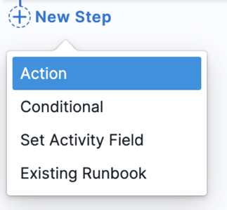
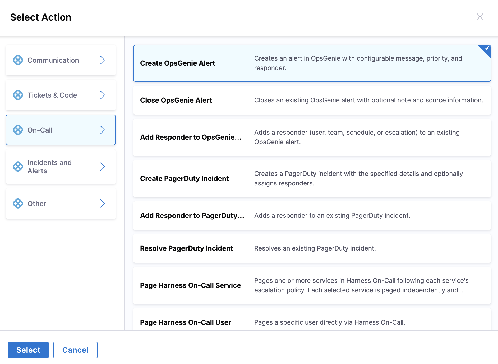

# OpsGenie Integration

Integrate OpsGenie with AI SRE runbooks to automate alert management and on-call operations during incident response.

## Use Cases

- Create alerts in OpsGenie
- Add notes to existing alerts
- Acknowledge alerts programmatically
- Close alerts when incidents resolve
- Page on-call teams
- Update alert priorities

---

## Prerequisites

- OpsGenie account with API access
- OpsGenie API key
- Team and escalation policies configured in OpsGenie

---

## Configure OpsGenie Integration

1. Go to **Project Settings** → **Third-Party Integrations for AI SRE**

   

2. Select the connector you want to use or create a new one
3. Provide your OpsGenie credentials:
   - **API Key**: Generate from OpsGenie settings
   - **Region**: US or EU
4. Test the connection
5. Save the integration

:::tip Alternative: On-Call Sync Approach
You can also configure OpsGenie directly in the **On-Call** section for schedule synchronization. Go to **On-Call** → **Sync from 3rd Party** tab, select **OpsGenie**, and follow the sync wizard to import schedules and on-call groups. This approach is specifically designed for bulk importing on-call data. Both approaches use the same connector but the On-Call sync provides a guided workflow for importing schedules, escalation policies, teams, and users.
:::

---

## Available Actions

### Create Alert

Create a new alert in OpsGenie with message, priority, and responder assignment.

**Required fields**:
- Message: Alert message content
- Priority: P1, P2, P3, P4, or P5
- Responder Type: team, user, escalation, or schedule
- Responder ID: ID of the responder
- Should Wait for Result: Whether to wait for alert creation confirmation
- Timeout Seconds: Optional timeout for waiting (default 120s, max 600s)

### Add Responder

Add a responder to an existing OpsGenie alert.

**Required fields**:
- Alert ID: OpsGenie alert identifier
- Responder Type: team, user, escalation, or schedule
- Responder ID: ID of the responder to add

### Close Alert

Close an existing OpsGenie alert with optional note and source information.

**Required fields**:
- Alert ID: OpsGenie alert identifier
- Alert ID Type: Type of identifier (id or alias)
- Note: Optional closing note
- Source: Optional source of the closure
- User: Optional user closing the alert

---

## Using OpsGenie Actions in Runbooks

OpsGenie actions are configured through the runbook action form in the UI:

1. **In your runbook**, click **New Step** → **Action**

   

2. In the **Select Action** dialog, go to **On-Call** category
3. Select **OpsGenie** from the available actions

   

4. Choose the action type (**Create OpsGenie Alert**, **Add Responder to OpsGenie Alert**, or **Close OpsGenie Alert**)
5. Fill in the form fields using the **Data Picker** to insert dynamic values like `incident.severity`, `incident.title`, etc.

---

## Available Mustache Variables

Use these variables to map AI SRE incident data to OpsGenie fields:

| Variable | Description | Example Value |
|----------|-------------|---------------|
| `{{Activity.title}}` | Incident title | `API Gateway Outage` |
| `{{Activity.summary}}` | Incident summary | `Payment API returning 500 errors` |
| `{{Activity.severity}}` | Incident severity | `0`, `1`, `2`, `3`, `4` |
| `{{Activity.status}}` | Incident status | `Detected`, `Investigating`, `Resolved` |
| `{{Activity.service}}` | Affected service name | `payment-service` |
| `{{Activity.environment}}` | Environment | `production`, `staging` |
| `{{Activity.owner}}` | Incident owner email | `jane.doe@company.com` |
| `{{Activity.created_at}}` | Incident creation timestamp | `2026-05-06T20:30:00Z` |
| `{{Activity.resolved_at}}` | Incident resolution timestamp | `2026-05-06T21:15:00Z` |
| `{{Activity.url}}` | Incident URL in AI SRE | `https://app.harness.io/...` |
| `{{Activity.short_id}}` | Human-readable ID | `INC-123` |

---

## Example Runbook Actions

### Create OpsGenie Alert

**Use case**: Create an OpsGenie alert when a critical incident is detected in AI SRE.

**Runbook configuration**:

1. In the runbook editor, add a **Create Alert** action from OpsGenie
2. Configure the form fields:
   - **Message**: `SEV{{Activity.severity}} Incident: {{Activity.title}}`
   - **Description**:
     ```
     Incident ID: {{Activity.short_id}}
     Service: {{Activity.service}}
     Environment: {{Activity.environment}}
     
     Description: {{Activity.title}}
     
     View in AI SRE: {{Activity.url}}
     ```
   - **Priority**: `P1` for SEV0, `P2` for SEV1, `P3` for SEV2+
   - **Tags**: `incident-{{Activity.short_id}}, service-{{Activity.service}}, env-{{Activity.environment}}`
   - **Responders**: Select team (e.g., `platform-team`)

**Result**: OpsGenie alert created with title `SEV0 Incident: API Gateway Outage`, P1 priority, assigned to platform-team.

### Add Responder to Alert

**Use case**: Add additional responders to an escalating OpsGenie alert.

**Runbook configuration**:

1. In the runbook editor, add an **Add Responder to OpsGenie Alert** action
2. Configure the form fields:
   - **Alert ID**: Enter OpsGenie alert ID
   - **Responder Type**: `team`
   - **Responder ID**: Enter team ID or name

**Result**: Responder added to OpsGenie alert with notification sent.

### Close Alert on Resolution

**Use case**: Automatically close OpsGenie alert when AI SRE incident is resolved.

**Runbook configuration**:

1. In the runbook editor, add a **Close Alert** action from OpsGenie
2. Configure the form fields:
   - **Alert ID**: Enter OpsGenie alert ID
   - **Note**:
     ```
     Incident {{Activity.short_id}} has been resolved.
     
     Resolution time: {{Activity.resolved_at}}
     ```

**Result**: OpsGenie alert closed with resolution note from AI SRE.

---

## Priority Mapping

Map AI SRE incident severity to OpsGenie priorities:

| AI SRE Severity | OpsGenie Priority | Use Case |
|-----------------|-------------------|----------|
| SEV0 | P1 | Critical system-wide outages |
| SEV1 | P2 | Major incidents with significant impact |
| SEV2 | P3 | Moderate issues requiring attention |
| SEV3 | P4 | Minor issues with workarounds |
| SEV4 | P5 | Cosmetic or low-priority issues |

---

## Security Best Practices

- Use API keys with minimum required permissions
- Rotate API keys regularly
- Limit integration access to specific teams
- Audit integration usage
- Use IP allowlisting when available

---

## Next Steps

- Go to [Configure Runbook Actions](/docs/ai-sre/runbooks/create-runbook) to add OpsGenie actions to runbooks.
- Go to [Runbook Best Practices](/docs/ai-sre/runbooks/workflows/best-practices) for automation patterns.
