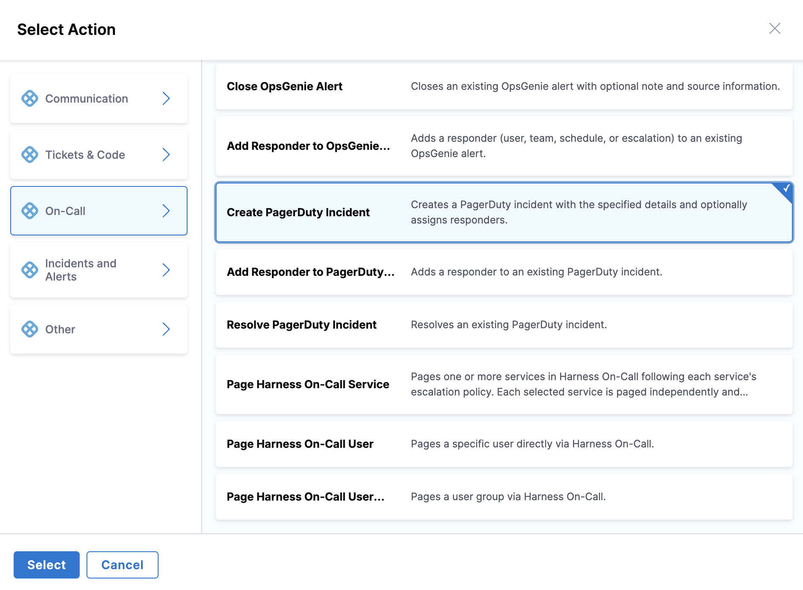

# PagerDuty Integration

Integrate PagerDuty with AI SRE runbooks to automate incident management and on-call operations during incident response.

## Use Cases

- Create incidents in PagerDuty
- Add notes to existing incidents
- Trigger escalations
- Resolve incidents programmatically
- Update incident urgency
- Manage on-call schedules

---

## Prerequisites

- PagerDuty account with API access
- PagerDuty API key or OAuth token
- Services and escalation policies configured in PagerDuty

---

## Configure PagerDuty Integration

1. Go to **Project Settings** → **Third-Party Integrations for AI SRE**

   

2. Select the connector you want to use or create a new one
3. Provide your PagerDuty credentials:
   - **API Key**: Generate from PagerDuty API Access Keys
   - **Subdomain**: Your PagerDuty subdomain
4. Test the connection
5. Save the integration

:::tip Alternative: On-Call Sync Approach
You can also configure PagerDuty directly in the **On-Call** section for schedule synchronization. Go to **On-Call** → **Sync from 3rd Party** tab, select **PagerDuty**, and follow the sync wizard to import schedules and on-call groups. This approach is specifically designed for bulk importing on-call data. Both approaches use the same connector but the On-Call sync provides a guided workflow for importing schedules, escalation policies, teams, and users.
:::

---

## Available Actions

### Create Incident

Create a new incident in PagerDuty with specified details and optionally assign responders.

**Required fields**:
- From: Email address of user creating the incident
- Title: Incident title
- Summary: Incident description/summary
- URL: Incident URL or reference
- Service ID: PagerDuty service identifier
- Responder ID: Optional responder to assign (user or escalation policy)

### Add Responder

Add a responder to an existing PagerDuty incident.

**Required fields**:
- From: Email address of user adding the responder
- Incident ID: PagerDuty incident identifier
- Responder ID: User or escalation policy ID to add
- Requester ID: User requesting the responder addition
- Message: Optional message to include with the request

### Resolve Incident

Resolve an existing PagerDuty incident.

**Required fields**:
- From: Email address of user resolving the incident
- Incident ID: PagerDuty incident identifier
- Resolution: Optional resolution description

---

## Using PagerDuty Actions in Runbooks

PagerDuty actions are configured through the runbook action form in the UI:

1. **In your runbook**, click **New Step** → **Action**

   

2. In the **Select Action** dialog, go to **On-Call** category
3. Select **PagerDuty** from the available actions

   

4. Choose the action type (**Create PagerDuty Incident**, **Add Responder to PagerDuty Incident**, or **Resolve PagerDuty Incident**)
5. Fill in the form fields using the **Data Picker** to insert dynamic values like `incident.severity`, `incident.title`, etc.

---

## Available Mustache Variables

Use these variables to map AI SRE incident data to PagerDuty fields:

| Variable | Description | Example Value |
|----------|-------------|---------------|
| `{{Activity.title}}` | Incident title | `API Gateway Outage` |
| `{{Activity.summary}}` | Incident summary | `Payment API returning 500 errors` |
| `{{Activity.severity}}` | Incident severity | `0`, `1`, `2`, `3`, `4` |
| `{{Activity.status}}` | Incident status | `Detected`, `Investigating`, `Resolved` |
| `{{Activity.service}}` | Affected service name | `payment-service` |
| `{{Activity.environment}}` | Environment | `production`, `staging` |
| `{{Activity.owner}}` | Incident owner email | `jane.doe@company.com` |
| `{{Activity.created_at}}` | Incident creation timestamp | `2026-05-06T20:30:00Z` |
| `{{Activity.resolved_at}}` | Incident resolution timestamp | `2026-05-06T21:15:00Z` |
| `{{Activity.url}}` | Incident URL in AI SRE | `https://app.harness.io/...` |
| `{{Activity.short_id}}` | Human-readable ID | `INC-123` |
| `{{Activity.id}}` | Unique incident identifier | `abc123...` |

---

## Example Runbook Actions

### Create PagerDuty Incident

**Use case**: Create a PagerDuty incident when a critical incident is detected in AI SRE.

**Runbook configuration**:

1. In the runbook editor, add a **Create Incident** action from PagerDuty
2. Configure the form fields:
   - **Service**: Select your PagerDuty service ID (e.g., `P1234AB`)
   - **Title**: `SEV{{Activity.severity}}: {{Activity.title}}`
   - **Body**:
     ```
     AI SRE Incident: {{Activity.short_id}}
     Service: {{Activity.service}}
     Environment: {{Activity.environment}}
     
     Description:
     {{Activity.title}}
     
     View in AI SRE: {{Activity.url}}
     ```
   - **Urgency**: `high` for SEV0/SEV1, `low` for SEV2+
   - **Incident Key**: `ai-sre-{{Activity.id}}`

**Result**: PagerDuty incident created with title `SEV0: API Gateway Outage`, high urgency, linked to AI SRE incident.

### Add Responder to Incident

**Use case**: Add additional responders to an escalating PagerDuty incident.

**Runbook configuration**:

1. In the runbook editor, add an **Add Responder to PagerDuty Incident** action
2. Configure the form fields:
   - **From**: `{{Activity.owner}}`
   - **Incident ID**: Enter PagerDuty incident ID
   - **Responder ID**: Enter user or escalation policy ID
   - **Requester ID**: `{{Activity.owner}}`
   - **Message**: `Additional responder needed for SEV{{Activity.severity}} incident`

**Result**: Responder added to PagerDuty incident with notification.

### Resolve on Incident Closure

**Use case**: Automatically resolve PagerDuty incident when AI SRE incident is resolved.

**Runbook configuration**:

1. In the runbook editor, add a **Resolve Incident** action from PagerDuty
2. Configure the form fields:
   - **Incident ID**: Enter PagerDuty incident ID
   - **Resolution Note**:
     ```
     Incident {{Activity.short_id}} resolved in AI SRE
     
     Resolved at: {{Activity.resolved_at}}
     ```

**Result**: PagerDuty incident resolved with resolution note from AI SRE.

### Create Incident with Responder

**Use case**: Create a PagerDuty incident and immediately assign it to a specific responder.

**Runbook configuration**:

1. In the runbook editor, add a **Create PagerDuty Incident** action
2. Configure the form fields:
   - **From**: `{{Activity.owner}}`
   - **Title**: `SEV{{Activity.severity}}: {{Activity.title}}`
   - **Summary**: `{{Activity.summary}}`
   - **URL**: `{{Activity.url}}`
   - **Service ID**: Enter your PagerDuty service ID
   - **Responder ID**: Enter escalation policy or user ID to assign

**Result**: PagerDuty incident created and assigned to the specified responder.

---

## Urgency Mapping

Map AI SRE incident severity to PagerDuty urgency:

| AI SRE Severity | PagerDuty Urgency | Notification Behavior |
|-----------------|-------------------|----------------------|
| SEV0 | high | Immediate phone call and SMS |
| SEV1 | high | Immediate phone call and SMS |
| SEV2 | low | Push notification and email |
| SEV3 | low | Email only |
| SEV4 | low | Email only |

---

## Integration Best Practices

### Incident Key for Deduplication

Use consistent incident keys to prevent duplicate PagerDuty incidents:

```yaml
incident_key: ai-sre-${{incident.id}}
```

This ensures:
- Multiple runbook runs do not create duplicate PagerDuty incidents
- Updates are properly correlated to the same incident
- Incident resolution is correctly tracked

### Service Mapping

Map AI SRE services to PagerDuty services:

```yaml
service: ${{
  incident.service == "payment-api" ? "P1234AB" :
  incident.service == "user-service" ? "P5678CD" :
  "PDEFAULT"
}}
```

---

## Security Best Practices

- Use API keys with minimum required permissions
- Rotate API keys regularly
- Limit integration access to specific services
- Use IP allowlisting when available
- Audit integration usage
- Enable two-factor authentication on PagerDuty accounts

---

## Next Steps

- Go to [Configure Runbook Actions](/docs/ai-sre/runbooks/create-runbook) to add PagerDuty actions to runbooks.
- Go to [Runbook Best Practices](/docs/ai-sre/runbooks/workflows/best-practices) for automation patterns.
