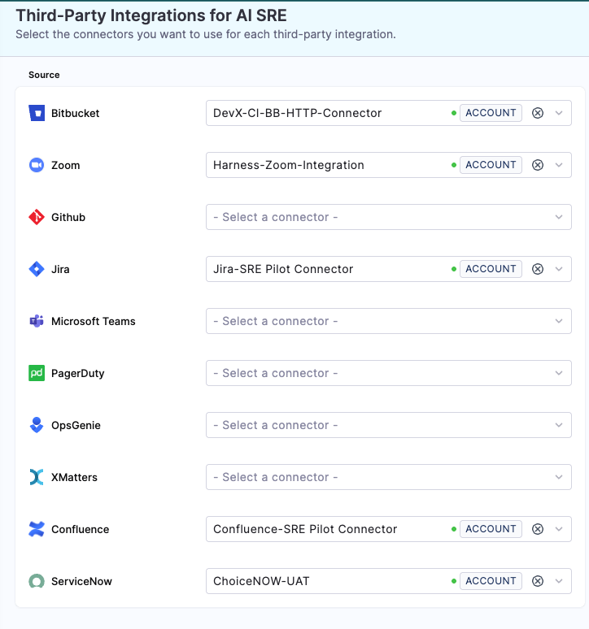

# xMatters Integration

Integrate xMatters with AI SRE to synchronize on-call schedules and escalation policies.

:::info On-Call Synchronization Only
xMatters integration supports **on-call synchronization only**. Unlike PagerDuty and OpsGenie, xMatters does not provide runbook actions. Use xMatters to import schedules and on-call groups, then manage incident response within AI SRE using other integrations.
:::

## Use Cases

- Import on-call schedules from xMatters
- Synchronize on-call groups as escalation policies
- Maintain schedule consistency between xMatters and AI SRE
- Migrate from xMatters to AI SRE on-call management

---

## Prerequisites

- xMatters account with administrator access
- xMatters API user credentials or API key with read permissions
- xMatters instance URL (e.g., `https://yourcompany.xmatters.com`)

---

## Configure xMatters Integration

1. Go to **Project Settings** → **Third-Party Integrations for AI SRE**

   

2. Select the connector you want to use or create a new one
3. Provide your xMatters credentials:
   - **Instance URL**: Your xMatters instance URL
   - **Username**: API user username
   - **Password**: API user password or API key
4. Test the connection
5. Save the integration

:::tip Alternative: On-Call Sync Approach
You can also configure xMatters directly in the **On-Call** section for schedule synchronization. Go to **On-Call** → **Sync from 3rd Party** tab, select **xMatters**, and follow the sync wizard to import schedules and on-call groups. This approach is specifically designed for bulk importing on-call data. Both approaches use the same connector but the On-Call sync provides a guided workflow for importing schedules, escalation policies, teams, and users.
:::

---

## Available Actions

xMatters does not provide runbook actions. The integration is limited to on-call synchronization.

---

## On-Call Synchronization

xMatters synchronization imports the following entities:

### Schedules

Import rotation schedules with shifts and time zones:
- Daily, weekly, and custom rotation patterns
- Shift assignments and handoff times
- Time zone configurations
- Schedule overrides

### On-Call Groups

xMatters on-call groups are mapped to AI SRE escalation policies:
- Group members become escalation levels
- Rotation patterns are preserved
- Notification preferences are imported when available

### Teams and Users

Import team structure and user information:
- User groups mapped to Harness User Groups
- Contact information (email, SMS, phone)
- Team membership and assignments

---

## Using xMatters in AI SRE

After synchronizing schedules from xMatters:

1. **Route alerts** to imported escalation policies
2. **Manage incidents** using AI SRE incident management
3. **Use other integrations** for runbook actions (Slack, Jira, PagerDuty, OpsGenie)
4. **Re-sync periodically** to keep schedules up to date

---

## Synchronization Workflow

1. **Connect Source**: Configure xMatters API credentials
2. **Select Entities**: Choose which services/groups to sync
3. **Invite Users**: Select users to invite to Harness
4. **Configure Rules**: Set sync strategy and conflict resolution
5. **Start Sync**: Monitor import progress
6. **Verify Import**: Review schedules and escalation policies

---

## Post-Sync Configuration

After completing the initial sync:

1. **Verify user mapping**: Ensure users are correctly mapped by email
2. **Review schedules**: Check rotation patterns and time zones
3. **Test escalation policies**: Verify escalation rules work as expected
4. **Update service ownership**: Assign teams to services in the Service Directory
5. **Configure alert rules**: Route alerts to imported escalation policies

---

## Time Zone Handling

xMatters schedules may use different time zone formats:
- AI SRE automatically converts xMatters time zones to IANA format
- Review imported schedules to verify conversions
- Manually adjust time zones if needed

---

## Hybrid Approach for Runbook Actions

To use runbook actions while keeping xMatters schedules:

1. **Sync schedules from xMatters** to maintain on-call rotations
2. **Configure PagerDuty or OpsGenie** for runbook actions
3. **Route alerts to xMatters-imported policies** in AI SRE
4. **Use PagerDuty/OpsGenie actions** in runbooks for incident management

This approach keeps xMatters as the schedule source while enabling automation with other platforms.

---

## Integration Comparison

| Feature | xMatters | PagerDuty | OpsGenie |
|---------|----------|-----------|----------|
| On-call sync | ✅ | ✅ | ✅ |
| Create incidents | ❌ | ✅ | ✅ |
| Add notes | ❌ | ✅ | ✅ |
| Acknowledge alerts | ❌ | ✅ | ✅ |
| Update status | ❌ | ✅ | ✅ |
| Trigger escalations | ❌ | ✅ | ❌ |

---

## Security Best Practices

- Use dedicated API users with read-only permissions
- Rotate API credentials regularly
- Restrict API user access to necessary resources
- Audit sync activity regularly
- Test sync in non-production before production

---

## Next Steps

- Go to [xMatters On-Call Integration](/docs/ai-sre/oncall/integrations/xmatters) for detailed sync configuration.
- Go to [PagerDuty Integration](/docs/ai-sre/runbooks/integrations/incident-management/pagerduty) for runbook action alternatives.
- Go to [OpsGenie Integration](/docs/ai-sre/runbooks/integrations/incident-management/opsgenie) for runbook action alternatives.
- Go to [Configure Runbook Actions](/docs/ai-sre/runbooks/create-runbook) to add automation to your incidents.
