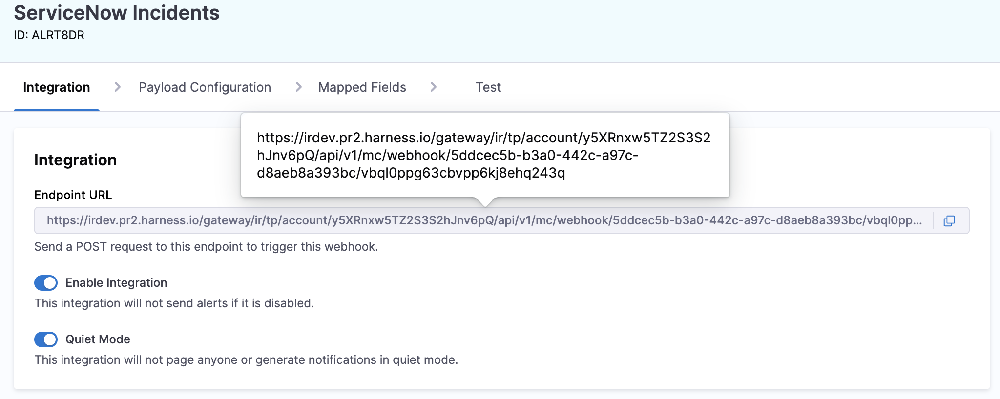
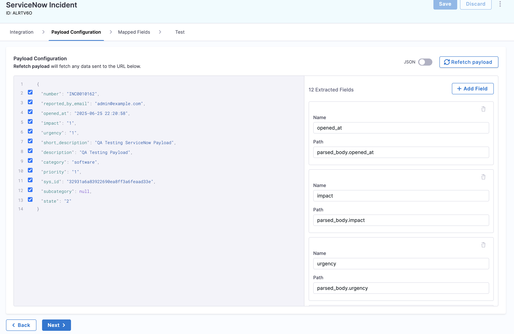

import Tabs from '@theme/Tabs';
import TabItem from '@theme/TabItem';
import CreateIntegration from './static/create-integration.png';

# ServiceNow Integration for Runbooks

Harness AI SRE offers comprehensive integration with ServiceNow, enabling both outbound (AI SRE to ServiceNow) and inbound (ServiceNow to AI SRE) incident management and tracking.

## Overview

ServiceNow integration enables your runbooks to:
- Create and update incidents
- Track incident progress
- Automate workflow transitions
- Sync incident updates bidirectionally

## Connector-Based Integration

### Prerequisites
- ServiceNow admin access
- Instance URL
- Service account credentials
- Harness Project Admin role

### Setup Steps
1. Navigate to **Settings** → **Connectors**
2. Click **+ New Connector**
3. Select **ServiceNow**
4. Configure authentication:
   - Instance URL
   - Username
   - Password/OAuth credentials
5. Test connection

### Required Permissions
- incident_manager role
- itil role
- rest_service role
- web_service_admin role

## Using ServiceNow in Runbooks

### Incident Creation
```yaml
- Action Type: ServiceNow
  Operation: Create Incident
  Category: "Infrastructure"
  Impact: "[incident.severity]"
  ShortDescription: "[incident.service] Incident"
  Description: |
    Impact: [incident.description]
    Service: [incident.service]
    Environment: [incident.environment]
```

### Update Incident
```yaml
- Action Type: ServiceNow
  Operation: Update Incident
  Number: "[servicenow.number]"
  Fields:
    Priority: "[incident.severity]"
    Assignment_group: "SRE Team"
    Comments: "Automated response initiated"
```

### State Management
```yaml
- Action Type: ServiceNow
  Operation: Update State
  Number: "[servicenow.number]"
  State: "In Progress"
  WorkNotes: "Incident response team engaged"
```

## Directional Synchronization with AI SRE

Harness AI SRE uses runbook triggers to update ServiceNow when incident fields change. When a field in AI SRE changes, a runbook can automatically update the corresponding ServiceNow incident.

### Field Change Triggers
Configure runbooks to trigger on field changes:
- State changes
- Priority updates
- Severity modifications
- Assignment changes

### Example: State Change Sync
```yaml
Trigger:
  Type: Field Change
  Field: state
  
Actions:
  - Action Type: ServiceNow
    Operation: Update State
    Number: "[servicenow.number]"
    State: "[incident.state]"
    WorkNotes: "State updated from AI SRE"
```

### Example: Priority Sync
```yaml
Trigger:
  Type: Field Change
  Field: priority
  
Actions:
  - Action Type: ServiceNow
    Operation: Update Incident
    Number: "[servicenow.number]"
    Fields:
      Priority: "[incident.priority]"
      WorkNotes: "Priority updated from AI SRE"
```

## Advanced Features

### Bidirectional Sync (Coming Soon)
:::note Future Capability
The following features are planned for future releases:
- Real-time incident synchronization
- Work notes mirroring
- CMDB integration
- Workflow state mapping
:::

#### Planned Capabilities
1. **Incident Sync**
   - ServiceNow → Harness AI SRE status mapping
   - Automatic state transitions
   - Priority synchronization

2. **Work Notes Sync**
   - Bidirectional updates flow
   - Attachment synchronization
   - User mapping

3. **CMDB Integration**
   - CI relationship mapping
   - Impact analysis
   - Service dependency tracking

## Best Practices

### Incident Management
- Use standard categorization
- Include business impact
- Link configuration items
- Maintain SLA tracking

### Workflow Integration
- Define clear state mappings
- Document transition rules
- Set up appropriate triggers
- Monitor sync status

### Field Configuration
- Map essential fields
- Use custom fields appropriately
- Document field purposes
- Validate field values

## Common Use Cases

### Major Incident Management
1. Create ServiceNow incident
2. Assign response teams
3. Track resolution progress
4. Update stakeholders

### Change Management
1. Create change requests
2. Track approvals
3. Document implementations
4. Update CMDB

### SLA Compliance
1. Monitor response times
2. Track resolution progress
3. Generate reports
4. Escalate as needed

## Troubleshooting

### Common Issues
1. **Authentication Failures**
   - Verify credentials
   - Check roles/permissions
   - Confirm instance access

2. **Field Update Errors**
   - Validate field names
   - Check required fields
   - Verify field formats

3. **State Transition Issues**
   - Check workflow rules
   - Verify state mappings
   - Confirm permissions

## Creating Incidents in AI SRE from ServiceNow

This section walks you through setting up an integration in Harness AI SRE to receive incident data from ServiceNow. By following these steps, you'll be able to automatically create incidents in Harness AI SRE based on ServiceNow incidents.

### Integration Setup Process

#### 1. Create the Integration in AI SRE

1. Navigate to **Integrations** in AI SRE.
2. Click **New Integration**.
3. Set the following values:
   - **Name**: ServiceNow Incidents
   - **Type**: Incident
   - **Template**: ServiceNow Incident


4. Copy the generated **Webhook URL**.

#### 2. Test the Integration with cURL

Use the following curl command to test sending incident data from ServiceNow. Replace `YOUR_URL` with the URL you copied from AI SRE.



```bash
curl -X 'POST' 'YOUR_URL' \
  -H 'host: IR' \
  -H 'user-agent: ServiceNow/1.0' \
  -H 'x-snc-integration-source: c9fdbaf8ebbce694c040fddacad0cd90' \
  -H 'content-type: application/json' \
  -d $'{
    "number": "INC0010166",
    "reported_by_email": "admin@example.com",
    "opened_at": "2025-07-08 18:08:05",
    "impact": "1",
    "urgency": "1",
    "short_description": "Testing SNOW Creation",
    "description": "Testing SNOW Creation",
    "category": "software",
    "priority": "1",
    "sys_id": "096654f28362ea10ea8ff3a6feaad338",
    "subcategory": null,
    "state": "2",
    "incident_url": "https://dev319566.service-now.com/nav_to.do?uri=/incident.do?sysparm_query=number=INC0010166"
  }'
```

#### 3. Configure Payload in AI SRE

1. In AI SRE, go to the newly created **ServiceNow Incidents** integration.
2. Click **Payload Configuration**.
3. Click **Refetch Payload** to load the fields.
4. Select all available values for use in AI SRE.



:::info custom fields
If custom ServiceNow fields are not showing up, update your ServiceNow Business Rule to include those fields in the payload.
:::

### Data Mapping: ServiceNow to AI SRE

<Tabs>
<TabItem value="state-mapping" label="State → Status Mapping">

| ServiceNow Value | ServiceNow Label | AI SRE Status |
|-----------------|------------------|---------------|
| 1               | New              | New           |
| 2               | In Progress      | Investigating |
| 3               | On Hold          | Monitoring    |
| 4               | Resolved         | Closed        |
| 5               | Closed           | Closed        |
| 6               | Canceled         | Closed        |

</TabItem>
<TabItem value="priority-mapping" label="Priority → Severity Mapping">

| ServiceNow Value | ServiceNow Label | AI SRE Severity |
|-----------------|------------------|----------------|
| 1               | Critical         | SEV0:Critical  |
| 2               | High             | SEV1:Major     |
| 3               | Moderate         | SEV2:Moderate  |
| 4               | Low              | SEV3:Minor     |
| 5               | Planning         | SEV4:Cosmetic  |

</TabItem>
</Tabs>

:::tip mapping usage
Use these mappings when parsing state and priority from the webhook payload to translate ServiceNow values into meaningful context within AI SRE.
:::


## Creating Webhooks in ServiceNow

Send data from ServiceNow to Harness AI SRE using a Business Rule and RESTMessageV2. This integration enables automatic incident creation and updates in Harness AI SRE when ServiceNow incidents are created or modified.

### Setup Instructions

1. **Navigate to Business Rules**
   - Go to **System Definition** > **Business Rules**
   - Click **New**

2. **Configure the Business Rule**
   - Name: `Send Incident to Harness AI SRE`
   - Table: `Incident`
   - Active: ✅
   - Advanced: ✅

3. **Set When to Run**
   - When: `After`
   - Insert: ✅
   - Update: ✅
   - (Optional) Add filter conditions to limit which incidents trigger the webhook

4. **Add Script**
   - Go to the **Advanced** tab and paste the following:

```javascript
(function executeRule(current, previous /*null when async*/ ) {
    try {
        var r = new sn_ws.RESTMessageV2();
        r.setEndpoint("https://app.harness.io/api/v1/incident/webhook");  // Replace with your Harness webhook URL
        r.setHttpMethod("post");
        r.setRequestHeader("Content-Type", "application/json");

        var usr = new GlideRecord('sys_user');
        usr.get('sys_id', current.getValue("caller_id"));
        var reported_by_email = usr.getValue('email');

        var number = current.getValue("number");
        var opened_at = current.getValue("opened_at");
        var impact = current.getValue("impact");
        var urgency = current.getValue("urgency");
        var short_description = current.getValue("short_description");
        var description = current.getValue("description");
        var category = current.getValue("category");
        var priority = current.getValue("priority");
        var sys_id = current.getValue("sys_id");
        var subcategory = current.getValue("subcategory");
        var state = current.getValue("state");

        var instanceUrl = gs.getProperty('glide.servlet.uri');
        var incident_url = instanceUrl + "nav_to.do?uri=/incident.do?sysparm_query=number=" + number;

        var obj = {
            "number": number,
            "reported_by_email": reported_by_email,
            "opened_at": opened_at,
            "impact": impact,
            "urgency": urgency,
            "short_description": short_description,
            "description": description,
            "category": category,
            "priority": priority,
            "sys_id": sys_id,
            "subcategory": subcategory,
            "state": state,
            "incident_url": incident_url
        };

        var body = JSON.stringify(obj);
        gs.info("AI SRE webhook payload: " + body);
        r.setRequestBody(body);

        var response = r.execute();
        gs.info("AI SRE webhook HTTP status: " + response.getStatusCode());
        gs.info("AI SRE webhook response: " + response.getBody());

    } catch (ex) {
        gs.error("Error sending webhook to AI SRE: " + ex.message);
    }

})(current, previous);
```

### Testing the Integration

1. **Create a Test Incident**
   - Create a new incident in ServiceNow to trigger the business rule

2. **Check System Logs**
   - Go to **System Logs** > **All**
   - Confirm log output containing "AI SRE webhook payload" and response information

3. **Verify in Harness AI SRE**
   - Log into your Harness AI SRE account
   - Navigate to the Incidents section
   - Confirm the incident was created with the correct data

:::info important fields
Ensure that all required fields are included in the webhook payload. The minimum fields needed for proper incident creation are: `number`, `short_description`, `state`, and `priority`.
:::

## Next Steps

- [Configure Jira Integration](./jira.md)
- [Configure Teams Integration](./teams.md)
- [Return to Runbook Overview](../runbooks.md)
