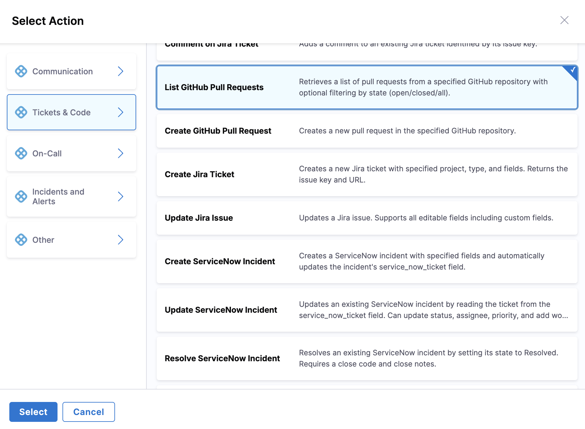

# GitHub Integration

Integrate GitHub with AI SRE runbooks to automate pull request management during incident response.

## Use Cases

- Create pull requests for hotfixes
- List open pull requests for incident correlation
- Track incident remediation through pull requests
- Automate PR creation for code changes

---

## Prerequisites

- GitHub account with repository access
- GitHub personal access token or GitHub App
- Repository permissions: repo, read:org (minimum)

---

## Configure GitHub Integration

1. Go to **Project Settings** → **Third-Party Integrations for AI SRE**

   

2. Select the connector you want to use or create a new one
3. Provide your GitHub credentials:
   - **Personal Access Token**: Generate from GitHub settings
   - **Permissions**: repo, read:org (minimum)
4. Test the connection
5. Save the integration

---

## Available Actions

### Create Pull Request

Create a pull request in a GitHub repository.

**Required fields**:
- Owner: Repository owner (user or organization)
- Repository: Repository name
- Source Branch: Branch with changes
- Target Branch: Branch to merge into
- Title: Pull request title
- Body: Pull request description (optional)

### List Pull Requests

List pull requests from a GitHub repository.

**Required fields**:
- Owner: Repository owner (user or organization)
- Repository: Repository name
- State: Filter by state (open, closed, or all)

---

## Using GitHub Actions in Runbooks

GitHub actions are configured through the runbook action form in the UI:

1. **In your runbook**, click **New Step** → **Action**

   

2. In the **Select Action** dialog, go to **Tickets & Code** category
3. Select **GitHub** from the available actions

   

4. Choose the action type (**Create GitHub Pull Request** or **List GitHub Pull Requests**)
5. Fill in the form fields using the **Data Picker** to insert dynamic values like `incident.severity`, `incident.title`, etc.

---

## Available Mustache Variables

Use these variables to map AI SRE incident data to GitHub fields:

| Variable | Description | Example Value |
|----------|-------------|---------------|
| `{{Activity.title}}` | Incident title | `API Gateway Outage` |
| `{{Activity.summary}}` | Incident summary | `Payment API returning 500 errors` |
| `{{Activity.severity}}` | Incident severity | `0`, `1`, `2`, `3`, `4` |
| `{{Activity.status}}` | Incident status | `Detected`, `Investigating`, `Resolved` |
| `{{Activity.service}}` | Affected service name | `payment-service` |
| `{{Activity.environment}}` | Environment | `production`, `staging` |
| `{{Activity.owner}}` | Incident owner email | `jane.doe@company.com` |
| `{{Activity.created_at}}` | Incident creation timestamp | `2026-05-06T20:30:00Z` |
| `{{Activity.url}}` | Incident URL in AI SRE | `https://app.harness.io/...` |
| `{{Activity.id}}` | Unique incident identifier | `abc123...` |
| `{{Activity.short_id}}` | Human-readable ID | `INC-123` |

---

## Example Runbook Actions

### Create Pull Request for Fix

**Use case**: Create a pull request for incident remediation with full context.

**Runbook configuration**:

1. In the runbook editor, add a **Create GitHub Pull Request** action
2. Configure the form fields:
   - **Owner**: `myorg`
   - **Repository**: `payment-service`
   - **Source Branch**: `hotfix/incident-{{Activity.short_id}}`
   - **Target Branch**: `main`
   - **Title**: `Fix for incident {{Activity.short_id}}: {{Activity.title}}`
   - **Body**:
     ```
     ## Incident Fix
     
     **Incident**: [{{Activity.short_id}}]({{Activity.url}})
     **Severity**: SEV{{Activity.severity}}
     **Service**: {{Activity.service}}
     **Environment**: {{Activity.environment}}
     
     ### Description
     {{Activity.title}}
     
     ### Related
     - Incident URL: {{Activity.url}}
     ```

**Result**: Pull request created with title `Fix for incident INC-123: API Gateway Outage` targeting `main` from `hotfix/incident-INC-123`.

### List Open Pull Requests

**Use case**: List all open pull requests to check for existing fixes before creating a new one.

**Runbook configuration**:

1. In the runbook editor, add a **List GitHub Pull Requests** action
2. Configure the form fields:
   - **Owner**: `myorg`
   - **Repository**: `payment-service`
   - **State**: `open`

**Result**: Returns a list of all open pull requests in the repository with details including title, branch, and URL.

### Create Hotfix PR with Context

**Use case**: Create a pull request with detailed incident context and action items.

**Runbook configuration**:

1. In the runbook editor, add a **Create GitHub Pull Request** action
2. Configure the form fields:
   - **Owner**: `myorg`
   - **Repository**: `payment-service`
   - **Source Branch**: `hotfix/{{Activity.short_id}}-{{Activity.service}}`
   - **Target Branch**: `main`
   - **Title**: `[SEV{{Activity.severity}}] {{Activity.title}}`
   - **Body**:
     ```
     ## Hotfix for Incident {{Activity.short_id}}
     
     **Status**: {{Activity.status}}
     **Service**: {{Activity.service}}
     **Environment**: {{Activity.environment}}
     **Detected**: {{Activity.created_at}}
     
     ### Incident Summary
     {{Activity.summary}}
     
     ### Action Items
     - [ ] Code changes implemented
     - [ ] Tests added
     - [ ] Reviewed and approved
     - [ ] Ready to deploy
     
     ### Links
     - [Incident Details]({{Activity.url}})
     
     cc: {{Activity.owner}}
     ```

**Result**: Pull request created with full incident context and checklist for tracking remediation progress.

---

## PR Title Conventions

Use consistent PR title formats for incident-related pull requests:

**By Severity**:
- SEV0/SEV1: `[SEV0] {{Activity.title}}`
- SEV2+: `Fix: {{Activity.title}}`

**By Type**:
- Hotfix: `Hotfix/{{Activity.short_id}}: {{Activity.title}}`
- Investigation: `Investigation/{{Activity.short_id}}: {{Activity.title}}`
- Post-incident: `Post-incident/{{Activity.short_id}}: {{Activity.title}}`

---

## Branch Naming Conventions

Use consistent branch naming for incident-related work:

```yaml
# Pattern examples:
hotfix/incident-{{Activity.short_id}}
fix/{{Activity.service}}-{{Activity.short_id}}
incident/{{Activity.short_id}}-{{Activity.severity}}
```

---

## Security Best Practices

- Use fine-grained personal access tokens
- Limit repository access to only what's needed
- Rotate tokens regularly
- Use GitHub Apps for organization-wide access
- Enable two-factor authentication
- Audit integration usage regularly

---

## Next Steps

- Go to [Configure Runbook Actions](/docs/ai-sre/runbooks/create-runbook) to add GitHub actions to runbooks.
- Go to [Runbook Best Practices](/docs/ai-sre/runbooks/workflows/best-practices) for automation patterns.
