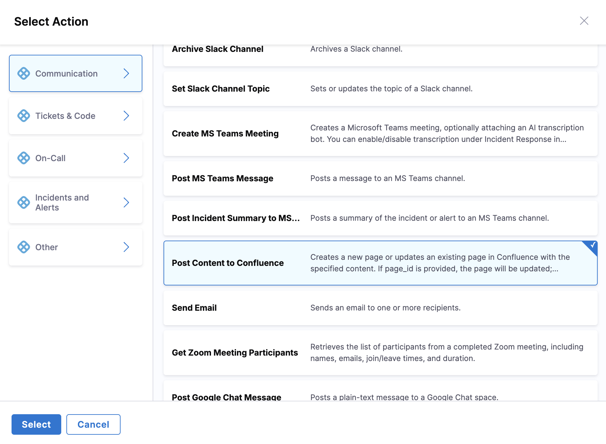

Harness AI SRE provides native integration with Harness Pipelines, enabling automated remediation actions and deployment control directly from your incident response workflows.

## Overview

Harness Pipelines integration enables your runbooks to:
- Execute deployment pipelines automatically
- Trigger rollback procedures
- Scale services during incidents
- Run diagnostic workflows
- Control deployment gates based on incident severity

---

## Prerequisites

- **Pipeline exists in Harness:** Target pipeline is created and working in Harness (CD or other module)
- **Pipeline inputs configured:** Pipeline defines inputs for incident data (service, environment, incidentId, changeId)
- **Shared account structure:** AI SRE project is in the same Harness account/org/project as the target pipeline
- **Proper permissions:** Users have permission to execute the target pipeline. At minimum, users need the **Edit** permission on Incidents (AI SRE) and execute permission on the target pipeline. Go to [Role-Based Access Control](/docs/ai-sre/resources/ai-sre-security#role-based-access-control-rbac) to review the required permissions.
- **RBAC configured:** AI SRE uses existing Harness identity and RBAC (no additional API keys needed). Roles are applied at the Project level, confirm the AI SRE project has the correct role assignments before enabling automated pipeline execution.

---

## Use Harness Pipeline actions in runbooks

Harness Pipeline actions are configured through the runbook action form in the UI:

1. **In your runbook**, click **New Step**, then **Action**.

   

2. In the **Select Action** dialog, go to the **Other** category.
3. Select **Execute Harness Pipeline** from the available options.

   

4. Configure the action to target the specific pipeline and pass incident context.

---

## Runbook configuration

### Create a runbook with incident context

Create the runbook and select the incident context it exposes to pipeline actions:

1. Go to **Runbooks** and click **New runbook**.
2. Provide a meaningful name and description, for example:
   - `P1 - Emergency Rollback`
   - `Scale Service - Production`
   - `Diagnostic Pipeline Execution`
3. Configure the **Inputs/Outputs** section:
   - **Incident/Alert Context:** Choose context level
     - `Any Incident Type`: Exposes base incident fields (severity, status, summary)
     - `Custom Incident Type`: Exposes base fields plus custom fields from specific incident types
   - **Incident Type:** Select specific type for custom fields (e.g., Major Incident, Security Incident, etc.)

### Context selection guidelines

Choose the context level based on the incident data your runbook needs:

- Use `Any Incident Type` for runbooks requiring only generic incident data
- Use `Custom Incident Type` when runbook depends on custom fields from specific incident types

---

## Execution patterns

### Manual execution
Recommended for production deployments and rollback operations:

- No automatic triggers configured
- Incident commander manually executes from **Runbooks** tab
- Human oversight maintained for critical operations
- Pipeline executes with mapped incident context

### Automatic execution
Use with caution for low-risk, well-tested actions:

1. Go to the **Triggers** section.
2. Add trigger type:
   - **Incident created**
   - **Incident updated**
3. Configure conditions:
   - Severity equals `P1` or `P0`
   - Service matches specific list
   - Custom fields, for example: `customer_facing = true`

---

## Pipeline action configuration

### Get pipeline input YAML

Copy the input YAML from the target pipeline so you can paste it into the runbook action:

1. Open target pipeline in **Harness Pipelines**.
2. Click **Run**.
3. Select the **YAML** tab in the Run Pipeline modal.
4. Copy the complete YAML block defining pipeline inputs.

### Add the Execute Harness Pipeline action

Add the action to your runbook workflow and point it at the target pipeline:

1. Open runbook and navigate to the **Workflow** section.
2. Click **New action**.
3. Select **Execute Harness Pipeline**.
4. Configure settings:
   - **Account/Org/Project:** Match target pipeline location
   - **Pipeline:** Select the target pipeline

### Configure pipeline inputs

Paste the copied YAML into the action and confirm it matches the pipeline:

1. Locate the **Inputs** or **Payload** area.
2. Paste copied YAML from Harness Run modal.
3. Verify structure matches pipeline expectations.

### Map input variables

Replace `<+input.*>` placeholders in the YAML using one of three approaches:

```yaml
service: <+input.service>
environment: <+input.environment>
incidentId: <+input.incidentId>
```

#### Map incident context
Use the data picker to bind incident fields:
- `service` binds to `incident.service`
- `environment` binds to `incident.environment`
- `incidentId` binds to `incident.id`

#### Runtime user input
Define runbook inputs for user selection:
- Environment selection from predefined list (`dev`, `qa`, `prod`)
- Service selection from available options
- Custom parameters based on incident type

#### Hardcoded values
Set static values for consistent parameters:
- `environment: "production"`
- `rollbackType: "last_successful"`
- `timeout: "300"`

:::note
All `<+input.*>` placeholders must be resolved through incident data binding, user input, or hardcoded values.
:::

### Execution mode configuration

Configure how the runbook handles pipeline execution:

#### Fire and forget
- AI SRE initiates pipeline without waiting for completion
- Suitable for non-critical or long-running operations
- Use when pipeline output is not required for subsequent actions

#### Wait for completion
- AI SRE waits for pipeline completion and records status
- Enables conditional follow-up actions based on results
- Logs success/failure in incident timeline
- Required for dependent workflow steps

---

## Follow-up actions

Chain additional actions after pipeline execution:

### Incident timeline updates
- Pipeline actions log start/finish automatically
- Add custom key events for failures or timeouts
- Include pipeline URLs and execution details

### External system integration
- **Jira/ServiceNow updates:** Post completion status with pipeline links
- **Conditional actions:** Gate follow-up steps on pipeline success/failure
- **Status synchronization:** Update external tickets with remediation results

### Team notifications
- **Slack/Teams integration:** Send pipeline status to incident channels
- **Email notifications:** Alert stakeholders of completion
- **Custom webhooks:** Integrate with additional monitoring tools

---

## Testing and validation

### Test in pre-production
1. **Configure staging pipeline:** Point action to staging/QA pipeline or non-destructive path
2. **Create test incident:** Generate incident matching trigger conditions
3. **Execute manually:** Run runbook to verify behavior

### Validation checklist
- **Field mapping:** Incident fields correctly populate pipeline variables
- **Pipeline execution:** Pipeline runs successfully in Harness
- **Timeline logging:** Incident timeline captures pipeline events
- **Follow-up actions:** Downstream integrations (Jira, notifications) function properly

### Production deployment
1. Update pipeline reference to production target.
2. Adjust trigger conditions and permissions.
3. Monitor initial executions closely.
4. Refine based on operational feedback.

---

## Use cases

This integration pattern supports various incident response scenarios:
- **Emergency rollbacks:** Automated deployment reversions
- **Service scaling:** Dynamic resource adjustment during incidents
- **Deployment pausing:** Halt deployments during critical incidents
- **Diagnostic workflows:** Automated troubleshooting pipelines
- **Infrastructure remediation:** Automated infrastructure repairs

---

## Best practices

Follow these practices when you run Harness Pipelines from runbooks:

- **Start with manual execution** for critical production operations
- **Use staging environments** for initial testing and validation
- **Implement proper RBAC** to control pipeline execution permissions, apply roles at the Project level and ensure users have the Incident Edit permission before granting runbook execution access
- **Monitor pipeline performance** and adjust timeouts accordingly
- **Document incident-to-pipeline mappings** for team reference

---

## Next steps

- Go to [Runbooks](/docs/ai-sre/runbooks) to build and manage runbook workflows.
- Go to [Runbook integrations](/docs/ai-sre/runbooks/integrations/overview) to connect other tools to your runbook actions.
- Go to [Mustache runbook actions](/docs/ai-sre/runbooks/workflows/use-mustache-runbook-actions) to template dynamic values in your pipeline inputs.