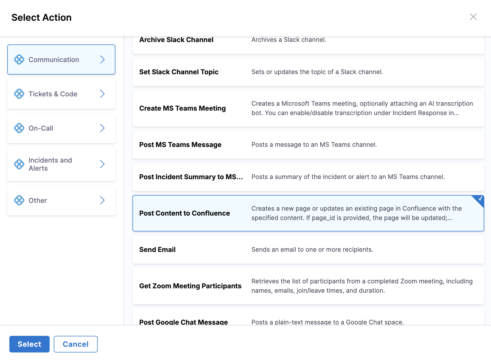

# Confluence Integration

Integrate Confluence with AI SRE runbooks to automate documentation and knowledge base updates during incident response.

## Use Cases

- Create incident postmortem pages
- Update runbook documentation
- Add incident notes to knowledge base
- Track incident history in Confluence
- Generate incident reports

---

## Prerequisites

- Confluence account with page creation permissions
- Confluence API token
- Space permissions for the spaces you need to update

---

## Configure Confluence Integration

1. Go to **Project Settings** → **Third-Party Integrations for AI SRE**

   

2. Select the connector you want to use or create a new one
3. Provide your Confluence credentials:
   - **Site URL**: Your Confluence site URL (e.g., `https://yoursite.atlassian.net/wiki`)
   - **Email**: Your Atlassian account email
   - **API Token**: Generate from Atlassian account settings
4. Test the connection
5. Save the integration

---

## Available Actions

### Post Content to Confluence

Create a new page or update an existing page in Confluence with specified content.

**Required fields**:
- Space Key: Confluence space identifier where the page will be created or updated
- Page Title: Title of the Confluence page
- Content: Page content in Confluence storage format (HTML)

**Optional fields**:
- Page ID: ID of existing page to update. If not provided, a new page will be created

**Outputs**:
- Page ID: ID of the created or updated page
- Page URL: URL to access the page
- Version: Version number of the page

---

## Using Confluence Actions in Runbooks

Confluence actions are configured through the runbook action form in the UI:

1. **In your runbook**, click **New Step** → **Action**

   

2. In the **Select Action** dialog, go to **Communication** category
3. Select **Post Content to Confluence** from the available actions

   

4. Fill in the form fields using the **Data Picker** to insert dynamic values like `incident.severity`, `incident.title`, etc.

---

## Available Mustache Variables

Use these variables to map AI SRE incident data to Confluence fields:

| Variable | Description | Example Value |
|----------|-------------|---------------|
| `{{Activity.title}}` | Incident title | `API Gateway Outage` |
| `{{Activity.summary}}` | Incident summary | `Payment API returning 500 errors` |
| `{{Activity.severity}}` | Incident severity | `0`, `1`, `2`, `3`, `4` |
| `{{Activity.status}}` | Incident status | `Detected`, `Investigating`, `Resolved` |
| `{{Activity.service}}` | Affected service name | `payment-service` |
| `{{Activity.environment}}` | Environment | `production`, `staging` |
| `{{Activity.owner}}` | Incident owner email | `jane.doe@company.com` |
| `{{Activity.created_at}}` | Incident creation timestamp | `2026-05-06T20:30:00Z` |
| `{{Activity.resolved_at}}` | Incident resolution timestamp | `2026-05-06T21:15:00Z` |
| `{{Activity.url}}` | Incident URL in AI SRE | `https://app.harness.io/...` |
| `{{Activity.short_id}}` | Human-readable ID | `INC-123` |

---

## Example Runbook Actions

### Create Incident Postmortem Page

**Use case**: Automatically create a Confluence page template for incident postmortem documentation.

**Runbook configuration**:

1. In the runbook editor, add a **Post Content to Confluence** action
2. Configure the form fields:
   - **Space Key**: `INCIDENTS`
   - **Page Title**: `Postmortem - {{Activity.title}}`
   - **Content** (using Confluence storage format HTML):
     ```html
     <h1>Incident Postmortem: {{Activity.short_id}}</h1>
     
     <h2>Summary</h2>
     <p><strong>Title:</strong> {{Activity.title}}</p>
     <p><strong>Severity:</strong> SEV{{Activity.severity}}</p>
     <p><strong>Duration:</strong>
       {{Activity.created_at}} - {{Activity.resolved_at}}
     </p>
     <p><strong>Service:</strong> {{Activity.service}}</p>
     <p>
       <strong>Environment:</strong> {{Activity.environment}}
     </p>
     
     <h2>Timeline</h2>
     <p><em>To be filled during postmortem</em></p>
     
     <h2>Root Cause</h2>
     <p><em>To be determined</em></p>
     
     <h2>Action Items</h2>
     <p><em>List action items here</em></p>
     
     <h2>Links</h2>
     <p>
       <a href="{{Activity.url}}">Incident in AI SRE</a>
     </p>
     ```
   - **Page ID**: Leave blank to create a new page

**Result**: New Confluence page created in `INCIDENTS` space 
with title `Postmortem - API Gateway Outage`, containing incident 
details and postmortem template sections.

### Update Existing Runbook Documentation

**Use case**: Update an existing runbook documentation page with recent incident information.

**Runbook configuration**:

1. In the runbook editor, add a **Post Content to Confluence** action
2. Configure the form fields:
   - **Space Key**: `ENGINEERING`
   - **Page Title**: `Runbook Documentation`
   - **Content** (append incident entry):
     ```html
     <h2>Recent Incidents</h2>
     <ul>
       <li>
         {{Activity.short_id}} - {{Activity.title}} -
         SEV{{Activity.severity}} - {{Activity.created_at}}
       </li>
     </ul>
     ```
   - **Page ID**: Enter the Confluence page ID to update

**Result**: Existing Confluence page updated with the latest 
incident entry. Because a Page ID was provided, the existing page 
is updated rather than creating a new one.

---

## Confluence Wiki Markup Reference

### Headers
```
h1. Heading 1
h2. Heading 2
h3. Heading 3
```

### Lists
```
* Bullet point
# Numbered list
```

### Links
```
[Link text|https://example.com]
[Link to page|Page Title]
```

### Formatting
```
*bold*
_italic_
{{monospace}}
{code}code block{code}
```

---

## Security Best Practices

- Use API tokens instead of passwords
- Limit space access to only what's needed
- Rotate API tokens regularly
- Use read-only access when possible
- Audit integration usage regularly

---

## Next Steps

- Go to [Configure Runbook Actions](/docs/ai-sre/runbooks/create-runbook) to add Confluence actions to runbooks.
- Go to [Runbook Best Practices](/docs/ai-sre/runbooks/workflows/best-practices) for automation patterns.
