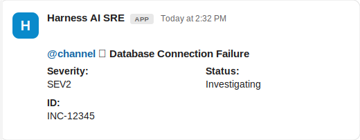
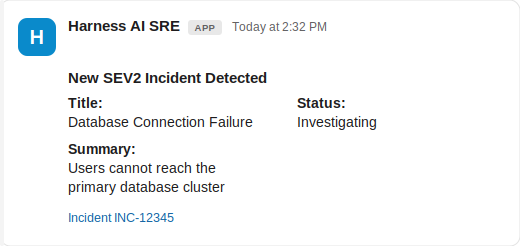
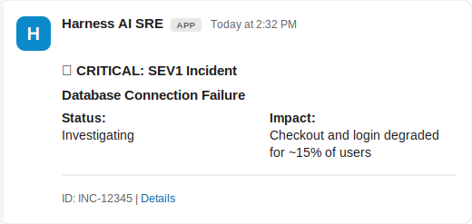
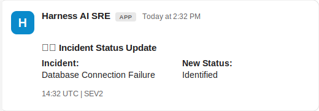
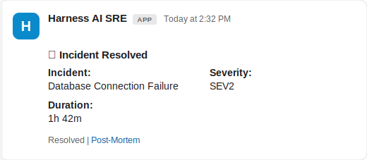
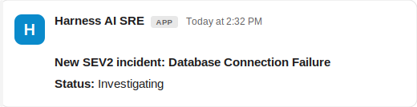
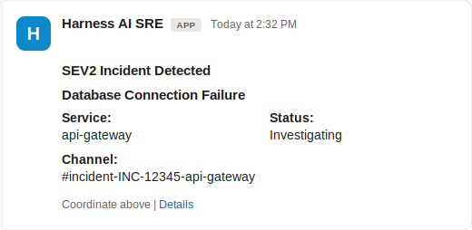
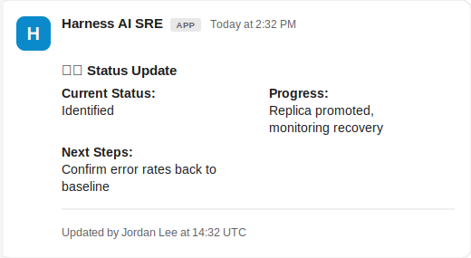
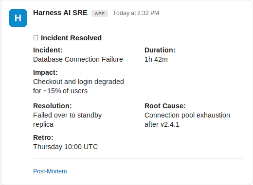
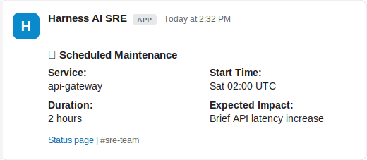

Harness AI SRE integrates with Slack at the organization level, enabling automated incident communication and team collaboration across all projects.

## Overview

Slack integration enables your runbooks to do the following:
- Send automated notifications
- Create incident-specific channels
- Manage threaded discussions
- Coordinate response teams
- Track incident updates

## Integration Setup

### Prerequisites
- Slack Workspace Admin access
- Harness Organization Admin role

### Setup Steps
1. Navigate to **Organization Settings** → **Third Party Integrations (AI SRE)**
2. Click **Connect** for Slack
3. Follow the OAuth flow to authorize Harness
4. Configure workspace permissions

### Required Slack Permissions
The Harness Slack bot requires these permissions:
- `channels:manage` - Create and manage channels
- `chat:write` - Send messages
- `groups:write` - Manage private channels
- `im:write` - Send direct messages

### Features
- Global Slack workspace access across all projects
- Unified authentication
- Centralized channel management
- Cross-project notifications

## Slack Actions in Runbooks

Slack actions are configured through a form. The fields shown depend on the action type you select.

### Send Slack Message Action

Sends a message to a specified Slack channel.

**Form Fields:**
- **Channel**: Channel name or ID (e.g., `#incidents` or `{{Activity.slack_channel}}`)
- **Message**: Message text to send
  - Supports Mustache variables: `{{Activity.title}}`, `{{Activity.summary}}`
  - Can include Slack markdown formatting (bold, italics, links)
  - Supports Block Kit JSON format for rich message layouts. Go to [Block Kit Formatting](#block-kit-formatting) for examples.

### Create Slack Channel Action

Creates a new Slack channel for incident coordination.

**Form Fields:**
- **Channel Name**: Name for the new channel (must follow Slack naming rules)
  - Example: `incident-{{Activity.id}}`
- **Description**: Channel topic/description
- **Is Private**: Whether to create a private channel

**Available Mustache Variables:**
- `{{Activity.title}}` - AI SRE incident title
- `{{Activity.id}}` - AI SRE incident ID
- `{{Activity.severity}}` - AI SRE incident severity
- `{{Activity.severity.id}}` - AI SRE incident severity ID (e.g., 1, 2, 3)
- `{{Activity.status}}` - AI SRE incident status
- `{{Activity.summary}}` - AI SRE incident summary
- Any custom incident fields configured in your incident template

## Block Kit Formatting

Harness AI SRE supports Slack's Block Kit JSON for rich layouts, including varied text sizes, colors, and formatting beyond basic markdown.

### When to Use Block Kit

Use Block Kit when you need:
- Visually distinct severity indicators
- Multi-section messages with different formatting
- Compact supplementary information
- Consistent message layouts across incidents
- Rich interactive elements (buttons, menus)

Use simple text when you need:
- Quick notifications without special formatting
- Plain status updates
- Messages with only basic markdown

### Format Overview

Block Kit messages are JSON arrays of block objects, each with a `type`. The Message field accepts plain text or Block Kit JSON.

:::note Line breaks in Block Kit JSON
The Message field is parsed as **strict JSON**. A string cannot span lines, so use the `\n` escape inside a value. A real newline or trailing backslash is invalid JSON and renders literally.

To keep the source readable, split content across multiple blocks or a section's `fields` array so each string stays short. The examples below use that approach.
:::

### Section Block

Use Section blocks for standard text with markdown — ideal for primary incident info and announcements.

**Example: Incident Alert with Severity**

```json
[
  {
    "type": "section",
    "text": {
      "type": "mrkdwn",
      "text": "*New SEV{{Activity.severity.id}} incident*"
    }
  }
]
```

**Rendered output in Slack:**


**Characteristics:**
- Standard text size
- Full markdown support (bold, italics, links, emoji)
- Black text on white background
- Suitable for primary content

**With Multiple Variables:**

A header section carries the title; a `fields` section holds metadata as label/value pairs, keeping each string short.
Use Context blocks for small, compact gray text, ideal for metadata or instructions that should be de-emphasized.
```json
[
  {
    "type": "section",
    "text": {
      "type": "mrkdwn",
      "text": "<!channel> :rotating_light: *{{Activity.title}}*"
    }
  },
  {
    "type": "section",
    "fields": [
      {
        "type": "mrkdwn",
        "text": "*Severity:*\nSEV{{Activity.severity.id}}"
      },
      { "type": "mrkdwn", "text": "*Status:*\n{{Activity.status}}" },
      { "type": "mrkdwn", "text": "*ID:*\n{{Activity.id}}" }
    ]
  }
]
```

**Rendered output in Slack:**



:::tip
A `fields` array renders as a two-column grid, filling left to right. With three fields, the first two share a row and the third sits below.

To stack values in one column instead, use a single section's `text` with `\n` separators:

```json
"text": "*Severity:* SEV{{Activity.severity.id}}\n*Status:* {{Activity.status}}"
```
:::

### Context Block

Use Context blocks for small, compact gray text — ideal for metadata or instructions that should be de-emphasized.

**Example: Supplementary Instructions**

```json
[
  {
    "type": "context",
    "elements": [
      {
        "type": "mrkdwn",
        "text": "*New SEV{{Activity.severity.id}} incident* – details above."
      }
    ]
  }
]
```

**Rendered output in Slack:**


**Characteristics:**
- Smaller text size
- Gray text color
- Markdown support in each element
- Suitable for secondary information

**Key Difference from Section Block:**
- Context blocks use an `elements` array (can contain multiple text elements)
- Section blocks use a single `text` object
- Context blocks render in a more compact, muted style

### Combining Blocks

Create rich, multi-section messages by combining block types. Blocks are rendered in array order.

**Example: Incident Notification with Details and Instructions**

Metadata goes in a `fields` section; the link sits in its own context block.

```json
[
  {
    "type": "section",
    "text": {
      "type": "mrkdwn",
      "text": "*New SEV{{Activity.severity.id}} Incident Detected*"
    }
  },
  {
    "type": "section",
    "fields": [
      { "type": "mrkdwn", "text": "*Title:*\n{{Activity.title}}" },
      { "type": "mrkdwn", "text": "*Status:*\n{{Activity.status}}" },
      { "type": "mrkdwn", "text": "*Summary:*\n{{Activity.summary}}" }
    ]
  },
  {
    "type": "context",
    "elements": [
      {
        "type": "mrkdwn",
        "text": "<{{Activity.url}}|Incident {{Activity.id}}>"
      }
    ]
  }
]
```

**Rendered output in Slack:**



### Divider Blocks

Add visual separation between sections using divider blocks.

```json
[
  {
    "type": "section",
    "text": {
      "type": "mrkdwn",
      "text": "*Incident Alert*"
    }
  },
  {
    "type": "divider"
  },
  {
    "type": "section",
    "text": {
      "type": "mrkdwn",
      "text": "Details go here..."
    }
  }
]
```

### Markdown Formatting

Within `mrkdwn` text fields, you can use:
- **Bold**: `*text*`
- **Italics**: `_text_`
- **Strikethrough**: `~text~`
- **Code**: `` `code` ``
- **Code block**: `` ```code block``` ``
- **Links**: `<URL|link text>`
- **User mentions**: `<@USER_ID>`
- **Channel mentions**: `<!channel>`, `<!here>`, `<#CHANNEL_ID>`
- **Emoji**: `:emoji_name:`
- **Line breaks**: `\n`

### Variable Interpolation

Mustache variables work seamlessly within Block Kit JSON. Variables are replaced before the JSON is sent to Slack.

**Examples:**
- `{{Activity.severity.id}}` → `1`, `2`, `3`
- `{{Activity.title}}` → `Database Connection Failure`
- `{{Activity.status}}` → `Investigating`, `Resolved`

The examples below link with `{{Activity.url}}` and `{{Activity.postmortem_url}}`, which are example custom fields holding the incident and post-mortem links. Use whatever link fields your incident template provides, or a full URL.

**Important:** Variables are auto-escaped, but ensure values contain no characters that break JSON (quotes, newlines).

### Common Templates

#### High Severity Incident Alert

```json
[
  {
    "type": "section",
    "text": {
      "type": "mrkdwn",
      "text": ":red_circle: *CRITICAL: SEV{{Activity.severity.id}} Incident*"
    }
  },
  {
    "type": "section",
    "text": {
      "type": "mrkdwn",
      "text": "*{{Activity.title}}*"
    }
  },
  {
    "type": "section",
    "fields": [
      { "type": "mrkdwn", "text": "*Status:*\n{{Activity.status}}" },
      { "type": "mrkdwn", "text": "*Impact:*\n{{Activity.summary}}" }
    ]
  },
  {
    "type": "divider"
  },
  {
    "type": "context",
    "elements": [
      {
        "type": "mrkdwn",
        "text": "ID: {{Activity.id}} | <{{Activity.url}}|Details>"
      }
    ]
  }
]
```

**Rendered output in Slack:**



#### Status Update Notification

```json
[
  {
    "type": "section",
    "text": {
      "type": "mrkdwn",
      "text": ":information_source: *Incident Status Update*"
    }
  },
  {
    "type": "section",
    "fields": [
      { "type": "mrkdwn", "text": "*Incident:*\n{{Activity.title}}" },
      { "type": "mrkdwn", "text": "*New Status:*\n{{Activity.status}}" }
    ]
  },
  {
    "type": "context",
    "elements": [
      {
        "type": "mrkdwn",
        "text": "{{Activity.updated_at}} | SEV{{Activity.severity.id}}"
      }
    ]
  }
]
```

**Rendered output in Slack:**



#### Resolution Notification

```json
[
  {
    "type": "section",
    "text": {
      "type": "mrkdwn",
      "text": ":white_check_mark: *Incident Resolved*"
    }
  },
  {
    "type": "section",
    "fields": [
      { "type": "mrkdwn", "text": "*Incident:*\n{{Activity.title}}" },
      {
        "type": "mrkdwn",
        "text": "*Severity:*\nSEV{{Activity.severity.id}}"
      },
      { "type": "mrkdwn", "text": "*Duration:*\n{{Activity.duration}}" }
    ]
  },
  {
    "type": "context",
    "elements": [
      {
        "type": "mrkdwn",
        "text": "Resolved | <{{Activity.postmortem_url}}|Post-Mortem>"
      }
    ]
  }
]
```

**Rendered output in Slack:**



### Limitations

When using Block Kit in Harness AI SRE, be aware of these constraints:

- **Block limit**: Slack allows up to 50 blocks per message
- **Text length**: Section and context text fields have a 3,000 character limit
- **JSON validation**: Invalid JSON will cause the action to fail. Validate syntax before deploying.
- **Interactive elements**: Buttons and menus display but are not interactive from AI SRE runbooks — they do not trigger callbacks.
- **Variable escaping**: Variables are auto-escaped, but ensure incident data has no malformed JSON characters.

### Testing Messages

Before deploying runbooks with Block Kit messages:

1. **Use Block Kit Builder**: Preview your JSON at [api.slack.com/block-kit](https://api.slack.com/block-kit/building).
2. **Test with static data**: Replace Mustache variables with example values to validate JSON syntax.
3. **Run in a test channel**: Execute the runbook in a non-production Slack channel first.
4. **Verify variable rendering**: Check that all `{{Activity.*}}` variables are replaced correctly in the execution logs.

### Migrating from Plain Text

If you have existing runbooks with plain text messages, you can migrate them to Block Kit:

**Before (Plain Text):**
```
⚠️ New SEV{{Activity.severity.id}} incident: {{Activity.title}}
Status: {{Activity.status}}
```

**After (Block Kit):**
```json
[
  {
    "type": "section",
    "text": {
      "type": "mrkdwn",
      "text": "*New SEV{{Activity.severity.id}} incident: {{Activity.title}}*"
    }
  },
  {
    "type": "section",
    "text": {
      "type": "mrkdwn",
      "text": "*Status:* {{Activity.status}}"
    }
  }
]
```

**Rendered output in Slack:**



**Benefits:**
- Better visual hierarchy
- Consistent formatting
- Easier to add sections without breaking layout

## Best Practices

### Channel Naming
- Use consistent prefixes: `incident-`, `alert-`, `sev1-`
- Include incident IDs: `incident-{{Activity.id}}-api`
- Keep names descriptive: `sev{{Activity.severity.id}}-{{Activity.service}}`
- Follow workspace conventions: lowercase, hyphens, no spaces
- Document naming patterns in runbook descriptions

### Message Structure
- **Use clear formatting**: Structure messages with headers, sections, and spacing
- **Include severity indicators**: Use emoji (🔴, ⚠️, ℹ️) or text prefixes (SEV1, SEV2)
- **Link to relevant resources**: Dashboards, runbooks, incident details, monitoring tools
- **Mention appropriate teams**: Use `<!channel>`, `<!here>`, or `<@USER_ID>` for targeted notifications
- **Prioritize readability**: Use Block Kit for complex messages, plain text for simple updates
- **Keep messages concise**: Slack messages should be scannable; avoid large blocks of text

### Block Kit Tips
- **Test before deploying**: Always preview Block Kit messages in Slack Block Kit Builder
- **Use Section blocks for primary content**: Main incident information, alerts, announcements
- **Use Context blocks for metadata**: Timestamps, IDs, supplementary instructions
- **Use `fields` for label/value pairs**: Keeps strings short and renders metadata in a tidy two-column grid
- **Add dividers for visual separation**: Break up long messages into logical sections
- **Validate JSON syntax**: Use a JSON validator before saving runbook actions
- **Use `\n` for line breaks**: Only the `\n` escape produces a line break — never a real newline or trailing backslash
- **Limit block count**: Keep messages under 20 blocks for best performance
- **Store templates**: Save common Block Kit patterns as runbook templates for reuse
- **Consider accessibility**: Ensure emoji and formatting convey meaning even without color

### Variable Usage
- **Validate variable names**: Ensure custom fields exist before using in messages
- **Use consistent naming**: Match variable names exactly (case-sensitive)
- **Provide context**: Include labels with variables (`*Severity:* {{Activity.severity.id}}`)
- **Test with sample data**: Replace variables with realistic values during testing
- **Handle missing data**: Consider what happens if a custom field is empty

### Permissions
- Use least privilege access: Only grant permissions needed for specific actions
- Regularly audit permissions: Review bot permissions quarterly
- Document access requirements: Maintain list of channels and permissions needed
- Monitor usage patterns: Track message volume and runbook execution frequency
- Rotate credentials: Update OAuth tokens according to security policies

## Common Use Cases

### Incident Coordination

**Workflow:**
1. Create incident-specific channel
2. Notify stakeholders with severity and context
3. Share initial assessment and runbook
4. Track response actions in threaded conversations

**Example Runbook Actions:**

**Action 1: Create Channel**
- **Action Type**: Create Slack Channel
- **Channel Name**: `incident-{{Activity.id}}-{{Activity.service}}`
- **Description**: `SEV{{Activity.severity.id}} - {{Activity.title}}`
- **Is Private**: False

**Action 2: Notify Team (Block Kit)**
- **Action Type**: Send Slack Message
- **Channel**: `#incidents`
- **Message**:
```json
[
  {
    "type": "section",
    "text": {
      "type": "mrkdwn",
      "text": "*SEV{{Activity.severity.id}} Incident Detected*"
    }
  },
  {
    "type": "section",
    "text": {
      "type": "mrkdwn",
      "text": "*{{Activity.title}}*"
    }
  },
  {
    "type": "section",
    "fields": [
      { "type": "mrkdwn", "text": "*Service:*\n{{Activity.service}}" },
      { "type": "mrkdwn", "text": "*Status:*\n{{Activity.status}}" },
      {
        "type": "mrkdwn",
        "text": "*Channel:*\n<#incident-{{Activity.id}}-{{Activity.service}}>"
      }
    ]
  },
  {
    "type": "context",
    "elements": [
      {
        "type": "mrkdwn",
        "text": "Coordinate above | <{{Activity.url}}|Details>"
      }
    ]
  }
]
```

**Rendered output in Slack:**



### Status Updates

**Workflow:**
1. Send periodic updates to incident channel
2. Track resolution progress with structured messages
3. Share metrics, graphs, and monitoring links
4. Document action items and next steps

**Example Runbook Action:**

**Action: Status Update (Block Kit)**
- **Action Type**: Send Slack Message
- **Channel**: `#incident-{{Activity.id}}-{{Activity.service}}`
- **Message**:
```json
[
  {
    "type": "section",
    "text": {
      "type": "mrkdwn",
      "text": ":information_source: *Status Update*"
    }
  },
  {
    "type": "section",
    "fields": [
      {
        "type": "mrkdwn",
        "text": "*Current Status:*\n{{Activity.status}}"
      },
      {
        "type": "mrkdwn",
        "text": "*Progress:*\n{{Activity.progress_description}}"
      },
      {
        "type": "mrkdwn",
        "text": "*Next Steps:*\n{{Activity.next_steps}}"
      }
    ]
  },
  {
    "type": "divider"
  },
  {
    "type": "context",
    "elements": [
      {
        "type": "mrkdwn",
        "text": "Updated by {{Activity.updated_by}} at {{Activity.updated_at}}"
      }
    ]
  }
]
```

**Rendered output in Slack:**



### Post-Incident Communication

**Workflow:**
1. Send resolution notification
2. Share incident summary and timeline
3. Schedule retrospective meeting
4. Archive incident channel
5. Document lessons learned

**Example Runbook Actions:**

**Action 1: Resolution Notice (Block Kit)**
- **Action Type**: Send Slack Message
- **Channel**: `#incident-{{Activity.id}}-{{Activity.service}}`
- **Message**:
```json
[
  {
    "type": "section",
    "text": {
      "type": "mrkdwn",
      "text": ":white_check_mark: *Incident Resolved*"
    }
  },
  {
    "type": "section",
    "fields": [
      { "type": "mrkdwn", "text": "*Incident:*\n{{Activity.title}}" },
      {
        "type": "mrkdwn",
        "text": "*Duration:*\n{{Activity.duration}}"
      },
      {
        "type": "mrkdwn",
        "text": "*Impact:*\n{{Activity.impact_summary}}"
      }
    ]
  },
  {
    "type": "section",
    "fields": [
      {
        "type": "mrkdwn",
        "text": "*Resolution:*\n{{Activity.resolution_summary}}"
      },
      {
        "type": "mrkdwn",
        "text": "*Root Cause:*\n{{Activity.root_cause}}"
      },
      {
        "type": "mrkdwn",
        "text": "*Retro:*\n{{Activity.retro_date}}"
      }
    ]
  },
  {
    "type": "divider"
  },
  {
    "type": "context",
    "elements": [
      {
        "type": "mrkdwn",
        "text": "<{{Activity.postmortem_url}}|Post-Mortem>"
      }
    ]
  }
]
```

**Rendered output in Slack:**



**Action 2: Archive Channel**
- **Action Type**: Archive Slack Channel
- **Channel**: `incident-{{Activity.id}}-{{Activity.service}}`

### Maintenance Notifications

**Example Runbook Action:**

**Action: Maintenance Alert (Block Kit)**
- **Action Type**: Send Slack Message
- **Channel**: `#engineering`
- **Message**:
```json
[
  {
    "type": "section",
    "text": {
      "type": "mrkdwn",
      "text": ":construction: *Scheduled Maintenance*"
    }
  },
  {
    "type": "section",
    "fields": [
      { "type": "mrkdwn", "text": "*Service:*\n{{Activity.service}}" },
      {
        "type": "mrkdwn",
        "text": "*Start Time:*\n{{Activity.maintenance_start}}"
      },
      {
        "type": "mrkdwn",
        "text": "*Duration:*\n{{Activity.maintenance_duration}}"
      },
      {
        "type": "mrkdwn",
        "text": "*Expected Impact:*\n{{Activity.expected_impact}}"
      }
    ]
  },
  {
    "type": "context",
    "elements": [
      {
        "type": "mrkdwn",
        "text": "<https://status.example.com|Status page> | <#sre-team>"
      }
    ]
  }
]
```

**Rendered output in Slack:**



## Troubleshooting

<details>
<summary><strong>Message does not appear in Slack channel</strong></summary>

**Check the following:**

1. Verify the Slack integration is connected in **Organization Settings**
2. Confirm the channel name or ID is correct
3. Ensure the Harness bot has been added to the channel
4. Check runbook execution logs for error messages
5. Verify the bot has `chat:write` permission

**If using a private channel**, the bot must be explicitly invited to the channel before it can post messages.

</details>

<details>
<summary><strong>Block Kit JSON message fails to send</strong></summary>

**Possible causes:**

- Invalid JSON syntax (missing brackets, commas, quotes)
- A real newline or a trailing backslash (`\`) used inside a string instead of the `\n` escape
- Mustache variable rendering breaks JSON structure
- Block type not supported or misspelled
- Text length exceeds 3,000 character limit

**Resolution:**

1. Validate JSON syntax using [jsonlint.com](https://jsonlint.com)
2. Test Block Kit structure in [Slack Block Kit Builder](https://api.slack.com/block-kit/building)
3. Replace Mustache variables with sample values to test JSON validity
4. Check runbook execution logs for specific JSON parsing errors
5. Ensure all text fields use `\n` for line breaks (not actual newlines, and not a trailing backslash)

**Common JSON errors:**
```json
Wrong: "text": "Line 1
Line 2"

Wrong: "text": "Line 1\
Line 2"

Correct: "text": "Line 1\nLine 2"
```

To narrow the source, split content across multiple blocks or a `fields` array rather than wrapping one long string.

</details>

<details>
<summary><strong>Mustache variables do not render in Block Kit messages</strong></summary>

**Possible causes:**

- Variable name is misspelled or does not exist
- Custom incident field is not populated
- Variable syntax is incorrect

**Resolution:**

1. Verify the name matches exactly (case-sensitive): `{{Activity.severity.id}}`, not `{{activity.severity.id}}`
2. Check that custom incident fields are populated before the runbook executes
3. Use correct Mustache syntax: `{{variable}}` not `{variable}` or `$variable`
4. Test with standard variables first (`{{Activity.id}}`, `{{Activity.title}}`)
5. Review runbook execution logs to see rendered output

</details>

<details>
<summary><strong>Block Kit message appears but formatting is wrong</strong></summary>

**Possible causes:**

- Using wrong block type for desired layout
- Markdown not enabled (`plain_text` instead of `mrkdwn`)
- Emoji codes not recognized by Slack
- Link formatting incorrect

**Resolution:**

1. Ensure `"type": "mrkdwn"` is set in text objects (not `"plain_text"`)
2. Test emoji codes in Slack directly (`:rotating_light:`, `:red_circle:`)
3. Use correct link syntax: `<URL|link text>` not `[link text](URL)`
4. Preview in Block Kit Builder before deploying
5. Check that Section blocks use `text` object, Context blocks use `elements` array

</details>

<details>
<summary><strong>Authentication failures</strong></summary>

**Possible causes:**

- OAuth token expired or revoked
- Slack workspace admin disabled the app
- Bot removed from workspace

**Resolution:**

1. Verify OAuth tokens in **Organization Settings** → **Third Party Integrations (AI SRE)**
2. Check permission scopes match required permissions
3. Confirm workspace access for the authorized user
4. Re-authorize the Slack integration if necessary

</details>

<details>
<summary><strong>Channel creation errors</strong></summary>

**Possible causes:**

- Channel name violates Slack naming conventions
- Workspace channel limit reached
- Bot lacks `channels:manage` permission

**Resolution:**

1. Check naming conventions: lowercase, no spaces, hyphens allowed
2. Verify channel limits in Slack workspace settings
3. Confirm bot has `channels:manage` permission
4. Ensure channel name does not already exist

</details>

<details>
<summary><strong>Rate limit errors</strong></summary>

**Possible causes:**

- Runbook sending too many messages in short period
- Multiple runbooks executing simultaneously
- Slack API rate limits exceeded

**Resolution:**

1. Add delays between message actions in runbook
2. Consolidate multiple messages into single Block Kit message
3. Review Slack API rate limits: [api.slack.com/docs/rate-limits](https://api.slack.com/docs/rate-limits)
4. Implement conditional logic to reduce message frequency

</details>

## Quick Reference

### Structure Comparison

| Feature | Section Block | Context Block |
|---------|--------------|---------------|
| **Text Size** | Standard | Smaller, compact |
| **Text Color** | Black | Gray |
| **Use Case** | Primary content | Supplementary info |
| **Structure** | Single `text` object | Array of `elements` |
| **Markdown** | ✅ Supported | ✅ Supported |

### Common Patterns

**Simple Alert:**
```json
[
  {
    "type": "section",
    "text": { "type": "mrkdwn", "text": "Alert message" }
  }
]
```

**Alert with Metadata:**
```json
[
  {
    "type": "section",
    "text": { "type": "mrkdwn", "text": "Main message" }
  },
  {
    "type": "context",
    "elements": [
      { "type": "mrkdwn", "text": "Metadata" }
    ]
  }
]
```

**Multi-Section with Divider:**
```json
[
  {
    "type": "section",
    "text": { "type": "mrkdwn", "text": "Section 1" }
  },
  { "type": "divider" },
  {
    "type": "section",
    "text": { "type": "mrkdwn", "text": "Section 2" }
  }
]
```

**Label/Value Metadata (two-column):**
```json
[
  {
    "type": "section",
    "fields": [
      {"type": "mrkdwn", "text": "*Label A:*\nValue A"},
      {"type": "mrkdwn", "text": "*Label B:*\nValue B"}
    ]
  }
]
```

### Essential Variables

| Variable | Description | Example Output |
|----------|-------------|----------------|
| `{{Activity.id}}` | Incident ID | `INC-12345` |
| `{{Activity.title}}` | Incident title | `Database Connection Failure` |
| `{{Activity.severity.id}}` | Severity level number | `1`, `2`, `3` |
| `{{Activity.status}}` | Current status | `Investigating`, `Resolved` |
| `{{Activity.service}}` | Affected service | `api-gateway` |

### Slack Markdown

| Format | Syntax | Example |
|--------|--------|---------|
| Bold | `*text*` | `*Critical*` |
| Italic | `_text_` | `_investigating_` |
| Strike | `~text~` | `~resolved~` |
| Code | `` `text` `` | `` `error_code` `` |
| Link | `<URL\|text>` | `<https://example.com\|Dashboard>` |
| Mention | `<@USER>` | `<@U12345>` |
| Channel | `<!channel>` | `<!channel>` |

### Resources

- **Slack Block Kit Builder**: [api.slack.com/block-kit/building](https://api.slack.com/block-kit/building)
- **Block Kit Reference**: [api.slack.com/reference/block-kit](https://api.slack.com/reference/block-kit)
- **Slack Markdown Reference**: [api.slack.com/reference/surfaces/formatting](https://api.slack.com/reference/surfaces/formatting)
- **JSON Validator**: [jsonlint.com](https://jsonlint.com)

## Next Steps

- Go to [Slack Commands](/docs/ai-sre/get-started/slack-commands) to learn about Slack slash commands for incident management.
- Go to [Configure Microsoft Teams Integration](./teams.md) to set up Microsoft Teams notifications.
- Go to [Configure Zoom Integration](./zoom.md) to create incident war rooms.
- Go to [Create a Runbook](../create-runbook) to build automated response workflows.