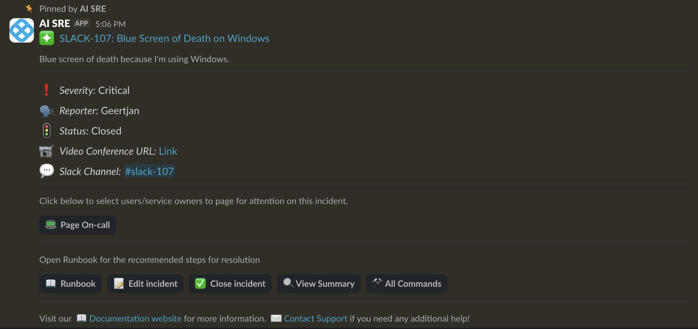
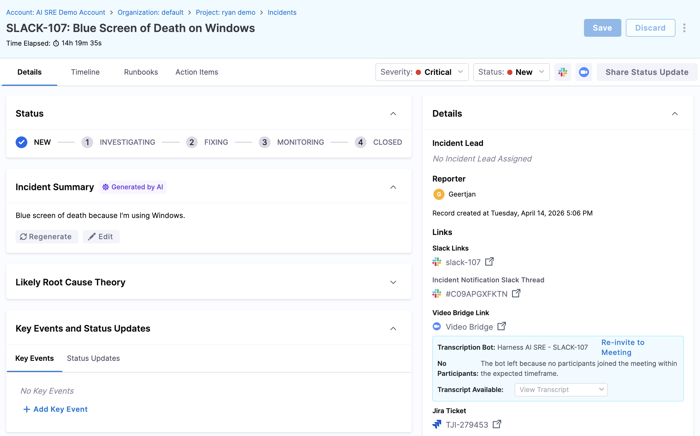

When you are paged for an incident, the first few minutes matter. 

This page walks you through opening the incident, understanding what is happening, and letting your team know you are responding.

## Respond to the notification

You receive an incident notification through one or more channels, such as Slack, Microsoft Teams, Google Chat, PagerDuty, Opsgenie, mobile push, email, SMS, or phone call, depending on your contact settings.

1. Click the notification link to open the **Incident Details** page in Harness.

   

2. If you are on mobile, you can also acknowledge directly from the Harness On-Call app.

---

## Review the incident summary

Before taking action, orient yourself:

- **Severity** and **incident type:** Understand the scope and priority level.
- **Timeline:** See the sequence of alerts and events that triggered the incident.
- **Related alerts:** View correlated monitoring data and identify affected services.
- **Assignee:** Check if someone else is already working on it.

---

## Acknowledge the incident

Click **Acknowledge** to signal to your team that you are on it. Acknowledging:

- Stops escalation at your level (the page will not continue climbing the escalation policy).
- Updates the incident status so teammates and stakeholders know someone is responding.
- Logs the acknowledgment in the incident timeline with a timestamp.

You can acknowledge from any platform, web, Slack, or the mobile app, and it syncs everywhere in real time.

---

## Assess impact

Once acknowledged, quickly assess the blast radius before diving into troubleshooting:

- **Which services are affected?** Check the related alerts and monitoring dashboards.
- **Who is impacted?** Determine whether this affects internal users, external customers, or both.
- **What is the business impact?** Consider revenue, SLA commitments, and reputational risk.
- **Is the severity accurate?** If the impact is larger or smaller than the initial classification, update the severity field now.

This assessment informs your next steps, whether you handle it yourself, pull in additional responders, or escalate.

---

## Next steps

- [Update incident details](/docs/ai-sre/users/manage-incidents/update-incident-details): Edit fields, change status, and add key events.
- [Execute runbooks](/docs/ai-sre/users/manage-incidents/execute-runbooks): Run the response procedures associated with the incident.