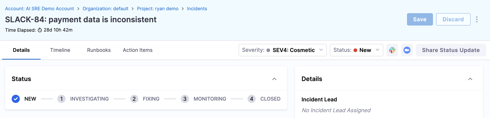
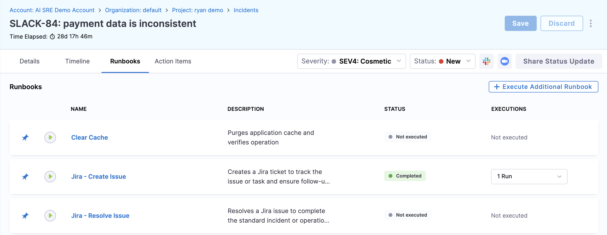

Runbooks are predefined response procedures that guide you through incident remediation. 

They can include automated actions (restart a service, scale infrastructure, query logs) and manual steps (verify with a customer, check a dashboard). 

Executing runbooks during an incident ensures you follow standardized procedures rather than working from memory under pressure.

## View attached runbooks

Some runbooks are automatically attached to an incident based on the incident type and trigger conditions configured by your administrator.

1. Open the **Incident Details** page.
2. Click the **Runbooks** tab.

   

3. Review any runbooks that are already attached.

   

---

## Execute a runbook

### From the Harness UI

Run an attached or additional runbook directly from the incident details page:

1. On the **Runbooks** tab, click **Execute** on an attached runbook, or click **Execute Additional Runbook** to add and run a different one.
2. If adding a new runbook, search for or browse available runbooks, select the appropriate one, and confirm.
3. Work through the steps in order:
   - **Automated steps** run on their own and report results (success, failure, output). Review the results before proceeding.
   - **Manual steps** provide instructions for you to follow. Mark each step complete as you go.
4. Execution progress is logged in the incident timeline, giving full visibility to other responders and stakeholders.
5. Click **Close** when execution is completed.

### From Slack using slugs

If your runbooks have been configured with slugs, you can execute them directly from Slack without navigating the Harness UI.

**Prerequisites:**
- **Slack authentication:** You must authenticate Slack with Harness AI SRE before using slug commands.
- **Runbook slugs configured:** Administrators must assign slugs to runbooks. Go to [Create runbooks](/docs/ai-sre/runbooks/create-runbook#configure-runbook-slugs) to configure slugs.

**Execute a runbook by slug:**

From an incident Slack channel, type:

```text
/harness run <slug>
```

Replace `<slug>` with the runbook's short identifier (e.g., `/harness run restart-pods`).

**List available slugs:**

If you do not know which slugs are available, type:

```text
/harness run
```

The system responds with a list of all runbook slugs available for the current project and incident.

**Why use Slack slugs?**
- **Faster response:** Execute runbooks instantly without switching tools during high-pressure incidents.
- **Muscle memory:** Common slugs (e.g., `rollback`, `scale-up`) become second nature to on-call responders.
- **Lower MTTR:** Reduce mean time to resolution by removing UI navigation from the response path.

Go to [Use Slack commands](/docs/ai-sre/get-started/slack-commands#run-runbooks-with-slugs) to review the complete documentation on runbook slug commands.

---

## Choose the right runbook

If you are unsure which runbook to use:

- **Check the incident type:** Your administrator has likely associated recommended runbooks with each type. Auto-attached runbooks are the first place to look.
- **Browse the runbook library:** Navigate to **Runbooks** in the left panel to see all available runbooks, their descriptions, and which incident types they are designed for.
- **Ask your team:** If multiple runbooks seem applicable, check with teammates in the incident channel.

---

## Best practices

Follow these practices when running runbooks during an incident:

- **Start with auto-attached runbooks:** They are pre-selected for the incident type and are usually the most relevant first response.
- **Review automated step results before moving on:** An automated step might fail or return unexpected output. Verify before proceeding to the next step.
- **Do not skip manual steps:** Even if you think you know the procedure, follow the runbook. It exists to prevent steps from being missed during high-pressure situations.
- **Note deviations:** If you need to deviate from the runbook (a step does not apply, you take a different action), document what you did in the [incident timeline](/docs/ai-sre/users/manage-incidents/use-the-incident-timeline) so it is captured for post-incident review.

---

## Next steps

- Go to [Create runbooks](/docs/ai-sre/runbooks/create-runbook) to build and configure your own response procedures.
- Go to [Use Slack commands](/docs/ai-sre/get-started/slack-commands) to run runbooks and manage incidents from Slack.
- Go to [Update incident details](/docs/ai-sre/users/manage-incidents/update-incident-details) to keep the incident record current as you remediate.