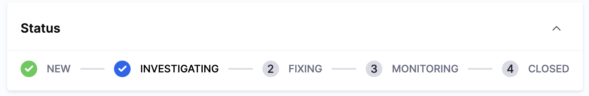

As you investigate and work toward resolution, keep the incident record current. 

Accurate details help stakeholders stay informed, trigger the right automated workflows, and create a reliable record for post-incident review.

## Edit incident fields

Update any incident field directly from the incident details page:

- Use the **Edit** icon next to any field to edit it inline (severity, assignee, affected services, etc.).
- Click **Edit** on the **Incident Summary** to update the description with new findings or context.
- Click **Save** after making changes.

Update fields whenever the situation changes, for example, if you discover additional affected services or need to reassign the incident to another responder.

---

## Update incident status

Keep the status current as you work through the incident. Status changes are visible to all stakeholders and may trigger automated workflows.

| Status | Meaning |
| --- | --- |
| **Investigating** | You are actively looking into the issue. |
| **Identified** | Root cause or a contributing factor has been found. |
| **Monitoring** | A fix has been applied; you are watching for stability. |
| **Resolved** | The incident is closed. |

Change the status from the incident details page by clicking the status field and selecting the new value.

---

## Add key events

Key events mark important milestones: root cause identified, mitigation applied, service restored, a decision to escalate, an external communication sent, etc.

1. Click **Add Key Event** on the incident details page.
2. Enter a description of what happened.
3. Click the check mark to save.
4. Click **Save** from the top right.

Key events appear in the incident timeline and are used by the [AI Scribe Agent](/docs/ai-sre/ai-agent) when generating post-incident summaries. Adding them as they happen, rather than reconstructing after the fact, produces a more accurate record.

---

## Send status updates

Keep stakeholders informed without interrupting the incident response by sending structured status updates via email. Status updates are delivered to all users and teams subscribed to the incident's impacted services.

### Send a status update

Compose and send a status update to subscribed stakeholders:

1. Open the **Incident Details** page.
2. Click **Status Update** (typically in the top action bar).
3. Review the pre-populated email template:
   - **Subject:** Default format is "AI SRE Status update for incident [incident-ID]"
   - **Message body:** Includes incident ID, title, summary, impacted services, and current status
4. Edit the subject and message as needed:
   - Add business context (customer impact, revenue impact, etc.)
   - Include mitigation actions taken
   - Set expectations for next steps and timeline
5. Review the **recipient preview**:
   - The system shows all resolved recipients and the total email count
   - Recipients are automatically gathered from all impacted services' subscriber lists
   - Duplicates are removed if a stakeholder is subscribed to multiple impacted services
6. Click **Send**.

### When to send status updates

Send updates at significant milestones during the incident:

- **Status change:** When moving from Investigating to Identified to Monitoring to Resolved
- **Mitigation applied:** After deploying a fix or implementing a workaround
- **Scope change:** When additional services are impacted or the severity changes
- **Customer impact:** When customer-facing impact begins or ends
- **Extended incidents:** For long-running incidents, send periodic updates even if status has not changed (e.g., every 2 hours)

### Email delivery

Status updates are delivered with the following characteristics:

- **Delivery channel:** Email only (from `aisre-noreply@harness.io`)
- **Format:** Branded HTML email with header and footer images
- **Timeline record:** A "Status Update Sent" event is added to the incident timeline when delivery succeeds

:::tip Reduce interruptions
Status updates allow stakeholders to stay informed without joining the incident war room or interrupting responders with "what is the status?" messages. Send updates proactively at key milestones.
:::

---

## Best practices

Follow these practices to keep the incident record accurate and useful:

- **Update status as soon as the phase changes:** Do not wait until resolution to batch-update. Real-time status drives stakeholder confidence and automated workflows.
- **Be specific in key events:** "Identified root cause: connection pool exhaustion on db-primary-01" is far more useful than "Found the issue."
- **Reassign when appropriate:** If you have identified that the incident belongs to another team or specialist, update the assignee and notify them.

---

## Next steps

- Go to [Execute runbooks](/docs/ai-sre/users/manage-incidents/execute-runbooks) to run automated remediation during an incident.
- Go to [Manage incidents](/docs/ai-sre/incidents) to review the full incident response workflow.
- Go to [AI Scribe Agent](/docs/ai-sre/ai-agent) to understand how key events feed post-incident summaries.