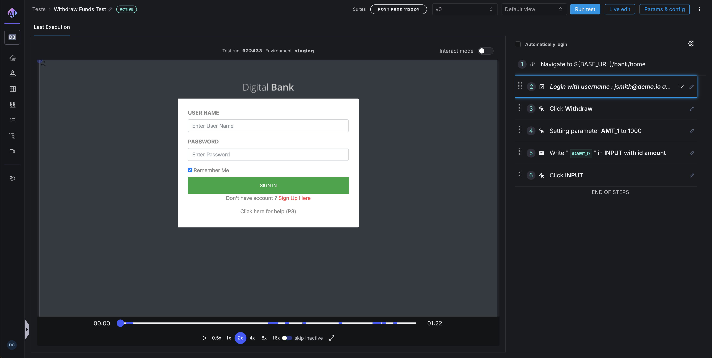
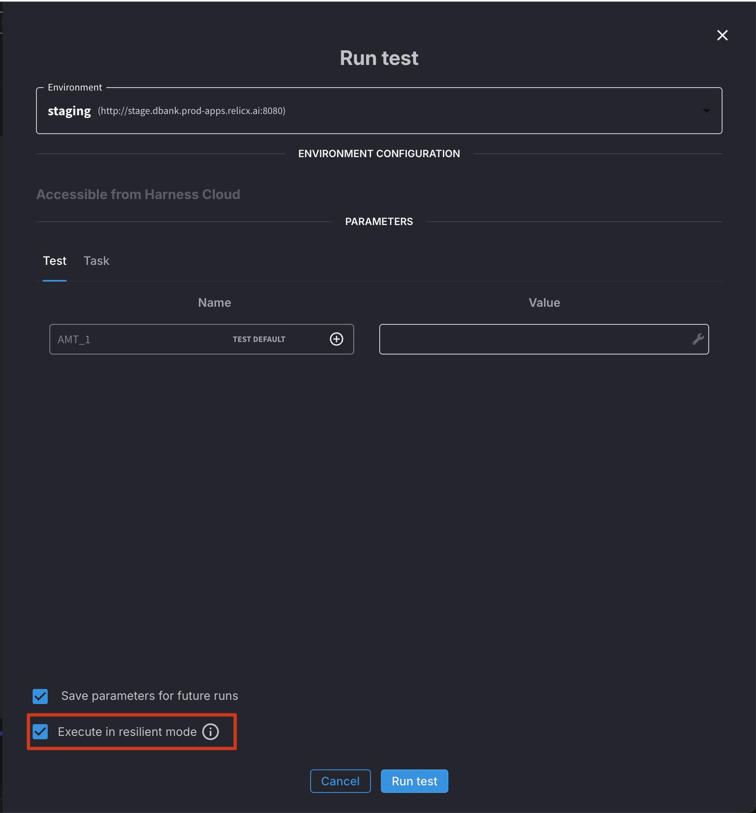
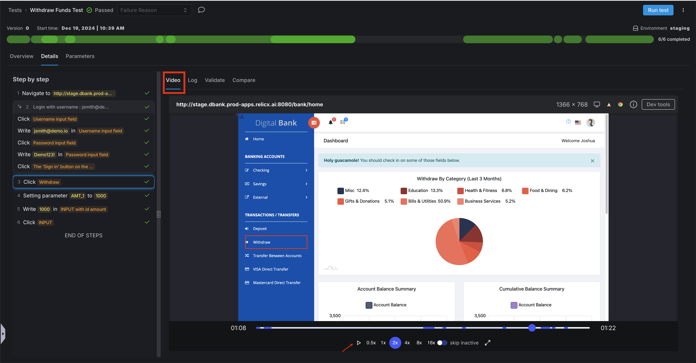

## Introduction

Harness AI Test Automation offers a powerful platform for creating, managing, and executing end-to-end tests, combining traditional automation approaches with cutting-edge AI capabilities.

This guide outlines proven strategies and best practices for maximizing the effectiveness of your testing efforts with Harness AI Test Automation. By following these recommendations, you'll create more maintainable test suites, reduce flakiness, and build reliable automation that supports your development workflows.

## 1\. Designing Tests

The foundation of effective test automation begins with thoughtful test design. Well-structured tests are easier to maintain, provide clearer feedback, and create less technical debt over time.

### Write Small Tests That Reflect a Workflow

Large, monolithic tests that attempt to validate too many features at once often become maintenance nightmares. Instead:

- **Focus on specific user journeys**: Design each test to validate a single, coherent user workflow (e.g., "User can log in and view their profile" or "Admin can create a new product category").  
- **Limit test scope**: A good rule of thumb is that a test should validate a single feature or functionality. If a test is validating multiple unrelated features, consider breaking it into separate tests.  
- **Consider test independence**: Each test should be capable of running independently without relying on the state created by other tests. This prevents cascading failures where one failed test causes many others to fail.  
- **Prioritize readability**: Name your tests descriptively so that their purpose is immediately clear. A test named "userCanSubmitOrderWithValidCreditCard" is much more informative than "testOrder001".  
- **Size of tests** \- Tests exceeding 50 steps present significant maintenance challenges, resulting in increased troubleshooting difficulty and reduced debugging efficiency

When tests are small and focused, several benefits emerge:

- Faster identification of issues when tests fail  
- Easier maintenance as the application evolves  
- More reliable test execution since there are fewer potential points of failure  
- Clearer documentation of application functionality through the test suite

### Leverage Tasks to Avoid Repetition

Duplication within a test suite can quickly lead to maintenance challenges. When the same sequence of steps appears in multiple tests, any change to that sequence requires updates in multiple places.

Tasks in Harness AI Test Automation solve this problem by allowing you to encapsulate and reuse common sequences of steps:

- **Identify common workflows**: Look for sequences of steps that appear in multiple tests, such as login procedures, navigation to specific areas of the application, or data setup routines.  
- **Create reusable tasks**: Extract these common sequences into tasks with descriptive names like "Login as Administrator" or "Navigate to User Profile".  
- **Parameterize where needed**: Make tasks flexible by adding parameters. For example, a "Login" task could accept username and password parameters, making it usable for different user types.  
- **Maintain a task library**: Document available tasks and their purposes to encourage reuse across the testing team.

Benefits of effectively using tasks include:

- **Single point of maintenance**: When application changes require updating a sequence of steps, you only need to update the task definition once.  
- **Consistency across tests**: Using the same task ensures that all tests interact with the application in a consistent manner.  
- **Reduced test authoring time**: New tests can be created more quickly by assembling existing tasks.  
- **Improved readability**: Tests become more declarative and easier to understand when they use well-named tasks.

Current limitations in task lifecycle management 

- **Tasks lack versioning functionality** \- exercise caution when modifying tasks used across multiple tests  
-  **Nested task execution (tasks calling other tasks)** \- is currently unsupported but planned for future implementation

### Add Assertions Liberally

Assertions are the validation points in your tests—they verify that the application is behaving as expected. Without sufficient assertions, a test might run through all its steps successfully but fail to detect that the application is producing incorrect results.

- **Assert early and often**: Don't wait until the end of a test to verify results. Add assertions throughout the test to validate intermediate states.  
- **Validate both UI elements and data**: Assertions should check not only that elements are present but also that they contain the expected data.  
- **Assert negative conditions where appropriate**: Sometimes it's important to verify that something does NOT happen or is NOT visible. For e.g. You can write an assertion \- can you make sure the login screen is not visible ?   
- **Use specific assertions**: Instead of generic existence checks, use more specific assertions like verifying text content, attribute values, or element states.

## 2\. Working with Dynamic Data

Modern web applications present significant challenges for traditional test automation. Dynamic content, asynchronous loading, and complex interactive elements can make tests brittle and unreliable. Harness AI Test Automation is specifically designed to address these challenges.

### Maximize Harness AI for Dynamic Applications

The AI capabilities in Harness test automation provide sophisticated solutions to common testing challenges:

- **Handling dynamic IDs and selectors**: Traditional selectors often break when developers make changes or when elements have dynamically generated IDs. Harness AI recognizes elements based on (Smart Selectors) their visual appearance, position, surrounding context, and other attributes that remain more stable.  
- **Adapting to visual changes**: Minor UI updates that would break traditional selectors are often handled automatically by the AI, reducing maintenance overhead.  
- **Managing timing issues**: The AI can intelligently wait for elements to become interactive, even when loading times vary or when complex animations are present.  
- **Understanding application context**: The AI can interpret the current state of the application to make more reliable decisions about how to interact with elements.

To get the most from these capabilities:

- **Use AI-based commands for dynamic situations**: When possible, use AI-powered commands over traditional selector-based approaches when the test criteria is dynamic. For e.g. You want to select an available room in the booking system or select the cheapest flight   
  .  
- **Provide clear context**: When instructing the AI to interact with elements, provide descriptive information about what you're trying to achieve.  
- **Trust the intelligence**: AI often requires less explicit instruction than traditional automation. For example, rather than adding explicit waits, let the AI determine when elements are ready for interaction.  
- **Test in varied conditions**: Verify that your AI-powered tests work consistently across different data states, screen sizes, and application conditions.

### Follow AI-Based Command Best Practices

For detailed guidance on maximizing the effectiveness of AI-based commands, refer to our comprehensive documentation at [https://docs.relicx.ai/best-practices-ai-based-commands.](https://docs.google.com/document/d/1DOet8UOg2JDdfTdWyVLLpkhG_X1TykIpUv5szuTnK5Q/edit?usp=sharing)

Key recommendations from this guide include:

- **Use descriptive natural language**: When creating AI commands, describe the target element in natural language that a human would understand. For example, "Click the Submit button at the bottom of the form" is more effective than "Click button with text 'Submit'".  
- **Provide sufficient context**: Include information about where the element can be found on the page. For example, "Click the Edit button in the User Profile section" provides more context than simply "Click the Edit button".  
- **Leverage visual characteristics**: Describe visual attributes like color, size, or position when they help identify the target element.  
- **Test with variations**: Verify that your AI commands work with different application states, data, and layouts.  
- **Refine based on performance**: If an AI command is not consistently performing as expected, refine your description to provide more specific guidance.  
- **Combine with traditional approaches when necessary**: For highly complex scenarios, consider using a combination of AI-based and traditional selector-based approaches.

## 3\. Editing Tests

As your application evolves, you'll need to update your tests to reflect new features, changed workflows, or improved testing strategies. Harness AI Test Automation offers two distinct approaches to test editing, each optimized for different scenarios.

### Choose the Right Editing Mode

#### Quick Edit

Quick Edit is designed for rapid, straightforward modifications that don't significantly alter the test's navigation flow. It provides a streamlined interface for making targeted changes without re-executing the entire test.

**When to use Quick Edit:**

- **Making minor modifications**: When you need to adjust element selectors, update expected values, or modify simple actions  
- **Adding non-interactive steps**: Inserting wait conditions, log statements, or comments  
- **Working with assertions and conditionals**: Adding or modifying verification points and conditional logic  
- **Removing steps that don't affect navigation**: Deleting actions that don't cause page transitions or major state changes

**Advantages of Quick Edit:**

- **Speed**: Changes can be made rapidly without waiting for the browser to execute each step  
- **Efficiency**: Simple modifications can be completed in seconds rather than minutes  
- **Low overhead**: No need to spin up additional resources for browser execution

**Limitations of Quick Edit:**

- **Limited validation**: Changes aren't immediately verified against the application  
- **Risk of errors**: Without execution validation, there's a higher chance of introducing broken steps  
- **Not suitable for complex changes**: Significant modifications to test flow are better handled through Live Edit

**How to use Quick Edit effectively:**

- Access Quick Edit through the test details page

- Make targeted changes to specific steps  
- Consider running the modified test after editing to verify your changes  
- Use the test details page to access additional options like cloning tests or reviewing version history

#### Live Edit

Live Edit provides a more comprehensive editing experience where each step is executed as you modify the test. This approach gives immediate feedback on whether your changes are working correctly.

**When to use Live Edit:**

- **Adding steps that cause navigation**: When inserting actions that will open new pages or modals  
- **Removing navigation-triggering steps**: When deleting steps that affect the application's navigation flow  
- **Creating new scenarios**: When building entirely new paths through the application  
- **Making complex modifications**: When changes might affect the test's ability to complete subsequent steps

**Advantages of Live Edit:**

- **Immediate validation**: Each change is verified against the actual application behavior  
- **Greater reliability**: Less chance of creating broken tests since each step is executed  
- **Visual confirmation**: You can see exactly how the application responds to each action  
- **Better for complex changes**: Provides the necessary context for more significant modifications

**Limitations of Live Edit:**

- **Slower process**: Executing each step takes time, especially for longer tests  
- **Resource intensive**: Requires a browser instance and potentially more computing resources  
- **May require complete test execution**: Sometimes you need to work through the entire test to make late-stage changes

**How to use Live Edit effectively:**

- Click the Live Edit button to launch the editing session  
- Be patient as steps execute in sequence  
- Use the opportunity to verify that existing steps still work correctly  
- Consider whether your changes might affect subsequent steps

### Best Practices for Test Editing

Regardless of which editing mode you choose, follow these general principles for effective test maintenance:

- **Document your changes**: Add comments explaining why changes were made, especially for workarounds or complex solutions  
- **Test after editing**: Always run the modified test end-to-end to verify that it still works correctly  
- **Consider impact on other tests**: If you're modifying shared components like tasks, consider how changes might affect other tests  
- **Preserve test intent**: Ensure that your modifications don't alter the fundamental purpose of the test  
- **Review version history**: Before making significant changes, review the test's version history to understand its evolution  
- **Consider creating a new test**: If changes are substantial, it might be better to create a new test rather than heavily modifying an existing one

Effective test editing requires balancing speed and reliability. By choosing the right editing mode for each situation, you can maintain your test suite efficiently while ensuring it remains robust and dependable.

## 4\. Running Tests

How you execute your tests can significantly impact their reliability, speed, and usefulness in your development process. Harness AI Test Automation offers several options for test execution, each with different characteristics and advantages.

### Choose the Appropriate Execution Mode

#### Resilient Mode (Recommended) 

Resilient Mode is designed to maximize the reliability of test execution, particularly in environments with variable performance or when testing complex applications.

**Key characteristics of Resilient Mode:**

- **Intelligent waiting**: Automatically waits for elements to be ready for interaction before proceeding  
- **Dynamic timing adjustments**: Adapts wait times based on application responsiveness  
- **Retry logic**: Attempts to recover from intermittent failures when possible  
- **Stability detection**: Waits for the page to stabilize before proceeding to the next step  
- **Comprehensive failure information**: Provides detailed diagnostics when issues occur

**Best practices for Resilient Mode:**

- **Use as your default execution mode**: Especially for CI/CD pipelines and scheduled test runs  
- **Minimize explicit waits**: The built-in intelligence usually handles timing issues automatically  
- **Set appropriate timeouts**: Configure maximum wait times based on your application's typical performance  
- **Monitor execution times**: Watch for trends that might indicate performance degradation  
- **Review failure details**: When tests fail in Resilient Mode, carefully examine the provided diagnostics

#### Non-resilient Mode

Non-resilient Mode prioritizes speed over automatic recovery mechanisms. It's suitable for well-controlled environments or when execution speed is critical.

**Key characteristics of Non-resilient Mode:**

- **Faster execution**: Completes tests more quickly by eliminating some automatic waiting  
- **Less overhead**: Reduces the computational resources required for test execution  
- **More predictable timing**: Execution speed is more consistent across runs  
- **Requires explicit waits**: You must add wait conditions where needed  
- **Less fault tolerance**: More likely to fail when encountering timing issues

**Best practices for Non-resilient Mode:**

- **Use for speed-critical scenarios**: When test execution time is a primary concern  
- **Add strategic waits**: Insert explicit wait conditions before interactions with elements that might not be immediately ready  
- **Test in stable environments**: Ideally, use in environments with consistent performance  
- **Implement error handling**: Consider adding additional error recovery logic in your tests  
- **Monitor failure patterns**: Watch for failures that may indicate missing wait conditions

**Selecting the right mode for your needs:**

- Consider using Resilient Mode for:  
    
  - CI/CD pipelines  
  - Overnight or scheduled runs  
  - Tests running in cloud or variable environments  
  - Complex applications with asynchronous behavior

- Consider using Non-resilient Mode for:  
    
  - Developer local testing  
  - Simple applications with predictable performance  
  - Scenarios where immediate results are important  
  - Performance testing or benchmarking

### Analyzing Test Results

Effective test analysis is crucial for maintaining a healthy test suite and quickly identifying application issues.

#### Leveraging Test Replay Videos

One of the most valuable features of Harness AI Test Automation is the ability to watch video recordings of test executions:

- **Always review videos for failed tests**: The visual record often makes it immediately obvious what went wrong  
- **Look for timing issues**: Videos can reveal race conditions or premature actions  
- **Identify visual discrepancies**: Sometimes tests fail because elements have moved or changed appearance  
- **Validate user experience**: Even when tests pass, videos can reveal slow performance or unexpected behaviors  
- **Share with stakeholders**: Videos provide accessible evidence of issues for non-technical team members

**Best practices for test replay analysis:**

- **Set up automatic recording**: Configure your system to always record test executions  
- **Establish retention policies**: Determine how long to keep videos based on your needs and storage constraints  
- **Consider selective recording**: For very large test suites, you might record only failures or critical workflows  
- **Add screenshots at key points**: Supplement videos with targeted screenshots at critical validation points  
- **Tag and categorize issues**: Use a consistent system to classify the types of failures you observe

#### Comprehensive Test Analysis

Beyond video replays, Harness AI Test Automation provides rich diagnostic information to help you understand test results:

- **Review execution logs**: Detailed logs provide insights into what happened during test execution  
- **Analyze error messages**: System-generated errors often point directly to the root cause  
- **Examine element states**: Information about element properties at the time of failure can be invaluable  
- **Look for patterns**: Recurring issues often indicate systemic problems in either the application or the tests  
- **Compare across environments**: Different results in different environments can help isolate infrastructure issues

**Best practices for thorough analysis:**

- **Establish a systematic approach**: Create a consistent process for investigating failures  
- **Document common issues**: Maintain a knowledge base of frequently encountered problems and their solutions  
- **Track flakiness**: Monitor tests that fail intermittently, as these often indicate timing or state management issues  
- **Correlate with application changes**: Link test failures to recent code or configuration changes  
- **Prioritize by impact**: Focus first on failures in critical workflows or high-risk areas

## Additional Resources

For comprehensive documentation on all aspects of Harness AI Test Automation, please go over our documentation. Our documentation covers:

- Detailed setup instructions for different environments  
- Advanced configuration options for specialized scenarios  
- Integrations with CI/CD systems and other development tools  
- Troubleshooting guides for common issues  
- Details of all commands

The Harness support slack is also an excellent resource for sharing best practices, asking questions, and learning from other users' experiences. Consider joining our community slack and participating in discussions to enhance your knowledge and contribute your insights.

## Conclusion

Creating effective end-to-end UI tests with Harness AI Test Automation requires thoughtful design, strategic use of AI capabilities, appropriate editing techniques, and smart execution strategies. By following the best practices outlined in this guide, you can build a test suite that provides reliable validation of your application while remaining maintainable and efficient.

Remember that test automation is an iterative process. Continuously evaluate and refine your approach based on your team's experiences and the evolving needs of your application. With the right practices in place, Harness AI Test Automation can significantly enhance your quality assurance efforts and contribute to delivering a superior user experience.

