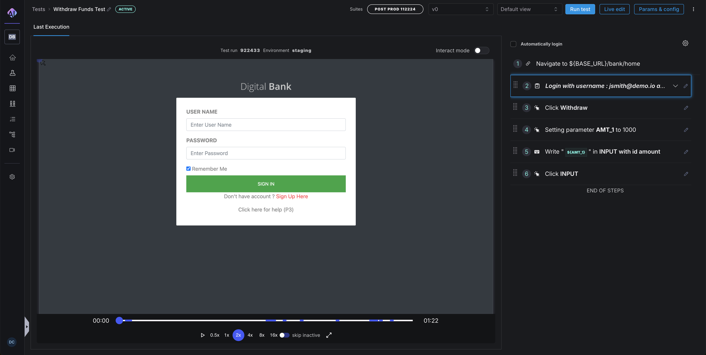
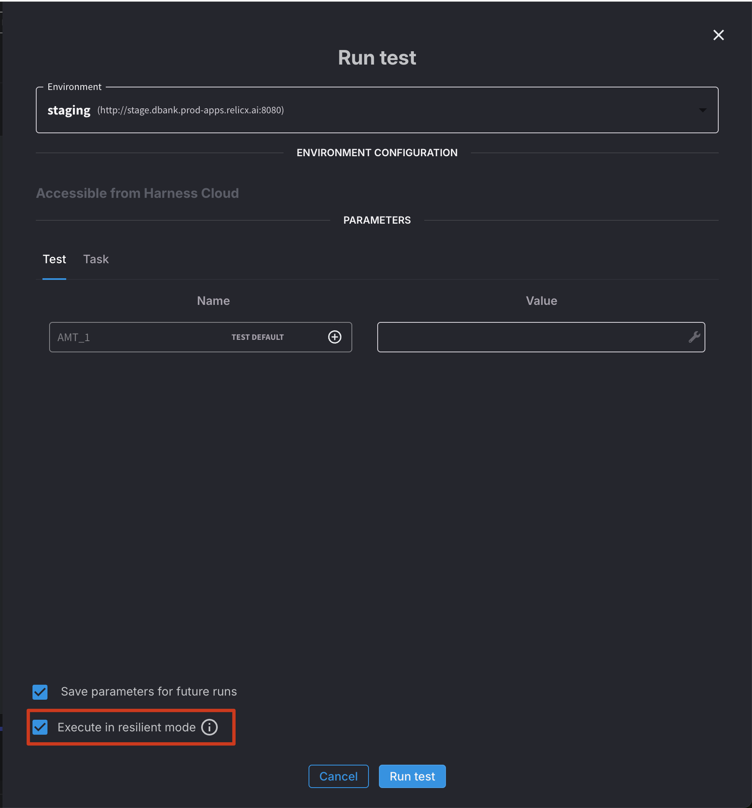
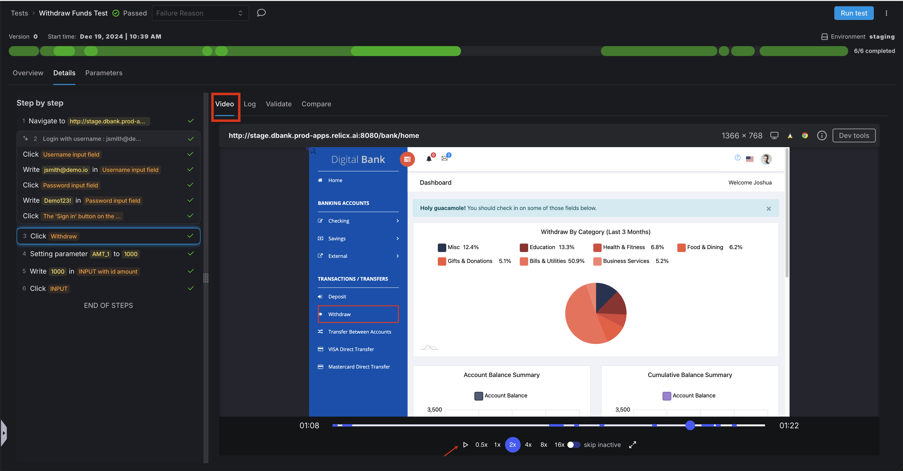

Harness AI Test Automation combines traditional automation approaches with AI capabilities to help you create, manage, and execute end-to-end tests. Following proven strategies for test design, editing, and execution reduces flakiness, lowers maintenance costs, and builds reliable automation that supports your development workflows.

---

## What you will learn

- **Test design principles:** How to structure small, focused tests that are easy to maintain and debug.
- **Task reuse patterns:** How to avoid duplication by extracting common steps into reusable tasks.
- **AI command effectiveness:** Strategies for writing clear, reliable AI-powered commands.
- **Editing mode selection:** When to use Quick Edit versus Live Edit for test maintenance.
- **Execution mode selection:** How to choose between Resilient Mode and Non-resilient Mode based on your environment.

---

## Test design principles

The foundation of effective test automation begins with thoughtful test design. Well-structured tests are easier to maintain, provide clearer feedback, and create less technical debt over time.

### Write small, focused tests

Large, monolithic tests that attempt to validate too many features at once often become maintenance problems. Follow these guidelines:

- **Focus on specific user journeys:** Design each test to validate a single, coherent user workflow (for example, "User can log in and view their profile" or "Admin can create a new product category").
- **Limit test scope:** A test should validate a single feature or functionality. If a test validates multiple unrelated features, break it into separate tests.
- **Ensure test independence:** Each test should be capable of running independently without relying on state created by other tests. This prevents cascading failures where one failed test causes many others to fail.
- **Prioritize readability:** Name your tests descriptively so that their purpose is immediately clear. A test named "userCanSubmitOrderWithValidCreditCard" is more informative than "testOrder001".
- **Keep tests under 50 steps:** Tests exceeding 50 steps present significant maintenance challenges, resulting in increased troubleshooting difficulty and reduced debugging efficiency.

When tests are small and focused, several benefits emerge:

- Faster identification of issues when tests fail.
- Easier maintenance as the application evolves.
- More reliable test execution since there are fewer potential points of failure.
- Clearer documentation of application functionality through the test suite.

### Leverage tasks to avoid repetition

Duplication within a test suite can quickly lead to maintenance challenges. When the same sequence of steps appears in multiple tests, any change to that sequence requires updates in multiple places.

Tasks solve this problem by allowing you to encapsulate and reuse common sequences of steps:

- **Identify common workflows:** Look for sequences of steps that appear in multiple tests, such as login procedures, navigation to specific areas, or data setup routines.
- **Create reusable tasks:** Extract these common sequences into tasks with descriptive names like "Login as Administrator" or "Navigate to User Profile".
- **Parameterize where needed:** Make tasks flexible by adding parameters. For example, a "Login" task could accept username and password parameters, making it usable for different user types.
- **Maintain a task library:** Document available tasks and their purposes to encourage reuse across the testing team.

Benefits of effectively using tasks include:

- **Single point of maintenance:** When application changes require updating a sequence of steps, you only need to update the task definition once.
- **Consistency across tests:** Using the same task ensures that all tests interact with the application in a consistent manner.
- **Reduced test authoring time:** New tests can be created more quickly by assembling existing tasks.
- **Improved readability:** Tests become more declarative and easier to understand when they use well-named tasks.

:::note
Task versioning affects all tests that reference a task. Go to [Tasks](/docs/ai-test-automation/test-authoring/creating-tests/tasks#task-versioning) to understand how versioning works before modifying shared tasks. Nested task execution (tasks calling other tasks) is currently unsupported.
:::

### Add assertions liberally

Assertions are the validation points in your tests. They verify that the application behaves as expected. Without sufficient assertions, a test might run through all steps successfully but fail to detect incorrect results.

- **Assert early and often:** Do not wait until the end of a test to verify results. Add assertions throughout the test to validate intermediate states.
- **Validate both UI elements and data:** Assertions should check not only that elements are present but also that they contain the expected data.
- **Assert negative conditions where appropriate:** Sometimes it is important to verify that something does NOT happen or is NOT visible. For example, you can write an assertion: "Make sure the login screen is not visible."
- **Use specific assertions:** Instead of generic existence checks, use more specific assertions like verifying text content, attribute values, or element states.

Go to [Assertions](/docs/ai-test-automation/test-authoring/creating-tests/assertions) to view all available assertion types.

---

## Handle dynamic data

Modern web applications present significant challenges for traditional test automation. Dynamic content, asynchronous loading, and complex interactive elements can make tests brittle and unreliable. AI Test Automation is specifically designed to address these challenges.

### AI capabilities for dynamic applications

The AI capabilities provide sophisticated solutions to common testing challenges:

- **Handling dynamic IDs and selectors:** Traditional selectors often break when developers make changes or when elements have dynamically generated IDs. The AI recognizes elements based on their visual appearance, position, surrounding context, and other attributes that remain more stable (Smart Selectors).
- **Adapting to visual changes:** Minor UI updates that would break traditional selectors are often handled automatically by the AI, reducing maintenance overhead.
- **Managing timing issues:** The AI can intelligently wait for elements to become interactive, even when loading times vary or when complex animations are present.
- **Understanding application context:** The AI can interpret the current state of the application to make more reliable decisions about how to interact with elements.

To get the most from these capabilities:

- **Use AI-based commands for dynamic situations:** When possible, use AI-powered commands over traditional selector-based approaches when the test criteria are dynamic. For example, you might want to select an available room in a booking system or select the cheapest flight.
- **Provide clear context:** When instructing the AI to interact with elements, provide descriptive information about what you are trying to achieve.
- **Trust the intelligence:** AI often requires less explicit instruction than traditional automation. Rather than adding explicit waits, let the AI determine when elements are ready for interaction.
- **Test in varied conditions:** Verify that your AI-powered tests work consistently across different data states, screen sizes, and application conditions.

### AI-based command best practices

When creating AI commands, follow these recommendations:

- **Use descriptive natural language:** Describe the target element in natural language that a human would understand. For example, "Click the Submit button at the bottom of the form" is more effective than "Click button with text Submit".
- **Provide sufficient context:** Include information about where the element can be found on the page. For example, "Click the Edit button in the User Profile section" provides more context than "Click the Edit button".
- **Leverage visual characteristics:** Describe visual attributes like color, size, or position when they help identify the target element.
- **Test with variations:** Verify that your AI commands work with different application states, data, and layouts.
- **Refine based on performance:** If an AI command is not consistently performing as expected, refine your description to provide more specific guidance.
- **Combine with traditional approaches when necessary:** For highly complex scenarios, consider using a combination of AI-based and traditional selector-based approaches.

Go to [Best practices for AI commands](/docs/ai-test-automation/best-practices/best-practices-for-ai-commands) to view detailed guidance on each AI command type.

---

## Test editing strategies

As your application evolves, you need to update tests to reflect new features, changed workflows, or improved testing strategies. AI Test Automation offers two distinct approaches to test editing, each optimized for different scenarios.

### Quick edit mode

Quick Edit is designed for rapid, straightforward modifications that do not significantly alter the test navigation flow. It provides a streamlined interface for making targeted changes without re-executing the entire test.

**When to use Quick Edit:**

- Making minor modifications (adjusting element selectors, updating expected values, modifying simple actions).
- Adding non-interactive steps (wait conditions, log statements, comments).
- Working with assertions and conditionals.
- Removing steps that do not affect navigation.

**Advantages:**

- Changes can be made rapidly without waiting for browser execution.
- Simple modifications can be completed in seconds rather than minutes.
- No need to spin up additional resources for browser execution.

**Limitations:**

- Changes are not immediately verified against the application.
- Without execution validation, there is a higher chance of introducing broken steps.
- Not suitable for complex changes to test flow.

Access Quick Edit through the test details page:

### Live edit mode

Live Edit provides a comprehensive editing experience where each step is executed as you modify the test. This approach gives immediate feedback on whether your changes are working correctly.

**When to use Live Edit:**

- Adding steps that cause navigation (opening new pages or modals).
- Removing navigation-triggering steps.
- Creating entirely new paths through the application.
- Making complex modifications that might affect subsequent steps.

**Advantages:**

- Each change is verified against actual application behavior.
- Less chance of creating broken tests since each step is executed.
- Visual confirmation of how the application responds to each action.

**Limitations:**

- Slower process since executing each step takes time.
- Requires a browser instance and potentially more computing resources.
- Sometimes requires working through the entire test to make late-stage changes.

### General editing guidelines

Regardless of which editing mode you choose, follow these principles:

- **Test after editing:** Always run the modified test end-to-end to verify that it still works correctly.
- **Consider impact on shared tasks:** If you modify shared components, consider how changes might affect other tests. Go to [Tasks](/docs/ai-test-automation/test-authoring/creating-tests/tasks) to understand task versioning implications.
- **Preserve test intent:** Ensure that modifications do not alter the fundamental purpose of the test.
- **Review version history:** Before making significant changes, review the test version history to understand its evolution.
- **Consider creating a new test:** If changes are substantial, it might be better to create a new test rather than heavily modifying an existing one.

Go to [Editing tests](/docs/ai-test-automation/test-authoring/editing-tests) to view detailed editing workflows.

---

## Execution mode selection

How you execute your tests can significantly impact their reliability, speed, and usefulness in your development process.

### Resilient mode (recommended)

Resilient Mode is designed to maximize the reliability of test execution, particularly in environments with variable performance or when testing complex applications.

**Key characteristics:**

- **Intelligent waiting:** Automatically waits for elements to be ready for interaction before proceeding.
- **Dynamic timing adjustments:** Adapts wait times based on application responsiveness.
- **Retry logic:** Attempts to recover from intermittent failures when possible.
- **Stability detection:** Waits for the page to stabilize before proceeding to the next step.
- **Comprehensive failure information:** Provides detailed diagnostics when issues occur.

**When to use Resilient Mode:**

- CI/CD pipelines.
- Overnight or scheduled runs.
- Tests running in cloud or variable environments.
- Complex applications with asynchronous behavior.

### Non-resilient mode

Non-resilient Mode prioritizes speed over automatic recovery mechanisms. It is suitable for well-controlled environments or when execution speed is critical.

**Key characteristics:**

- **Faster execution:** Completes tests more quickly by eliminating some automatic waiting.
- **Less overhead:** Reduces the computational resources required for test execution.
- **More predictable timing:** Execution speed is more consistent across runs.
- **Requires explicit waits:** You must add wait conditions where needed.
- **Less fault tolerance:** More likely to fail when encountering timing issues.

**When to use Non-resilient Mode:**

- Developer local testing.
- Simple applications with predictable performance.
- Scenarios where immediate results are important.
- Performance testing or benchmarking.

Go to [Running modes](/docs/ai-test-automation/test-execution/resilient-mode) to configure execution modes for your tests.

---

## Test result analysis

Effective test analysis is crucial for maintaining a healthy test suite and quickly identifying application issues.

### Test replay videos

One of the most valuable features is the ability to watch video recordings of test executions:

- **Always review videos for failed tests:** The visual record often makes it immediately obvious what went wrong.
- **Look for timing issues:** Videos can reveal race conditions or premature actions.
- **Identify visual discrepancies:** Sometimes tests fail because elements have moved or changed appearance.
- **Validate user experience:** Even when tests pass, videos can reveal slow performance or unexpected behaviors.
- **Share with stakeholders:** Videos provide accessible evidence of issues for non-technical team members.

### Diagnostic information

Beyond video replays, AI Test Automation provides rich diagnostic information:

- **Review execution logs:** Detailed logs provide insights into what happened during test execution.
- **Analyze error messages:** System-generated errors often point directly to the root cause.
- **Examine element states:** Information about element properties at the time of failure can be invaluable.
- **Look for patterns:** Recurring issues often indicate systemic problems in either the application or the tests.
- **Compare across environments:** Different results in different environments can help isolate infrastructure issues.

Go to [Test errors and severities](/docs/ai-test-automation/test-execution/test-errors-and-severities) to understand how test failures are categorized.

---

## Next steps

- [Get started with AI Test Automation](/docs/ai-test-automation/get-started/quickstart): Create your first test and login task.
- [Tasks](/docs/ai-test-automation/test-authoring/creating-tests/tasks): Understand task types, versioning, and parameter overrides.
- [Running tests](/docs/ai-test-automation/test-execution/running-tests): Configure test execution settings and schedules.
- [Data-driven tests](/docs/ai-test-automation/test-execution/data-driven-tests): Run the same test with multiple data sets.
- [Harness pipeline integration](/docs/ai-test-automation/integrations/harness-cd): Add tests to your CI/CD pipeline.
