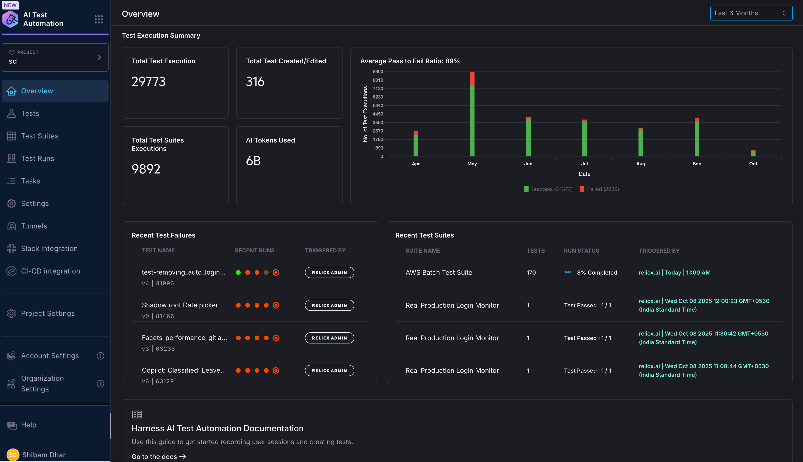

import Tabs from '@theme/Tabs';
import TabItem from '@theme/TabItem';

:::info 
To enable Harness AI Test Automation in your account, contact your sales representative or reach out to the team at [ait-interest@harness.io](mailto:ait-interest@harness.io).
:::

**Harness AI Test Automation** is the future of software quality assurance—a generative AI-powered platform that transforms how teams create, maintain, and execute automated tests. By combining cutting-edge natural language processing, user behavior analytics, and proprietary multi-agent orchestration, Harness delivers a no-code, intent-driven testing experience that accelerates release cycles, improves test resilience, and reduces manual effort.

## What is Harness AI Test Automation?
Harness AI Test Automation empowers you to write automated tests in plain English using simple prompts like “add the most expensive item to the cart”. The AI foundation model interprets your intent alongside the application’s dynamic UI, making it easy for technical and non-technical users alike to author robust, end-to-end test cases—without writing any code.

#### Key capabilities:

- **No-Code Test Creation:** Capture steps automatically through the cloud or author tests with natural language AI prompts.
- **Self-Healing Tests:** AI dynamically adjusts to UI or workflow changes, maintaining stable tests without manual patching.
- **Environment Agnostic:** Define tests once and run across QA, staging, or production by simply switching environment parameters.
- **Seamless Pipeline Integration:** Automate tests within your continuous integration and delivery workflows for faster, reliable feedback.

#### Core Features

- **Comprehensive Test Suites:** Organize and manage tests grouped logically for batch runs, scheduling, and notifications.
- **Extensive Analytics:** Dashboards identify flaky tests, track failure trends, and provide insights into test execution efficiency.
- **Reusable Tasks:** Modular components streamline complex workflows like authentication or setup sequences.
- **Secure Execution:** Tests run isolated in Kubernetes pods with strict privacy controls, including no persistent user data.
- **Bulk Test Creation & Roadmap Integration:** Generate tests en masse from user stories or CSV files; integration with tools like TestRail is forthcoming.

---

## UI Walkthrough

<iframe src="https://www.loom.com/embed/fb9f3cb6346b4f708e91a529edcc1613?sid=0c2007dc-2521-48bd-80f0-456300aef1ab" width="800" height="450" frameborder="0" allowfullscreen></iframe>

### Glossary

**Overview**
The Overview section provides information about the tests being performed, recent test runs, and the status of the project being opened. It provides a comprehensive view of the test automation process.

**Tests**
The Tests section enables you to create tests, view a list of tests, and see detailed information about the tests being executed, including the number of times they have passed or failed. It also offers options to edit, validate, add to test suites, and more.

**Test Suites**
The Test Suites section allows you to group tests together and run them together. You can view the summary of the suite, including the last run. This section plays a crucial role in organizing and managing tests.

**Test Runs**
The Test Runs section provides information about previous test runs, including duration and associated test suites. It allows you to view individual test runs and also view the test runs associated with test suites.

**Tasks**
The Tasks section groups steps to be executed and generates tasks. It includes options to create login tasks and general tasks.

**Settings (Environment and Configuration)**
The Settings section allows you to define environments for different test suites and test execution. It also handles configuration for more detailed execution of your AI Test Automation, enabling you to customize the test execution process.

These sections of Harness AI Test Automation provide a comprehensive and organized framework for managing and executing tests.

**Tunnels** 
describes secure tunnels that connect cloud-based test runners to private or firewalled internal resources. Tunnels ensure that tests can be executed against protected environments. By establishing secure channels, users can test applications that are not accessible from the public internet.

**CI-CD Integration** 
explains how Harness AI Test Automation integrates seamlessly into continuous integration and deployment (CI-CD) pipelines. It enables automatic test triggers, flexible execution, and integrations with test management and analytics tools. The platform supports integration with popular CI-CD tools, allowing users to automate tests as part of their CI-CD workflows.

---

## How Does It Work?
Harness breaks testing down into clear AI-powered stages:

- Intent-Based Authoring: Tests are defined with natural language, requiring no special coding skills.
- AI Interpretation: The core AI evaluates sanitized HTML “wireframes” and UI screenshots, understanding context and visual structure.
- Multi-Agent Execution: Specialized agents (like navigation and date handlers) orchestrate specific test tasks for precise workflows.
- Real-Time Self-Healing: On every run, tests self-correct UI locators based on the latest page layout and element changes.
- Caching and Parallel Runs: Initial executions reason through intents, but subsequent runs leverage cached “copilot memory” to accelerate, alongside parallel execution of up to 100 tests.

### Benefits

1. Test Creation Benefits
Empower non-technical team members to author high‑quality tests with AI-assisted guidance.
Dramatically reduce the time and expertise required to design and build test suites.
2. Test Maintenance Benefits
Cut maintenance time with AI-driven self-healing that adapts to UI and application changes.
Eliminate brittle scripts by automatically updating selectors and flows when apps evolve.
3. Testing Efficiency Benefits
Accelerate releases with faster, more reliable execution powered by AI semantic validation and visual regression.
Expand coverage and improve accuracy through intelligent assertions and risk-based prioritization.
4. Pipeline Integration Benefits
Ensure continuous, automated quality checks with environment-agnostic tests and CI/CD triggers.
Streamline collaboration across dev and QA with standardized workflows and actionable feedback.
5. Security and Scale
Enterprise-grade security and a robust, cloud-ready architecture that scales with your needs.

### Future Potential
Harness is innovating continuously with exciting upcoming capabilities:

- Autonomous Test Generation: Automatically generate tests from real user flows and requirements.
- Advanced AI Validation: Implement confidence scoring for nuanced assertion controls.
- Expanded Integrations: Sync effortlessly with test management tools and external systems for full lifecycle coverage.
- Performance Enhancements: Ongoing improvements in AI models and architecture will drive faster test execution and broader scalability.

## Why Choose Harness AI Test Automation?
Harness AI Test Automation transcends traditional scripted testing by dynamically reasoning across UI changes and intent, rather than relying on fragile static locators. This approach ensures:

- Greater test resilience and lower failure rates
- Faster onboarding and broader team participation
- Improved release velocity with trustworthy automation coverage

Harness's unique balance of AI-powered adaptability and deep pipeline integration makes it the premier choice for organizations seeking smarter, scalable software testing.

Harness AI Test Automation is more than just a testing tool—it’s an intelligent platform designed to future-proof your quality engineering, enhance team productivity, and fuel continuous innovation.

